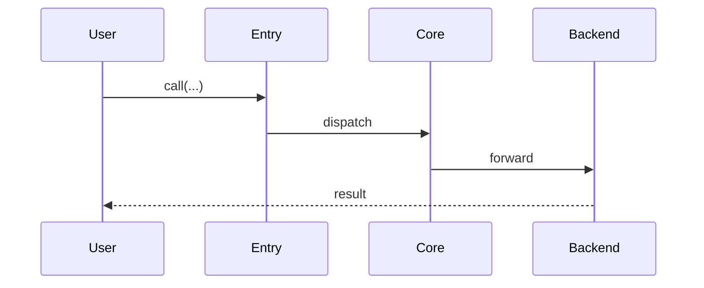

# Skill: read-src — 从 Prompt 阅读源码并产出解读文档

## 1. 用途（什么时候用这个 skill）

当用户以自然语言请求"阅读 / 梳理 / 解读 / 分析"某段源码时，使用本 skill：

- 典型场景：
  - "帮我读一下 `<path/to/module>` 这个模块"
  - "讲讲 <特性 / 算法 / 组件> 是怎么实现的"
  - "梳理一下从 `<入口>` 到 `<出口>` 的完整调用链"
  - "给 `<文件或目录>` 写一份源码解读"
- 把源码阅读成果转成一份**分层、可检索、带真实代码引用**的 Markdown 文档

本 skill 是**项目无关的通用 skill**：不假设任何特定仓库结构、不依赖任何项目特定目录约定。**输出目录由用户在 prompt 中指定**（见 §3 Step 2）。

本 skill 不负责修改源码，只负责**读 + 写文档**。

## 2. 核心原则

1. **输出目录必须由用户指定，不得默认**：动笔前必须明确用户要写到哪里；若用户未指定，先向用户询问（见 §3 Step 2）。
2. **先调研再落笔**：必须用 `Glob` / `Grep` / `SemanticSearch` / `Read` 实际阅读过相关源码，再开始写；不能凭模块名或用户描述猜测架构。
3. **所有代码引用必须真实可验证**：引用源码使用带行号的引用格式 ```` ```startLine:endLine:filepath ```` ```（详见 §4 模板），行号必须对应当前仓库的真实代码；不要伪造行号或路径。
4. **"读到哪儿写到哪儿"不可取**：必须先构建整体骨架（§3 Step 4），再按骨架逐节填充，避免流水账。
5. **先抽象后细节**：顶层必须有明确的分层图 / 模块关系图（文字版即可），读者应在前 2 分钟就能理解整体定位；具体函数逐行讲解只放在"关键实现"节。
6. **控制流 / 数据流分开讲**：对于规模稍大的对象（超过 3 个文件），分别梳理"请求/调用是怎么走的"和"状态/数据是怎么流的"两条主线。
7. **面向读者，不面向 AI**：写给后来者看——他们需要知道"改 X 去哪改、看 Y 从哪里入手"，而不是 AI 的思考过程。
8. **只在用户指定的目录内创建文件**：不要在其它位置（仓库根目录、`docs/`、`README.md` 隔壁等）额外散落文件。

## 3. 工作流（必须按顺序执行）

### Step 1: 解析 prompt
从用户 prompt 中抽取：
- **读什么**：模块名 / 目录 / 文件 / 特性关键词（下面称"目标范围"）
- **读多深**：只要总览？逐文件精读？端到端追一条调用链？
- **读给谁看**：新人入门 / 要改这块的人 / 调优者 / 其他
- **输出到哪**：用户是否明确指定了输出目录 / 文件名？

如果目标范围指向不明（例如用户只说"读一下 cache"，但仓库里可能有多处同名模块），先用 `Glob` / `Grep` 列出候选，向用户确认，**或直接选最可能的那一个并在文档开头显式注明"本文仅覆盖 XXX，另一处 YYY 未覆盖"**。

### Step 2: 确认输出目录（关键，不可省略）
本 skill 的输出目录**必须由用户指定**。优先级：

1. 如果 prompt 里已明确给出（例如"写到 `docs/source-reading/`"、"输出到 `notes/xxx.md`"、"放在 `@some/dir/`"），直接用该路径。
2. 如果未指定，**必须向用户询问**。可给出 2~3 个合理建议（如仓库根下的 `docs/`、`notes/`、`.cursor/docs/` 或专门的解读目录），让用户选择或输入自定义路径。
3. 得到目录后：
   - 用 `Shell` 执行 `ls <dir> 2>/dev/null` 检查是否存在；不存在则询问用户是否 `mkdir -p <dir>`，得到确认后再创建。
   - 如果用户给的是已存在的目录，查看目录内文件命名风格（例如是否用 `01_xxx.md` / `NN_xxx.md` 编号、是否有 `README.md` 作为总览），**沿用其风格**。
4. 目标文件名规则：
   - **用户已指定文件名**：用用户给的
   - **用户只给了目录**：用 kebab-case 或 snake_case 体现主题（例：`read-<module-name>.md`、`<module>-walkthrough.md`）
   - **目录已有编号约定**（如 `01_xxx.md`）：取下一个可用编号
5. 如果目标文件已存在：询问用户要覆盖、追加版本号（`<name>.v2.md`）、还是合并；**不要默默覆盖**。

### Step 3: 源码调研（核心动作）
用组合工具快速搭建认知：

- **定位入口**：`Glob` 按模式找相关文件
- **定位主干**：`SemanticSearch` 问"X 的入口在哪""Y 和 Z 是怎么交互的"（目录范围使用用户指定的源码范围）
- **精确查符号**：`Grep` 搜类名 / 函数名 / 关键字符串
- **精读关键文件**：`Read` 读出具体实现，**记录行号**以便后面引用
- **读测试**：测试目录通常是理解行为最快的入口（按仓库约定查找）
- **读已有文档**：仓库根下的 `README.md`、`docs/`、`CONTRIBUTING.md` 等可能已有部分资料可复用

调研完成的自检：能否口头回答以下问题？
- 这个对象的**单句定位**是什么？
- 顶层有哪些**核心类 / 函数 / 数据结构**？
- 从外部进入的**调用入口**有几个？
- 这个对象依赖谁？谁依赖它？
- 有没有平台 / 后端 / 策略的多实现分支？

### Step 4: 先搭骨架，再填肉
真正写正文前，先用大纲敲定：

1. 标题（= 文档主题）
2. §1 定位（一句话讲清是干啥的）
3. §2 目录结构（哪些文件，各自职责）
4. §3 关键抽象（核心类 / 接口 / 数据结构）
5. §4 控制流主线（调用链）
6. §5 数据流主线（状态 / 数据怎么传）
7. §6 关键实现（2~5 段带行号引用的代码片段 + 注释）
8. §7 扩展点 / 修改指引
9. §8 端到端示例
10. §9 FAQ / 踩坑 / 待确认
11. §10 参考

如果对象较小（只有 1~2 个文件），可以把 §2+§3 合并、§4+§5 合并，但**不建议少于 5 节**。

### Step 5: 按 §4 模板填写正文
- 标题改为具体主题
- 每节都要有实质内容；实在没有就显式写 `N/A` 或 `TODO: <需要补充的点>`
- 代码引用**必须**用 `startLine:endLine:filepath` 格式，行号对应当前仓库实际文件
- 图示优先用 Mermaid 或 ASCII

### Step 6: 用 `Write` 工具写入文档
- 禁止用 `echo` / `cat > file` / `sed` 等 shell 手段写文件
- 写入后用 `Read` 复核关键段落
- 如果一次产出多个文件，对每个文件单独调用 `Write`

### Step 7: 向用户汇报
- 明确给出所有落盘文件路径（**使用 Step 2 里用户指定的路径**）
- 用 3~6 条 bullets 概述文档里的**核心结论 / 洞察**（不是复述目录）
- 列出**未覆盖**的子话题和**有待确认**的点
- 询问是否需要增补某节

## 4. 文档模板（写入用户指定目录下的 `<name>.md` 时使用）

````markdown
# <模块/特性名> 源码解读

> 覆盖范围：<一句话说明本文涵盖的代码路径>
> 未覆盖：<明确列出本文主动不覆盖的子话题，方便读者另查>
> 适合读者：<新人入门 / 要改这块的人 / 调优者 / ...>

## 1. 定位（这是什么）

- 一句话定位：<...>
- 在仓库中的位置：`path/to/target/`
- 解决的核心问题：<...>
- 和 <相关对象> 的区别：<...>

## 2. 目录结构与文件职责

```text
path/to/target/
├── a.py        # 职责 A
├── b.py        # 职责 B
└── sub/
    └── c.py    # 职责 C
```

| 文件 | 职责 | 关键符号 |
| --- | --- | --- |
| `path/to/target/a.py` | ... | `ClassA`, `func_a()` |
| `path/to/target/b.py` | ... | `ClassB` |

## 3. 关键抽象

### 3.1 `ClassA` — <一句话定位>

```10:30:path/to/target/a.py
class ClassA:
    def do_something(self, x):
        ...
```

- 职责：...
- 关键字段：...
- 生命周期：...

### 3.2 数据结构 `FooRequest`

<字段解释 + 为什么这样设计>

## 4. 控制流主线（请求/调用是怎么走的）



逐步说明：
1. 入口：`entry.py::run()` — <做了什么>
2. 分派：`core.py::dispatch()` — <做了什么>
3. ...

## 5. 数据流主线（状态/数据怎么流）

- 输入数据形态：<结构 / 类型 / 单位>
- 中间关键状态：<...>
- 输出数据形态：<...>
- 关键转换点：
  - `foo.py::encode()`：<in → out>
  - `bar.py::decode()`：<in → out>

## 6. 关键实现片段

### 6.1 <关键点 1 的标题>

```100:130:path/to/target/a.py
def critical_path(...):
    ...
```

**要点**：
- 为什么这样实现？
- 和朴素实现的差别？
- 有什么隐含假设？

### 6.2 <关键点 2 的标题>

<同上>

## 7. 扩展点与修改指引

| 想做的事 | 改哪里 | 注意事项 |
| --- | --- | --- |
| 新增一个 Backend | `backends/` 下新建文件并在 `registry.py` 注册 | 必须实现 `BackendBase` 全部方法 |
| 改变默认策略 | `config.py::DEFAULT_POLICY` | 下游 X / Y 会受影响 |
| 加一条运行时 metric | `observability.py::emit_metric()` | metric 名需符合既有规范 |

## 8. 端到端示例（把前面的内容串起来）

选一个真实 case，逐步走：

1. 外部调用 ...
2. 进入 `entry.py::run()`，此时 `req = ...`
3. 分派到 `core.py::dispatch()`，状态变为 ...
4. ...
5. 最终返回 `result = ...`

## 9. FAQ / 踩坑 / 待确认

- **Q：X 和 Y 的区别是什么？** A：...
- **坑：在 <某条件> 下 Z 行为会变**：...
- **待确认**：`foo.py::bar()` 里某分支看起来永不触发，需要进一步验证

## 10. 参考

- 相关源文件清单（全部引用）
- 相关测试位置
- 相关已有文档（如有）
- 上游 issue / PR（如适用）
````

## 5. 质量自检（写完后，至少过一遍）

- [ ] 标题已替换为具体主题名，不是占位符
- [ ] §1 定位有明确的"一句话"，而不是一大段废话
- [ ] §2 的目录树和仓库当前状态一致（路径真实、文件确实存在）
- [ ] §3 至少覆盖 2 个核心抽象，每个都有带行号的代码引用
- [ ] §4 / §5 各自至少有一条清晰的主线；不把控制流和数据流混在一起讲
- [ ] §6 的所有代码引用都是 ``` ```start:end:filepath ``` ``` 格式，行号与当前仓库一致
- [ ] §7 至少给出 3 条具体的"想做 X 去改 Y"指引
- [ ] §8 的端到端示例是真实可追的（不是伪造的例子）
- [ ] §9 如实列出"没读全的地方""有疑问的地方"，不装懂
- [ ] **文档已落盘到用户指定的目录**，没有散落到其它位置
- [ ] 所有落盘路径已在回复里汇报给用户
- [ ] 向用户提炼了 3~6 条**洞察**（不是复述目录）

## 6. 常见反模式（不要这样做）

- ❌ **不问用户就选目录**：自作主张把文档写到 `docs/`、`notes/`、仓库根目录等用户没指定的位置
- ❌ **不读代码直接编**：凭模块名猜测架构，不实际 `Read` 源码
- ❌ **流水账**：从头到尾按文件顺序一行行讲，没有分层、没有主线
- ❌ **代码引用不带行号**：只写"见 `a.py` 的 `foo` 函数"，读者还得自己搜
- ❌ **伪造行号**：随便写个 `10:30:a.py`，行号对不上真实代码
- ❌ **路径写错**：对仓库里实际的文件路径写错或写半路
- ❌ **用 `echo / cat > file` 写文件**：必须用 `Write` 工具
- ❌ **控制流/数据流混讲**：一会讲函数调用一会讲数据结构，读者抓不住主线
- ❌ **装懂**：对没读全 / 没读懂的地方不如实标 `TODO`，硬编一段逻辑
- ❌ **写完不汇报路径**：让用户自己去找文件
- ❌ **默默覆盖已有文件**：同名文件已存在时未经询问就覆盖
