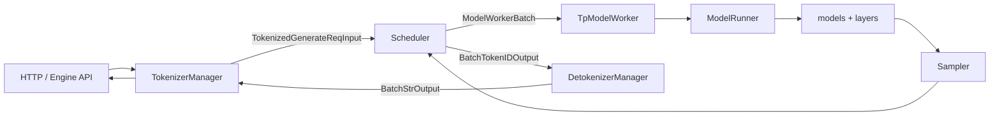

# SRT 请求生命周期深度解析

本文从一次生成请求出发，串起 `python/sglang/srt` 的入口、tokenizer、scheduler、model worker、detokenizer 与响应返回路径。它是后续阅读 `managers`、`model_executor`、`mem_cache` 等模块的主索引。

## 总览

SRT 的在线推理链路采用多进程流水线。主进程承载 HTTP/Python API 与 `TokenizerManager`，scheduler 和 detokenizer 运行在子进程中，核心 IPC 使用 ZMQ。`Engine` 在注释中把系统拆成三部分：`TokenizerManager` tokenizes requests 并发送给 scheduler；scheduler 调度 batch、执行 forward 并把 token 输出发给 detokenizer；detokenizer 把 token 转回文本并返回给 tokenizer manager。

## 入口层

主要文件：

- `python/sglang/srt/entrypoints/engine.py`：`Engine`、`init_tokenizer_manager`、子进程启动与 Python API。
- `python/sglang/srt/entrypoints/http_server.py`：HTTP 服务、OpenAI/Ollama/Anthropic 等协议入口。
- `python/sglang/srt/managers/io_struct.py`：入口请求与内部 IPC 数据结构。
- `python/sglang/srt/server_args.py`：启动参数与运行时配置入口。

`Engine.generate()` 和 `Engine.async_generate()` 会构造 `GenerateReqInput`，然后调用 `self.tokenizer_manager.generate_request(obj, None)`。embedding/rerank 路径构造 `EmbeddingReqInput`，但复用同一个 tokenizer/scheduler 管道。

`GenerateReqInput` 承载上层语义：`text`、`input_ids`、多模态数据、采样参数、logprob、LoRA、stream、PD disaggregation bootstrap 信息、DP 路由、session、priority 等。`normalize_batch_and_arguments()` 会把单请求和 batch 请求归一化，这是后续 tokenizer 与响应聚合能复用同一套逻辑的前提。

## TokenizerManager

主要类：`python/sglang/srt/managers/tokenizer_manager.py::TokenizerManager`

初始化阶段按顺序完成：

1. `init_model_config()`：从 `ServerArgs` 构造 `ModelConfig`，确定 generation/embedding、多模态、上下文长度、reserved speculative token 等。
2. `init_tokenizer_and_processor()`：初始化 tokenizer、HF processor 或 SRT 多模态 processor；可选启用 `AsyncDynamicbatchTokenizer`。
3. `init_ipc_channels()`：建立到 scheduler 的 PUSH socket 和来自 detokenizer 的 PULL socket。
4. `init_running_status()`：维护 `rid_to_state`、session future、服务状态。
5. `init_weight_update()`、`init_lora()`、`init_disaggregation()`、`init_metric_collector_watchdog()`：接入横向能力。

请求处理主函数是 `generate_request()`。它的关键职责不是简单 tokenization，而是把上层协议请求转换为 scheduler 可安全执行的内部请求：

- 归一化 batch 参数，设置默认 priority，校验 rid 不冲突。
- 初始化 request timing、请求日志和 dump 信息。
- 在权重更新读锁内解析 LoRA，避免推理与权重更新状态冲突。
- 对单请求调用 `_tokenize_one_request()`，对 batch 请求进入 `_handle_batch_request()`。
- `_tokenize_one_request()` 支持三种输入来源：`input_embeds`、`input_ids`、文本 tokenizer。多模态请求还会调用 `mm_processor.process_mm_data_async()` 或 disaggregation receiver 获取编码结果。
- 发送 `TokenizedGenerateReqInput` / `TokenizedEmbeddingReqInput` 到 scheduler，并通过 `rid_to_state` 等待返回。

## Scheduler

主要类：`python/sglang/srt/managers/scheduler.py::Scheduler`

Scheduler 是控制面最密集的组件。它持有等待队列、运行 batch、prefix cache、memory pool、grammar、LoRA、speculative worker、metrics、profile、disaggregation、PP/DP attention 等状态。

关键初始化顺序：

1. 解析并行 rank、调度策略、LoRA/speculative/cache/HiCache/HiSparse 开关。
2. `init_model_config()`、`init_metrics()`、`init_ipc_channels()`。
3. `init_model_worker()`：创建 `TpModelWorker` 和可选 draft worker。
4. `init_cache_with_memory_pool()`：从 worker 获取 `ReqToTokenPool` 和 KV allocator，选择 `RadixCache`、`ChunkCache`、`HiRadixCache`、`SWARadixCache`、`MambaRadixCache` 等 prefix cache 实现。
5. `init_schedule_policy()`：创建 `SchedulePolicy` 和可选 `PrefillDelayer`。
6. `init_disaggregation()`、`init_overlap()`、`GrammarManager` 等。

事件循环有两条主路径：

- `event_loop_normal()`：普通调度循环。
- `event_loop_overlap()`：overlap schedule 下把接收、调度、forward 和输出处理重叠。

重要方法：

- `recv_requests()`：从 tokenizer/RPC socket 拉取输入。
- `process_input_requests()`：按请求类型分发，普通生成进入 `handle_generate_request()`。
- `update_running_batch()`：根据运行 batch 状态决定 decode、prefill 或混合 chunk。
- `run_batch()`：把 `ScheduleBatch` 交给 model worker 执行。
- `process_batch_result()`：分发到 `SchedulerOutputProcessorMixin` 的 prefill/decode/idle 结果处理。
- `flush_cache()`、`abort_request()`：控制请求与 cache 生命周期。

## Batch 边界

主要文件：`python/sglang/srt/managers/schedule_batch.py`

`Req` 是 scheduler 内单请求状态，`ScheduleBatch` 是 scheduler 内批状态，`ModelWorkerBatch` 是 scheduler 发送给 worker 的序列化/执行边界。

`ScheduleBatch` 的核心字段可以分为几类：

- 请求与 cache：`reqs`、`req_to_token_pool`、`token_to_kv_pool_allocator`、`tree_cache`。
- 执行模式：`forward_mode`、`is_prefill_only`、`is_extend_in_batch`、`global_forward_mode`。
- 张量输入：`input_ids`、`input_embeds`、`req_pool_indices`、`seq_lens`、`out_cache_loc`。
- prefill/extend：`prefix_lens`、`extend_lens`、`extend_num_tokens`、`extend_logprob_start_lens`。
- 特性状态：`sampling_info`、`multimodal_inputs`、`spec_info`、`dllm_config`、`hisparse_coordinator`。

`prepare_for_extend()` 是 prefill/extend 的关键组装点。它根据每个 `Req` 的 `prefix_indices` 和 `fill_ids` 计算实际需要执行的 token，调用 `alloc_for_extend()` 分配 KV cache 位置，并更新 `req.kv_committed_len`、`req.kv_allocated_len`、cached token 统计和多模态/logprob/Mamba 相关字段。

`prepare_for_decode()` 则面向 decode step，通常每个请求追加一个或多个 token，重点是增量分配新 cache loc、更新 seq lens，并为 sampling 准备 batch metadata。

## Worker 与执行返回

主要文件：

- `python/sglang/srt/managers/tp_worker.py`
- `python/sglang/srt/model_executor/model_runner.py`
- `python/sglang/srt/model_executor/forward_batch_info.py`

`TpModelWorker.forward_batch_generation()` 接收 `ModelWorkerBatch`，调用 `ForwardBatch.init_new()` 构造 executor 侧元数据，再进入 `ModelRunner.forward()`。`ModelRunner` 根据 `ForwardMode` 分派到：

- `forward_extend()`：prefill/extend 路径。
- `forward_decode()`：decode 路径，可走 CUDA graph。
- `forward_idle()`：空 batch 或 pipeline 协调。
- `forward_split_prefill()`：split prefill 路径。

模型输出经过 `ModelRunner.sample()` 或 embedding/pooler 路径后返回 scheduler。scheduler 更新 `Req.output_ids`、finish reason、cache 引用、metrics，并根据 `stream_interval`、请求完成状态和 detokenizer 配置发送 `BatchTokenIDOutput` 或 `BatchEmbeddingOutput`。

## Detokenizer 与流式响应

主要类：`python/sglang/srt/managers/detokenizer_manager.py::DetokenizerManager`

Detokenizer 维护 token 到字符串的增量 decode 状态，处理 skip special tokens、stop string、finish reason、logprobs 和 stream chunk。若 `skip_tokenizer_init=True`，scheduler 可以直接把 token ID 输出发回 tokenizer manager，绕过 detokenizer。

流式请求中，`TokenizerManager` 不是等请求完全结束才返回，而是把 detokenizer 的 `BatchStrOutput` 按 rid 分发给对应 async generator。非流式请求则聚合到 final output 后一次返回。

## 关键不变量

- `rid` 是跨 tokenizer、scheduler、detokenizer 的请求身份。重复 rid 会导致状态覆盖，因此 `TokenizerManager` 会校验 in-flight rid。
- `req_pool_idx` 和 `out_cache_loc` 是 scheduler、memory pool、attention backend 共享的坐标，任何释放、retract、abort 都必须保持一致。
- `prefix_indices` 表示 prefix cache 命中的 token loc，`extend_input_len` 表示本轮实际需要执行的新 token 长度。
- `ForwardBatch` 是性能路径上的跨模块契约，新增字段要评估 CUDA graph、DP attention、speculative 和 attention backend。
- 权重更新使用 tokenizer 侧读写锁保护入口，但 scheduler/model runner 侧也必须保证 rank 间同步。

## 常见问题

- **为什么 tokenizer 和 detokenizer 分进程？** tokenizer、HTTP 和输出流处理不应被 GPU forward 阻塞；detokenizer 单独处理字符串状态也避免 scheduler 事件循环承担文本拼接成本。
- **为什么 batch 状态分成 `ScheduleBatch` 和 `ForwardBatch`？** scheduler 需要 Python 请求对象和调度状态；executor 需要尽量张量化、backend 友好的元数据。两者分离能让执行路径更稳定。
- **为什么功能都混入 Scheduler？** Scheduler 是统一调度点，LoRA、grammar、speculative、disaggregation、profile 都必须影响 batch 选择或输出处理。mixin 把横向能力拆到独立文件，降低单文件继续膨胀的程度。
- **修改请求结构时最容易漏哪里？** `io_struct.py`、tokenizer 归一化、scheduler dispatcher、`Req`/`ScheduleBatch` 转换、detokenizer 输出、HTTP 协议转换和 metrics/logging。
