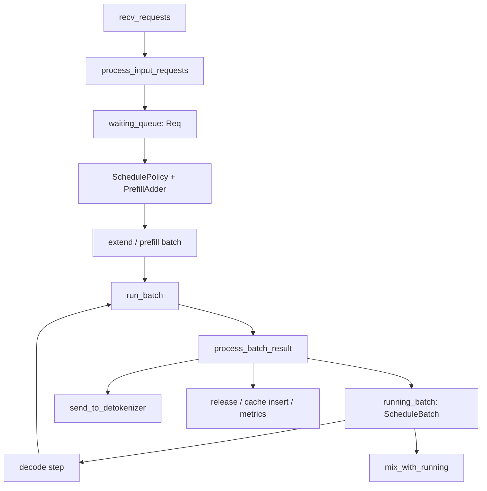

# Scheduler 与动态批调度深度解析

本文聚焦 `python/sglang/srt/managers/scheduler.py`、`schedule_batch.py`、`schedule_policy.py` 及相关 mixin，解释 SRT 如何把不断到来的请求组织成 prefill/decode batch，并在 prefix cache、显存预算、priority、chunked prefill、speculative、LoRA、grammar 等约束下保持吞吐。

## 模块定位

Scheduler 是 SRT 的运行时调度中心。它既是请求队列管理器，也是 cache 生命周期管理者，还是 model worker 的调用者。它的设计目标是把上层异步请求转成尽可能高吞吐的 GPU forward，同时保持每个请求的输出语义、finish reason、streaming、abort 和 metrics 正确。

## 类与文件边界

| 文件 | 核心对象 | 职责 |
| --- | --- | --- |
| `scheduler.py` | `Scheduler` | 事件循环、请求分发、调度决策、worker 调用、cache 控制 |
| `schedule_batch.py` | `Req`、`ScheduleBatch`、`ModelWorkerBatch` | 请求状态、批状态、worker 执行边界 |
| `schedule_policy.py` | `SchedulePolicy`、`PrefillAdder` | waiting queue 排序、prefix cache 感知、prefill 预算 |
| `scheduler_output_processor_mixin.py` | `process_batch_result_*` | prefill/decode/idle 输出处理 |
| `scheduler_update_weights_mixin.py` | weight update handlers | 运行中权重更新 |
| `scheduler_profiler_mixin.py` | profile handlers | torch/cuda/trace profiling |
| `scheduler_dp_attn_mixin.py` | DP attention helpers | DP attention token 分布、padding、协作 |
| `scheduler_pp_mixin.py` | PP helpers | pipeline parallel batch 协调 |
| `disaggregation/prefill.py`、`decode.py` | Scheduler mixins | PD 分离下的 KV/bootstrap/transfer 状态 |

## 请求进入调度器

`recv_requests()` 从 tokenizer 与 RPC socket 获取对象，`process_input_requests()` 通过类型分发处理。生成请求进入 `handle_generate_request()`，转换为 scheduler 内部 `Req`，然后进入 `waiting_queue`。

`Req` 保存所有调度必须跨 step 持久化的状态，包括：

- token：`origin_input_ids`、`fill_ids`、`output_ids`。
- cache：`prefix_indices`、`req_pool_idx`、`kv_committed_len`、`kv_allocated_len`。
- 采样：`sampling_params`、logprob 配置、自定义 logit processor。
- 输出：`finished_reason`、stream 状态、hidden/routed experts。
- 特性：grammar、LoRA、multimodal、session、speculative、disaggregation。

`Req` 与入口的 `TokenizedGenerateReqInput` 不同：后者是 IPC 输入对象，前者是 scheduler 的可变状态机。

## Prefill 调度

Prefill 的目标是在显存和 token 预算内选择一批 waiting 请求执行输入 prompt 的未命中部分。

主线步骤：

1. `SchedulePolicy` 按策略排序 waiting queue。常见策略会考虑 prefix cache 命中、等待时间、priority。
2. 对每个候选请求查 prefix cache，填充 `req.prefix_indices`。
3. `PrefillAdder` 根据 `max_prefill_tokens`、`max_running_requests`、KV 可用 token、chunked prefill 等约束决定能加入多少 token。
4. `ScheduleBatch.init_new()` 创建 batch。
5. `ScheduleBatch.prepare_for_extend()` 构造张量输入，调用 `alloc_for_extend()` 分配 cache loc。
6. `run_batch()` 调用 worker。

`prepare_for_extend()` 是理解 prefill 的关键函数。它把每个请求的 `fill_ids[len(prefix_indices):]` 展平为 batch `input_ids`，并维护 `prefix_lens`、`extend_lens`、`extend_num_tokens`。这一步也会更新 cached token 统计，将 device/host/storage 命中拆开，支持 HiCache metrics。

## Decode 调度

Decode 面向已经进入 `running_batch` 的请求。每轮通常为每个未完成请求追加一个 token；speculative 或多 token step 会改变追加数量，但仍复用同一批状态。

核心步骤：

1. `update_running_batch()` 过滤已完成请求，处理 retract、abort、memory pressure。
2. `ScheduleBatch.prepare_for_decode()` 为每个请求追加位置分配 KV cache loc。
3. `run_batch()` 进入 `TpModelWorker.forward_batch_generation()`。
4. `process_batch_result_decode()` 更新输出 token、finish、stream、cache、metrics。

Decode 的性能路径通常更适合 CUDA graph，因为 batch shape 相对稳定。`ScheduleBatch.can_run_dp_cuda_graph`、`ForwardBatch.padded_static_len`、`DecodeInputBuffers` 等字段都服务于这一目标。

## Mixed Chunk 与 Running Batch 合并

当 `chunked_prefill_size` 开启时，一个长 prompt 可能拆成多个 extend chunk。SRT 允许在 decode 进行的同时插入 prefill chunk，以减少长 prompt 阻塞。

`ScheduleBatch.mix_with_running()` 将新的 extend batch 与当前 decode batch 合并。合并后同一 `ScheduleBatch` 可能同时包含 extend 请求和 decode 请求，因此要维护：

- `is_extend_in_batch` / `all_extend_in_batch`
- `decoding_reqs`
- `global_forward_mode`
- extend/decode 各自的 logprob 和 position 信息

这类路径是风险最高的区域之一，因为 cache 分配、输出处理和 finish 判断需要同时支持两种 forward mode。

## 输出处理

`SchedulerOutputProcessorMixin` 按 batch 类型处理结果：

- `process_batch_result_prefill()`：处理 prefill 后的首 token、input logprob、prefill-only 请求、cache 插入。
- `process_batch_result_decode()`：处理增量 token、finish reason、stream interval、release。
- `process_batch_result_idle()`：处理空转或 pipeline 协调。
- `process_batch_result_prebuilt()`：处理某些预构造输出路径。

输出处理不仅是发送 token。它还要更新 `Req.output_ids`、检查 stop token/stop string/regex、更新 speculative 接受统计、释放或保留 KV、写 metrics、触发 detokenizer。

## Cache 生命周期

调度器通过 `ReqToTokenPool` 与 `BaseTokenToKVPoolAllocator` 管理物理内存，通过 `BasePrefixCache` 管理 prefix 复用。

生命周期大致是：

1. prefill 前查 cache，命中 loc 写入 `prefix_indices`。
2. extend/decode 分配新 `out_cache_loc`。
3. forward 中 attention 层写入 KV。
4. 请求完成后 `release_kv_cache()` 决定把 token 插入 prefix tree 还是释放。
5. 显存不足时调用 tree cache eviction 或 retract running req。

Prefix cache 的 lock/ref 语义很重要：运行中的请求不能被驱逐；完成后可作为 prefix 被复用；abort/retract 时必须防止重复释放。

## 横向能力接入点

- **Priority scheduling**：在 policy 排序和 preemption 中生效。禁用 priority 时若请求带 priority，可按配置 abort。
- **Grammar/constrained decoding**：`GrammarManager` 在请求进入和输出 token 后更新 grammar 状态，影响 logits mask 或 jump-forward。
- **LoRA**：batch 需要收集 `lora_ids`，并限制 `max_loras_per_batch`；overlap loading 通过 `LoRAOverlapLoader` 与推理并行。
- **Speculative decoding**：scheduler 可能调用 draft worker，`spec_info` 调整 batch token 数和输出处理。
- **Disaggregation**：prefill/decode mode 下，scheduler 额外维护 bootstrap、KV transfer queue、decode prealloc queue。
- **DP/PP attention**：会改变 batch token 的全局/本地布局，影响 `global_num_tokens`、padding 和 logits 位置。

## 修改建议

- 新增请求类型时，先在 `io_struct.py` 定义类型，再检查 scheduler dispatcher、tokenizer dispatcher、detokenizer 是否需要处理。
- 新增 batch 字段时，同时检查 `ScheduleBatch`、`ModelWorkerBatch`、`ForwardBatch.init_new()`、CUDA graph input buffer。
- 修改 cache 释放逻辑时，必须覆盖完成、abort、retract、flush、session close、disaggregation decode offload。
- 修改 prefill 预算时，必须同时考虑 `max_prefill_tokens`、`max_running_requests`、KV 可用 token、chunked prefill 和 priority preemption。
