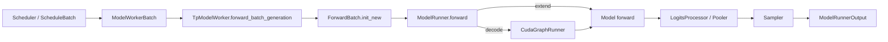

# Model Executor 执行链路深度解析

本文说明 `python/sglang/srt/model_executor` 如何把 scheduler 的 batch 转成模型 forward，覆盖 `TpModelWorker`、`ModelRunner`、`ForwardBatch`、CUDA graph、attention backend、sampler 与权重加载的关系。

## 执行层定位

`model_executor` 是 rank-local 执行层。每个 scheduler 进程持有一个 `TpModelWorker`，worker 内部持有 `ModelRunner`。`ModelRunner` 负责分布式初始化、模型加载、KV cache、attention backend、CUDA graph 和 forward。

## 初始化顺序

`ModelRunner.__init__()` 的顺序体现了大量隐式依赖：

1. 保存 `ServerArgs`、rank、TP/PP/EP/DP attention、模型配置和设备信息。
2. `model_specific_adjustment()` 根据模型/后端调整 chunked prefill、double sparsity、chunked prefix cache 等配置。
3. `init_torch_distributed()` 初始化 torch distributed、model parallel、DP attention、NCCL/RCCL 等。
4. 创建 forward stream、offloader、weight checker、MindSpore/NPU 相关环境。
5. `initialize()`：
   - 创建 sampler。
   - `load_model()` 调用 `model_loader` 实例化模型并加载权重。
   - 初始化 EPLB、elastic EP、LoRA、double sparsity、deterministic batch invariant ops。
   - 推导 KV cache dtype，创建 memory pool 和 attention backend。
   - 初始化 CUDA graph / device graph / piecewise graph。
   - 注册 forward hooks 和 routed experts capture。

这个顺序不能随意调整。例如 attention backend 依赖 memory pool，CUDA graph capture 依赖模型和部分 buffer 已经稳定，LoRA 的 CUDA graph buffer 又需要在显存 profiling 前预留。

## ForwardBatch 契约

主要类：`python/sglang/srt/model_executor/forward_batch_info.py::ForwardBatch`

`ForwardBatch` 是 executor 与模型层共享的执行元数据。它从 `ModelWorkerBatch` 创建，字段尽量张量化，避免在性能路径引入动态 Python 结构。

核心字段：

- `forward_mode`：`EXTEND`、`DECODE`、`IDLE`、split prefill、DLLM 等。
- `input_ids` / `input_embeds` / `token_type_ids`：模型输入。
- `req_pool_indices`、`seq_lens`、`out_cache_loc`：cache 坐标。
- `positions`：由 `compute_position()` 计算的位置编码输入。
- `sampling_info`：采样参数批状态。
- `req_to_token_pool`、`token_to_kv_pool`、`attn_backend`：attention 层写 KV 和读 cache 的入口。
- `extend_*`：prefill/extend 所需的 prefix length、start loc、logprob token。
- `global_num_tokens_*`：DP attention/MLP sync 的全局 token 分布。
- `spec_info`、`lora_ids`、`mm_inputs`、`hisparse_coordinator`：横向能力。

模型实现通常只接收 `input_ids`、`positions`、`forward_batch`，具体 attention backend 从 `forward_batch.attn_backend` 读取 cache 和 metadata。

## Forward 分派

`ModelRunner.forward()` 根据 `forward_mode` 选择执行路径：

- `forward_decode()`：decode token。若满足条件，优先用 CUDA graph replay；否则走普通 model forward。
- `forward_extend()`：prefill/extend token。通常 shape 更动态，更多走 eager 或 piecewise graph。
- `forward_split_prefill()`：把长 prefill 按 layer 或 token 分片执行。
- `forward_idle()`：没有本地 token 但需要参与 pipeline/DP 协作时使用。

执行结束后，generation 模型进入 logits/sampling 路径；embedding/rerank 模型进入 pooler 或 embedding 输出路径。

## CUDA Graph 与输入 Buffer

主要文件：

- `cuda_graph_runner.py`
- `piecewise_cuda_graph_runner.py`
- `input_buffers.py`

Decode 阶段 batch shape 更稳定，SRT 会捕获一组 batch size 的 CUDA graph。`CudaGraphRunner` 为被捕获 batch size 预分配 `DecodeInputBuffers`，replay 时把新 batch 的 tensor copy 到静态 buffer，再执行 graph。

关键约束：

- graph capture 期间不能有动态 shape、未捕获分配或不稳定 Python 控制流。
- 新增 `ForwardBatch` 字段若参与 decode forward，需要考虑是否加入 input buffer。
- LoRA、MoE、DP attention、speculative、piecewise graph 都会改变 capture 条件。

## 模型加载与模型实现

`ModelRunner.load_model()` 通过 `python/sglang/srt/model_loader` 完成：

1. `ModelConfig` 从 HF config、server args 和模型特例推导 dtype、context length、attention 架构、是否 generation/multimodal/embedding。
2. `model_loader.utils.get_model_architecture()` 根据 architecture 查 `models/registry.py`。
3. `get_model_loader()` 根据 `LoadConfig.load_format` 选择 `DefaultModelLoader`、`ShardedStateLoader`、`BitsAndBytesModelLoader`、`GGUFModelLoader`、remote loader 等。
4. 模型类的 `load_weights()` 把 HF tensor 名称映射到 SRT 参数，并处理 TP 分片、QKV 合并、MoE expert layout、量化 scale。

SRT 原生模型一般遵循 `Embedding -> DecoderLayer* -> Norm -> LMHead/Pooler` 结构，attention 层使用 `RadixAttention` 或模型特化 attention wrapper。

## Sampler

`ModelRunner.initialize()` 创建 sampler。forward 输出 logits 后，`ModelRunner.sample()` 根据 `SamplingBatchInfo` 执行 temperature、top-p/top-k、min-p、penalty、logit bias、自定义 logit processor、grammar mask 等逻辑，返回 next token 和 logprob 相关信息。

采样参数在入口是 `SamplingParams`，进入 batch 后变成 `SamplingBatchInfo`。这种分层避免每个 token step 重复解析高层参数。

## 扩展与风险

- **新增模型**：优先复用现有 Llama/Qwen/DeepSeek 模式；重点校验 `forward()` 签名、`load_weights()`、TP 切分、position/rope、多模态 embedding 插入。
- **新增 attention backend**：需要接入 backend registry、`ForwardBatch` metadata、KV pool 写入和 CUDA graph 条件。
- **新增 ForwardBatch 字段**：检查 `ModelWorkerBatch`、`ForwardBatch.init_new()`、CUDA graph input buffer、DP attention、TBO、speculative。
- **新增量化/loader**：需要扩展 `LoadFormat` choices、`get_model_loader()`、权重 iterator、参数 loader 和错误提示。
- **修改初始化顺序**：要明确 memory profiling、KV cache 分配、attention backend、graph capture、LoRA/EPLB 的依赖关系。
