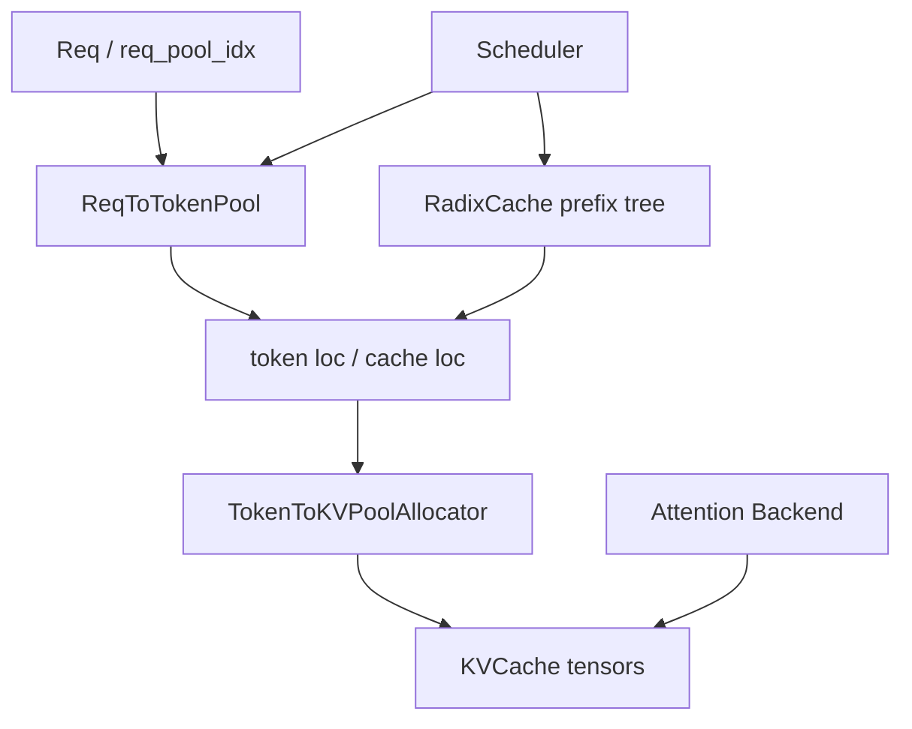

# KV Cache 与内存管理深度解析

本文梳理 `python/sglang/srt/mem_cache` 在 SRT 中承担的两类职责：物理 KV 内存管理，以及 prefix cache 逻辑复用。它解释 `ReqToTokenPool`、`TokenToKVPoolAllocator`、`RadixCache`、HiCache、SWA/Mamba cache 与 scheduler/executor 的关系。

## 两层坐标系

SRT 的 cache 设计分成两层：

- 请求到 token 位置：`ReqToTokenPool` 记录每个请求的 token 序列对应哪些 KV token slot。
- token slot 到物理 KV tensor：`TokenToKVPoolAllocator` 和 `KVCache` 管理实际 K/V tensor 或 Mamba/linear state。

这种分层让 scheduler 可以用轻量索引表达请求状态，让 attention backend 用连续/分页物理位置高效读写 KV。

## 关键文件

| 文件 | 关键对象 | 职责 |
| --- | --- | --- |
| `memory_pool.py` | `ReqToTokenPool`、`KVCache`、`MHATokenToKVPool`、`MLATokenToKVPool` | 请求映射与物理 KV tensor |
| `allocator.py` | `BaseTokenToKVPoolAllocator`、`TokenToKVPoolAllocator`、`PagedTokenToKVPoolAllocator` | token slot 分配/释放 |
| `common.py` | `alloc_for_extend`、`alloc_for_decode`、`release_kv_cache` | scheduler 调用的分配释放入口 |
| `base_prefix_cache.py` | `BasePrefixCache`、参数/结果类型 | prefix cache 抽象 |
| `radix_cache.py` | `RadixCache`、`TreeNode` | 普通 radix prefix tree |
| `chunk_cache.py` | `ChunkCache`、`SWAChunkCache` | radix disabled + chunked prefill 场景 |
| `swa_radix_cache.py`、`swa_memory_pool.py` | SWA cache/pool | sliding-window attention |
| `mamba_radix_cache.py`、`hi_mamba_radix_cache.py` | Mamba cache | Mamba/SSM 状态管理 |
| `hiradix_cache.py`、`hicache_storage.py`、`hybrid_cache/`、`storage/` | HiCache | GPU/host/storage 分层 cache |
| `sparsity/` | Sparse algorithms/adaptors | HiSparse/NSA/Quest 等稀疏 attention |

## Prefix Cache 主线

普通生成请求进入 scheduler 后，调度器用请求 token 查询 `tree_cache.match_prefix()`。命中返回 `prefix_indices`，这些位置已经有可复用 KV；未命中的 suffix 才会进入 prefill。

执行 prefill 后，请求完成或被释放时，`release_kv_cache()` 根据请求状态把新 KV 插入 prefix cache，或者直接释放 token slot。Radix tree 的 key 通常是 token id 序列；paged 模式下会按 page size 对齐。

Prefix cache 的价值在于减少重复 prompt prefill；风险在于 cache loc 生命周期复杂，尤其是 streaming、abort、retract、session、chunked prefill、disaggregation 同时存在时。

## 分配流程

Prefill/extend：

1. `ScheduleBatch.prepare_for_extend()` 设置 `prefix_lens`、`extend_lens`、`seq_lens`、`extend_num_tokens`。
2. `alloc_for_extend(batch)` 先为请求分配 `req_pool_idx`，再分配本轮新 token 的 `out_cache_loc`。
3. `ReqToTokenPool` 写入请求到 token loc 的映射。
4. attention backend 在 forward 中把新 K/V 写到 `out_cache_loc`。

Decode：

1. `ScheduleBatch.prepare_for_decode()` 为每个运行请求准备一个或多个新 token。
2. `alloc_for_decode(batch, token_per_req)` 分配新 loc。
3. attention backend 读取旧 loc 并写入新 loc。

释放：

1. 请求 finished/abort/retract/flush 时由 scheduler 触发。
2. `release_kv_cache(req, tree_cache, is_insert=True)` 决定插入 prefix tree 或直接释放。
3. allocator 回收 token loc；prefix tree 保留的 loc 需要 lock/ref 保护，不能被运行请求误驱逐。

## Cache 实现选择

`Scheduler.init_cache_with_memory_pool()` 根据配置和模型特性选择 prefix cache：

- radix disabled 且 chunked prefill：`ChunkCache` 或 `SWAChunkCache`。
- `SGLANG_EXPERIMENTAL_CPP_RADIX_TREE`：`RadixCacheCpp`。
- hierarchical cache：`HiRadixCache` 或 `HiMambaRadixCache`。
- hybrid SWA：`SWARadixCache`。
- hybrid SSM/Mamba：`MambaRadixCache`。
- LMCache：`LMCRadixCache`。
- 默认：`RadixCache`。
- streaming session：外层包 `SessionAwareCache`。

这说明 cache 策略不是独立模块开关，而是模型架构、attention 类型、chunked prefill、storage backend、session 能力共同作用的结果。

## HiCache 与远端存储

HiCache 在 GPU cache 之外引入 host 或外部 storage。`HiCacheStorage` 提供抽象，具体 backend 位于 `mem_cache/storage/`。调度器在 prefix cache 命中统计中区分：

- device hit：KV 已在 GPU。
- host hit：KV 在 host，可搬回 GPU。
- storage hit：KV 在外部存储，需要更慢的加载。

这类路径通常需要 prefetch、staging buffer、异步 transfer 和 layer_done counter，因此与 scheduler、model runner、disaggregation 的同步关系更紧。

## 与 Attention Backend 的关系

`ForwardBatch` 把 `req_to_token_pool`、`token_to_kv_pool`、`out_cache_loc`、`seq_lens` 和 `attn_backend` 传给模型层。attention backend 根据 forward mode：

- prefill/extend：写入新 KV，并对新 token 做 attention。
- decode：读取历史 KV，写入当前 token KV。
- MLA/MHA/SWA/Mamba/NSA 等架构使用不同 KV pool 形态。

因此 cache 模块不能只按“显存池”理解，它实际上定义了 attention 层的数据布局。

## 常见问题

- **为什么有 `ReqToTokenPool` 还需要 radix tree？** 前者描述运行中请求的 token loc，后者描述可复用 prefix 的索引结构。一个是当前请求视角，一个是全局 cache 视角。
- **为什么 cache loc 不能随意 compact？** attention backend、CUDA graph、disaggregation transfer 和 req pool 都持有 loc。compact 会要求全链路同步更新。
- **为什么多模态 Transformers backend 会禁用 radix cache？** 多模态 token 与 embedding 对齐更复杂，prefix cache 容易误复用不等价的 multimodal 前缀，因此代码中会自动禁用以避免错误。
- **OOM 时为什么可能 retract 请求？** decode batch 占用 KV 增长，如果没有足够 token slot，scheduler 可能回退部分 running req，把它们放回 waiting queue，释放 KV 后再调度。

## 修改建议

- 修改 allocator 时，必须同时跑 prefill、decode、chunked prefill、abort/retract 的测试。
- 修改 radix key 语义时，要评估 page size、bigram key、session-aware cache、HiCache hash。
- 新增 storage backend 时，要实现一致的 exists/get/set/prefetch 语义，并明确失败回退策略。
- 新增 attention 架构时，要先确定 KV tensor layout，再接入 `memory_pool.py` 和 attention backend。
