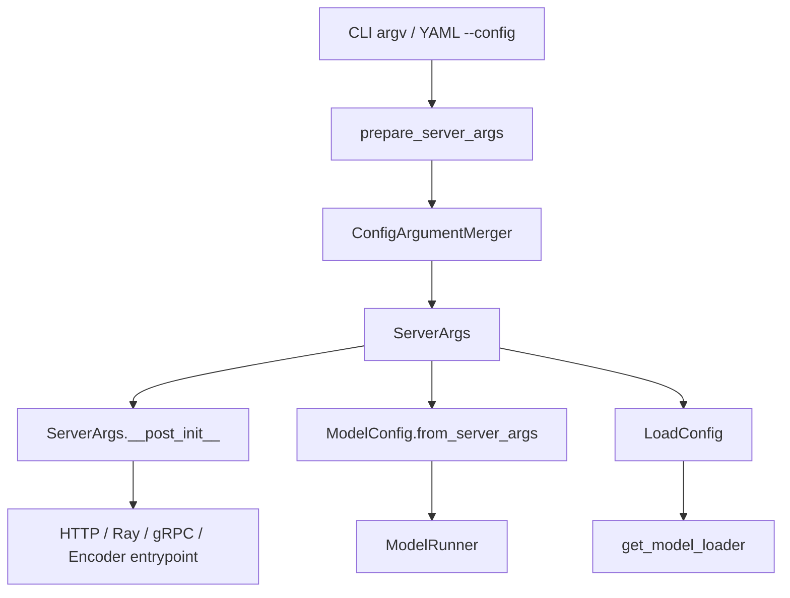

# 配置体系、模型加载与扩展生态

本文覆盖 SRT 的配置加载链路、模型注册与权重加载、多模态/LoRA/speculative/disaggregation 扩展点，以及 observability 接入。它回答一个开发者常见问题：新增能力时，应该从 `ServerArgs`、`ModelConfig`、loader、registry 还是 runtime manager 入手。

## 配置加载链路

入口 `python/sglang/launch_server.py` 调用 `prepare_server_args(sys.argv[1:])`，随后按 `encoder_only`、`grpc_mode`、`use_ray` 等参数分流到不同 server。`prepare_server_args()` 创建 argparse parser，调用 `ServerArgs.add_cli_args()`。如果存在 `--config`，则通过 `server_args_config_parser.py::ConfigArgumentMerger` 合并 YAML。

YAML 合并优先级是 `CLI > Config > Defaults`。实现方式是把配置文件参数放到 CLI 参数之前，再交给 argparse；同一 option 后出现的 CLI 值覆盖配置值。

`ServerArgs` 是运行时总配置，`__post_init__()` 统一做默认值推导、后端选择、speculative、load format、disaggregation、cache、deterministic、DLLM 等归一化和校验。它不是简单 DTO，而是运行时策略中心。

## ServerArgs、ModelConfig、LoadConfig

三者职责不同：

- `ServerArgs`：启动和运行配置，覆盖服务、HTTP、并行、cache、backend、LoRA、speculative、disaggregation、observability、debug 等。
- `ModelConfig`：模型静态语义和形状，从 HF config/generation config 与 `ServerArgs` 推导 dtype、context length、head/layer/vocab、多模态、attention 架构等。
- `LoadConfig`：权重来源和加载策略，承接 `load_format`、download dir、extra config、remote instance、ModelOpt、draft model index 等。

这条边界很重要：新增“用户可调运行参数”通常进 `ServerArgs`；新增“从模型 config 推导出的模型属性”进 `ModelConfig`；新增“权重文件读取方式”进 `LoadConfig` 或 loader。

## 模型注册

主要文件：

- `python/sglang/srt/models/registry.py`
- `python/sglang/srt/model_loader/utils.py`
- `python/sglang/srt/model_loader/loader.py`

`ModelRegistry.register("sglang.srt.models")` 扫描模型包，读取每个模块级 `EntryClass`，以类名作为 architecture key。外部模型可以通过环境变量 `SGLANG_EXTERNAL_MODEL_PACKAGE` 注册，且可用 overwrite 覆盖已有 architecture。

`model_loader.utils.get_model_architecture()` 读取 `model_config.hf_config.architectures`，解析到 SRT 原生模型类。必要时 fallback 到 `TransformersForCausalLM` 或 `MindSporeForCausalLM`，并把结果缓存到 `_resolved_model_arch` 和 `_resolved_model_impl`。

新增模型时要保证：

- 模块定义 `EntryClass`。
- class name 与 HF `architectures` 对齐，或在解析逻辑中明确映射。
- `forward()` 接收 SRT 所需参数，尤其是 `ForwardBatch`。
- `load_weights()` 正确处理权重名映射、TP 分片、QKV/MoE/量化布局。

## 权重加载路径

`ModelRunner` 构造 `LoadConfig` 后调用：

1. `get_model_loader(load_config, model_config)` 选择 loader。
2. `loader.load_model()` 初始化模型。
3. loader 准备权重 iterator。
4. 模型实例的 `load_weights(weights)` 消费权重。
5. loader 做 quant postprocess 或额外后处理。

`get_model_loader()` 按 `LoadFormat` 分发到 `DummyModelLoader`、`ShardedStateLoader`、`BitsAndBytesModelLoader`、`GGUFModelLoader`、`LayeredModelLoader`、`QuantizedRLModelLoader`、`RemoteModelLoader`、`RemoteInstanceModelLoader`、`RunaiModelStreamerLoader`，默认是 `DefaultModelLoader`。

默认 loader 会根据 `LoadFormat.AUTO/SAFETENSORS/PT/NPCACHE/MISTRAL` 等选择 `*.safetensors`、`*.bin`、`*.pt`、npcache 或多线程 iterator。MTP draft、secondary weights、fastsafetensors 等也在这一层处理。

## 多模态扩展

多模态识别主要由 `ModelConfig` 根据 architecture/subconfig 推导。`TokenizerManager` 初始化时会扫描 `sglang.srt.multimodal.processors`，外部 processor 包可由 `SGLANG_EXTERNAL_MM_PROCESSOR_PACKAGE` 覆盖。

processor 注册主线：

- `import_processors()` 扫描 `BaseMultimodalProcessor` 子类。
- processor 类需要声明 `models` 列表，建立 `PROCESSOR_MAPPING`。
- Transformers backend 可 fallback 到 `TransformersAutoMultimodalProcessor`。
- 请求中 `image_data/audio_data/video_data` 在 tokenizer 侧被 `process_mm_data_async()` 处理。
- scheduler 将 processor 输出转换为 `MultimodalInputs`，再调用模型的 `pad_input_ids` 展开占位 token。

风险点：多模态 token 与 embedding 对齐复杂，chunked prefill、radix cache、Transformers backend 和 encoder disaggregation 组合时需要单独验证。

## LoRA 扩展

配置入口位于 `ServerArgs`：`enable_lora`、`max_lora_rank`、`lora_target_modules`、`lora_paths`、`lora_backend` 等。

控制面：

- `TokenizerManager` 用 `LoRARegistry` 维护用户可见 LoRA name 到唯一 `lora_id` 的映射。
- load/unload adapter 请求通过 `io_struct.py` 的 LoRA 请求类型进入 scheduler。
- scheduler 侧 batch 收集 `lora_ids`，并受 `max_loras_per_batch` 限制。

执行面：

- `ModelRunner.init_lora_manager()` 创建 `LoRAManager`。
- `LoRAManager` 选择 backend、加载 adapter config/weights、初始化 LoRA modules 和 memory pool。
- backend registry 注册 `triton`、`csgmv`、`ascend`、`torch_native`。

常见限制：无初始 `--lora-paths` 时必须提供 `--max-lora-rank` 和 `--lora-target-modules`；LoRA adapter added tokens 路径需要谨慎，因为 tokenizer、vocab size、LM head 和 serving 协议都可能受影响。

## Speculative Decoding

`speculative/spec_info.py::SpeculativeAlgorithm` 支持 `EAGLE`、`EAGLE3`、`STANDALONE`、`NGRAM`、`NONE`。`create_worker()` 是 draft worker 工厂，会根据算法、overlap 和 spec v2 选择 worker 类。

主模型 worker 与 draft worker 的关系在 scheduler 初始化阶段确定。`Scheduler` 中 `self.model_worker` 在无 speculative 时指向 `tp_worker`，开启 speculative 时指向 draft worker，同时 target worker 仍用于验证或最终执行。

风险点：

- Speculative 会改变每步候选 token 数和 accepted length，影响 `ScheduleBatch`、`ForwardBatch`、logprob、finish reason。
- NGRAM 有平台和 DP attention 限制。
- EAGLE/MTP 类模型要求 draft config、aux hidden state、MTP layer 与 PP/TP 路径相容。

## Disaggregation

核心枚举：

- `DisaggregationMode`：`null`、`prefill`、`decode`。
- `TransferBackend`：`mooncake`、`mori`、`nixl`、`ascend`、`fake` 等。

`disaggregation/utils.py::get_kv_class()` 是 KV sender/receiver/manager/bootstrap server 的后端工厂。Prefill/decode 分离时，scheduler mixin 会维护 bootstrap、KV transfer queue、decode prealloc queue、metadata buffer 和 abort/error 回滚。

常见约束：

- decode mode 会改变 radix cache 假设，部分路径会强制禁用或改写 cache 策略。
- fake backend 只适合有限开发场景。
- staging buffer 与特定 transfer backend 绑定，不能假设所有 backend 都支持相同 zero-copy 能力。

## Observability

主要能力：

- HTTP server lifespan 中，`--enable-metrics` 添加 Prometheus middleware；`--enable-trace` 初始化 OpenTelemetry OTLP tracing。
- `SchedulerMetricsMixin.init_metrics()` 创建 `SchedulerMetricsCollector`，labels 包含 model/rank/engine 等信息。
- `TokenizerManager` 创建 `TokenizerMetricsCollector`，支持自定义 header labels 和 `extra_metric_labels`。
- `ReqTimeStatsBase`、`APIServerReqTimeStats`、`SchedulerReqTimeStats` 定义 tokenize、queue、prefill、decode、PD transfer 等阶段。
- `RequestLogger` 支持 text/json、日志级别、目标 logger、header 白名单和超时阈值。
- `--export-metrics-to-file` 使用 `FileRequestMetricsExporter` 输出请求 metrics 文件。

Observability 不是只在入口层。scheduler、tokenizer、HTTP、profile mixin、request logger 和 tracing 都会读写请求阶段数据；新增请求阶段或输出字段时，应同时检查 metrics 和 trace。

## 常见坑点

- `ServerArgs` 字段顺序需要与 CLI 参数维护同步，新增参数容易漏文档、校验和序列化。
- YAML config 主要支持 argparse 的 `store` 和 `store_true`；默认 true 参数不能简单用 `store_true: false` 反向关闭。
- `model_path` 为 `none/dummy` 时部分 `ServerArgs.__post_init__()` 校验会早退。
- `ModelRegistry` 依赖模块级 `EntryClass`，重复类名会断言失败。
- Transformers fallback 能提高兼容性，但不保证 SRT 原生性能和所有特性组合。
- `--export-metrics-to-file` 必须同时配置输出目录。
- `--enable-trace` 依赖 OpenTelemetry 包和可用 OTLP endpoint。

## 扩展 Checklist

- 新启动参数：`ServerArgs` 字段、CLI、config parser、校验、README/文档、测试。
- 新模型：`models/<model>.py`、`EntryClass`、`load_weights()`、registry 解析、代表性启动命令。
- 新 loader：`LoadFormat` choice、`get_model_loader()`、iterator、权重过滤、错误提示。
- 新多模态 processor：`BaseMultimodalProcessor` 子类、`models` 列表、token/embedding 对齐、chunked prefill 行为。
- 新 LoRA backend：backend registry、batch info、memory pool、CUDA graph 条件、fallback。
- 新 disaggregation backend：`TransferBackend`、KV class factory、bootstrap/metadata、失败回滚、metrics。
- 新 metrics：collector label、request stage、Prometheus bucket、文件导出字段、trace span。
