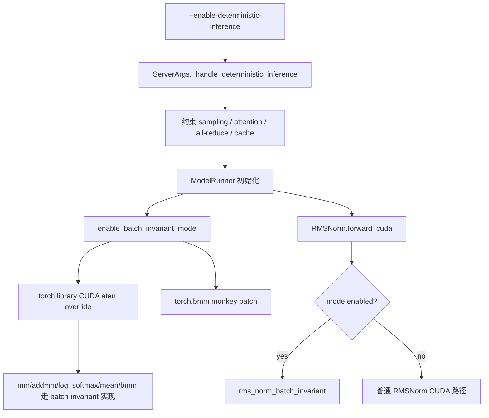

# srt/batch_invariant_ops 源码分析

## 1. 模块定位

`python/sglang/srt/batch_invariant_ops` 是 SRT 确定性推理路径的算子替换层。它通过 Triton/CUDA 内核、`torch.library` 覆盖和少量 monkey patch，让矩阵乘、softmax、mean、batch matmul、RMSNorm 等关键算子尽量不随 batch 组成变化而改变数值路径。

这个模块不是独立调度策略，而是 `--enable-deterministic-inference` 的底层支撑之一。确定性推理还需要 server 参数层同时约束 attention backend、sampling backend、all-reduce、cache 行为等，否则仅替换局部算子并不能保证端到端 batch-invariant。

源码入口：

- [batch_invariant_ops.py](/mnt/shanhai-ai/shanhai-workspace/zhouhao6/sglang/python/sglang/srt/batch_invariant_ops/batch_invariant_ops.py)
- [__init__.py](/mnt/shanhai-ai/shanhai-workspace/zhouhao6/sglang/python/sglang/srt/batch_invariant_ops/__init__.py)

## 2. 目录结构

```text
python/sglang/srt/batch_invariant_ops/
├── __init__.py
└── batch_invariant_ops.py
```

`__init__.py` 暴露运行时开关、RMSNorm helper、attention block size helper。核心实现集中在 `batch_invariant_ops.py`。

## 3. 核心接口

### 3.1 模式开关

- `enable_batch_invariant_mode(enable_bmm=True)`：注册 CUDA 实现，覆盖 `aten::mm`、`aten::addmm`、`aten::_log_softmax`、`aten::mean.dim`，可选覆盖 `aten::bmm` 并替换 `torch.bmm`。
- `disable_batch_invariant_mode()`：关闭模块级状态并恢复 `torch.bmm`。
- `set_batch_invariant_mode(enabled=True)`：便捷开关，内部调用 enable/disable。
- `is_batch_invariant_mode_enabled()`：供 layers/model runner 判断当前是否处于确定性路径。

这些开关是进程级状态。`torch.library` 注册和 `torch.bmm` 替换会影响同一 Python 进程内后续执行，因此调用方必须把它视为 server 生命周期配置，而不是局部上下文优化。

### 3.2 被替换的算子

- `matmul_persistent()`：矩阵乘核心持久化 kernel 路径，必要时走 DeepGEMM 或 fallback。
- `mm_batch_invariant()`：`aten::mm` CUDA 替换。
- `addmm_batch_invariant()`：`aten::addmm` CUDA 替换。
- `log_softmax()` / `_log_softmax_batch_invariant()`：稳定 softmax 归一化路径。
- `mean_dim()` / `mean_batch_invariant()`：按维度均值。
- `bmm_batch_invariant()`：batch matmul 替换，受 `enable_bmm` 控制。
- `rms_norm_batch_invariant()`：给 `layers.layernorm.RMSNorm.forward_cuda()` 显式调用。

### 3.3 attention block size

`AttentionBlockSize` 和 `get_batch_invariant_attention_block_size()` 返回固定 attention tile 形状，当前固定为 `(16, 16)`。这个值用于让 attention 路径避免随 batch 形态改变分块选择。

## 4. 端到端启用流程



关键点：

1. 用户通过 `--enable-deterministic-inference` 进入 deterministic mode。
2. server 参数处理阶段同步修改 sampling backend、attention backend、TP all-reduce、prefix cache 等配置。
3. `ModelRunner` 在 CUDA 模型执行路径启用 batch-invariant ops。
4. 后续 PyTorch aten 调用进入已注册的 CUDA 替换实现。
5. RMSNorm 不靠 aten override，而是在 layer forward 中主动查询 mode 并调用 batch-invariant helper。

## 5. 设计理由

LLM serving 中，同一个请求和其他请求拼在一起时，kernel 选择、规约顺序、分块形状、all-reduce 细节都可能变化。普通高性能路径优先吞吐，允许这些变化；确定性路径牺牲部分性能，固定关键数值路径，目标是让同一输入在不同 batch 组合下输出更一致。

该模块选择替换少量高影响算子，而不是全局禁用所有优化，原因是：

- 矩阵乘、softmax、norm 是 logits 细微差异的主要来源。
- 通过 `torch.library` 覆盖可以尽量少侵入模型实现。
- RMSNorm 作为自定义 layer 已经有明确 dispatch 点，显式分支比全局拦截更清晰。
- attention 需要配合独立 backend/block size 约束，不能只靠这里解决。

## 6. 依赖关系

内部依赖：

- `sglang.srt.server_args`：决定是否启用 deterministic inference。
- `sglang.srt.model_executor.model_runner`：实际调用 `enable_batch_invariant_mode()`。
- `sglang.srt.layers.layernorm`：在 RMSNorm CUDA forward 中查询 mode。
- attention、sampling、distributed all-reduce 相关模块：共同构成端到端确定性约束。

外部依赖：

- `torch`
- `torch.library`
- `triton`
- DeepGEMM 相关能力，可用时用于部分 matmul 路径。

## 7. 扩展点

新增 batch-invariant 算子时建议遵循三层结构：

1. 实现可独立测试的 kernel/helper。
2. 提供 `*_batch_invariant()` Python 包装，保留 dtype/shape 校验和 fallback。
3. 在 `enable_batch_invariant_mode()` 中注册对应 aten op 或在 layer 中显式分支。

新增 attention 确定性支持时，不应只改本目录，还要检查：

- attention backend 是否支持固定 block shape。
- scheduler/forward batch 是否会改变 token 排布。
- sampling backend 是否仍然使用稳定实现。
- TP/DP collective 是否有 deterministic 约束。

## 8. 风险与排障

- 进程级副作用：`torch.library` 注册和 `torch.bmm` monkey patch 不是请求级开关。
- 嵌套开关风险：如果测试或工具中反复 enable/disable，需要确认 `torch.bmm` 恢复顺序。
- shape/dtype 限制：部分 kernel 只覆盖特定 CUDA dtype/shape，不满足时可能 fallback 或报错。
- 性能下降：确定性推理优先稳定性，吞吐和 latency 不应按普通 fast path 预期评估。
- backend 协同：如果 sampling/attention/all-reduce 任一处仍走非确定性 fast path，最终输出仍可能变化。
- 源码清理点：当前 `batch_invariant_ops.py` 的 `log_softmax` 附近可见一段疑似合并残留文本，后续维护时应单独清理并回归测试。

## 9. 验证建议

- 单元测试：`test/registered/unit/batch_invariant_ops/test_batch_invariant_ops.py`。
- 端到端：构造同一 prompt 单独请求、与不同 batch 混合请求，比较 logits/logprobs。
- 手工脚本：`test/manual/test_logprobs.py` 可作为 logprobs 稳定性排查入口。

