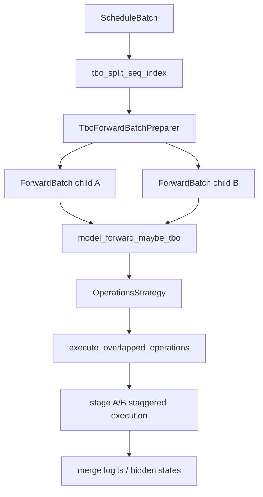
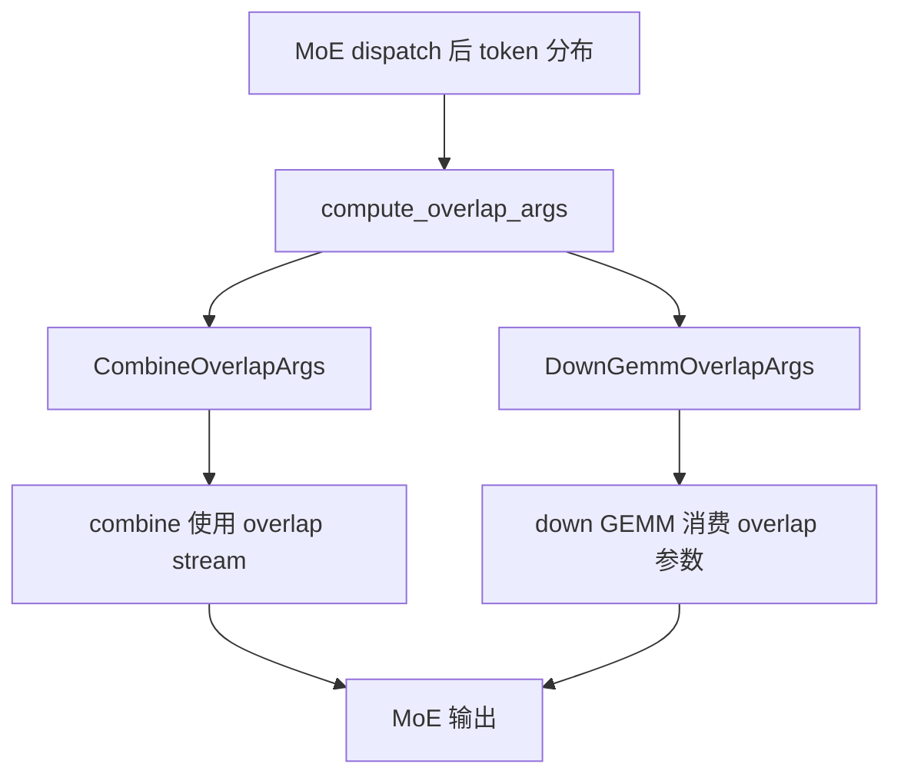

# srt/batch_overlap 源码分析

## 1. 模块定位

`python/sglang/srt/batch_overlap` 实现的是 MoE 前向内部的 single-batch overlap 和 two-batch overlap，目标是在 MoE dispatch、combine、down GEMM、attention 等阶段之间制造流水重叠，降低 MoE 路径通信和计算的暴露时间。

它和 scheduler 层的 overlap 不是同一个概念：

- scheduler overlap 关注请求调度、CPU/GPU 准备和模型执行之间的并行。
- `batch_overlap` 关注一次模型 forward 内部或两个 micro batch 之间的 MoE/attention 操作交错。

源码入口：

- [operations.py](/mnt/shanhai-ai/shanhai-workspace/zhouhao6/sglang/python/sglang/srt/batch_overlap/operations.py)
- [operations_strategy.py](/mnt/shanhai-ai/shanhai-workspace/zhouhao6/sglang/python/sglang/srt/batch_overlap/operations_strategy.py)
- [single_batch_overlap.py](/mnt/shanhai-ai/shanhai-workspace/zhouhao6/sglang/python/sglang/srt/batch_overlap/single_batch_overlap.py)
- [two_batch_overlap.py](/mnt/shanhai-ai/shanhai-workspace/zhouhao6/sglang/python/sglang/srt/batch_overlap/two_batch_overlap.py)

## 2. 目录结构

```text
python/sglang/srt/batch_overlap/
├── __init__.py
├── operations.py
├── operations_strategy.py
├── single_batch_overlap.py
└── two_batch_overlap.py
```

## 3. 核心文件职责

### 3.1 operations.py

`operations.py` 是通用 stage executor：

- `YieldOperation`：表示某个阶段需要让出执行权，便于两个 batch 交错。
- `ExecutionOperation`：封装实际执行单元。
- `_StageExecutor`：按 stage 推进 operation。
- `_StateDict`：保存跨阶段状态。
- `execute_operations()`：普通顺序执行。
- `execute_overlapped_operations()`：按 stage 交错执行，用于 TBO。

该文件提供的是抽象执行框架，不绑定具体模型结构。

### 3.2 operations_strategy.py

`OperationsStrategy` 把模型层结构转换为可 overlap 的 stage 序列。`init_new_tbo(layers, forward_mode)` 根据模型层类型和 forward mode 选择策略。

当前显式支持的 MoE decoder layer 包括：

- `DeepseekV2DecoderLayer`
- `Qwen3MoeDecoderLayer`
- `MiMoV2DecoderLayer`

策略约束：

- prefill/extend 使用 `tbo_delta_stages=0`。
- decode/target verify 使用 `tbo_delta_stages=2`。
- dense TBO 当前未实现。

### 3.3 single_batch_overlap.py

SBO 在同一个 batch 内重叠 MoE combine/down GEMM 等步骤。核心结构：

- `SboFlags`：记录当前是否启用相关 overlap。
- `CombineOverlapArgs`：combine 阶段 overlap 参数。
- `DownGemmOverlapArgs`：down projection GEMM overlap 参数。
- `compute_overlap_args()`：根据 forward batch 和 token 分布生成 overlap 参数。

### 3.4 two_batch_overlap.py

TBO 将一个 forward batch 切成 A/B 两个 child batch，并在层级 stage 上交错推进。

关键组件：

- `TboCudaGraphRunnerPlugin`：给 CUDA graph runner 注入 TBO 相关准备/回放逻辑。
- `TboDPAttentionPreparer`：DP attention 场景下检查和准备跨 rank TBO 条件。
- `TboForwardBatchPreparer`：切分 `ForwardBatch`，设置 child batch metadata。
- `model_forward_maybe_tbo()`：模型 forward 的 TBO 选择入口。
- `MaybeTboDeepEPDispatcher`：MoE dispatch 路径中对 TBO/非 TBO 的统一适配。

## 4. 启用条件与关键参数

相关 server 参数包括：

- `--enable-two-batch-overlap`
- `--enable-single-batch-overlap`
- `--tbo-token-distribution-threshold`

TBO 依赖 MoE A2A backend，`moe_a2a_backend` 不能为 `none`。实际是否运行 TBO 还取决于 forward mode、token 分布、DP attention 一致性、CUDA graph 支持、模型层类型等。

## 5. Two-Batch Overlap 数据流



运行逻辑：

1. scheduler/forward batch 准备阶段计算 `tbo_split_seq_index`。
2. `TboForwardBatchPreparer` 将一个 batch 切成两个 child batch，并填充 `tbo_children`、`can_run_tbo` 等字段。
3. `model_forward_maybe_tbo()` 判断是否可走 TBO。
4. `OperationsStrategy` 根据层结构生成 stage。
5. `execute_overlapped_operations()` 将 A/B 两个 batch 按 stage 交错推进。
6. 最后把输出重新合并为原 batch 语义。

## 6. Single-Batch Overlap 数据流



SBO 不切分成两个 batch，而是在同一批 token 内根据 MoE token 分布和 dispatcher 能力安排 combine/down projection 的重叠。

## 7. 与其他模块的关系

- `model_executor.forward_batch_info`：承载 `tbo_split_seq_index`、`tbo_children`、`can_run_tbo` 等字段。
- `model_executor.model_runner`：选择 `TboAttnBackend`、决定 CUDA graph replay 是否可结合 TBO。
- `layers/attention/tbo_backend.py`：TBO attention backend。
- MoE layers/dispatchers/runners：DeepEP、DeepGEMM、combine/down GEMM overlap 的主要消费方。
- DP attention：`TboDPAttentionPreparer` 要求各 rank 对 TBO 可行性达成一致，否则存在 collective mismatch 风险。

## 8. 设计理由

MoE 模型中，token dispatch/combine 通信和 expert GEMM 常常交替出现。单纯顺序执行会让通信和计算互相等待。TBO/SBO 的设计思路是：

- 让两个 batch 的 attention/MoE stage 错位执行，隐藏部分通信等待。
- 在单 batch 内对 combine 和 down GEMM 使用额外 stream/参数重叠。
- 把 overlap 逻辑集中在 `batch_overlap`，避免污染每个模型的 forward 主干。

## 9. 扩展点

新增模型支持 TBO 时，需要补充：

1. 在 `operations_strategy.py` 中识别新的 decoder layer。
2. 为该 layer 拆解出可 overlap 的 stage。
3. 确认 attention backend、MoE dispatcher、CUDA graph runner 都能处理 child batch。
4. 校验 output merge 对 logits、hidden states、aux loss 等字段没有语义损失。

新增 MoE dispatcher 支持 SBO 时，需要：

- 消费 `CombineOverlapArgs` / `DownGemmOverlapArgs`。
- 明确 stream 同步点。
- 为小 batch 或 token 分布极不均衡场景提供回退。

## 10. 风险与排障

- backend 约束：TBO 要求 MoE A2A backend，不适用于所有 MoE 配置。
- CPU graph 不支持：TBO CUDA graph plugin 不等价于 CPU graph 支持。
- dense TBO 未实现：dense decoder layer 不能直接复用当前策略。
- padding/merge 风险：child batch 输出合并必须保持原 token 顺序。
- `ForwardBatch` 字段传播：新增过滤、切片、合并逻辑时必须维护 TBO 字段。
- speculative/grammar 风险：spec decode、约束解码等路径可能对 batch 切分更敏感。
- DP attention deadlock：各 rank 对 `can_run_tbo` 判断不一致可能造成 collective 等待。
- 小 batch 退化：overlap 管理成本可能超过收益。

排查开关：

- `SGLANG_TBO_DEBUG=1`
- `SGLANG_OPERATIONS_ENABLE_PROFILE=1`

