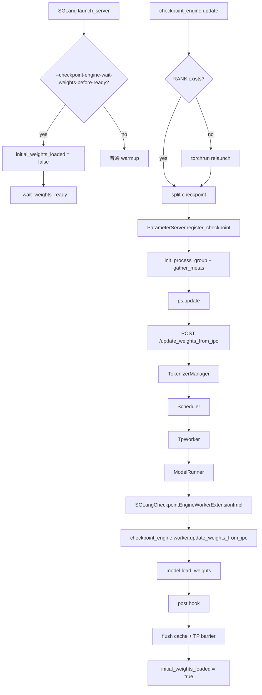

# srt/checkpoint_engine 源码分析

## 1. 模块定位

`python/sglang/srt/checkpoint_engine` 是 SRT 对外部 `checkpoint-engine` 包的集成层。它让已经运行的 SGLang server 可以通过 IPC/ZMQ 接收外部分布式加载进程传来的权重，并在线更新 `ModelRunner` 中的模型参数。

典型使用方式是：

1. SGLang server 用 `--load-format dummy` 启动空权重模型。
2. 启用 `--checkpoint-engine-wait-weights-before-ready`，server warmup 前等待首次权重注入。
3. 外部 `torchrun` 进程并行读取 safetensors checkpoint。
4. 外部 `checkpoint_engine.ps.ParameterServer` 分发权重并调用 SGLang `/update_weights_from_ipc`。

源码入口：

- [checkpoint_engine_worker.py](/mnt/shanhai-ai/shanhai-workspace/zhouhao6/sglang/python/sglang/srt/checkpoint_engine/checkpoint_engine_worker.py)
- [update.py](/mnt/shanhai-ai/shanhai-workspace/zhouhao6/sglang/python/sglang/srt/checkpoint_engine/update.py)

## 2. 目录结构

```text
python/sglang/srt/checkpoint_engine/
├── __init__.py
├── checkpoint_engine_worker.py
└── update.py
```

- `__init__.py`：导出 `update.main`。
- `checkpoint_engine_worker.py`：server 侧 worker extension，桥接 `ModelRunner` 和外部 checkpoint-engine worker。
- `update.py`：外部更新脚本入口，可由 `python -m sglang.srt.checkpoint_engine.update` 启动。

## 3. Server 侧核心类

### 3.1 SGLangCheckpointEngineWorkerExtension

该类维护 ZMQ context，并定义从外部 IPC 更新权重的通用流程。

核心方法：

- `get_device_uuid()`：由子类实现，返回当前设备 UUID。
- `get_device_id()`：返回当前设备 id。
- `get_model_loader()`：返回可消费 `(name, tensor)` iterator 的权重加载函数。
- `get_post_hook()`：默认无 hook。
- `update_weights_from_ipc(zmq_handles)`：
  1. 初始化 ZMQ context。
  2. 用当前设备 UUID 从 `zmq_handles` 中查找 socket path。
  3. 调用外部 `checkpoint_engine.worker.update_weights_from_ipc(ctx, handle, device_id, run, post_hook)`。

### 3.2 SGLangCheckpointEngineWorkerExtensionImpl

实现类持有 `model_runner`。

- `get_device_uuid()`：使用 `torch.cuda.current_device()` 和 CUDA device property UUID，格式为 `GPU-<uuid>`。
- `get_model_loader()`：返回 `model_runner.model.load_weights`。
- `get_post_hook()`：返回权重加载后的处理闭包：
  - 遍历 `model.named_modules()`。
  - 如果 module 有 `quant_method`，调用 `quant_method.process_weights_after_loading(module)`。
  - 如果模型有 `post_load_weights()`，继续调用。
  - hook 异常只记录 warning。

## 4. 外部更新脚本

`update.py` 在 server 外运行，职责是读取 checkpoint、启动/加入 checkpoint-engine 参数服务、等待 SGLang ready，然后触发 IPC 更新。

主要函数：

- `check_sglang_ready(endpoint, inference_parallel_size, uds)`：每个 inference parallel group 的 src rank 轮询 `/ping`。
- `split_checkpoint_files(checkpoint_path, rank, world_size)`：按 rank 切分 `.safetensors` 文件。
- `split_tensors(checkpoint_path, rank, world_size)`：读取 `model.safetensors.index.json` 后按 weight name 切分 tensor。
- `req_inference(...)`：构造传给 `ParameterServer.update()` 的回调，向 `/update_weights_from_ipc` POST `zmq_handles`、`flush_cache=True`、`weight_version`。
- `update_weights(ps, ...)`：注册 checkpoint、初始化进程组、收集 metas，并按 `broadcast`、`p2p` 或 `all` 更新。
- `join(ps, ...)`：加载已保存 metas 并加入已有更新。
- `run_with_torchrun()`：若当前没有 `RANK` 环境变量，自动用 `torchrun --nproc-per-node=<inference_parallel_size>` 重启脚本。
- `main()`：CLI 入口。

## 5. 端到端流程



调用链：

```text
HTTP /update_weights_from_ipc
-> TokenizerManager.update_weights_from_ipc
-> update_weights_from_ipc_communicator
-> Scheduler.update_weights_from_ipc
-> TpWorker.update_weights_from_ipc
-> ModelRunner.update_weights_from_ipc
-> SGLangCheckpointEngineWorkerExtensionImpl.update_weights_from_ipc
-> checkpoint_engine.worker.update_weights_from_ipc
-> model.load_weights
```

## 6. 依赖关系

外部依赖：

- `checkpoint_engine.ps.ParameterServer`
- `checkpoint_engine.worker.update_weights_from_ipc`
- `pyzmq`
- `httpx`
- `torch`
- `torch.distributed`
- `safetensors.safe_open`
- `loguru`，不可用时回退到 Python logging

内部依赖：

- `sglang.srt.managers.io_struct.UpdateWeightsFromIPCReqInput/Output`
- `TokenizerManager` 和 `TokenizerCommunicatorMixin`
- `SchedulerUpdateWeightsMixin`
- `TpWorker`
- `ModelRunner`
- 默认模型加载器的权重后处理约定

## 7. 扩展点

- 新传输方式：优先扩展外部 checkpoint-engine 的 `ParameterServer.update()` 或 worker 传输实现，SGLang 侧只要求最终传入 `zmq_handles`。
- 非 CUDA 后端：当前设备匹配依赖 CUDA UUID，需要替换 `get_device_uuid()`。
- 更严格的 post hook：可以把量化后处理失败从 warning 升级为异常，但要评估热更新兼容性。
- 自定义权重版本：`weight_version` 会在成功更新后写入 tokenizer manager。
- DP 场景：Tokenizer 层允许 `dp_size == 1 or enable_dp_attention`，但 IPC 返回结果取第一个 communicator 结果，复杂 DP 拓扑需要专项验证。

## 8. 风险与排障

- 外部包缺失：需要安装带 checkpoint-engine 额外依赖的环境，否则 worker 或 update 脚本会失败。
- GPU UUID 不匹配：`zmq_handles` 的 key 必须匹配 `GPU-<cuda uuid>`。
- 并行度不一致：`--inference-parallel-size` 必须和 server 侧 TP/节点布局匹配。
- 首次等待超时：默认 `SGLANG_WAIT_WEIGHTS_READY_TIMEOUT=120` 秒，慢 checkpoint 需要调大。
- post hook 异常被吞：量化后处理失败只 warning，可能推迟到推理阶段暴露。
- cache 一致性：默认 `flush_cache=True`。关闭后旧 KV cache 可能与新权重不一致。
- 更新期间并发：`TokenizerManager` 使用 writer lock 阻塞推理，但 IPC 请求本身没有 `abort_all_requests` 字段。
- 参数名：当前源码参数是 `--checkpoint-engine-wait-weights-before-ready`。

