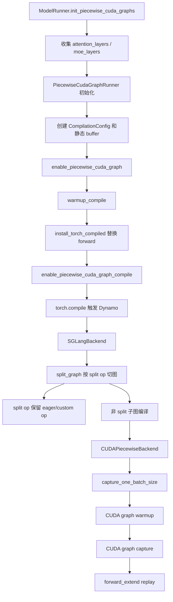

# srt/compilation 源码分析

## 1. 模块定位

`python/sglang/srt/compilation` 是 SRT 服务于 piecewise CUDA graph 的编译子系统。它不是普通的全模型 `torch.compile` 封装，而是在 piecewise CUDA graph 上下文中按需触发 Dynamo/Inductor，把 FX graph 按自定义 split op 切成多个子图，并对可捕获子图分别包装 CUDA/NPU graph backend。

核心目标：

- 用 `torch.compile` 捕获模型前向中的可编译片段。
- 将 attention、MoE、all-reduce、Mamba 等不适合并入同一 graph 的操作作为边界。
- 对子图支持 `eager` 和 `inductor` 两类执行/编译后端。
- 在 CUDA graph capture/replay 期间稳定子图输入地址和输出生命周期。

主要上游入口：

- [piecewise_cuda_graph_runner.py](/mnt/shanhai-ai/shanhai-workspace/zhouhao6/sglang/python/sglang/srt/model_executor/piecewise_cuda_graph_runner.py)
- [model_runner.py](/mnt/shanhai-ai/shanhai-workspace/zhouhao6/sglang/python/sglang/srt/model_executor/model_runner.py)

## 2. 目录结构

```text
python/sglang/srt/compilation/
├── backend.py
├── compilation_config.py
├── compile.py
├── compiler_interface.py
├── cuda_piecewise_backend.py
├── fix_functionalization.py
├── fx_utils.py
├── inductor_pass.py
├── npu_piecewise_backend.py
├── pass_manager.py
├── piecewise_context_manager.py
└── weak_ref_tensor.py
```

## 3. 核心组件

### 3.1 CompilationConfig

[compilation_config.py](/mnt/shanhai-ai/shanhai-workspace/zhouhao6/sglang/python/sglang/srt/compilation/compilation_config.py) 保存 piecewise 编译配置：

- `capture_sizes`
- `compiler`
- debug mode
- 当前 split op 列表

初始化时会复制全局 `SPLIT_OPS`，运行期可通过 `add_split_op()` 追加 MoE 等动态边界。

`register_split_op` 是装饰器，用于把自定义 op 注册进全局 split op 表。切图时通过 `str(node.target)` 和 `sglang.<op_name>` 字符串匹配。

### 3.2 install_torch_compiled

[compile.py](/mnt/shanhai-ai/shanhai-workspace/zhouhao6/sglang/python/sglang/srt/compilation/compile.py) 的 `install_torch_compiled()` 会替换目标 module 的 `forward`：

- 不在 piecewise CUDA graph 上下文中时，显式调用原始 forward。
- 在 piecewise 上下文中时，首次执行会按注解或 `dynamic_arg_dims` 标记动态维度，并调用 `torch.compile(..., backend=SGLangBackend(...))`。
- 后续执行复用已编译 callable。

这种 trampoline 设计避免普通 forward 被意外编译，也让 capture/warmup 阶段可以控制何时触发 Dynamo。

### 3.3 SGLangBackend

[backend.py](/mnt/shanhai-ai/shanhai-workspace/zhouhao6/sglang/python/sglang/srt/compilation/backend.py) 实现 Dynamo backend：

- 接收整段 FX graph。
- 配置 Inductor post-grad pass。
- 调用 `split_graph()` 按 split op 切图。
- 编译非 split 子图。
- 返回拼接后的 `split_gm`。

compile cache 默认位于 `SGLANG_CACHE_DIR` 或 `~/.cache/sglang/torch_compile_cache/<hash>/rank_0_0/<model_tag>`。

### 3.4 split_graph

`split_graph()` 遍历 FX node，遇到 split op 时将该 op 单独放入 splitting graph，并在其前后切分 capturable graph。它使用 `torch.fx.passes.split_module.split_module(..., keep_original_order=True)`，避免带 mutation 的节点被重排。

### 3.5 PiecewiseCompileInterpreter

该 interpreter 在 fake mode 下执行 split graph。对非 split 子模块，它先编译动态 shape callable，再把对应子模块替换成 `CUDAPiecewiseBackend` 或 `NPUPiecewiseBackend`。

### 3.6 CUDAPiecewiseBackend / NPUPiecewiseBackend

[cuda_piecewise_backend.py](/mnt/shanhai-ai/shanhai-workspace/zhouhao6/sglang/python/sglang/srt/compilation/cuda_piecewise_backend.py) 中每个可捕获子图对应一个 backend 实例：

- 第一次执行走动态 shape compiled graph。
- 对 capture size 先 warmup，再进入 `torch.cuda.graph(..., pool=graph_pool, stream=capture_stream)`。
- capture 后使用 replay。
- debug mode 下会检查输入 tensor 地址是否稳定。

[npu_piecewise_backend.py](/mnt/shanhai-ai/shanhai-workspace/zhouhao6/sglang/python/sglang/srt/compilation/npu_piecewise_backend.py) 继承 CUDA backend 逻辑，改用 `torch.npu.NPUGraph`。但 server 参数层当前会在 NPU 场景自动禁用 piecewise CUDA graph，因此不能理解为 NPU 默认可用。

### 3.7 InductorAdaptor 与 pass

[compiler_interface.py](/mnt/shanhai-ai/shanhai-workspace/zhouhao6/sglang/python/sglang/srt/compilation/compiler_interface.py) 定义：

- `CompilerInterface`
- `EagerAdapter`
- `InductorAdaptor`

`InductorAdaptor` 直接调用 `torch._inductor.compile_fx.compile_fx`，并 patch `FxGraphCache`、compiled graph hash、shape env、AOTAutograd cache 等内部 API，以支持脱离 Dynamo tracing 上下文的多 shape 编译/cache。这里高度依赖 PyTorch 内部实现，升级 PyTorch 时风险最高。

`pass_manager.py`、`inductor_pass.py`、`fix_functionalization.py` 提供 post-grad pass 管理和 functionalization 后处理基础设施。

## 4. 编译与 capture 流程



阶段说明：

1. `ModelRunner.init_piecewise_cuda_graphs()` 检查启用条件，收集模型层中的 attention/MoE 对象。
2. `PiecewiseCudaGraphRunner` 创建静态输入 buffer、capture sizes 和 graph memory pool。
3. 在 `enable_piecewise_cuda_graph()` 下 warmup kernel，并通过 `install_torch_compiled()` 替换 language model forward。
4. 在 `enable_piecewise_cuda_graph_compile()` 下执行 capture token sizes，触发 `torch.compile`。
5. `SGLangBackend` 将 FX graph 切成 split op 子图和可捕获子图。
6. 可捕获子图被包装成 `CUDAPiecewiseBackend`。
7. capture 阶段对每个 size warmup 并记录 CUDA graph。
8. replay 阶段由 `piecewise_cuda_graph_runner.replay()` 将真实 batch copy 到静态 buffer，并 pad 到最近 capture size。

## 5. 与 layers/model_executor 的关系

- `ModelRunner`：决定是否启用 piecewise CUDA graph，并在 extend 路径选择 graph replay 或普通 forward。
- `PiecewiseCudaGraphRunner`：管理静态 buffer、capture token sizes、capture/replay 生命周期和 forward metadata。
- `ForwardBatch`：贯穿 warmup、capture、replay 的运行时上下文。
- `layers.radix_attention.unified_attention_with_output`：作为 attention split op，通过 `ForwardContext` 找真实 attention layer 和 attn backend。
- `distributed.parallel_state.inplace_all_reduce`：注册为 split op，避免 collective 被错误并入 graph。
- linear attention、Nemotron-H Mamba2、MoE piecewise 实现也复用 split op 模式。

## 6. 扩展点

新增 split op：

1. 使用 SGLang custom op 注册。
2. 使用 `@register_split_op()` 加入 split op 表。
3. 正确声明 `mutates_args`。
4. 在 op 内通过 `get_forward_context()` 获取 `forward_batch`、layer 列表或 MoE 配置。

新增编译后端：

1. 实现 `CompilerInterface.compile/load/compute_hash/initialize_cache`。
2. 在 `make_compiler()` 中注册新的 compiler 名称。
3. 保证返回 callable 能被 piecewise backend 以 `*args` 调用。

新增 Inductor pass：

1. 继承 `InductorPass` 或 `SGLangInductorPass`。
2. 加入 `PostGradPassManager`。
3. `uuid()` 必须反映 pass 行为，避免 cache 复用过期产物。

## 7. 风险与排障

- PyTorch 内部 API 敏感：`InductorAdaptor` 是升级 PyTorch 时的重点回归对象。
- 自动禁用条件多：spec decoding、DP attention、普通 torch compile、PP、非 CUDA、MoE A2A、LoRA、多模态、GGUF、CPU offload、deterministic、PD disaggregation、symmetric memory、context parallel 等都会导致禁用。
- split op 依赖字符串匹配，op target 命名变化会影响切图。
- mutation 语义敏感，custom op 必须准确声明参数修改。
- replay 只支持 `num_tokens <= max(capture_sizes)`，并会 pad 到最近 capture size。
- capture stream 必须通过 `set_pcg_capture_stream()` 设置。
- output 使用 weak ref 管理，最后一个子图输出生命周期容易出问题。

排障建议：

- 打开 `enable_torch_compile_debug_mode` 检查 replay 输入地址。
- 查看 compile cache 中的 `computation_graph_*.py`。
- 失败时先用 `--disable-piecewise-cuda-graph` 回退确认问题范围。

