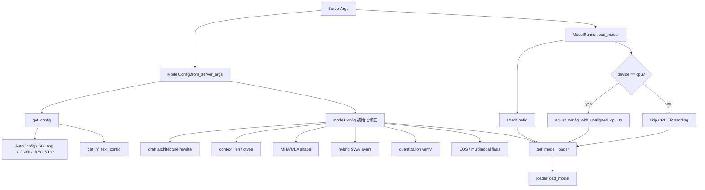

# srt/configs 源码分析

## 1. 模块定位

`python/sglang/srt/configs` 是 SRT 推理路径中的配置适配层。它不执行模型前向，而是把 HuggingFace、本地、远端、模型特化配置转换成 SGLang runtime 可直接消费的统一配置对象。

核心职责：

- 加载和修正 HF `PretrainedConfig`。
- 从 `ServerArgs` 构造 `ModelConfig`。
- 统一文本子配置、上下文长度、dtype、attention shape、KV head、量化信息。
- 定义权重加载配置 `LoadConfig` 和设备配置 `DeviceConfig`。
- 提供 SGLang 自定义 `PretrainedConfig`，覆盖 HF 未内置或字段不兼容模型。
- 在 CPU TP、非整除 head、量化 block size 场景下修正配置。
- 为多模态模型注册自定义 processor/image processor。

## 2. 目录结构

主要文件：

- [model_config.py](/mnt/shanhai-ai/shanhai-workspace/zhouhao6/sglang/python/sglang/srt/configs/model_config.py)：运行时主配置入口。
- [load_config.py](/mnt/shanhai-ai/shanhai-workspace/zhouhao6/sglang/python/sglang/srt/configs/load_config.py)：权重加载配置。
- [device_config.py](/mnt/shanhai-ai/shanhai-workspace/zhouhao6/sglang/python/sglang/srt/configs/device_config.py)：设备配置。
- [update_config.py](/mnt/shanhai-ai/shanhai-workspace/zhouhao6/sglang/python/sglang/srt/configs/update_config.py)：CPU TP 下配置 padding。
- [utils.py](/mnt/shanhai-ai/shanhai-workspace/zhouhao6/sglang/python/sglang/srt/configs/utils.py)：processor 注册工具。
- `modelopt_config.py`：ModelOpt 量化相关 dataclass。
- `mamba_utils.py`：Mamba2/linear attention cache shape 与 dtype 工具。
- 其他 `*.py`：模型特化 config。

`__init__.py` 导出一批常用特化 config，但不是所有 config 文件都通过这里暴露。部分模型由具体 model 文件直接 import。

## 3. ModelConfig

`ModelConfig` 是 SRT 模型运行主配置对象，典型来源是：

```python
ModelConfig.from_server_args(server_args)
```

初始化主流程：

1. 保存 `model_path`、`revision`、`quantization`、`model_impl`、sampling defaults、draft 标记等基础参数。
2. 校验 `quantize_and_serve`，当前 ModelOpt 一体化 quantize-and-serve 被显式禁用。
3. 处理 RunAI object URI 和 remote URL，必要时把 config 拉到本地临时目录。
4. 解析 `model_override_args`，调用 `get_config()` 加载 HF config。
5. 调用 `get_hf_text_config()` 提取文本侧 config，存为 `hf_text_config`。
6. 读取 `generation_config.json`，补充 EOS 和默认采样参数。
7. 根据 architecture 和子配置判断 generation/multimodal/audio/encoder-decoder/local-attention/piecewise 禁用等属性。
8. 对 draft model 改写 architecture，例如 DeepSeek、GLM、Longcat、Qwen3Next、Step3p5、NemotronH 等切到 NextN/MTP 架构。
9. 推导 dtype、context length、attention shape、head 数、hidden layers、vocab size。
10. 处理 hybrid SWA 层划分。
11. 校验或自动识别量化配置。
12. 校验 Transformers 版本和 dual-chunk sparse attention 配置。
13. 缓存 EOS token、image token、matryoshka embedding 标记。

关键字段：

- `hf_config`：完整 HF config。
- `hf_text_config`：文本侧 config，多模态模型通常来自 `text_config`、`llm_config`、`language_config` 或 `thinker_config`。
- `context_len`：由 `get_context_length()` 推导，可被用户参数覆盖。
- `dtype`：由 config dtype 和 CLI dtype 共同决定。
- `attention_arch`：`AttentionArch.MHA` 或 `AttentionArch.MLA`。
- `head_dim`、`v_head_dim`、`num_attention_heads`、`num_key_value_heads`。
- `num_hidden_layers`、`num_attention_layers`、`num_nextn_predict_layers`。
- `is_hybrid_swa`、`swa_attention_layer_ids`、`full_attention_layer_ids`。
- `quantization`、`use_scale_ue8m0`。

## 4. LoadConfig

[load_config.py](/mnt/shanhai-ai/shanhai-workspace/zhouhao6/sglang/python/sglang/srt/configs/load_config.py) 定义权重加载参数，通常由 `ModelRunner.load_model()` 根据 `server_args` 创建。

支持的 `LoadFormat` 包括：

```text
auto, pt, safetensors, npcache, dummy, sharded_state, gguf,
bitsandbytes, mistral, layered, flash_rl, jax, remote,
remote_instance, rdma, local_cached, fastsafetensors, private,
runai_streamer
```

`__post_init__` 负责：

- 把 JSON 字符串形式的 `model_loader_extra_config` 转成 dict。
- 校验并规范化 `load_format` enum。
- 在未指定 `ignore_patterns` 时默认忽略 `original/**/*`。
- 自动创建 `ModelOptConfig`。

## 5. DeviceConfig

`DeviceConfig` 很薄，负责把设备类型包装成 `torch.device`，支持：

```text
cuda, xpu, hpu, cpu, npu, musa, mps
```

字段包括 `device_type`、`device`、`gpu_id`。模型加载时会传给 loader。

## 6. 模型特化 Config

大部分特化 config 继承 `transformers.PretrainedConfig`，用于定义 `model_type`、默认字段、字段映射、子配置结构，或补齐 SGLang 模型实现需要的属性。

主要类别：

- 文本/通用：`ChatGLMConfig`、`DbrxConfig`、`ExaoneConfig`、`LongcatFlashConfig`、`Olmo3Config`、`Step3p5Config`、`AfmoeConfig`。
- MoE/hybrid/linear/Mamba：`BailingHybridConfig`、`FalconH1Config`、`GraniteMoeHybridConfig`、`JetNemotronConfig`、`KimiLinearConfig`、`Lfm2MoeConfig`、`NemotronHConfig`、`Qwen3NextConfig`。
- 多模态：`DeepseekVL2Config`、`DotsVLMConfig`、`InternVLChatConfig`、`KimiVLConfig`、`Qwen3VLConfig`、`Qwen3OmniMoeConfig`、`Step3VLConfig`、Janus/DeepSeek OCR 相关 config。
- 视觉/processor 辅助：`MoonViTConfig`、`RadioConfig`、`DotsVisionConfig` 等。

注册链路位于 [hf_transformers_utils.py](/mnt/shanhai-ai/shanhai-workspace/zhouhao6/sglang/python/sglang/srt/utils/hf_transformers_utils.py)：

```text
sglang.srt.configs import config classes
-> _CONFIG_REGISTRY = {model_type: config_cls}
-> AutoConfig.register(model_type, cls)
-> get_config() 优先或回退到 SGLang 自定义 config
```

## 7. 配置修正流程



第一层修正发生在 `hf_transformers_utils.py` 和 `ModelConfig.__init__`：

- remote/RunAI URI 先拉 config。
- `get_hf_text_config()` 从多模态父 config 中提取文本 config，并同步 token id 和 tied embedding 字段。
- rope v5/v4 兼容，补齐 `rope_scaling["type"]`。
- DeepSeek OCR、Longcat、InternVL 等模型有特化修正。
- `_derive_context_length()` 推导 context len；超过推导值默认报错，可用 `SGLANG_ALLOW_OVERWRITE_LONGER_CONTEXT_LEN=1` 放行。
- `_derive_model_shapes()` 推导 MLA/MHA、head_dim、KV head、attention layer 数。
- `_verify_quantization()` 读取 checkpoint 量化配置并校验 CLI 参数。

第二层修正发生在 [update_config.py](/mnt/shanhai-ai/shanhai-workspace/zhouhao6/sglang/python/sglang/srt/configs/update_config.py)，仅 CPU 设备在模型加载前调用：

```python
adjust_config_with_unaligned_cpu_tp(model_config, load_config, tp_size)
```

它会 padding attention heads、KV heads、intermediate size、MoE intermediate size，并把修正写回 `hf_config` 和 `hf_text_config`。

## 8. 依赖关系

- `server_args.py`：构造 `ModelConfig.from_server_args()`，并读取 `hf_config` 做参数校验。
- `model_runner.py`：创建 `LoadConfig`，CPU 场景调用 `adjust_config_with_unaligned_cpu_tp()`，再调用 `get_model_loader()`。
- `model_loader/loader.py`：使用 `hf_config` 初始化模型类，根据 `quantization` 构造 quant config。
- `model_loader/utils.py`：根据 architecture 和 `model_impl` 解析模型实现。
- attention/KV cache/graph runner：消费 `AttentionArch`、MLA、NSA、hybrid SWA 信息。
- multimodal processor：消费多模态 config 和 processor 注册。
- quantization layers：通过 `QUANTIZATION_METHODS` 校验和实例化量化方法。

## 9. 扩展新模型配置

新增模型 config 通常需要：

1. 在 `python/sglang/srt/configs/<model>.py` 定义 `PretrainedConfig` 子类。
2. 设置稳定的 `model_type`，必要时设置 `architectures`、`attribute_map`、`sub_configs`。
3. 如需全局注册，加入 `configs/__init__.py`。
4. 如需 `AutoConfig` 自动识别，加入 `hf_transformers_utils.py` 的 `_CONFIG_REGISTRY`。
5. 多模态模型需补充 `model_config.py` 中的多模态判断。
6. MLA/linear/Mamba/hybrid SWA 模型需补充 shape 推导、hybrid layer id 或 `mamba_utils.py`。
7. 自定义 processor 使用 `register_processor()` / `register_image_processor()`。
8. 专用模型实现需能被 `models/` 和 `model_loader/utils.py` 解析。

## 10. 风险与排障

- `architectures` 缺失或不匹配会影响大量分支。
- `model_type` 未注册时，HF 解析失败后 SGLang 无法回退。
- 多模态文本子配置缺字段时，`get_hf_text_config()` 可能失败。
- context length 覆盖过大会默认报错。
- dtype auto 可能把 float32 降到 float16，Gemma 特殊降到 bfloat16，低算力 CUDA 也会触发降级。
- CLI `--quantization` 与 checkpoint 配置不一致会报错，draft model 有特殊放宽。
- ROCm 量化支持有白名单限制。
- CPU TP padding 会修改 config 中 head/intermediate size，排查维度问题要看 `original_*` 字段。
- Transformers v5 兼容逻辑较多，升级依赖后需重点回归。

