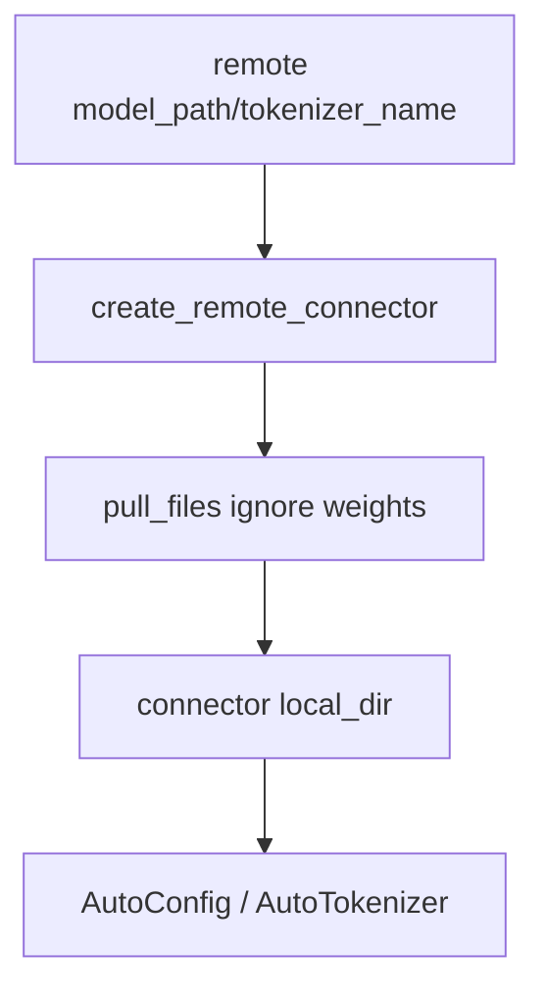
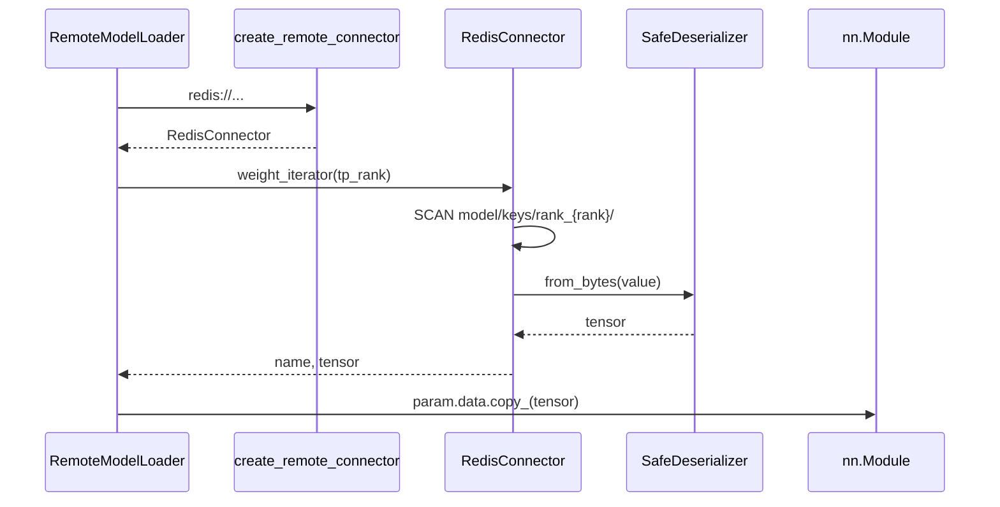
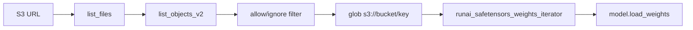
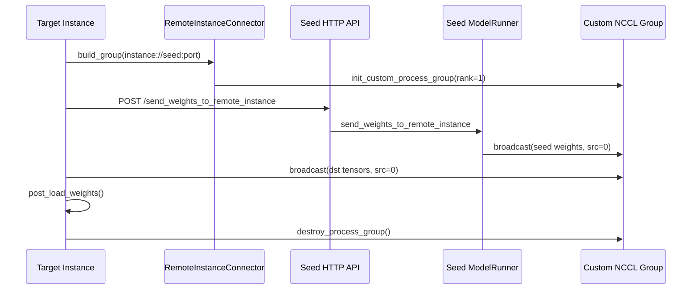

# srt/connector 源码分析

## 1. 模块定位

`python/sglang/srt/connector` 是 SRT 的远端模型资源接入层。它把不同 URL scheme 映射为统一 connector，用于远端 config/tokenizer 文件拉取、远端权重加载和 remote instance 权重传输。

支持的资源类型：

- `redis://...`：KV 型远端存储，存取 tensor 权重和文本配置文件。
- `s3://...`：文件型对象存储，列举/拉取模型文件，并迭代 safetensors 权重。
- `instance://...`：远端 SGLang 实例权重传输入口，主要服务 NCCL remote instance loader。

上游使用方包括 `ModelConfig`、`hf_transformers_utils`、`RemoteModelLoader`、`RemoteInstanceModelLoader`。

## 2. 目录结构

```text
python/sglang/srt/connector/
├── __init__.py
├── base_connector.py
├── redis.py
├── remote_instance.py
├── s3.py
├── utils.py
└── serde/
    ├── __init__.py
    ├── serde.py
    └── safe_serde.py
```

关键文件：

- [__init__.py](/mnt/shanhai-ai/shanhai-workspace/zhouhao6/sglang/python/sglang/srt/connector/__init__.py)
- [base_connector.py](/mnt/shanhai-ai/shanhai-workspace/zhouhao6/sglang/python/sglang/srt/connector/base_connector.py)
- [redis.py](/mnt/shanhai-ai/shanhai-workspace/zhouhao6/sglang/python/sglang/srt/connector/redis.py)
- [s3.py](/mnt/shanhai-ai/shanhai-workspace/zhouhao6/sglang/python/sglang/srt/connector/s3.py)
- [remote_instance.py](/mnt/shanhai-ai/shanhai-workspace/zhouhao6/sglang/python/sglang/srt/connector/remote_instance.py)

## 3. Factory 与抽象基类

`__init__.py` 定义：

- `ConnectorType`：`FS`、`KV`、`INSTANCE`。
- `create_remote_connector(url, device=None, **kwargs)`：根据 URL scheme 创建 `RedisConnector`、`S3Connector` 或 `RemoteInstanceConnector`。
- `get_connector_type(client)`：根据实例类型归类。

`base_connector.py` 定义：

- `BaseConnector`
  - 保存 `url`、`closed`、临时目录 `local_dir = tempfile.mkdtemp()`。
  - 注册 `SIGINT`/`SIGTERM` handler，退出时调用 `close()` 清理临时目录。
  - 抽象接口：`weight_iterator(rank=0)`、`pull_files(allow_pattern=None, ignore_pattern=None)`。
  - 支持 context manager 和 `__del__()`。
- `BaseKVConnector`
  - 扩展 `get()`、`getstr()`、`set()`、`setstr()`、`list()`。
- `BaseFileConnector`
  - 扩展 `glob(allow_pattern)`。

## 4. RedisConnector

[redis.py](/mnt/shanhai-ai/shanhai-workspace/zhouhao6/sglang/python/sglang/srt/connector/redis.py) 实现 KV 后端：

- URL 解析：host/port 建 Redis client，path 去掉 `/` 作为 `model_name`。
- `create_serde("safe")` 创建 safetensors tensor 序列化器。
- `get(key)`：Redis bytes -> `SafeDeserializer.from_bytes()` -> tensor。
- `set(key, tensor)`：tensor -> safetensors bytes -> Redis。
- `getstr()` / `setstr()`：配置、tokenizer 等文本文件。
- `list(prefix)`：Redis `SCAN match=f"{prefix}*"`。
- `weight_iterator(rank)`：扫描 `{model_name}/keys/rank_{rank}/`，yield 去前缀后的权重名和 tensor。
- `pull_files()`：委托 `pull_files_from_db()`。

## 5. S3Connector

[s3.py](/mnt/shanhai-ai/shanhai-workspace/zhouhao6/sglang/python/sglang/srt/connector/s3.py) 实现文件型后端：

- `_filter_allow()` / `_filter_ignore()`：基于 `fnmatch` 过滤路径。
- `list_files(s3, path, allow_pattern=None, ignore_pattern=None)`：解析 `s3://bucket/prefix`，调用 `list_objects_v2`，过滤目录项、allow、ignore，返回 `(bucket, prefix, paths)`。
- `glob()`：返回 `s3://bucket/key` 列表。
- `pull_files()`：下载对象到 connector 临时目录。
- `weight_iterator()`：仅支持 `*.safetensors`，调用 `runai_safetensors_weights_iterator()`。
- `close()`：关闭 boto3 client 并清理临时目录。

## 6. RemoteInstanceConnector

[remote_instance.py](/mnt/shanhai-ai/shanhai-workspace/zhouhao6/sglang/python/sglang/srt/connector/remote_instance.py) 服务 remote instance 权重加载：

- 只允许 `cuda` 或 `npu` device。
- `build_group(gpu_id, tp_rank, instance_ip, group_rank=1, world_size=2)`：
  - 从 `instance://host:port` 解析 master address/port。
  - 构造 group name：`send_weights_{instance_ip}_{master_port}_{tp_rank}`。
  - 用 `init_custom_process_group(backend="nccl", init_method="tcp://...")` 建自定义通信组。
  - 调用 `dist.barrier()` 同步。
- `pull_files()` / `weight_iterator()` 是 no-op，只为满足基类接口。

## 7. serde

`serde` 子目录当前提供 safetensors 方式：

- `Serializer.to_bytes(tensor)`：抽象 tensor -> bytes。
- `Deserializer.from_bytes(bytes)`：抽象 bytes -> tensor。
- `SafeSerializer.to_bytes()`：`safetensors.torch.save({"tensor_bytes": t.cpu().contiguous()})`。
- `SafeDeserializer.from_bytes()`：`safetensors.torch.load(bytes(b))["tensor_bytes"]`。
- `create_serde("safe")`：当前唯一 serde 类型。

## 8. 数据流

### 8.1 配置与 tokenizer 文件拉取



调用点包括 `hf_transformers_utils.get_config/get_tokenizer` 和 `ModelConfig._maybe_pull_model_tokenizer_from_remote`。

### 8.2 Redis 远端权重加载



### 8.3 S3 远端权重加载



### 8.4 Remote instance NCCL 权重传输



## 9. 扩展点

新增存储后端：

1. 实现 `BaseKVConnector` 或 `BaseFileConnector`。
2. 在 `create_remote_connector()` 中注册新 scheme。
3. 在 `get_connector_type()` 中确保类型归类正确。
4. 同步 URL 解析和 server 参数文档。

新增 serde：

1. 实现 `Serializer` / `Deserializer`。
2. 扩展 `create_serde(serde_type)`。
3. 明确 dtype、device、contiguous、shape 元数据和版本兼容。

扩展 remote instance：

- 当前 connector 只负责 NCCL group 建立。
- 传输模式、HTTP admin 入口和权重广播主体在 `model_loader`、`model_runner` 及 remote instance utils 中。

## 10. 风险与排障

- S3 `list_objects_v2` 未处理分页，超过 1000 对象可能漏文件。
- S3 trailing slash 路径处理敏感，下载目标路径需要确认不会逃出临时目录。
- S3 `weight_iterator()` 仅加载 `*.safetensors`。
- Redis `pull_files_from_db()` 接收 allow/ignore 参数，但实现未真正过滤。
- Redis 文本文件写入只用 basename，不同目录同名文件可能覆盖。
- Redis tensor 序列化会 `.cpu().contiguous()`，大权重保存有额外 CPU 内存和拷贝开销。
- `BaseConnector` 修改进程级 signal handler，嵌入式或多 connector 场景要注意副作用。
- Remote instance 要求 device 为 cuda/npu，且 `build_group()` 必须传 `gpu_id`、`tp_rank`。
- seed/dst TP rank、端口数量、默认 torch distributed 状态必须匹配。
- `RemoteInstanceConnector.weight_iterator()` 是 no-op，不能按普通权重 iterator 使用。
- 未发现 connector 专门单元测试，Redis/S3/instance 后端需要集成或 mock 测试补齐。

