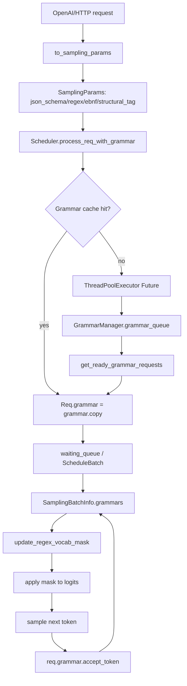

# srt/constrained 源码分析

## 1. 模块定位

`python/sglang/srt/constrained` 是 SRT 的约束解码层。它负责把用户侧结构化输出约束编译成“下一 token 可选集合”，并在采样前对 logits 原地加 mask。

它本身不执行模型 forward，也不做最终采样；它提供的是：

- grammar backend 抽象和实现。
- 每个请求独立的 grammar 状态对象。
- Scheduler 侧异步 grammar 编译队列。
- logits bitmask 构造和应用能力。

支持的约束类型包括：

- `json_schema`：OpenAI `response_format=json_schema`、`json_object`、工具调用 JSON schema。
- `regex`：正则约束输出。
- `ebnf`：EBNF grammar，主要由 `xgrammar` / `llguidance` 支持。
- `structural_tag`：严格 tool call / 结构化标签输出，兼容 legacy 与新格式。
- reasoning 延迟约束：思考结束 token 后才启用 grammar mask。

## 2. 目录结构

```text
python/sglang/srt/constrained/
├── base_grammar_backend.py
├── grammar_manager.py
├── llguidance_backend.py
├── outlines_backend.py
├── outlines_jump_forward.py
├── reasoner_grammar_backend.py
├── triton_ops/
│   └── bitmask_ops.py
├── utils.py
└── xgrammar_backend.py
```

关键文件：

- [base_grammar_backend.py](/mnt/shanhai-ai/shanhai-workspace/zhouhao6/sglang/python/sglang/srt/constrained/base_grammar_backend.py)：统一抽象、缓存、backend 工厂、注册扩展点。
- [grammar_manager.py](/mnt/shanhai-ai/shanhai-workspace/zhouhao6/sglang/python/sglang/srt/constrained/grammar_manager.py)：Scheduler 侧 grammar 异步编译队列。
- [xgrammar_backend.py](/mnt/shanhai-ai/shanhai-workspace/zhouhao6/sglang/python/sglang/srt/constrained/xgrammar_backend.py)：默认 backend。
- [llguidance_backend.py](/mnt/shanhai-ai/shanhai-workspace/zhouhao6/sglang/python/sglang/srt/constrained/llguidance_backend.py)：llguidance backend。
- [outlines_backend.py](/mnt/shanhai-ai/shanhai-workspace/zhouhao6/sglang/python/sglang/srt/constrained/outlines_backend.py)：Outlines backend。
- [reasoner_grammar_backend.py](/mnt/shanhai-ai/shanhai-workspace/zhouhao6/sglang/python/sglang/srt/constrained/reasoner_grammar_backend.py)：reasoning wrapper。
- [triton_ops/bitmask_ops.py](/mnt/shanhai-ai/shanhai-workspace/zhouhao6/sglang/python/sglang/srt/constrained/triton_ops/bitmask_ops.py)：非 HIP 场景下 xgrammar bitmask Triton kernel。

## 3. 核心抽象

### 3.1 BaseGrammarObject

`BaseGrammarObject` 是运行时 grammar 状态机协议，核心方法：

- `accept_token(token_id)`：采样后推进状态。
- `rollback(num_tokens)`：回滚状态，供 jump-forward/speculative 等路径使用。
- `is_terminated()`：判断 grammar 是否结束。
- `allocate_vocab_mask()`：分配当前 backend 的 mask 缓冲。
- `fill_vocab_mask()`：填充当前 step 可选 token mask。
- `move_vocab_mask()`：把 mask 移到目标设备。
- `apply_vocab_mask()`：对 logits 应用 mask。
- `copy()`：从缓存 grammar 创建请求独立状态。
- `try_jump_forward()`：尝试 grammar fast-forward。

### 3.2 BaseGrammarBackend

`BaseGrammarBackend` 负责把 `(key_type, key_string)` 分派到具体编译函数。

`get_cached_or_future_value()` 的行为：

1. 查 `cache`。
2. 命中时调用 `copy()`，为请求生成独立状态。
3. 未命中时提交到 `ThreadPoolExecutor`。
4. 返回已编译 grammar 或 `Future`。

这使 JSON schema、regex、EBNF 等编译可以异步进行，避免阻塞 scheduler 主循环。

### 3.3 InvalidGrammarObject 与 GrammarStats

`InvalidGrammarObject` 表示编译失败结果，携带 `error_message`，并会被缓存。相同坏 schema 后续会直接失败，不重复编译。

`GrammarStats` 记录编译耗时、cache hit、dispatch 类型、schema 数量、timeout 等观测字段。不同 backend 对它的使用程度不完全一致。

## 4. Backend 差异

### 4.1 XGrammar

`XGrammarGrammarBackend` 是默认路径。

初始化时：

- 优先使用 tokenizer 的 `init_xgrammar()`。
- 否则用 `TokenizerInfo.from_huggingface()`。
- 把模型 EOS token 作为 stop token。

支持：

- `dispatch_json()`：`"$$ANY$$"` 走 builtin JSON grammar，否则 `compile_json_schema()`。
- `dispatch_regex()`：`compile_regex()`。
- `dispatch_ebnf()`：`compile_grammar()`。
- `dispatch_structural_tag()`：兼容 legacy `structures/triggers` 和新 `format` 结构，缺失 schema 时补 `{}`。

运行时 `XGrammarGrammar` 用 `GrammarMatcher` 维护状态，用 xgrammar 分配压缩 int32 bitmask。HIP 走 `sgl_kernel.apply_token_bitmask_inplace_cuda`，其他 GPU 走本目录 Triton kernel。

### 4.2 llguidance

`llguidance_backend.py` 使用 `LLMatcher` / `LLTokenizer`。

`GuidanceGrammar` 支持 token consume、rollback、bitmask 分配、fast-forward tokens。JSON schema 编译时会传入 `whitespace_flexible` 和 `whitespace_pattern`。

限制点：structural tag 当前断言 legacy 格式，并只取 `triggers[0]`。

### 4.3 Outlines

`outlines_backend.py` 使用 `RegexGuide`。JSON schema 会先通过 `build_regex_from_schema()` 转为 regex，再编译 FSM。

它只显式支持 JSON/regex；EBNF 和 structural tag 会走 base unsupported。Outlines mask 是 bool tensor，`True` 表示禁用 token，直接 `logits.masked_fill_(-inf)`。

### 4.4 Reasoner wrapper

`reasoner_grammar_backend.py` 不是独立 grammar 编译器，而是 wrapper。

`ReasonerGrammarObject` 在 `tokens_after_think_end == -1` 时不填 mask、不向内部 grammar 喂 token；遇到 `think_end_id` 后才开始约束。`create_grammar_backend()` 会在 `server_args.reasoning_parser` 且 tokenizer 有 `think_end_id` 时包一层。

## 5. 关键数据结构

- `Req.grammar`：请求上的 grammar 状态对象或编译中的 `Future`。
- `Req.grammar_key`：通常是 `("json", schema_str)`、`("regex", pattern)`、`("ebnf", grammar)`、`("structural_tag", json_str)`。
- `GrammarManager.grammar_queue`：等待 grammar 编译完成的请求队列。
- `SamplingBatchInfo.grammars`：当前 batch 每个请求对应的 grammar。
- `SamplingBatchInfo.vocab_mask`：当前 batch 的 token mask，backend 决定格式。
- `SamplingBatchInfo.apply_mask_func`：由第一个 grammar 提供的 mask 应用函数。

## 6. 调用链与数据流



主要流程：

1. API 层把约束写入 sampling params。OpenAI 协议中 `response_format=json_schema` 转为 `json_schema`，`json_object` 转为 `{"type": "object"}`，`structural_tag` 序列化为 `structural_tag`。
2. 工具调用约束由 `function_call_parser.py` 生成。strict auto tool call 可能产生 `structural_tag`，required 或指定 tool choice 可能产生 `json_schema`。
3. `SamplingParams.verify()` 校验 `json_schema`、`regex`、`ebnf` 互斥。`structural_tag` 的冲突主要在 OpenAI tool call 路径处理。
4. Scheduler 初始化时创建 `GrammarManager`。
5. 请求入队前调用 `process_req_with_grammar(req)`。缓存命中直接进入 waiting queue；未命中则保存 `Future` 并放入 `grammar_queue`。
6. 调度 prefill 前调用 `get_ready_grammar_requests()` 轮询 Future。多 rank 时通过 `all_gather_object()` 同步 ready/failed，ready 取交集，failed 取并集。
7. `ScheduleBatch.get_model_worker_batch()` 把 grammar 列表写入 `sampling_info.grammars`。
8. `ModelRunner._preprocess_logits()` 调用 `sampling_info.update_regex_vocab_mask()` 和 `apply_logits_bias()`。
9. mask 会在 logits 上写 `-inf`，随后清理 `sampling_info.vocab_mask`，降低结构化输出下的 VRAM 持有风险。
10. 采样后，scheduler output processor 调用 `req.grammar.accept_token(next_token_id)` 更新状态。spec v2 会逐个喂入 accepted token list。

## 7. 与其他模块的关系

- `server_args.py`：提供 `--grammar-backend`、JSON whitespace 控制、Outlines disk cache 控制。
- `environ.py`：提供 `SGLANG_GRAMMAR_POLL_INTERVAL`、`SGLANG_GRAMMAR_MAX_POLL_ITERATIONS`、`SGLANG_DISABLE_OUTLINES_DISK_CACHE`。
- `scheduler.py` / `schedule_batch.py` / `tp_worker.py` / `model_runner.py`：负责调度、batch 传播、overlap sampling、logits 预处理。
- `sampling_batch_info.py`：实际构造和应用 vocab mask。
- `scheduler_output_processor_mixin.py`：采样后推进 grammar 状态。
- `function_call/*`：strict tool calling 的 structural/json 约束来源。
- `parser/reasoning_parser.py`：提供 reasoning parser 和 `think_end_id`。
- `speculative/*`：speculative 路径会引用 grammar object；spec v2 可能一次接受多个 token。
- `disaggregation/prefill.py`：分离式 prefill 中也有 grammar accept token 路径和异常处理。

## 8. 配置与环境变量

- `--grammar-backend {xgrammar,outlines,llguidance,none}`：默认由 `ServerArgs._handle_grammar_backend()` 设为 `xgrammar`。
- `--constrained-json-whitespace-pattern`：Outlines / llguidance 使用的 JSON 空白 regex。
- `--constrained-json-disable-any-whitespace`：xgrammar / llguidance 使用，强制 compact JSON。
- `--disable-outlines-disk-cache`：写入 `SGLANG_DISABLE_OUTLINES_DISK_CACHE`。
- `SGLANG_GRAMMAR_POLL_INTERVAL`：默认 `0.005` 秒，grammar queue 单轮轮询窗口。
- `SGLANG_GRAMMAR_MAX_POLL_ITERATIONS`：默认 `10000`，超过后认为 grammar preprocessing timeout。
- `LLGUIDANCE_LOG_LEVEL`：llguidance matcher 日志级别。
- `--reasoning-parser`：配合 tokenizer `think_end_id` 启用 reasoning-aware grammar wrapper。
- `--grammar-backend none`：grammar-based generation 会在请求侧 abort。

## 9. 扩展点

自定义 backend：

1. 调用 `register_grammar_backend(name, init_func)`。
2. 通过 `server_args.add_grammar_backend_choices()` 添加 CLI choice。
3. `init_func(server_args, tokenizer, vocab_size, eos_token_ids)` 返回 `BaseGrammarBackend`。

新增 grammar 类型：

1. 扩展 `BaseGrammarBackend._init_value_dispatch()`。
2. 扩展 `SamplingParams` 和 API 协议转换。
3. 扩展 manager key 生成。
4. 补充采样和输出处理路径测试。

新增设备 mask kernel：

- 实现 `allocate_vocab_mask`、`fill_vocab_mask`、`move_vocab_mask`、`apply_vocab_mask` 的一致语义即可接入 `SamplingBatchInfo`。

## 10. 风险与排障

- xgrammar tokenizer 不支持时会 fallback 到 `grammar_backend='none'`，结构化输出不可用。
- grammar 编译超时会缓存 `InvalidGrammarObject("Grammar preprocessing timed out")`，相同 key 后续直接失败。
- 多 rank ready 取交集，任一 rank 慢都会阻塞请求进入 waiting queue。
- failed 取并集，任一 rank 超时都会导致失败。
- `accept_token()` 抛 `ValueError` 通常意味着 mask 与采样状态不一致、speculative 接受 token 漏喂、rollback 状态错误或 tokenizer 不一致。
- Outlines disk cache 可用 `--disable-outlines-disk-cache` 规避文件系统/并发问题。
- `structural_tag` 格式判别依赖 assert，非法格式不是优雅 invalid。
- `SamplingBatchInfo.update_regex_vocab_mask()` 使用第一个非空 grammar 的 mask 实现，不适合在一个 batch 混用不同 backend。
- `structural_tag` 与已有 `regex/json_schema/ebnf` 冲突在 tool call 路径只是 warning，需关注协议层优先级。
- XGrammar `MAX_ROLLBACK_TOKENS = 200`，jump-forward/speculative retokenize 回滚超过该范围有风险。

## 11. 测试参考

重点测试目录：

- `test/registered/unit/constrained`
- `test/registered/constrained_decoding/test_constrained_decoding.py`
- `test/registered/unit/sampling/test_sampling_batch_info.py`
- `test/registered/unit/sampling/test_sampling_params.py`

