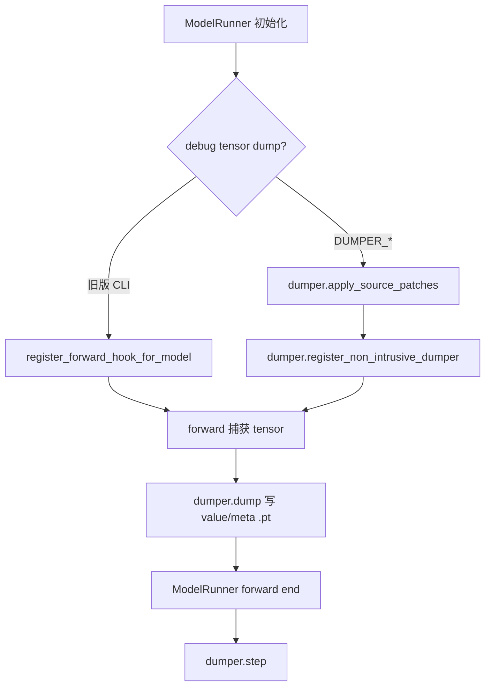
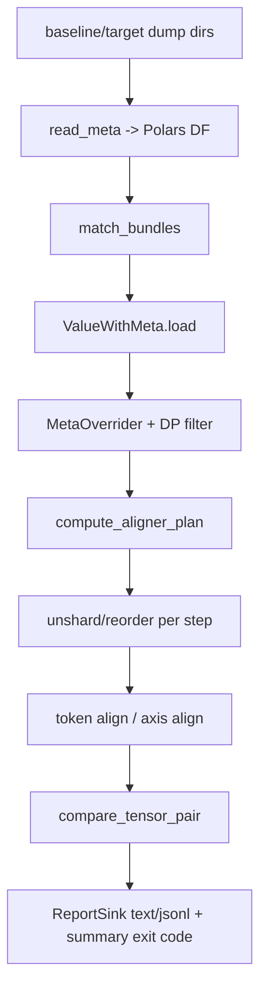

# srt/debug_utils 源码分析

## 1. 模块定位

`python/sglang/srt/debug_utils` 是 SRT 的调试工具集，而不是单一运行时组件。它面向模型执行、分布式并行、调度和数值差异排查，提供 dump、读取、比较、日志解析、CUDA coredump、源码动态插桩和调度模拟等能力。

核心用途：

- 运行时 tensor dump：通过新版 `dumper.py` 或旧版 forward hook 捕获模型输入、输出和中间 tensor。
- dump 读取与比较：从 `.pt` 文件名和内嵌 meta 重建 DataFrame，并支持分布式 unshard、维度对齐、token 对齐和差异报告。
- 辅助排障：CUDA coredump、日志解析、文本输出比较、模型截断、调度模拟器。
- 动态注入：`source_patcher` 可在运行时 patch 函数源码，向任意位置插入 dumper 调用。

## 2. 目录结构

```text
python/sglang/srt/debug_utils/
├── comparator/
├── cuda_coredump.py
├── dump_comparator.py
├── dump_loader.py
├── dumper.py
├── log_parser.py
├── model_truncator.py
├── schedule_simulator/
├── source_patcher/
├── tensor_dump_forward_hook.py
└── text_comparator.py
```

关键文件：

- [dumper.py](/mnt/shanhai-ai/shanhai-workspace/zhouhao6/sglang/python/sglang/srt/debug_utils/dumper.py)：新版 dumper 主体，含 HTTP/ZMQ 控制、非侵入 hook、SGLang/Megatron 插件。
- [dump_loader.py](/mnt/shanhai-ai/shanhai-workspace/zhouhao6/sglang/python/sglang/srt/debug_utils/dump_loader.py)：读取 dump meta/value。
- [dump_comparator.py](/mnt/shanhai-ai/shanhai-workspace/zhouhao6/sglang/python/sglang/srt/debug_utils/dump_comparator.py)：旧版单文件比较器。
- [comparator](/mnt/shanhai-ai/shanhai-workspace/zhouhao6/sglang/python/sglang/srt/debug_utils/comparator)：新版比较器包。
- [tensor_dump_forward_hook.py](/mnt/shanhai-ai/shanhai-workspace/zhouhao6/sglang/python/sglang/srt/debug_utils/tensor_dump_forward_hook.py)：旧版按模块 forward hook dump。
- [source_patcher](/mnt/shanhai-ai/shanhai-workspace/zhouhao6/sglang/python/sglang/srt/debug_utils/source_patcher)：YAML 驱动函数源码 patcher。
- [schedule_simulator](/mnt/shanhai-ai/shanhai-workspace/zhouhao6/sglang/python/sglang/srt/debug_utils/schedule_simulator)：离线调度模拟器。

## 3. 新版 Dumper

`dumper.py` 是当前主要调试入口。

核心对象：

- `DumperConfig`：读取 `DUMPER_*` 环境配置。
- `_Dumper`：提供 `dump()`、`dump_model()`、`step()`、`ctx()`、`capture_output()`、`configure()`、`reset()`。
- `_NonIntrusiveDumper`：遍历 `model.named_modules()` 注册 hook；root module 通过 monkey patch `forward`，因为 SRT 某些路径会直接调用 `.forward()`。
- `_SGLangPlugin`：识别 `ForwardBatch`、`PPProxyTensors`、`LogitsProcessorOutput`，收集 TP/PP/MoE/DP attention 并行信息和 tokenizer path。
- `_MegatronPlugin`：识别 `PackedSeqParams`，收集 Megatron parallel state，并处理 recompute pseudo axis。

dump 文件格式：

```python
{
    "value": value,
    "meta": {
        "step": ...,
        "rank": ...,
        "dump_index": ...,
        "name": ...,
        ...
    },
}
```

文件名采用 `key=value___key=value.pt` 格式，至少包含 `step/rank/dump_index/name`。文件内 meta 与文件名 meta 会在 loader 中合并。

## 4. Dump 读取与比较

### 4.1 dump_loader

`ValueWithMeta` / `DumpLoader` 负责加载 `.pt`，合并文件名 meta 和文件内 meta，为比较器提供统一对象。

`SGLANG_DUMP_LOADER_DIR` 可指定默认读取目录。

### 4.2 comparator 包

新版比较器主入口是 `comparator.entrypoint.run()`，职责包括：

- 读取 baseline/target dump 目录。
- 展示 rank/input 信息。
- 匹配 tensor bundle。
- 执行 token align、axis align、unshard、reorder。
- 输出 text/jsonl report。

关键函数：

- `compare_bundle_pair()`：单个 tensor bundle 比较流水线。
- `compute_aligner_plan()` / `execute_aligner_plan()`：按 step 做 unshard/reorder，再跨 side 做 token align 和 axis align。
- `parse_dims()`：解析 `b s h[tp] d # dp:=moe_dp ep:replicated` 这类 dims DSL。
- `compare_tensor_pair()`：计算统计量、相对差异、最大差异坐标和 per-token diff。

相对差异公式：

```text
rel_diff = 1 - 2<x,y> / (||x||^2 + ||y||^2)
```

### 4.3 对齐数据结构

- `Pair[x,y]`：baseline/target 成对容器。
- `TensorFileInfo` / `TensorBundleInfo`：由 Polars rows 归并出的同名 tensor 文件组。
- `DimsSpec` / `DimSpec` / `ParallelModifier`：描述 tensor 维度名、并行切分轴、zigzag/reduction/replicated 语义。
- `UnsharderPlan`、`ReordererPlan`、`AlignerPlan`：meta-only 规划对象。
- `TokenAlignerGlobalAux`、`TokenAlignerPlan`、`TokenLocator`：跨 step/token 对齐所需 request/position/input_ids 信息。
- `TensorComparisonInfo` / `DiffInfo`：shape、dtype、统计量和差异明细。

## 5. 运行时数据流



比较流程：



## 6. 与 SRT 其他模块的关系

- `model_runner.py`：直接导入 `dumper` 和 `register_forward_hook_for_model`。
- `forward_batch_info.py`：`ForwardBatch.rids` 供 dumper 做跨 step token/sequence tracking。
- `server_args.py`：暴露旧版 tensor dump CLI，并在开启时禁用 CUDA graph 和 warmup。
- `http_server.py`：当 `DUMPER_SERVER_PORT=reuse` 时注册 `/dumper/{method}` 管理接口。
- `tokenizer_communicator_mixin.py` / `scheduler.py`：把 dumper 控制请求转发到 scheduler 侧执行。
- `environ.py`：导入 `cuda_coredump.py`，通过 `SGLANG_CUDA_COREDUMP=1` 注入 CUDA coredump 环境变量。
- `distributed.py`、`dp_attention.py`、`server_args.py`：被 `_SGLangPlugin` 用来采集并行和 tokenizer 元数据。

## 7. 配置与环境变量

新版 dumper：

- `DUMPER_ENABLE`
- `DUMPER_FILTER`
- `DUMPER_DIR`
- `DUMPER_ENABLE_OUTPUT_FILE`
- `DUMPER_ENABLE_OUTPUT_CONSOLE`
- `DUMPER_ENABLE_VALUE`
- `DUMPER_ENABLE_GRAD`
- `DUMPER_ENABLE_MODEL_VALUE`
- `DUMPER_ENABLE_MODEL_GRAD`
- `DUMPER_EXP_NAME`
- `DUMPER_CLEANUP_PREVIOUS`
- `DUMPER_COLLECTIVE_TIMEOUT`
- `DUMPER_SERVER_PORT`
- `DUMPER_NON_INTRUSIVE_MODE`
- `DUMPER_SOURCE_PATCHER_CONFIG`

其他：

- `SGLANG_DUMP_LOADER_DIR`
- `SGLANG_CUDA_COREDUMP`
- `SGLANG_CUDA_COREDUMP_DIR`
- `TENSOR_DUMP_TOP_LEVEL_MODULE_NAME`
- `TENSOR_DUMP_LAYERS_MODULE_NAME`

SRT CLI：

- `--debug-tensor-dump-output-folder`
- `--debug-tensor-dump-layers`
- `--debug-tensor-dump-input-file`
- `--debug-tensor-dump-inject`

比较器 CLI：

- `--preset`
- `--grouping-skip-keys`
- `--token-aligner`
- `--override-dims`
- `--override-config`
- `--allow-skipped-pattern`
- `--allow-failed-pattern`
- `--viz-*`

## 8. source_patcher 与调度模拟器

`source_patcher` 通过 `CodePatcher` / `patch_function()` 使用 `inspect.getsource`、文本替换、`compile/exec` 替换函数 `__code__`。它适合临时插桩，不适合作为长期业务逻辑。

`schedule_simulator` 的 `Simulator` 提供离线调度循环：路由请求、FIFO 调度、执行 decode step、记录 balancedness。新增调度策略可以实现 `RouterPolicy` 或 `SchedulerPolicy` 后接入 entrypoint。

## 9. 扩展点

- 新增框架支持：扩展 `dumper.py` 的 `_FrameworkPlugin`，以及 smart token aligner 的 `_AuxFrameworkPlugin`。
- 新增并行轴：扩展 `ParallelAxis`、parallel meta 采集、dims parser 与 unsharder 逻辑。
- 自定义 tensor 布局：通过 `dumper.dump(..., dims="...")` 或 comparator `--override-dims`，无需重跑 dump。
- 自定义源码插桩：用 `DUMPER_SOURCE_PATCHER_CONFIG` 指向 YAML 动态插入 dumper 调用。
- 新调度策略：实现 `RouterPolicy` 或 `SchedulerPolicy` 后接入 `schedule_simulator.entrypoint`。

## 10. 风险与排障

- `DUMPER_FILTER` 使用受限 `eval`，虽禁用 builtins，但不应暴露给不可信输入。
- dump 文件名直接拼接 `key=value`，复杂值、特殊字符、超长字段会影响路径可读性或匹配。
- 大 tensor dump 会引入显存同步、CPU 内存和磁盘压力。
- 分布式 exp name、cleanup、ZMQ 控制依赖所有 rank 参与，缺 rank 会触发 timeout warning。
- comparator 高级对齐强依赖 `dims` 和 parallel info，缺失或错误会导致 skip、shape mismatch 或错误 unshard。
- `filter_to_non_empty_dp_rank()` 假设 DP 中恰好一个非空 rank，多非空或全空会断言。
- `--preset` 默认是 `sglang_dev`，会跳过 `rank` 分组；严格逐 rank 比较应使用 `--preset raw` 或自定义 grouping。
- `--allow-skipped-pattern` 默认 `.*`，skip 默认不影响 exit code；CI 严格比较应设为 `^$`。
- 旧版 `--debug-tensor-dump-output-folder` 会禁用 CUDA graph 和 server warmup，行为与生产路径不同。

