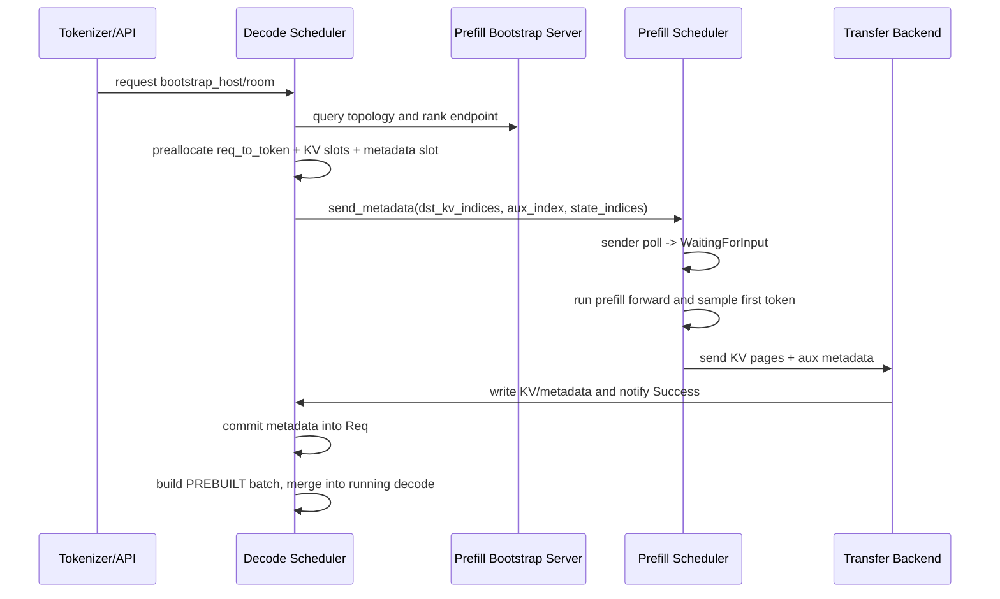

# srt/disaggregation 源码分析

## 1. 模块定位

`python/sglang/srt/disaggregation` 是 SRT 内部的解耦推理基础设施，覆盖两类能力：

- **PD disaggregation**：将生成请求拆成 prefill-only 节点和 decode-only 节点。Prefill 节点负责 prompt prefill、首 token 采样和 KV cache 写出；Decode 节点负责预分配 KV 目的地址、接收 KV/元数据，并跳过 prefill forward 直接进入 decode。
- **EPD / encoder disaggregation**：多模态场景下把视觉/音频 encoder 独立出来，language-only 节点通过 HTTP/gRPC/ZMQ/Mooncake 接收 embedding。

核心文件：

- [prefill.py](/mnt/shanhai-ai/shanhai-workspace/zhouhao6/sglang/python/sglang/srt/disaggregation/prefill.py)
- [decode.py](/mnt/shanhai-ai/shanhai-workspace/zhouhao6/sglang/python/sglang/srt/disaggregation/decode.py)
- [common/conn.py](/mnt/shanhai-ai/shanhai-workspace/zhouhao6/sglang/python/sglang/srt/disaggregation/common/conn.py)
- [mooncake/conn.py](/mnt/shanhai-ai/shanhai-workspace/zhouhao6/sglang/python/sglang/srt/disaggregation/mooncake/conn.py)
- [encode_receiver.py](/mnt/shanhai-ai/shanhai-workspace/zhouhao6/sglang/python/sglang/srt/disaggregation/encode_receiver.py)

## 2. 目录结构

```text
python/sglang/srt/disaggregation/
├── ascend/
├── base/
│   └── conn.py
├── common/
│   ├── conn.py
│   ├── staging_buffer.py
│   └── staging_handler.py
├── decode.py
├── decode_kvcache_offload_manager.py
├── decode_schedule_batch_mixin.py
├── encode_grpc_server.py
├── encode_receiver.py
├── encode_server.py
├── fake/
├── kv_events.py
├── mooncake/
├── mori/
├── nixl/
├── prefill.py
└── utils.py
```

职责划分：

- `base/conn.py`：抽象接口层，定义 `KVArgs`、`KVPoll`、`BaseKVManager`、`BaseKVSender`、`BaseKVReceiver`、`BaseKVBootstrapServer`。
- `common/conn.py`：后端无关的连接、拓扑、HTTP bootstrap 逻辑。
- `common/staging_buffer.py` / `staging_handler.py`：异构 TP KV 传输的 staging buffer、ring allocator、gather/scatter。
- `utils.py`：枚举、后端工厂、metadata buffer、poll all-reduce、page/CP rank index 工具。
- `prefill.py`：prefill 侧生命周期队列和 scheduler mixin。
- `decode.py`：decode 侧预分配、接收、prebuilt batch、scheduler mixin。
- `decode_schedule_batch_mixin.py`：`ScheduleBatch` 的 `PREBUILT` 模式。
- `decode_kvcache_offload_manager.py`：decode 侧 KV cache offload 到 HiCache host/storage。
- `mooncake/`、`nixl/`、`mori/`、`ascend/`、`fake/`：具体 KV transfer backend。
- `encode_*`：多模态 encoder disaggregation。
- `kv_events.py`：KV cache event 发布，供 HiCache 或外部订阅消费。

## 3. PD 架构

PD 模式由 `--disaggregation-mode {null,prefill,decode}` 控制。

### 3.1 Prefill 节点

Prefill 节点的职责：

1. 启动 bootstrap server。`start_disagg_service()` 只在 prefill 模式创建 `KVBootstrapServer`。
2. Scheduler 使用 `event_loop_normal_disagg_prefill()` 或 overlap/PP 变体。
3. 请求进入 `PrefillBootstrapQueue`，等待 decode 节点完成握手和目的 KV 地址回传。
4. forward 完成后，`send_kv_chunk()` 发送 KV page indices，并在最后一个 chunk 写入首 token 元数据。
5. `process_disagg_prefill_inflight_queue()` 轮询传输状态，成功后释放 tree cache 锁并向客户端返回。

### 3.2 Decode 节点

Decode 节点的职责：

1. Scheduler 使用 `event_loop_normal_disagg_decode()` 或 overlap/PP 变体。
2. 请求进入 `DecodePreallocQueue`。
3. receiver 初始化，向 prefill bootstrap 查询拓扑和 rank 映射。
4. decode 侧预分配 `req_to_token_pool` 和 `token_to_kv_pool` 目标位置。
5. `send_metadata()` 把目的 KV indices、metadata buffer index、state indices 发给 prefill。
6. `DecodeTransferQueue.pop_transferred()` 轮询 KV 到达状态。
7. 成功后从 metadata buffer 取首 token、logprob、spec 信息。
8. 构造 `ForwardMode.PREBUILT` batch，跳过 prefill forward，把请求并入 running batch 开始 decode。

## 4. 核心类与数据结构

- `KVArgs`：跨后端传递本 rank 的 KV/aux/state buffer 指针、长度、page size、IB device、PP rank、state type 等。
- `KVPoll`：传输状态机枚举，包含 `Failed`、`Bootstrapping`、`WaitingForInput`、`Transferring`、`Success`。
- `CommonKVBootstrapServer`：HTTP `/route` 注册/查询 prefill rank 信息；`/register_dp_rank` 记录每个 room 的 prefill DP rank；`/query_dp_ranks` 批量查询。
- `CommonKVManager`：保存拓扑、ZMQ socket、请求状态、失败记录、heartbeat 参数；decode 侧负责 `try_ensure_parallel_info()` 和 TP/CP/PP rank mapping。
- `PrefillBootstrapQueue`：prefill 侧握手队列，poll sender，拿到 `WaitingForInput` 后分配 metadata buffer index 并调用 sender `init()`。
- `DecodePreallocQueue`：decode 侧握手和内存预分配队列，负责 `kv_receiver.init()`、`_pre_alloc()`、`send_metadata()`。
- `DecodeTransferQueue`：decode 侧传输完成队列，负责 metadata commit、失败释放、staging scatter 状态推进。
- `ScheduleBatchDisaggregationDecodeMixin.prepare_for_prebuilt()`：构造不跑 prefill 的 extend 元数据。
- `ScheduleBatchDisaggregationDecodeMixin.process_prebuilt()`：把 prefill 侧生成的首 token 作为已完成输出，处理 grammar/spec 信息。
- `MetadataBuffers`：首 token 和附加元数据的 aux buffer，包括 `output_ids`、cached token 统计、logprob、top logprobs、EAGLE topk、hidden states、`bootstrap_room` 校验字段。
- `ReqToMetadataIdxAllocator`：metadata buffer slot 分配器。
- `DecodeKVCacheOffloadManager`：decode 增量 KV offload 到 HiCache host pool/storage。

## 5. 请求、KV 与元数据流转



典型流程：

1. Tokenizer/API 层带上 `bootstrap_host`、`bootstrap_port`、`bootstrap_room`、可选 `disagg_prefill_dp_rank`，构造 `Req`。
2. Scheduler `_add_request_to_queue()` 根据 `DisaggregationMode` 分流到 prefill 或 decode 队列。
3. Prefill `CommonKVManager.register_to_bootstrap()` 向 bootstrap server 注册 DP/TP/CP/PP rank 的 ZMQ endpoint。
4. Decode receiver 查询 bootstrap server，拿到 prefill topology，并计算目标 TP/CP/PP ranks。
5. Decode 预分配 KV 目标 indices 和 metadata buffer index。
6. Decode 通过 ZMQ 向 prefill rank 发送 metadata。
7. Prefill sender poll 到 `WaitingForInput` 后进入普通 prefill 调度。
8. Prefill forward 产出首 token，`MetadataBuffers.set_buf(req)` 写 aux metadata。
9. Prefill sender 调用后端 transfer，把 KV/state/aux 写到 decode 侧。
10. Decode 收到完成信号后从 metadata buffer 恢复首 token、logprob、spec hidden states。
11. Decode 构造 `PREBUILT` batch，跳过 prefill forward，进入 decode loop。

KV 传输粒度是 page indices。`utils.py` 中 `kv_to_page_indices()`、`kv_to_page_num()` 负责 token index 到 page index 的转换；CP 场景用 `filter_kv_indices_for_cp_rank()` 做分片过滤。

## 6. Scheduler 与 mem_cache 关系

Scheduler 直接继承或混入：

- `SchedulerDisaggregationPrefillMixin`
- `SchedulerDisaggregationDecodeMixin`
- `ScheduleBatchDisaggregationDecodeMixin`

初始化阶段 `init_disaggregation()` 创建 metadata buffers 和对应队列：

- prefill 模式创建 `PrefillBootstrapQueue` 和 `disagg_prefill_inflight_queue`。
- decode 模式创建 `DecodeTransferQueue` 和 `DecodePreallocQueue`。

cache 关系：

- Prefill forward 后会调用 `tree_cache.cache_unfinished_req(req)` 锁住 tree cache，KV transfer 完成后释放。
- Decode 模式强制 `disable_radix_cache=True`，KV cache 被强制为 chunk cache。
- Decode 预分配走 `token_to_kv_pool_allocator`，并写 `req_to_token_pool.req_to_token`。
- HiSparse 下 decode 目的 KV 可直接是 host pool。
- `DecodeKVCacheOffloadManager` 可把 decode 增量 KV 异步 offload 到 HiCache host/storage。

## 7. Transfer Backend

`utils.get_kv_class()` 根据 `--disaggregation-transfer-backend` 选择后端：

- `mooncake`：默认主后端，支持 RDMA/NVLink/custom mem pool/staging。
- `nixl`：基于 NIXL agent/plugin，注册 VRAM/DRAM，使用 notification/status。
- `mori`：基于 Mori IOEngine/RDMA backend。
- `ascend`：继承 Mooncake 结构，替换为 `AscendTransferEngine`。
- `fake`：测试/预热用，不真实传输 KV；prefill server 不允许 fake。

Mooncake 主协议：

1. Decode receiver 向 prefill ZMQ endpoint 注册 decode 侧 KV/aux/state 指针和 session id。
2. Decode `send_metadata()` 发送 room、endpoint、dst indices、aux index、state indices、required dst info count。
3. Prefill `start_prefill_thread()` 收 metadata，凑齐 required dst info 后把 room 状态置为 `WaitingForInput`。
4. Prefill `transfer_worker()` 执行 KV/aux/state 传输。
5. 完成后向 decode endpoint 发 `KVPoll.Success`。
6. Decode `start_decode_thread()` 聚合多个 prefill rank success，达到 `required_prefill_response_num` 后置 `Success`。

## 8. EPD / Encoder Disaggregation

相关文件：

- [encode_receiver.py](/mnt/shanhai-ai/shanhai-workspace/zhouhao6/sglang/python/sglang/srt/disaggregation/encode_receiver.py)
- [encode_server.py](/mnt/shanhai-ai/shanhai-workspace/zhouhao6/sglang/python/sglang/srt/disaggregation/encode_server.py)
- [encode_grpc_server.py](/mnt/shanhai-ai/shanhai-workspace/zhouhao6/sglang/python/sglang/srt/disaggregation/encode_grpc_server.py)

关键点：

- `--encoder-only` 启动独立 encoder server。
- `--language-only` 启动 language node，并要求配置 `--encoder-urls`。
- `TokenizerManager._handle_epd_disaggregation_encode_request()` 决定多模态请求是否 dispatch 到 encoder。
- `MMReceiverHTTP` / `MMReceiverGrpc` 支持 HTTP/gRPC 调用 encoder。
- embedding 传输后端包括 `mooncake`、`zmq_to_scheduler`、`zmq_to_tokenizer`。
- adaptive dispatch 可按多模态 item 数量决定是否发送到 encoder。

## 9. 配置与环境变量

主要 CLI：

- `--disaggregation-mode {null,prefill,decode}`
- `--disaggregation-transfer-backend {mooncake,mori,nixl,ascend,fake}`
- `--disaggregation-bootstrap-port`
- `--disaggregation-ib-device`
- `--disaggregation-decode-enable-offload-kvcache`
- `--num-reserved-decode-tokens`
- `--disaggregation-decode-polling-interval`
- `--encoder-only`
- `--language-only`
- `--encoder-transfer-backend`
- `--encoder-urls`
- `--enable-adaptive-dispatch-to-encoder`

环境变量：

- `SGLANG_DISAGG_STAGING_BUFFER`
- `SGLANG_DISAGGREGATION_ALL_CP_RANKS_TRANSFER`
- `SGLANG_DISAGGREGATION_BOOTSTRAP_TIMEOUT`
- `SGLANG_DISAGGREGATION_WAITING_TIMEOUT`
- `SGLANG_DISAGGREGATION_HEARTBEAT_INTERVAL`
- `SGLANG_DISAGGREGATION_HEARTBEAT_MAX_FAILURE`
- `SGLANG_DISAGGREGATION_THREAD_POOL_SIZE`
- `SGLANG_DISAGGREGATION_QUEUE_SIZE`
- `SGLANG_DISAGGREGATION_NIXL_BACKEND`
- `SGLANG_HICACHE_DECODE_OFFLOAD_STRIDE`

## 10. 扩展点

- 新 KV backend：实现 `KVArgs` 兼容的 Manager/Sender/Receiver/BootstrapServer，并在 `utils.get_kv_class()` 注册。
- 新 transfer topology：优先扩展 `CommonKVManager._resolve_rank_mapping()`。
- 新 aux metadata：扩展 `MetadataBuffers`、`get_buf_infos()`、`set_buf()` 和 decode commit 逻辑。
- 新模型 state：扩展 `KVArgs.state_type` 和 prefill/decode state indices 生成逻辑；当前已有 `mamba`、`swa`、`nsa` 分支。
- 新 encoder transport：扩展 `MMReceiverBase`、`MMEncoder.send()` 和 server args backend choices。
- 新 KV event publisher：通过 `EventPublisherFactory.register_publisher()` 注册。

## 11. 风险与排障

- bootstrap server 未就绪：decode 查询 `/route` 可能得到 503，`DecodePreallocQueue._ensure_prefill_info()` 最多重试 15 个调度周期。
- page size / kv dtype 不一致：decode `try_ensure_parallel_info()` 会显式报错。
- TP/CP/PP 约束：decode CP size 断言必须为 1；decode PP size 必须等于 prefill PP size 或为 1。
- metadata buffer 碰撞：metadata 中写入 `bootstrap_room`，decode commit 时会校验。
- 传输状态卡住：prefill bootstrapping 超时看 `SGLANG_DISAGGREGATION_BOOTSTRAP_TIMEOUT`；decode waiting 超时看 `SGLANG_DISAGGREGATION_WAITING_TIMEOUT`。
- prefill 节点失联：Mooncake/NIXL decode 侧 heartbeat 会清 connection pool，并标记相关 room failed。
- staging buffer 只支持 Mooncake，涉及后台线程 scatter 和 CUDA event，需看 staging 日志。
- PP/多 rank 共识：poll 使用 CPU group all-reduce 取 MIN，某 rank transient 状态会拖慢整体。
- fake backend 只适合 warmup/test，prefill server 显式禁止。
- decode offload 要求 storage backend，释放 GPU/host/storage 涉及异步 ack，泄漏排查看 `ongoing_offload`、`ongoing_backup`、`offloaded_state`。

