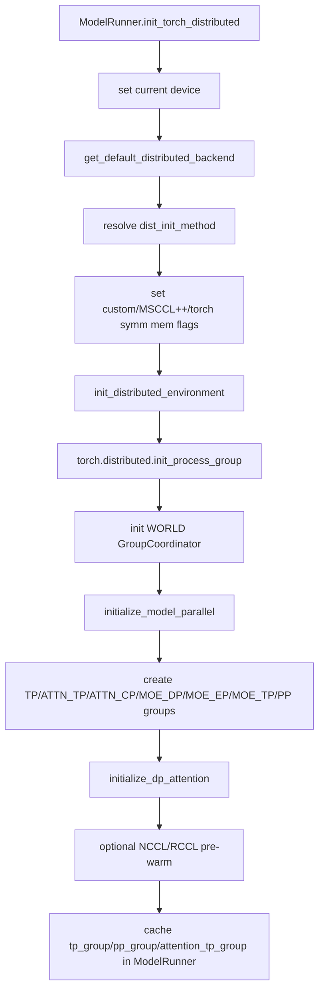
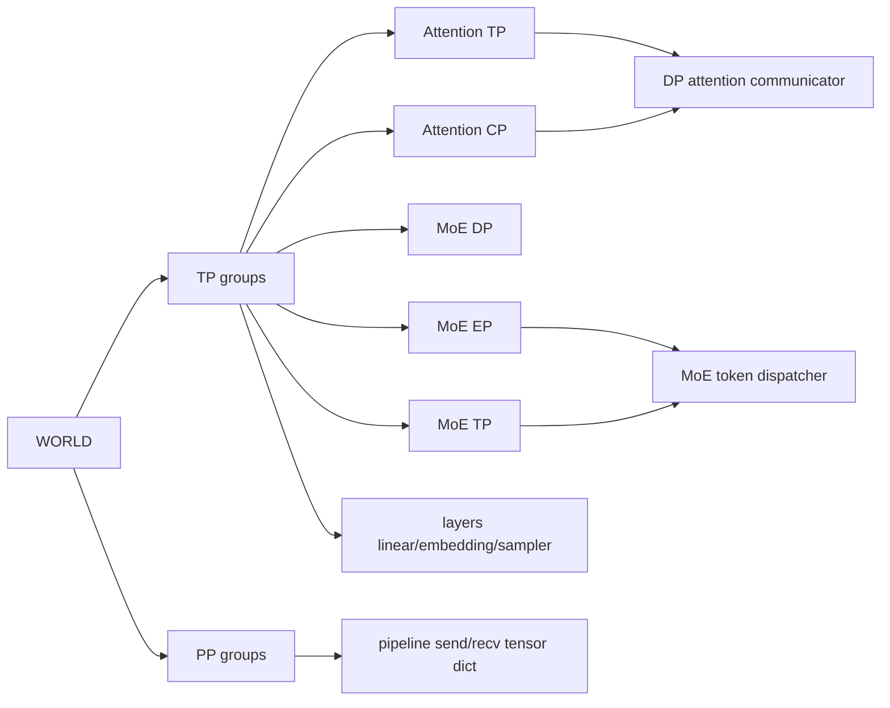
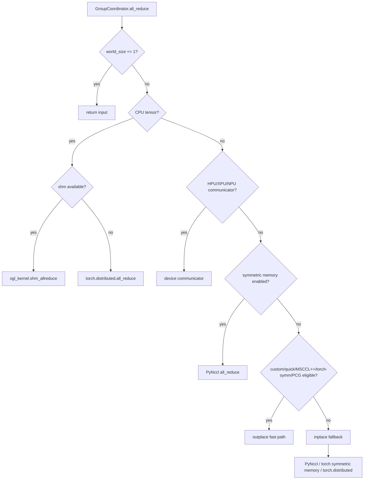
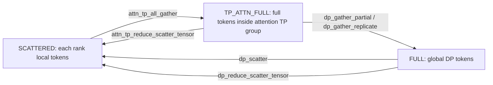

# srt/distributed 源码分析

## 1. 模块定位

`python/sglang/srt/distributed` 是 SRT 推理运行时的分布式通信与并行状态层。它不直接实现模型算子，而是为 `model_runner`、`layers`、scheduler/worker 提供统一的并行组抽象和通信 API。

核心职责：

- 初始化 torch distributed 全局进程组。
- 构造 TP、PP、Attention TP、Attention CP、MoE DP、MoE EP、MoE TP 等模型并行组。
- 封装 NCCL/Gloo/HCCL/XCCL/MCCL/Mooncake backend。
- 在 `GroupCoordinator` 内统一调度 all-reduce、all-gather、reduce-scatter、P2P send/recv、对象广播。
- 在 CUDA graph / piecewise CUDA graph 场景下切换 PyNccl、custom all-reduce、MSCCL++、torch symmetric memory 等 fast path。
- 为 DP attention、MoE token dispatcher、PP pipeline 传输提供底层通信原语。

关键源码：

- [parallel_state.py](/mnt/shanhai-ai/shanhai-workspace/zhouhao6/sglang/python/sglang/srt/distributed/parallel_state.py)
- [communication_op.py](/mnt/shanhai-ai/shanhai-workspace/zhouhao6/sglang/python/sglang/srt/distributed/communication_op.py)
- [utils.py](/mnt/shanhai-ai/shanhai-workspace/zhouhao6/sglang/python/sglang/srt/distributed/utils.py)
- [device_communicators](/mnt/shanhai-ai/shanhai-workspace/zhouhao6/sglang/python/sglang/srt/distributed/device_communicators)

## 2. 目录结构

```text
python/sglang/srt/distributed/
├── __init__.py
├── communication_op.py
├── naive_distributed.py
├── parallel_state.py
├── utils.py
└── device_communicators/
    ├── all_reduce_utils.py
    ├── cuda_wrapper.py
    ├── custom_all_reduce.py
    ├── custom_all_reduce_v2.py
    ├── custom_all_reduce_utils.py
    ├── hpu_communicator.py
    ├── mooncake_transfer_engine.py
    ├── npu_communicator.py
    ├── pynccl.py
    ├── pynccl_allocator.py
    ├── pynccl_wrapper.py
    ├── pymscclpp.py
    ├── quick_all_reduce.py
    ├── shm_broadcast.py
    ├── torch_symm_mem.py
    └── xpu_communicator.py
```

主要文件职责：

- `parallel_state.py`：定义 `GroupCoordinator`、全局并行组变量、初始化/销毁流程、rank/world-size 查询函数。
- `communication_op.py`：面向 layers 的轻量 wrapper，如 `tensor_model_parallel_all_reduce()`。
- `utils.py`：维度切分、PP layer partition、全局 `TCPStore`、`StatelessProcessGroup`。
- `naive_distributed.py`：基于文件系统 rendezvous 的极简分布式实现，主要用于特殊或测试场景。
- `device_communicators/*`：NCCL/HCCL/XCCL/custom all-reduce/MSCCL++/symmetric memory/共享内存广播等 backend 封装。

## 3. 初始化生命周期



入口是 `ModelRunner.init_torch_distributed()`：

1. 设置当前 device。
2. 根据 device 选择 backend：
   - cuda -> `nccl`
   - xpu -> `xccl`
   - hpu -> `hccl`
   - cpu -> `gloo`
   - npu -> `hccl`
   - musa -> `mccl`
3. 解析 `dist_init_method`，优先 `SGLANG_DISTRIBUTED_INIT_METHOD_OVERRIDE`。
4. 根据 server args 设置 custom all-reduce、MSCCL++、torch symmetric memory 开关。
5. 调用 `init_distributed_environment()`。
6. 调用 `initialize_model_parallel()`。
7. 调用 `initialize_dp_attention()`。
8. 可选 NCCL/RCCL pre-warm。
9. 缓存 `tp_group`、`pp_group`、`attention_tp_group`。

## 4. 并行组拓扑

`parallel_state.py` 维护全局并行组：

- `_WORLD`：所有 model worker ranks。
- `_TP`：tensor parallel group。
- `_PDMUX_PREFILL_TP_GROUP`：PD-Multiplexing prefill 重复 TP group。
- `_ATTN_TP`：attention tensor parallel group。
- `_ATTN_CP`：attention context parallel group。
- `_MOE_DP`：MoE data parallel group。
- `_MOE_EP`：MoE expert parallel group。
- `_MOE_TP`：MoE tensor parallel group。
- `_PP`：pipeline parallel group。



基本约束：

```text
world_size == tensor_model_parallel_size * pipeline_model_parallel_size
```

TP 示例：

```text
world_size=8, tp_size=2
TP groups: [0,1], [2,3], [4,5], [6,7]
```

PP 示例：

```text
world_size=8, pp_size=4, tp_size=2
PP groups: [0,2,4,6], [1,3,5,7]
```

Attention parallel：

```text
attn_dp_size = attention_data_parallel_size
attn_cp_size = attention_context_model_parallel_size
attn_tp_size = tp_size // attn_cp_size // attn_dp_size
```

MoE parallel：

```text
moe_ep_size = expert_model_parallel_size
moe_dp_size = moe_data_model_parallel_size
moe_tp_size = tp_size // moe_ep_size // moe_dp_size
```

## 5. GroupCoordinator

`GroupCoordinator` 是 torch `ProcessGroup` 的统一 wrapper。每个逻辑并行组都有一个 coordinator。

它同时持有：

- `device_group`：设备通信组，通常 NCCL/HCCL/XCCL/MCCL/Mooncake。
- `cpu_group`：Gloo 或 Mooncake CPU group，用于 object、metadata、barrier。
- rank 元信息：`rank`、`ranks`、`world_size`、`local_rank`、`rank_in_group`。
- 可选 communicator：`pynccl_comm`、`pymscclpp_comm`、`ca_comm`、`qr_comm`、`torch_symm_mem_comm`、HPU/XPU/NPU communicator、message queue broadcaster。

主要 API：

- `all_reduce()`、`fused_allreduce_rmsnorm()`
- `all_gather()`、`all_gather_into_tensor()`、`all_gatherv()`
- `gather()`、`reduce_scatter_tensor()`、`reduce_scatterv()`
- `broadcast()`、`broadcast_object()`、`broadcast_tensor_dict()`
- `send_tensor_dict()`、`recv_tensor_dict()`
- `send()`、`recv()`、`send_object()`、`recv_object()`
- `barrier()`
- `graph_capture()`
- `destroy()`

设计要点：

- CPU metadata/object 走 `cpu_group`。
- GPU tensor 走 `device_group` 或专用 communicator。
- `barrier()` 明确使用 `cpu_group`，避免 NCCL barrier 隐式创建 GPU tensor 并污染当前 device。
- `broadcast_tensor_dict()` 先广播 metadata，再按 tensor device 分别广播 payload。
- PP 传输时，`send_tensor_dict()` / `recv_tensor_dict()` 支持 `all_gather_group` 优化。

## 6. all-reduce fast path

`GroupCoordinator.all_reduce()` 分派逻辑：



主要 fast path：

- PyNccl：ctypes 直接加载 NCCL/RCCL/MCCL，适合 CUDA graph capture。
- CustomAllreduce：小/中 payload 低延迟 all-reduce，使用 IPC/shared buffer，支持 graph buffer 注册。
- CustomAllReduceV2：JIT kernel，通过 `SGLANG_USE_JIT_ALL_REDUCE=1` 启用。
- MSCCL++：CUDA 小消息 all-reduce，支持 world size `[8,16]`，最大消息由 `SGLANG_MSCCLPP_MAX_BYTES` 控制。
- NCCL symmetric memory allocator：使用 `ncclMemAlloc` 和 `ncclCommWindowRegister`。
- torch symmetric memory：依赖 `torch.distributed._symmetric_memory`。
- 共享内存 CPU all-reduce：CPU tensor 可走 `sgl_kernel.shm_allreduce`。

CUDA graph 语义：

- `graph_capture()` 会同时包住 TP、PP、MoE EP、MoE TP group。
- custom all-reduce 在 capture 后注册 graph buffer。
- PyNccl/MSCCL++/torch symmetric memory 在 graph capture context 中临时启用。
- eager 下 torch.distributed 可用；graph 下要避免 torch.distributed NCCL collective。

## 7. TP / PP / DP Attention / MoE 数据流

### 7.1 TP

layers 通过 `communication_op.py` 或 `get_tp_group()` 调用：

- `tensor_model_parallel_all_reduce(input_)`
- `tensor_model_parallel_all_gather(input_, dim=-1)`
- `tensor_model_parallel_gather(input_, dst=0, dim=-1)`
- `broadcast_tensor_dict(...)`
- `tensor_model_parallel_fused_allreduce_rmsnorm(...)`

典型用途：

- Column/row parallel linear 后 all-reduce partial output。
- vocab parallel embedding/lm head gather 或 reduce。
- sampler 同步 token ids。
- CUDA graph capture 下选择 graph-safe collective。

### 7.2 PP

PP group 来自 `get_pp_group()`。

- `get_pp_indices(num_hidden_layers, pp_rank, pp_size)` 计算每个 PP stage 的 layer 范围。
- `SGLANG_PP_LAYER_PARTITION` 可显式指定每个 stage layer 数。
- `pp_size > 1` 时 server args 会禁用 overlap schedule。
- stage 间可用 `send_tensor_dict()` / `recv_tensor_dict()` 传递 tensor dict。

global rank 关系：

```text
global_rank = tp_size * pp_rank + tp_rank
world_size = tp_size * pp_size
```

### 7.3 DP Attention

初始化函数：`initialize_dp_attention(server_args, model_config)`。

rank layout：

```text
attn_dp_size = dp_size if enable_dp_attention else 1
attn_tp_size = tp_size // attn_dp_size // attn_cp_size
attn_tp_rank = tp_rank % attn_tp_size
attn_dp_rank = tp_rank // (attn_tp_size * attn_cp_size)
```

布局是 `(dp, cp, tp)`，其中 tp 是 fastest-changing dimension。

token 布局转换：



padding mode：

- `MAX_LEN`：padding 到 max length 后用 `all_gather_into_tensor`。
- `SUM_LEN`：padding 到 sum length 后用 `all_reduce`，减少不均匀 token 分布的 padding 开销。

### 7.4 MoE / EP

并行组：

- `_MOE_DP`
- `_MOE_EP`
- `_MOE_TP`

MoE group size：

```text
moe_ep_size = expert_model_parallel_size
moe_dp_size = moe_data_model_parallel_size
moe_tp_size = tp_size // moe_ep_size // moe_dp_size
```

Standard dispatcher 根据 EP rank 构造 local expert mapping。FlashInfer Cutlass FP4 MoE 特殊路径会先量化 hidden states，再用 TP `all_gatherv` 聚合 topk 和 hidden states，combine 时用 `reduce_scatterv` 回收局部 buffer。

NIXL EP 依赖全局 `TCPStore`，要求 `init_distributed_environment(..., moe_a2a_backend="nixl")` 已初始化 store。

多种 A2A backend 会在 server args 中强制：

```text
ep_size = tp_size
```

包括 `deepep`、`mooncake`、`nixl`、`ascend_fuseep`、`flashinfer`、`mori`。

## 8. 与 model_runner / layers / server_args 的关系

`ModelRunner` 是分布式初始化主调用方，传入：

- `tp_size`
- `pp_size`
- `moe_ep_size`
- `dp_size`
- `attn_cp_size`
- `moe_dp_size`

初始化后缓存：

- `self.tp_group`
- `self.pp_group`
- `self.attention_tp_group`

layers 通过 distributed API 获取 group 或 communication wrapper，不直接管理 process group 生命周期。典型使用方：

- `layers/communicator.py`
- `layers/dp_attention.py`
- `layers/linear.py`
- `layers/vocab_parallel_embedding.py`
- `layers/sampler.py`
- `layers/moe/token_dispatcher/*`
- 多个量化实现

server args 关键字段：

- `nccl_port`
- `dist_init_addr`
- `nnodes`
- `node_rank`
- `dist_timeout`
- `tp_size`
- `pp_size`
- `dp_size`
- `ep_size`
- `attn_cp_size`
- `moe_dp_size`
- `enable_dp_attention`
- `enable_dp_lm_head`
- `enable_nccl_nvls`
- `enable_symm_mem`
- `disable_custom_all_reduce`
- `enable_mscclpp`
- `enable_torch_symm_mem`
- `pre_warm_nccl`
- `moe_a2a_backend`
- `elastic_ep_backend`
- `enable_eplb`
- `moe_dense_tp_size`

## 9. 环境变量

常见变量：

- `SGLANG_DISTRIBUTED_INIT_METHOD_OVERRIDE`
- `MASTER_ADDR` / `MASTER_PORT`
- `LOCAL_RANK`
- `LOCAL_SIZE`
- `SGLANG_TCP_STORE_PORT`
- `SGLANG_NCCL_SO_PATH`
- `SGLANG_ONE_VISIBLE_DEVICE_PER_PROCESS`
- `SGLANG_USE_MESSAGE_QUEUE_BROADCASTER`
- `SGLANG_RINGBUFFER_WARNING_INTERVAL`
- `SGLANG_PP_LAYER_PARTITION`
- `SGLANG_ENABLE_TP_MEMORY_INBALANCE_CHECK`
- `SGLANG_USE_JIT_ALL_REDUCE`
- `SGLANG_USE_1STAGE_ALLREDUCE`
- `SGLANG_ENABLE_DETERMINISTIC_INFERENCE`
- `SGLANG_USE_AITER_AR`
- `SGLANG_MSCCLPP_MAX_BYTES`
- `SGLANG_TMP_NCCL_COMM_VALUE`
- `SGLANG_SYMM_MEM_PREALLOC_GB_SIZE`
- MoE/EP 相关 `SGLANG_DEEPEP_*`、`SGLANG_NIXL_EP_*`、`SGLANG_MORI_*`
- `NCCL_ALGO`

## 10. 扩展点

- 新设备 backend：在 device -> backend 映射中添加类型，实现新的 communicator，并在 `GroupCoordinator` collective 方法中分派。
- 新 all-reduce fast path：添加 communicator 类，暴露 eligibility check 和 `all_reduce()`，接入 `all_reduce()` 分派。
- 新 MoE A2A backend：在 server args 添加约束，在 MoE dispatcher 中接入 dispatch/combine，必要时复用 `get_global_tcp_store()`。
- 新 PP 分层策略：扩展 `get_pp_indices()`；简单场景可用 `SGLANG_PP_LAYER_PARTITION`。
- 新 object broadcast 策略：替换或增强 `MessageQueue`，保持 `broadcast_object()` 语义。
- draft worker 不同 TP degree：可用 `patch_tensor_parallel_group(tp_group)` 临时 patch。

## 11. 风险与排障

- `initialize_model_parallel()` 要求 `world_size == tp_size * pp_size`。
- rank layout 容易误解：model runner global rank 是 `tp_size * pp_rank + tp_rank`，DP attention 是 `(dp, cp, tp)`。
- custom all-reduce 不生效时检查 world size、P2P/NVLink、contiguous、byte 对齐和 `--disable-custom-all-reduce`。
- PyNccl 绑定固定 device，tensor device 不一致可能触发 assert 或非法访问。
- CUDA graph 中避免直接使用 torch.distributed NCCL collective，应通过 `graph_capture()` 启用 graph-safe 路径。
- NIXL EP 需要全局 TCPStore。
- `moe_dp_size > 1` 时要求 `pp_size == 1`。
- `pp_size > 1` 会禁用 overlap schedule。
- DP attention 的 `MAX_LEN` 和 `SUM_LEN` 路径 buffer 语义不同，token start position 错会导致 gather/scatter 错位。
- symmetric memory 依赖 GPU、torch、NCCL 能力和 graph pool 配置。
- HCCL/NPU group options 和 HCCL buffer 环境变量会影响可用性。
- 共享内存 broadcaster 跨节点走 ZeroMQ，需检查网络地址和 IPv6。
- TP 初始化后会检查 GPU memory imbalance，必要时通过相关环境变量调整。

排障顺序：

1. 确认 `tp_size * pp_size == world_size`。
2. 打印每个 rank 的 TP/PP/attention/MoE rank。
3. 禁用 fast path 验证基础通信。
4. 如果是 CUDA graph 问题，检查是否在 `graph_capture()` 下进入 collective。
5. 如果是 MoE A2A，确认 `ep_size` 是否被自动改成 `tp_size`。
6. 如果是 NIXL，确认 TCPStore 和 NIXL 包安装。
7. 如果是 PP，确认 layer partition 合法。

