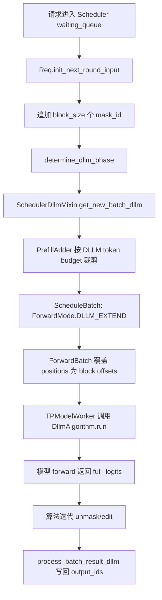

# srt/dllm 源码分析

## 1. 模块定位

`python/sglang/srt/dllm` 是 SRT 的 Diffusion LLM 推理支持层。它不实现模型本体，而是为 block diffusion 风格生成提供配置、调度、请求状态和解码算法胶水。

核心语义是“块扩展 + 反复对 mask 位置并行预测”。它把普通自回归逐 token decode 改成块状 mask/unmask 调度，更接近非自回归或半非自回归生成。

主要能力：

- DLLM 配置解析：模型 architecture 到 `block_size`、`mask_id` 的映射。
- 请求 mixin：初始化 `fill_ids`、维护 block offset 和阶段。
- scheduler mixin：构造 DLLM 专用 batch。
- 解码算法插件：`LowConfidence`、`JointThreshold`。
- 与 `Scheduler`、`PrefillAdder`、`ForwardBatch`、`TPModelWorker`、`LogitsProcessor` 连接。

## 2. 目录结构

```text
python/sglang/srt/dllm/
├── algorithm/
│   ├── __init__.py
│   ├── base.py
│   ├── joint_threshold.py
│   └── low_confidence.py
├── config.py
└── mixin/
    ├── req.py
    └── scheduler.py
```

关键文件：

- [config.py](/mnt/shanhai-ai/shanhai-workspace/zhouhao6/sglang/python/sglang/srt/dllm/config.py)：`DllmConfig`。
- [mixin/req.py](/mnt/shanhai-ai/shanhai-workspace/zhouhao6/sglang/python/sglang/srt/dllm/mixin/req.py)：`ReqDllmMixin`。
- [mixin/scheduler.py](/mnt/shanhai-ai/shanhai-workspace/zhouhao6/sglang/python/sglang/srt/dllm/mixin/scheduler.py)：`SchedulerDllmMixin`、`DllmManager`。
- [algorithm/base.py](/mnt/shanhai-ai/shanhai-workspace/zhouhao6/sglang/python/sglang/srt/dllm/algorithm/base.py)：`DllmAlgorithm`。
- [algorithm/low_confidence.py](/mnt/shanhai-ai/shanhai-workspace/zhouhao6/sglang/python/sglang/srt/dllm/algorithm/low_confidence.py)：低置信度解码。
- [algorithm/joint_threshold.py](/mnt/shanhai-ai/shanhai-workspace/zhouhao6/sglang/python/sglang/srt/dllm/algorithm/joint_threshold.py)：联合阈值与编辑解码。

## 3. 启用与配置

入口来自 server 参数：

- `--dllm-algorithm LowConfidence|JointThreshold`
- `--dllm-algorithm-config config.yaml`

`ServerArgs._handle_dllm_inference()` 会同步改写运行约束：

- 禁用 overlap schedule。
- AMD/HIP 禁 CUDA graph，并倾向 triton/aiter。
- NPU 使用 ascend。
- CUDA graph 场景倾向 flashinfer。
- 禁 hierarchical cache、LMCache、LoRA、disaggregation。

`DllmConfig` 中硬编码的模型参数：

| Architecture | block_size | mask_id |
| --- | ---: | ---: |
| `LLaDA2MoeModelLM` | 32 | 156895 |
| `SDARForCausalLM` | 4 | 151669 |
| `SDARMoeForCausalLM` | 4 | 151669 |

YAML 配置可以覆盖通用 `block_size`，算法私有参数由算法类读取。

## 4. 请求与调度流程



核心步骤：

1. `Req` 继承 `ReqDllmMixin`。
2. `init_next_round_input()` 在 DLLM 下调用 `_init_fill_ids_for_dllm()`，把 `origin_input_ids + output_ids + mask_id * block_size` 写入 `fill_ids`。
3. `determine_dllm_phase()` 判断当前块是 prefill 还是 decode。
4. `Scheduler.get_next_batch_to_run()` 在 `dllm_config != None` 时走 `get_new_batch_dllm()`，产生 `ForwardMode.DLLM_EXTEND`。
5. `ScheduleBatch` 转成 `ModelWorkerBatch` 时携带 `dllm_block_offsets` 和 `dllm_config`。
6. `ForwardBatch.init_new()` 在 DLLM 下覆盖 `positions`，每个请求使用 `[block_offset, block_offset + block_size)`。
7. `TPModelWorker` 初始化 `dllm_algorithm`，生成时直接调用算法 `run(model_runner, forward_batch)`。
8. `SchedulerDllmMixin.process_batch_result_dllm()` 把新 token 写回 `req.fill_ids[-new_tokens:]`，追加到 `req.output_ids`，完成后释放 KV cache 并 stream 输出。

## 5. 解码算法

### 5.1 LowConfidence

默认参数：

- `threshold=0.95`

流程：

1. 对块内 mask 位置取 argmax 和概率。
2. 置信度超过阈值的 mask 被替换。
3. 如果没有任何位置超过阈值，强制选择置信度最高的一个，保证推进。
4. 最多循环 `block_size` 次。
5. 最后额外 forward 一次保存 KV 或刷新 logits。

### 5.2 JointThreshold

默认参数：

- `threshold=0.5`
- `edit_threshold=0`
- `max_post_edit_steps=16`
- `penalty_lambda=0`

两阶段逻辑：

- M2T：mask-to-token，类似 `LowConfidence`。
- T2T：token-to-token，只编辑非 prompt、非 mask 的生成位置。

可用 `penalty_lambda` 对相邻重复做简单惩罚；mask 全消失后仍可做有限 post-edit，避免无限循环。

源码中没有独立 latent state 抽象。这里的“latent/扩散”主要体现在 mask token 作为待去噪变量，以及块内并行预测/编辑的迭代过程。

## 6. 与执行和采样路径的关系

- `Scheduler`：决定 DLLM 请求进入专用 waiting/staging 队列，构造 `DLLM_EXTEND` batch。
- `PrefillAdder`：通过 `dllm_config` 限制每轮最多调度 `max_running_requests * block_size` 个 DLLM token，并按 page/block 对齐裁剪。
- `ForwardBatch`：根据 `dllm_block_offsets` 重写 positions。
- `ModelRunner`：普通采样函数仍存在，但 DLLM 由 `TPModelWorker` 旁路调用算法。
- `SamplingBatchInfo`：仍由 `ScheduleBatch.prepare_for_extend()` 构建，但当前 DLLM 算法不调用 `ModelRunner.sample()` 和 `_preprocess_logits()`。
- `LogitsProcessor`：DLLM forward mode 下返回 `full_logits`，不是普通 `next_token_logits`。

重要后果：temperature、top-p、top-k、grammar mask、logit bias、自定义 logit processor 等常规 sampling 机制基本不会参与 DLLM token 选择，除非算法显式复用这些逻辑。

## 7. 扩展点

新增算法：

1. 在 `python/sglang/srt/dllm/algorithm/` 增加文件。
2. 定义算法类。
3. 设置 `Algorithm = YourClass`。
4. 类名就是 `--dllm-algorithm` 的值。

新增模型：

1. 扩展 `DllmConfig.DLLM_PARAMS`。
2. 提供 architecture、`block_size`、`mask_id`。
3. 确保模型 logits processor 使用 `return_full_logits=True`。

支持常规 sampling 参数：

- 需要让算法显式调用或复用 `ModelRunner._preprocess_logits()` / sampler 逻辑。
- 否则 grammar、temperature、top-p 等不会生效。

## 8. 风险与排障

- 算法名错误会报 `Unknown diffusion LLM algorithm`。
- 未知 architecture 会在 `DllmConfig.from_server_args()` 报 `Unknown diffusion LLM`。
- 传入 YAML 配置但缺少 PyYAML 会报 ImportError。
- DLLM 对 page/block 对齐敏感；`_update_block_offset_for_dllm()` 要求 prefix 长度能被 block size 整除。
- 当前 DLLM 旁路常规 sampling，结构化输出、logit bias、temperature/top-p 等可能不符合用户预期。
- `server_args.py` 中 PP 处理条件值得复核，文档使用者不要默认认为 PP 已完整兼容。
- `DllmManager.is_empty()` 只看 `waiting_queue`，staging 状态需结合 `any_staging_reqs()` 排查。
- 调度策略中有剩余 DLLM token 小于 block size 时的扩散 unmask 风险提示，相关路径需要回归。

