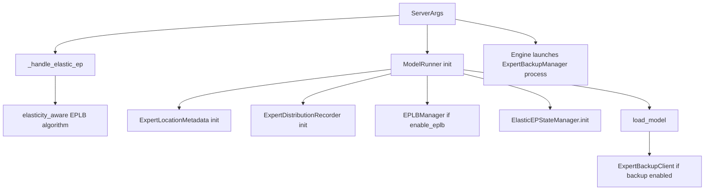
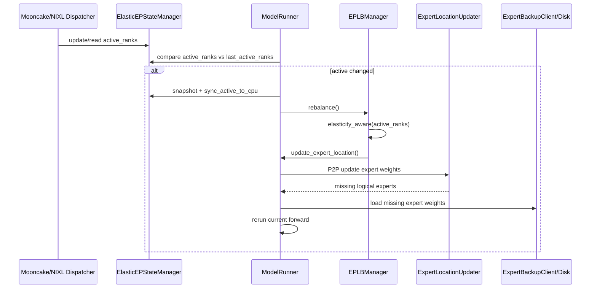
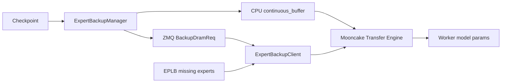

# srt/elastic_ep 源码分析

## 1. 模块定位

`python/sglang/srt/elastic_ep` 是 Elastic Expert Parallel 的状态与专家权重备份模块。它不实现完整 MoE 计算，而是给 MoE A2A dispatcher、EPLB 重平衡、ModelRunner 热更新专家权重提供两类基础能力：

- EP rank 存活状态：记录哪些 expert parallel rank 仍 active。
- 专家权重备份恢复：rank 失效或 EPLB 重新布局后，从 DRAM backup 或磁盘加载缺失专家权重。

真正的 token dispatch/combine 仍在 MoE dispatcher 中完成。Elastic EP 负责把 `active_ranks` 暴露给 Mooncake/NIXL 后端，并在 rank 状态变化时触发 EPLB。

## 2. 目录结构

```text
python/sglang/srt/elastic_ep/
├── elastic_ep.py
├── expert_backup_client.py
└── expert_backup_manager.py
```

关键文件：

- [elastic_ep.py](/mnt/shanhai-ai/shanhai-workspace/zhouhao6/sglang/python/sglang/srt/elastic_ep/elastic_ep.py)：全局 Elastic EP 状态单例。
- [expert_backup_manager.py](/mnt/shanhai-ai/shanhai-workspace/zhouhao6/sglang/python/sglang/srt/elastic_ep/expert_backup_manager.py)：独立 backup 进程。
- [expert_backup_client.py](/mnt/shanhai-ai/shanhai-workspace/zhouhao6/sglang/python/sglang/srt/elastic_ep/expert_backup_client.py)：worker 侧专家权重恢复客户端。

## 3. 核心类

### 3.1 ElasticEPState

`ElasticEPState` 维护三份状态：

- `active_ranks`：设备侧 rank active mask。
- `last_active_ranks`：上一轮快照，用于判断状态是否变化。
- `active_ranks_cpu`：CPU 侧副本，用于 EPLB/P2P 过滤。

核心方法：

- `sync_active_to_cpu()`：把设备 tensor 同步到 CPU。
- `snapshot_active_to_last()`：更新比较基准。
- `is_active_equal_last()`：判断 active mask 是否变化。

### 3.2 ElasticEPStateManager

全局单例：

- `init(server_args)`：当 `elastic_ep_backend` 非空时初始化健康状态，全 1。
- `healthy_rank_state()`：构造全 active rank mask，默认 size 来自 `torch.distributed.get_world_size()`。
- `instance()`：返回全局状态。

### 3.3 ExpertBackupManager

backup manager 是独立进程，每个节点一个。职责：

1. 根据 `node_rank` 和 `nnodes` 把 routed experts 切到本节点负责范围。
2. 从 checkpoint 读取专家权重。
3. 拷贝到 CPU `continuous_buffer`。
4. 注册 Mooncake transfer memory。
5. 通过 ZMQ PUB 发布 `BackupDramReq`，包含远端权重指针表、session id、buffer size。

### 3.4 ExpertBackupClient

每个 model worker 创建一个 client。职责：

1. 连接所有节点的 backup manager。
2. 收集各节点 `weight_pointer_map` 和 `session_id`。
3. 注册本地模型参数内存到 Mooncake transfer engine。
4. 在 `update_weights(weight_name_filter)` 中，根据 expert location metadata 找本 rank 缺失的 physical expert。
5. 把远端 backup 权重按 fused MoE 参数布局写入本地参数。

当前命名映射主要支持：

- `gate_proj` / `up_proj` -> `experts.w13_`
- `down_proj` -> `experts.w2_`

## 4. 初始化与恢复流程



启动入口：

- `--elastic-ep-backend {mooncake,nixl}`
- `--enable-eplb`
- `--enable-elastic-expert-backup`

server 参数处理：

- 启用 Elastic EP 且启用 EPLB 时，`eplb_algorithm=auto` 会变成 `elasticity_aware`。
- 只允许 `elasticity_aware` 或 `elasticity_aware_hierarchical`。
- Mooncake 后端会校验 `mooncake_ib_device`。

ModelRunner 初始化：

1. 初始化 expert location metadata。
2. 初始化 expert distribution recorder。
3. 如果 `enable_eplb`，创建 `EPLBManager`。
4. 如果 `elastic_ep_backend` 非空，调用 `ElasticEPStateManager.init()`。
5. 模型加载后，如果启用 backup，创建 `ExpertBackupClient`。

## 5. Rank Fault 恢复闭环



前向阶段：

- Mooncake/NIXL dispatcher 在 dispatch/combine 阶段读取或更新 `active_ranks`。
- NIXL 在 combine 后通过 `query_mask_buffer()` 查询失效 rank，并写回 `active_ranks`。
- Mooncake dispatch/combine 把 `active_ranks` 传给底层 buffer。

ModelRunner 每次 forward 后检查 `active_ranks` 是否变化。如果变化：

1. snapshot 到 `last_active_ranks`。
2. 同步到 CPU。
3. 触发 `eplb_manager.rebalance()`。
4. 更新 expert location。
5. 必要时加载缺失专家权重。
6. 重新执行当前 forward。

## 6. 与 EPLB 的关系

Elastic EP 依赖 EPLB 在 rank 失效后重算专家布局。

关键关系：

- `server_args._handle_elastic_ep()` 强制 Elastic EP + EPLB 使用 elasticity-aware 系列算法。
- `eplb/eplb_algorithms/__init__.py` 中，`rebalance_experts()` 对 `elasticity_aware` 传入 `ElasticEPStateManager.instance().active_ranks`。
- `eplb/eplb_algorithms/elasticity_aware.py` 根据 `active_ranks.sum()` 计算 active rank 数。
- 如果 active rank 少于原 GPU 数，算法回退到 global load-balance，并把 inactive rank 的 physical expert 槽位插回占位。
- `EPLBManager.rebalance()` dump expert distribution recorder 的 logical count，调用 `ExpertLocationMetadata.init_by_eplb()` 生成新布局，再分 chunk 调 `model_runner.update_expert_location()`。

## 7. 与 distributed / model_executor / MoE layers 的关系

### distributed

- `distributed/parallel_state.py` 中，Mooncake backend 的 process group wrapper 会创建 `active_ranks` 和 `active_ranks_cpu`，传给 `MooncakeBackendOptions`。
- scheduler 在 DP attention + Elastic EP 时，从 `tp_group.active_ranks` 和 `active_ranks_cpu` 计算 DP rank 是否 active，并发送 `ActiveRanksOutput`。
- `ElasticEPStateManager` 与 distributed group 的 active mask 命名相似，但不是同一个对象。前者主要服务 MoE dispatcher/EPLB；后者服务通信组和 scheduler 控制面。

### model_executor

`ModelRunner` 负责：

- 初始化 `ElasticEPStateManager`。
- Mooncake Elastic EP 时把 torch distributed backend 改成 `mooncake`。
- 启用 expert backup 时初始化 Mooncake transfer engine。
- 模型加载 barrier 上，Mooncake 使用普通 `dist.barrier(group=get_tp_group().cpu_group)`。
- 在 `update_expert_location()` 中调用 `ExpertLocationUpdater.update()`，缺失 logical experts 时优先从 `ExpertBackupClient` 拉取，否则从磁盘热加载。

### MoE layers

- `elastic_ep_backend` 不会自动替代 `moe_a2a_backend`。
- `moe_a2a_backend` 决定真正的 Mooncake/NIXL MoE dispatcher。
- `MaybeTboDeepEPDispatcher` 会根据 backend 实例化 `MooncakeEPDispatcher` 或 `NixlEPDispatcher`。
- Mooncake/NIXL/DeepEP 都走 `DeepEPMoE` 实现类。
- 多个 MoE 模型在 `enable_eplb` 时创建 `ExpertLocationDispatchInfo`，用于 logical expert 到 physical expert 的映射与统计。

## 8. Expert Backup 数据流



backup manager 从 checkpoint 读取本节点负责专家权重，放进 CPU 连续 buffer，并通过 Mooncake transfer engine 注册为可远程读取内存。worker 侧 client 收到指针表后，在 EPLB 更新专家布局发现本地缺失专家时，从远端 DRAM 拉取到模型参数。

## 9. 配置与环境变量

主要 server args：

- `--elastic-ep-backend {none,mooncake,nixl}`
- `--enable-elastic-expert-backup`
- `--enable-eplb`
- `--eplb-algorithm`
- `--eplb-rebalance-num-iterations`
- `--eplb-rebalance-layers-per-chunk`
- `--eplb-min-rebalancing-utilization-threshold`
- `--moe-a2a-backend`
- `--mooncake-ib-device`

环境变量：

- `SGLANG_BACKUP_PORT_BASE`
- `SGLANG_MOONCAKE_EP_NUM_MAX_DISPATCH_TOKENS_PER_RANK`
- `SGLANG_NIXL_EP_NUM_MAX_DISPATCH_TOKENS_PER_RANK`
- `SGLANG_LOG_EXPERT_LOCATION_METADATA`
- `SGLANG_EXPERT_LOCATION_UPDATER_LOG_*`
- `SGLANG_EPLB_HEATMAP_COLLECTION_INTERVAL`
- `SGLANG_ENABLE_EPLB_BALANCEDNESS_METRIC`

## 10. 扩展点

新增 Elastic EP backend：

1. 增加 `server_args.elastic_ep_backend` choice。
2. 实现对应 token dispatcher，并消费/更新 `ElasticEPStateManager.active_ranks`。
3. 如需通信组感知 active ranks，扩展 `distributed/parallel_state.py`。

新增 EPLB 算法：

1. 在 `eplb/eplb_algorithms/__init__.py` 增加 enum 和 dispatch。
2. 故障感知算法需要传入 `active_ranks`。

新增模型热更新支持：

- 模型类应暴露 `routed_experts_weights_of_layer`。
- 模型类应提供 `get_model_config_for_expert_location()`。
- 最好实现 `generate_weight_name_filter()`，否则缺失专家恢复会退化为全量 reload。

扩展 backup 权重命名：

- 当前 client 假设 checkpoint 名称符合 `layers.<layer>.mlp.experts.<expert>.<gate/down/up>_proj`。
- 新模型或量化格式需要扩展 `extract_layer_and_expert_id()` 与 fused 参数映射。

## 11. 风险与排障

- `elastic_ep_backend` 不等于 `moe_a2a_backend`。前者开启 Elastic EP 状态/恢复，后者决定 MoE dispatcher。实际部署通常需要一致配置。
- `enable_elastic_expert_backup` 当前强依赖 Mooncake transfer engine，即使 `elastic_ep_backend=nixl` 也会调用 Mooncake transfer engine。
- Elastic EP 应配合 `--enable-eplb` 使用；active rank 变化后会直接调用 `eplb_manager.rebalance()`。
- backup client 只识别 `gate_proj/down_proj/up_proj`，并映射到 `experts.w13_` / `experts.w2_`。
- backup manager 如果本节点没有匹配专家权重，`continuous_buffer` 可能为空，异常配置下可能在注册 transfer memory 时出错。
- backup 使用 `SGLANG_BACKUP_PORT_BASE + node_rank * 2` 和 `+1`，多实例同机需错开端口。
- Mooncake/NIXL dispatcher normal mode 未实现，实际走 low-latency。
- NIXL 通过 `query_mask_buffer()` 写回 active ranks；Mooncake Python 层没有显式查询 mask 的代码，需结合后端行为排查。
- rank fault 后会在同一次 forward 后触发 EPLB 并重跑当前 batch，排查时关注 “EPLB due to rank faults” 相关日志。

