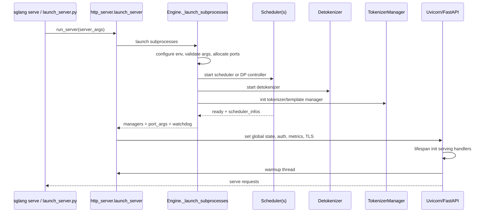
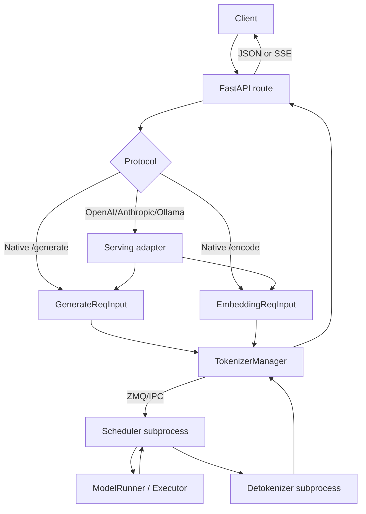
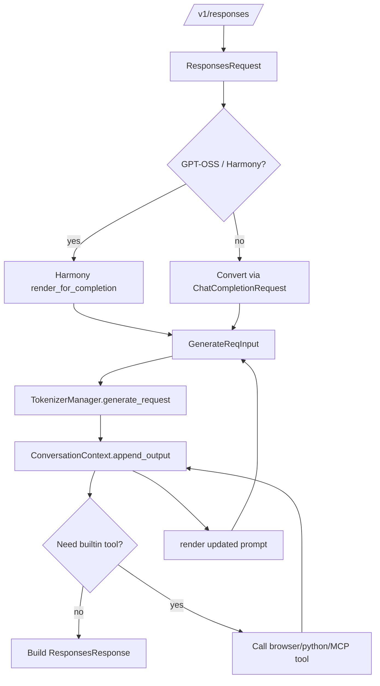

# srt/entrypoints 源码分析

## 1. 模块定位

`python/sglang/srt/entrypoints` 是 SRT 对外入口层，负责把不同调用形态统一接入底层推理运行时。

它覆盖：

- HTTP/FastAPI 服务入口：原生 `/generate`、`/encode`、管理 API、OpenAI/Ollama/Anthropic/SageMaker/Vertex 兼容 API。
- Python 内嵌 Engine：`sglang.Engine(...)` 直接启动 tokenizer/scheduler/detokenizer，并提供同步/异步方法。
- 协议适配层：OpenAI、Responses、Anthropic、Ollama、gRPC、HTTP server adapter。
- 工具调用与 Harmony 支持：Responses API、内置 browser/python 工具、MCP 工具服务。
- 运行期辅助：warmup、TLS 证书热刷新、负载查询、transfer engine info bootstrap。

entrypoints 不做模型执行本身。它负责协议解析、请求适配、服务生命周期和运行时管理 API；实际调度和推理由 `TokenizerManager`、scheduler、detokenizer、model runner 等 managers/executor 层完成。

## 2. 目录结构

顶层文件：

- [http_server.py](/mnt/shanhai-ai/shanhai-workspace/zhouhao6/sglang/python/sglang/srt/entrypoints/http_server.py)：主 HTTP/FastAPI 服务。
- [engine.py](/mnt/shanhai-ai/shanhai-workspace/zhouhao6/sglang/python/sglang/srt/entrypoints/engine.py)：Python API Engine。
- [EngineBase.py](/mnt/shanhai-ai/shanhai-workspace/zhouhao6/sglang/python/sglang/srt/entrypoints/EngineBase.py)：Engine 抽象基类。
- [http_server_engine.py](/mnt/shanhai-ai/shanhai-workspace/zhouhao6/sglang/python/sglang/srt/entrypoints/http_server_engine.py)：HTTP server adapter。
- [grpc_server.py](/mnt/shanhai-ai/shanhai-workspace/zhouhao6/sglang/python/sglang/srt/entrypoints/grpc_server.py)：普通推理 gRPC 薄封装。
- [v1_loads.py](/mnt/shanhai-ai/shanhai-workspace/zhouhao6/sglang/python/sglang/srt/entrypoints/v1_loads.py)：`/v1/loads` 负载指标。
- [warmup.py](/mnt/shanhai-ai/shanhai-workspace/zhouhao6/sglang/python/sglang/srt/entrypoints/warmup.py)：自定义 warmup。
- [ssl_utils.py](/mnt/shanhai-ai/shanhai-workspace/zhouhao6/sglang/python/sglang/srt/entrypoints/ssl_utils.py)：TLS 证书热刷新。
- [context.py](/mnt/shanhai-ai/shanhai-workspace/zhouhao6/sglang/python/sglang/srt/entrypoints/context.py)、[harmony_utils.py](/mnt/shanhai-ai/shanhai-workspace/zhouhao6/sglang/python/sglang/srt/entrypoints/harmony_utils.py)、[tool.py](/mnt/shanhai-ai/shanhai-workspace/zhouhao6/sglang/python/sglang/srt/entrypoints/tool.py)：Responses/Harmony 工具循环。

协议子目录：

- `openai/`：OpenAI 兼容协议模型和 serving handlers。
- `anthropic/`：Anthropic Messages API 适配。
- `ollama/`：Ollama API 适配和 smart router。

## 3. 启动入口

顶层分流在 [launch_server.py](/mnt/shanhai-ai/shanhai-workspace/zhouhao6/sglang/python/sglang/launch_server.py)。

`run_server(server_args)` 分流：

- `encoder_only + grpc_mode`：走 encoder gRPC。
- `encoder_only`：走 encoder HTTP server。
- `grpc_mode`：走 `entrypoints/grpc_server.py::serve_grpc`。
- `use_ray`：走 Ray HTTP server。
- 默认：走 `entrypoints/http_server.py::launch_server`。

普通 HTTP server 启动：

1. `http_server.launch_server(server_args)` 调用 `Engine._launch_subprocesses(...)`。
2. 配置环境、校验参数、分配 IPC 端口。
3. 启动 scheduler 或 data-parallel controller。
4. 启动 detokenizer。
5. 创建 `TokenizerManager` 和 `TemplateManager`。
6. 等 scheduler ready，取回 `scheduler_infos`。
7. `_setup_and_run_http_server()` 设置全局状态、认证、metrics、uvicorn、TLS、多 tokenizer workers。
8. FastAPI lifespan 初始化 serving handlers 和 warmup。

## 4. 核心组件

### 4.1 http_server.py

- `_GlobalState`：保存 `tokenizer_manager`、`template_manager`、`scheduler_info`。
- `lifespan()`：初始化 metrics/tracing、OpenAI/Ollama/Anthropic/Responses handlers、tool server、自定义 warmup。
- `generate_request()`：原生 `/generate`，把 `GenerateReqInput` 交给 `TokenizerManager.generate_request()`。
- `encode_request()` / `classify_request()`：原生 embedding/classify。
- `openai_v1_*`：OpenAI 兼容 route，只做 FastAPI 参数绑定和转发。
- `_wait_and_warmup()`：HTTP server 启动后自检 `/model_info` 并发送 warmup 请求。
- `_setup_and_run_http_server()`：配置全局状态、认证、metrics、TLS、多 tokenizer workers。
- `launch_server()`：HTTP server 总入口。

### 4.2 engine.py

`Engine` 是 Python API 总入口，HTTP server 也复用它的 `_launch_subprocesses()`。

主要方法：

- `init_tokenizer_manager()`：创建 `TokenizerManager` 和 `TemplateManager`。
- `generate()` / `async_generate()`：构造 `GenerateReqInput` 并调用 tokenizer manager。
- `encode()` / `async_encode()` / `rerank()`：构造 `EmbeddingReqInput`。
- `_launch_scheduler_processes()`：根据 `dp_size` 启动 scheduler 或 data parallel controller。
- `_set_envs_and_config()`：设置 NCCL/CUDA/Prometheus/ulimit/version check/SIGQUIT/mp spawn。
- `_wait_for_scheduler_ready()`：用 pipe 等待 scheduler ready，并检测子进程提前死亡。

### 4.3 OpenAI / Anthropic / Ollama

OpenAI handler：

- `OpenAIServingBase`：通用处理模板。
- `OpenAIServingChat`：`/v1/chat/completions`。
- `OpenAIServingCompletion`：`/v1/completions`。
- `OpenAIServingEmbedding`：`/v1/embeddings`。
- `OpenAIServingResponses`：`/v1/responses`，支持 Harmony、store/background/cancel、内置工具循环。
- `OpenAIServingRerank/Score/Classify/Tokenize/Detokenize/Transcription`：对应兼容入口。

Anthropic/Ollama 适配：

- Anthropic Messages API 转 OpenAI ChatCompletionRequest，再转回 Anthropic 响应。
- Ollama `/api/chat`、`/api/generate` 转 `GenerateReqInput`，输出 Ollama JSON 或 NDJSON stream。

## 5. 请求数据流

原生 `/generate`：

1. Client `POST /generate`。
2. FastAPI 解析为 `GenerateReqInput`。
3. `TokenizerManager` tokenizes、校验、路由。
4. 请求经 ZMQ/IPC 发给 scheduler。
5. Scheduler 组 batch 并执行模型。
6. Detokenizer 解码文本。
7. HTTP 返回 JSON 或 SSE。

OpenAI chat：

1. FastAPI 解析 `ChatCompletionRequest`。
2. `OpenAIServingChat` 校验 messages/tools/max tokens。
3. 应用 chat template 或 conversation template，提取多模态内容。
4. 构造 `GenerateReqInput`，包含 sampling params、LoRA、DP routing、reasoning/tool constraints。
5. 调 `TokenizerManager.generate_request()`。
6. 包装成 OpenAI JSON 或 SSE。

Responses + Harmony tool loop：

## 6. 与 managers / server_args / Engine 的关系

- `TokenizerManager` 是入口层核心依赖，所有推理和管理请求最终代理到它。
- scheduler 子进程由 `run_scheduler_process` 启动。
- detokenizer 子进程由 `run_detokenizer_process` 启动。
- `dp_size > 1` 时，`Engine._launch_scheduler_processes()` 启动 data parallel controller。
- HTTP server 和 Python `Engine` 共用 `_launch_subprocesses()`，进程模型一致。
- Python `Engine` 不启动 uvicorn，直接持有 `TokenizerManager`。
- `HttpServerEngineAdapter` 启动 HTTP server 子进程，再用 requests 调用 HTTP API。

常用 `ServerArgs`：

- 服务形态：`host`、`port`、`fastapi_root_path`、`grpc_mode`、`use_ray`、`encoder_only`。
- tokenizer workers：`tokenizer_worker_num`、`skip_tokenizer_init`。
- warmup：`skip_server_warmup`、`warmups`、`checkpoint_engine_wait_weights_before_ready`。
- TLS：`ssl_keyfile`、`ssl_certfile`、`ssl_ca_certs`、`enable_ssl_refresh`。
- API 安全：`api_key`、`admin_api_key`。
- 协议扩展：`served_model_name`、`chat_template`、`reasoning_parser`、`tool_call_parser`、`tool_server`。
- 观测：`enable_metrics`、`enable_trace`、`otlp_traces_endpoint`。

## 7. 扩展点

- 新 HTTP route：在 `http_server.py` 加 FastAPI route，但应尽量只做协议适配。
- 新 OpenAI-like API：继承 `OpenAIServingBase` 并实现 validate、convert、streaming/non-streaming handler。
- 新协议兼容层：参考 Anthropic/Ollama，把外部协议转成 `ChatCompletionRequest` 或 `GenerateReqInput`。
- 新 Engine 后端：覆写 Engine 的 server args、tokenizer manager、scheduler/detokenizer 启动函数。
- 新 warmup：在 `warmup.py` 用 `@warmup(name)` 注册。
- 新工具服务：实现 `ToolServer`，或通过 MCP SSE server 接入。
- 新 load 指标：扩展 managers 返回的 load dataclass metadata。

## 8. 风险与排障

- 初始化卡死：`_wait_for_scheduler_ready()` 会检查 scheduler 进程死亡；exit code `-9` 常见原因是 OS OOM。
- 子进程崩溃：`SubprocessWatchdog` 监控 scheduler/detokenizer，SIGQUIT handler 清理进程树。
- 多 tokenizer 模式不支持 API key 和 SSL refresh。
- Responses API 的 store/background 状态是内存字典，生产环境需外部存储。
- TLS 启用但无 CA 时，内部健康检查会禁用证书校验。
- warmup 失败会 kill 当前进程树。
- `/health` 默认可能只返回 200；`/health_generate` 才强制轻量生成。
- 普通 gRPC 依赖外部 `smg-grpc-servicer[sglang]`。
- OpenAI JSON endpoint 强制 `Content-Type: application/json`。
- tool call parser、chat template、tool schema 耦合强，schema 无效会在 validation 返回 400。
- 部分管理接口是否需要 admin key 需要部署前逐项复核。

