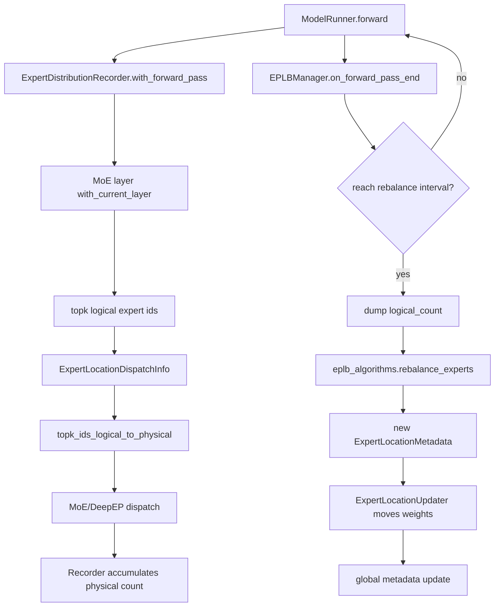
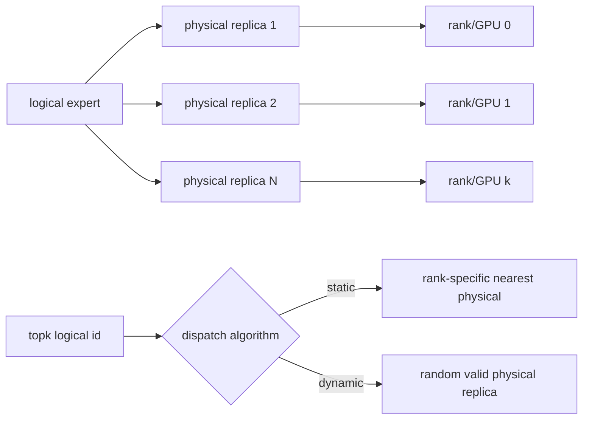

# srt/eplb 源码分析

## 1. 模块定位

`python/sglang/srt/eplb` 实现 Expert Parallel Load Balancing。它在 MoE expert parallel 场景下，根据一段时间内的 expert 命中分布，为热点 logical expert 增加 physical replica，并在运行时更新 expert 权重位置与 dispatch 映射。

EPLB 不是单独调度器，而是嵌入以下路径的一组运行时机制：

- `ModelRunner.forward()`
- MoE topk 选择
- DeepEP/Mooncake/NIXL dispatcher
- Elastic EP 故障恢复
- 专家权重加载与迁移

## 2. 目录结构

```text
python/sglang/srt/eplb/
├── eplb_algorithms/
│   ├── __init__.py
│   ├── deepseek.py
│   ├── deepseek_vec.py
│   └── elasticity_aware.py
├── eplb_manager.py
├── eplb_simulator/
│   └── reader.py
├── expert_distribution.py
├── expert_location.py
├── expert_location_dispatch.py
└── expert_location_updater.py
```

关键文件：

- [eplb_manager.py](/mnt/shanhai-ai/shanhai-workspace/zhouhao6/sglang/python/sglang/srt/eplb/eplb_manager.py)：`EPLBManager`，周期性触发重平衡。
- [expert_distribution.py](/mnt/shanhai-ai/shanhai-workspace/zhouhao6/sglang/python/sglang/srt/eplb/expert_distribution.py)：expert 分布记录、统计窗口、metrics、dump。
- [expert_location.py](/mnt/shanhai-ai/shanhai-workspace/zhouhao6/sglang/python/sglang/srt/eplb/expert_location.py)：`ExpertLocationMetadata`，逻辑/物理 expert 映射中心。
- [expert_location_dispatch.py](/mnt/shanhai-ai/shanhai-workspace/zhouhao6/sglang/python/sglang/srt/eplb/expert_location_dispatch.py)：topk logical expert id 到 physical expert id 的转换。
- [expert_location_updater.py](/mnt/shanhai-ai/shanhai-workspace/zhouhao6/sglang/python/sglang/srt/eplb/expert_location_updater.py)：运行时搬迁 expert 权重。
- `eplb_algorithms/`：`deepseek`、`deepseek_vec`、`elasticity_aware` 算法族。

## 3. 运行主链路



主流程：

1. `ModelRunner.initialize()` 初始化全局 `ExpertLocationMetadata` 和 `ExpertDistributionRecorder`。
2. `ModelRunner.forward()` 用 `with_forward_pass()` 包裹一次 forward。
3. MoE topk 完成后调用 `topk_ids_logical_to_physical()`，再调用 `on_select_experts()` 记录分布。
4. `EPLBManager.on_forward_pass_end()` 每次 forward 后推进生成器。
5. 达到 `eplb_rebalance_num_iterations` 后 dump 统计、计算新映射、更新权重。
6. `ModelRunner.update_expert_location()` 调用 `ExpertLocationUpdater` 搬权重。
7. Elastic EP 下缺失 expert 会从 DRAM backup 或磁盘补载。

## 4. 核心算法

统一入口是 `eplb_algorithms.__init__.py` 的 `rebalance_experts()`。

输入主要是 `tokens_per_expert`，输出：

- `physical_to_logical_map`：每层每个 physical slot 对应哪个 logical expert。
- `logical_to_physical_map`：每层每个 logical expert 有哪些 physical replica。
- `expert_count`：每个 logical expert 的 replica 数。

### 4.1 deepseek

`deepseek` 算法先把历史窗口按 step 求和，做静态负载均衡。

层次化版本：

1. 按 group 把 logical experts 打包到 node。
2. 在 node 内复制热点 expert。
3. 把 physical experts 打包到 GPU。

非层次化版本退化为全局单 node/group 策略。

### 4.2 deepseek_vec

`deepseek_vec` 保留 step 维度，适合更细粒度历史窗口。

`make_redundant_experts_chunkwise()` 在每个 chunk 内逐个分配冗余 expert：每次选择“新增一个 replica 后能最大降低峰值负载”的 logical expert，并在本地 physical experts 之间重新排序。

### 4.3 elasticity_aware

`elasticity_aware` 在 rank 失效时只对 active ranks 重新平衡。

如果 active rank 少于总 GPU：

1. 先按 active rank 数生成较小映射。
2. 再把 inactive rank 的 physical expert slot 插回占位。

该算法主要配合 Elastic EP 使用。

## 5. EPLBManager

`EPLBManager` 是在线重平衡控制器。

关键规则：

- 初始化时要求 `eplb_rebalance_num_iterations >= expert_distribution_recorder_buffer_size`，否则 circular buffer 可能混入旧统计。
- 自动启动 recorder。
- 用生成器串起“等待 N 次 forward”和“分 chunk 更新层”。
- `eplb_rebalance_layers_per_chunk` 非空时，每次只更新部分 MoE 层，降低单次 forward 后抖动。
- `eplb_min_rebalancing_utilization_threshold` 可根据窗口平均 GPU balancedness 跳过重平衡。

默认阈值 `1.0` 基本等于总是允许重平衡。

## 6. Expert Location Metadata

`ExpertLocationMetadata` 是 EPLB 的状态核心：

- `physical_to_logical_map`：`[layers, num_physical_experts]`。
- `logical_to_all_physical_map`：`[layers, num_logical_experts, X]`，用 `-1` padding。
- `logical_to_all_physical_map_num_valid`：每个 logical expert 有效 replica 数。
- `logical_to_rank_dispatch_physical_map`：static dispatch 时，每个 rank 对每个 logical expert 选定哪个 physical expert。

初始化来源：

- `trivial`
- 显式 `physical_to_logical_map`
- 基于 `logical_count` 直接跑 EPLB

模型要支持 EPLB，需要实现 `get_model_config_for_expert_location()`，返回 `ModelConfigForExpertLocation(num_layers, num_logical_experts, num_groups)`。

## 7. Dispatch 关系

`ExpertLocationDispatchInfo.init_new(layer_id)` 从全局 metadata 截出单层映射，MoE 层在 topk 时传入该对象。



dispatch 算法：

- `static`：用 `logical_to_rank_dispatch_physical_map[topk_ids]`，偏向本 GPU、本节点，否则公平随机。
- `dynamic/fake`：每次从该 logical expert 的全部 physical replicas 中随机选一个。

注意：`expert_location_dispatch.py` 的类型注解写的是 `Literal["static", "random"]`，但实际 server args 和分支是 `static/dynamic/fake`，这是类型与实现一致性风险。

## 8. 权重迁移

`ExpertLocationUpdater.update()` 先按新旧 mapping 搬迁 `model.routed_experts_weights_of_layer`，再原地更新全局 metadata。

单层迁移分五类：

- unchanged：目标 slot logical expert 未变。
- same-gpu：本 GPU 另一个 slot 已有该 expert，先拷到 temp buffer。
- free-rider：当前层前面的目标 slot 已持有同一 expert，可复用。
- same-node：同节点 rank 间 P2P。
- cross-node：跨节点 P2P。

P2P 使用 `torch.distributed.batch_isend_irecv()`，按 logical expert id 排序执行。Elastic EP 会过滤 inactive peer；如果 recv 需要的源 rank 不可用，会记录 missing logical experts，后续由 backup 或磁盘补载。

## 9. 与 Elastic EP / ModelRunner / MoE Layers 的关系

- `ServerArgs._handle_elastic_ep()` 在开启 Elastic EP 且开启 EPLB 时，把 `auto` 算法改成 `elasticity_aware`，并限制算法只能是 elasticity-aware 系列。
- `ModelRunner.forward()` 检测 active ranks 变化时，会立即触发一次 `eplb_manager.rebalance()`，然后重新跑一次 forward。
- 缺失 expert 权重由 `expert_backup_client` 或磁盘热加载恢复。
- MoE 层需要构造 `ExpertLocationDispatchInfo` 并传入 topk。
- MoE 层还需要在上下文里调用 recorder 的 `with_current_layer()`。

## 10. 配置与环境变量

主要 CLI：

- `--enable-eplb`
- `--ep-num-redundant-experts`
- `--ep-dispatch-algorithm static|dynamic|fake`
- `--init-expert-location trivial|json|pt|inline-json`
- `--eplb-algorithm auto|deepseek|deepseek_hierarchical|deepseek_vec|deepseek_vec_hierarchical|elasticity_aware|elasticity_aware_hierarchical`
- `--eplb-rebalance-num-iterations`
- `--eplb-rebalance-layers-per-chunk`
- `--eplb-min-rebalancing-utilization-threshold`
- `--expert-distribution-recorder-mode stat|stat_approx|per_pass|per_token`
- `--expert-distribution-recorder-buffer-size`
- `--enable-expert-distribution-metrics`

自动补全：

- 开启 EPLB 会自动设 recorder mode 为 `stat`。
- 开启 EPLB 或自定义初始位置时，若未指定 dispatch algorithm，会默认 `static`。
- 开启 expert distribution metrics 也会默认启用 `stat` recorder。

环境变量：

- `SGLANG_EXPERT_LOCATION_UPDATER_LOG_INPUT`
- `SGLANG_EXPERT_LOCATION_UPDATER_CANARY`
- `SGLANG_EXPERT_LOCATION_UPDATER_LOG_METRICS`
- `SGLANG_LOG_EXPERT_LOCATION_METADATA`
- `SGLANG_EXPERT_DISTRIBUTION_RECORDER_DIR`
- `SGLANG_EPLB_HEATMAP_COLLECTION_INTERVAL`
- `SGLANG_ENABLE_EPLB_BALANCEDNESS_METRIC`

## 11. 扩展点

- 新算法：在 `eplb_algorithms/__init__.py` 增加 enum 和分支，保持返回三元组 shape。
- 新模型：实现 `get_model_config_for_expert_location()`，并确保 MoE 层传 `ExpertLocationDispatchInfo`、记录 `with_current_layer()`。
- 新 dispatcher/backend：在 expert distribution gatherer 中增加来源处理。
- 新权重布局：模型需维护 `routed_experts_weights_of_layer`；elastic fallback 最好实现 `generate_weight_name_filter()`。
- 新观测：扩展 `ExpertDistributionMetrics`、`ExpertDispatchCollector`、heatmap collection。

## 12. 风险与排障

- `num_physical_experts = num_logical_experts + ep_num_redundant_experts` 必须能整除 `ep_size`。
- 模型未实现 `get_model_config_for_expert_location()` 时，metadata 为 `None`，启用 recorder 会断言失败。
- `stat_approx` 目前只支持 `moe_a2a_backend != none` 且 `deepep_mode == normal`。
- `per_token` gatherer 不支持 TBO，且 `_TOP_K_NUM = 8` 有模型假设。
- `dynamic` dispatch 有随机性，复现和图捕获需谨慎。
- `static` dispatch 依赖全 rank 同步 metadata，否则 routing/权重会错配。
- P2P 更新依赖 rank 拓扑和 active rank 状态；可用 `SGLANG_EXPERT_LOCATION_UPDATER_CANARY=1` 校验迁移。
- `eplb_rebalance_num_iterations` 小于 recorder buffer 会直接断言。
- 层分 chunk 会让不同层在一段时间内处于新旧位置混合状态，metadata 更新必须按层原子化。

