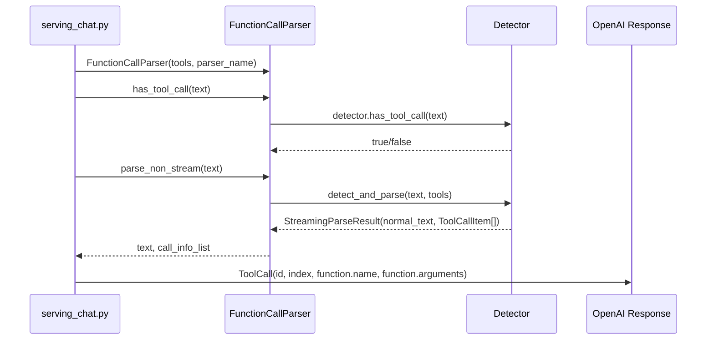
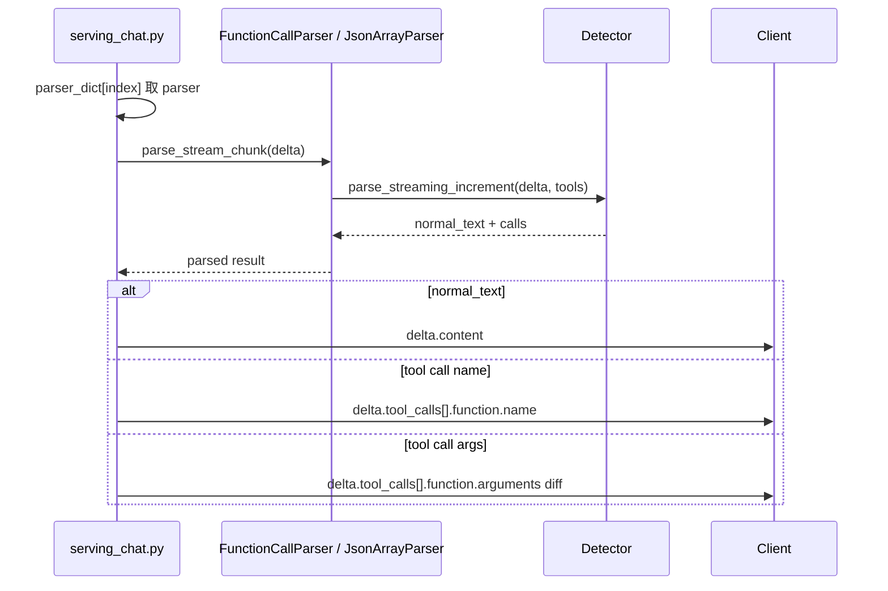
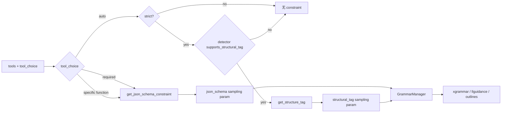

# srt/function_call 源码分析

## 1. 模块定位

`python/sglang/srt/function_call` 是 SRT OpenAI Chat tool/function call 的格式适配层。

它不执行工具，也不负责 chat template 本身。核心职责是：

1. 将模型输出的各类工具调用私有格式解析成 OpenAI 协议里的 `tool_calls`。
2. 在合适场景为解码生成 constrained decoding 约束，例如 `json_schema` 或 `structural_tag`。

主入口：

- [function_call_parser.py](/mnt/shanhai-ai/shanhai-workspace/zhouhao6/sglang/python/sglang/srt/function_call/function_call_parser.py)
- OpenAI serving 调用点：[serving_chat.py](/mnt/shanhai-ai/shanhai-workspace/zhouhao6/sglang/python/sglang/srt/entrypoints/openai/serving_chat.py)

## 2. 目录结构

核心文件：

- [function_call_parser.py](/mnt/shanhai-ai/shanhai-workspace/zhouhao6/sglang/python/sglang/srt/function_call/function_call_parser.py)：parser 注册表、统一入口、约束生成。
- [base_format_detector.py](/mnt/shanhai-ai/shanhai-workspace/zhouhao6/sglang/python/sglang/srt/function_call/base_format_detector.py)：detector 抽象基类和 JSON 增量解析状态机。
- [core_types.py](/mnt/shanhai-ai/shanhai-workspace/zhouhao6/sglang/python/sglang/srt/function_call/core_types.py)：`ToolCallItem`、`StreamingParseResult`、`StructureInfo`。
- [utils.py](/mnt/shanhai-ai/shanhai-workspace/zhouhao6/sglang/python/sglang/srt/function_call/utils.py)：partial JSON、JSON Schema constraint、schema defs 合并。
- [json_array_parser.py](/mnt/shanhai-ai/shanhai-workspace/zhouhao6/sglang/python/sglang/srt/function_call/json_array_parser.py)：required/specific function 的流式 JSON array parser。

模型格式 detector 包括 Qwen、DeepSeek、Mistral、Hermes、GLM、GPT-OSS、Kimi-K2、Pythonic、Llama、MiMo、LFM2、Step、Trinity、GigaChat、InternLM、Minimax 等。

## 3. 核心类型

- `ToolCallItem`：function_call 层的中间表示，包含 `tool_index`、`name`、`parameters`，最终由 serving 层转成 OpenAI `ToolCall`。
- `StreamingParseResult`：流式/非流式 detector 返回结构，包含 `normal_text` 和 `calls`。
- `StructureInfo`：包含 `begin`、`end`、`trigger`，为 structural tag constrained decoding 提供格式边界。
- `BaseFormatDetector`：维护流式状态，统一处理 `parameters` / `arguments` 字段、工具名校验、partial JSON 解析、参数 diff。
- `FunctionCallParser`：按 parser 名称选择 detector，提供 `parse_non_stream()`、`parse_stream_chunk()`、`get_structure_constraint()`。
- `JsonArrayParser`：专供 JSON Schema constrained output 的流式解析。

## 4. 解析流程

### 4.1 非流式



流程：

1. `_validate_request()` 校验 tools、tool_choice、JSON Schema。
2. 生成完成后 `_process_tool_calls()` 处理输出。
3. `tool_choice="required"` 或指定函数时，期望模型直接输出 JSON array，使用 `orjson.loads(text)`。
4. 否则构造 `FunctionCallParser(tools, tool_call_parser)`。
5. detector 返回普通文本和 `ToolCallItem` 列表。
6. serving 层包装成 OpenAI `tool_calls`。

### 4.2 流式



serving 层维护 `parser_dict[index]`，每个 choice 一个 parser，避免增量状态混在一起。典型流式语义是先发送 tool name，再逐步发送 arguments JSON 字符串 diff。

## 5. 约束生成



请求进入 `_process_messages()` 时，如果有 tools 且 `tool_choice != "none"`：

1. 设置 `skip_special_tokens = False`。
2. 将工具 schema 传给 chat template。
3. 如果配置 `--tool-call-parser`，创建 `FunctionCallParser`。
4. 调 `get_structure_constraint()` 生成工具调用约束。
5. 对 required 或指定函数，serving 层直接覆盖为 `json_schema` constraint。

约束类型：

- auto + strict：如果 detector 支持 structural tag，生成 `structural_tag`。
- required / 指定函数：生成 JSON Schema，根类型为 array，`minItems=1`。
- `parallel_tool_calls=False` 时加 `maxItems=1`。
- required 多工具时用 `anyOf`。
- 多工具 `$defs` 冲突会抛 `ValueError`。

function_call 只生成约束描述，真正编译和执行约束的是 constrained 子系统。

## 6. Detector 格式

常见 detector：

- Qwen/Hermes：`<tool_call>{...}</tool_call>` 风格，支持 structural tag。
- Mistral：`[TOOL_CALLS] [...]` 或 `[TOOL_CALLS]tool_name[ARGS]{...}`。
- DeepSeek v3/v3.1/v3.2：特殊 token 或 DSML function call。
- GPT-OSS：依赖 Harmony parser。
- Pythonic：Python 函数调用列表，用 `ast.parse()`，不支持 structural tag。
- Qwen3 Coder、GLM、LFM2、MiMo、Step：多为 XML-ish 或自定义状态机，不一定支持 structural tag。
- Kimi-K2：tool call id 有特殊规则。

## 7. 与 OpenAI protocol / constrained / parser 的关系

OpenAI protocol 定义：

- `Function`
- `Tool`
- `ToolChoice`
- `ToolCall`
- `FunctionResponse`
- `ChatCompletionRequest`

默认规则：

- 无 tools 时 `tool_choice` 归一为 `"none"`。
- 有 tools 且未指定时归一为 `"auto"`。

与 constrained 的链路：

```text
FunctionCallParser.get_structure_constraint()
-> ("json_schema", schema) 或 ("structural_tag", tag)
-> ChatCompletionRequest.to_sampling_params()
-> SamplingParams.json_schema / structural_tag
-> GrammarManager.process_req_with_grammar()
-> grammar backend compile
-> decode 时按 grammar mask logits
```

与 parser 的边界：

- `function_call_parser.py` 是 tool call parser。
- `parser/reasoning_parser.py` 解析 reasoning content。
- `parser/harmony_parser.py` 被 GPT-OSS detector 使用。
- `template_manager.py` 管理 chat template，不负责响应解析。

## 8. 配置与环境变量

CLI：

- `--tool-call-parser`
- `--grammar-backend`
- `--constrained-json-whitespace-pattern`
- `--constrained-json-disable-any-whitespace`

环境变量：

- `SGLANG_TOOL_STRICT_LEVEL`
  - `OFF=0`
  - `FUNCTION=1`
  - `PARAMETER=2`
- `SGLANG_FORWARD_UNKNOWN_TOOLS`
  - false：未知工具跳过。
  - true：保留未知工具。

请求级：

- `tools`
- `tool_choice`: `"none"`、`"auto"`、`"required"`、指定 function。
- `parallel_tool_calls`

## 9. 扩展点

新增 tool parser：

1. 新增 detector 文件。
2. 继承 `BaseFormatDetector`。
3. 实现 `has_tool_call()`、`detect_and_parse()`、`parse_streaming_increment()`。
4. 如支持 structural tag，实现 `structure_info()`。
5. 如不支持 structural tag，覆盖 `supports_structural_tag()` 返回 false。
6. 在 `FunctionCallParser.ToolCallParserEnum` 注册。
7. 确认 chat template 输出格式匹配。
8. 补充非流式、流式、多工具、unknown tool、strict schema 测试。

## 10. 风险与排障

- `--tool-call-parser` 与模型 chat template 不匹配时，最终会返回普通 content。
- `skip_special_tokens` 错误为 true 时，特殊 tool tag 可能被剥掉。
- required / 指定函数路径期望 JSON array，模型输出原生 tag 会解析失败。
- auto 不 strict 时主要依赖模型自发输出格式。
- structural tag 不支持 Pythonic/XML-ish 参数语法。
- 未知工具默认跳过并 warning。
- 多工具 `$defs` 名称相同但 schema 不同会抛错。
- response_format/regex/ebnf/json_schema 与 tool constraint 冲突时 protocol 层只 warning。
- grammar backend 为 `none` 时 required/strict tool call 会 abort。
- Outlines 不支持 structural tag，strict auto tool call 建议使用 xgrammar 或 llguidance。
- GPT-OSS 需同时排查 Harmony parser 和 detokenizer。

