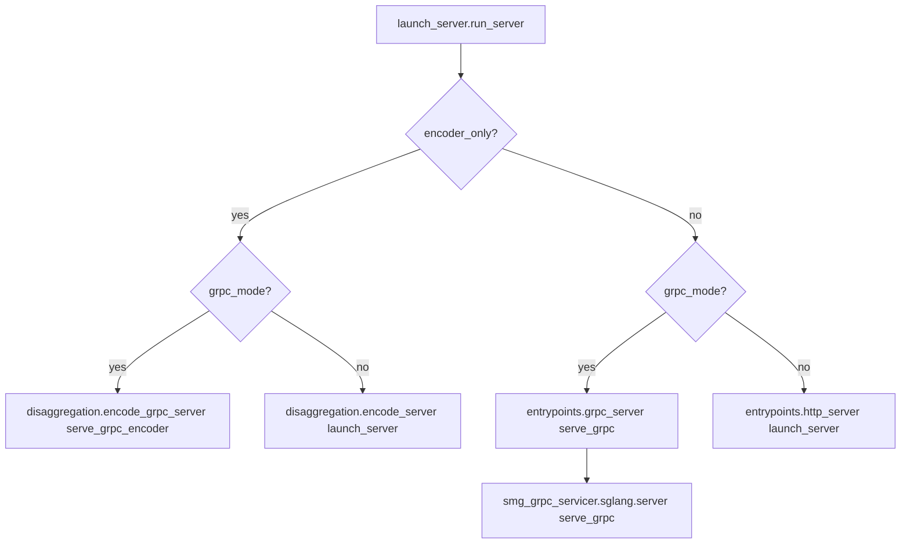
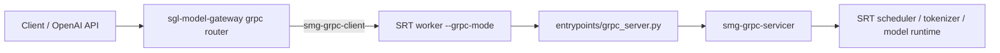
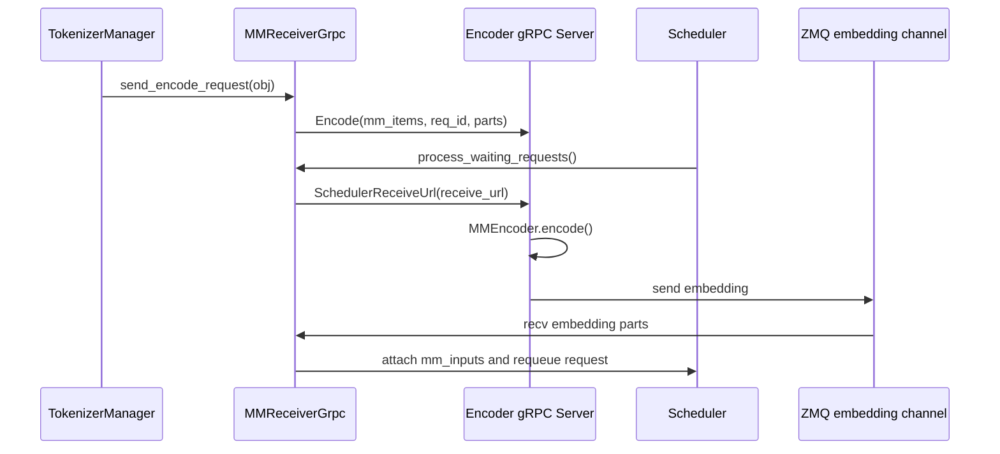
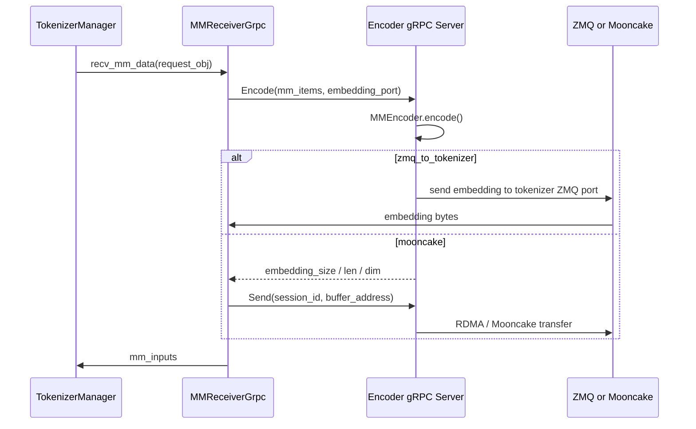

# srt/grpc 源码分析

## 1. 当前结论

`python/sglang/srt/grpc` 当前不是实际 gRPC 实现目录，而是一个占位包。目录内只有 `__init__.py`，内容仅为占位注释。

SRT gRPC 能力实际分成两条路径：

1. 普通推理 gRPC server：由 [entrypoints/grpc_server.py](/mnt/shanhai-ai/shanhai-workspace/zhouhao6/sglang/python/sglang/srt/entrypoints/grpc_server.py) 作为薄封装，委托外部包 `smg_grpc_servicer.sglang.server.serve_grpc`。
2. Encoder disaggregation gRPC：由 [disaggregation/encode_grpc_server.py](/mnt/shanhai-ai/shanhai-workspace/zhouhao6/sglang/python/sglang/srt/disaggregation/encode_grpc_server.py) 和 [disaggregation/encode_receiver.py](/mnt/shanhai-ai/shanhai-workspace/zhouhao6/sglang/python/sglang/srt/disaggregation/encode_receiver.py) 在本仓库内实现，用于多模态 encoder-only 服务。

因此，`srt/grpc` 文档不应把该目录写成完整实现模块。更准确的边界是：gRPC 相关入口与实现散落在 entrypoints、disaggregation，以及外部 smg-grpc 包中；`srt/grpc` 只是命名空间占位。

## 2. 目录结构

```text
python/sglang/srt/grpc/
└── __init__.py
```

相关文件：

- [launch_server.py](/mnt/shanhai-ai/shanhai-workspace/zhouhao6/sglang/python/sglang/launch_server.py)
- [entrypoints/grpc_server.py](/mnt/shanhai-ai/shanhai-workspace/zhouhao6/sglang/python/sglang/srt/entrypoints/grpc_server.py)
- [disaggregation/encode_grpc_server.py](/mnt/shanhai-ai/shanhai-workspace/zhouhao6/sglang/python/sglang/srt/disaggregation/encode_grpc_server.py)
- [disaggregation/encode_receiver.py](/mnt/shanhai-ai/shanhai-workspace/zhouhao6/sglang/python/sglang/srt/disaggregation/encode_receiver.py)
- [server_args.py](/mnt/shanhai-ai/shanhai-workspace/zhouhao6/sglang/python/sglang/srt/server_args.py)

## 3. 启动分流



`run_server(server_args)` 根据参数选择：

- `encoder_only=True` 且 `grpc_mode=True`：启动 encoder gRPC。
- `encoder_only=False` 且 `grpc_mode=True`：启动普通推理 gRPC，委托外部 `smg-grpc-servicer`。
- 默认：HTTP server。

## 4. 普通推理 gRPC

[entrypoints/grpc_server.py](/mnt/shanhai-ai/shanhai-workspace/zhouhao6/sglang/python/sglang/srt/entrypoints/grpc_server.py) 的 `serve_grpc(server_args, model_info=None)` 只做一件事：导入外部 `smg_grpc_servicer.sglang.server.serve_grpc` 并 `await`。

如果导入失败，会抛出更明确的 ImportError，提示安装 `smg-grpc-servicer[sglang]` 或检查版本。

本仓库内没有普通推理 gRPC 的 Python proto 源文件或 `*_pb2.py` 生成物；这部分由外部 `smg-grpc-servicer` / `smg-grpc-client` 提供。

与 gateway 的关系：



gateway 侧有 Rust gRPC client/router 和 Go bindings 生成物，但 Python SRT 普通 gRPC server 实现不在 `python/sglang/srt/grpc` 下。

## 5. Encoder Disaggregation gRPC

Encoder gRPC server 在本仓库内实现。

### 5.1 Server

`serve_grpc_encoder(server_args)`：

1. 初始化 multiprocessing spawn context、ZMQ context、`PortArgs`、分布式 init method。
2. 当 `tp_size > 1` 时为 rank 1..N 启动 encoder 子进程。
3. 创建主 rank 的 `MMEncoder`。
4. 创建 `grpc.aio.server`，设置 256MB send/receive message limit。
5. 注册 health、encoder service、reflection。
6. 监听 `server_args.host:server_args.port`。

`SGLangEncoderServer` 关键 RPC：

- `Encode()`：接收多模态 item，调用 `MMEncoder.encode()`，再按 transfer backend 返回元数据或直接发送 embedding。
- `Send()`：Mooncake 等路径中，收到 buffer/session metadata 后调用 `encoder.send()`。
- `SchedulerReceiveUrl()`：把 scheduler 接收地址注册给 encoder 侧。

### 5.2 Receiver

`encode_receiver.py` 提供 language-only 侧 receiver：

- `_grpc_target(url)`：接受 `grpc://host:port`，拒绝 `grpcs://`。
- `_grpc_encode_request()`：同步 gRPC client，调用 encoder `Encode`。
- `_grpc_send_request()`：同步 gRPC client，调用 encoder `Send`。
- `MMReceiverGrpc`：把 image items 切成多个 encoder 请求，通过 `asyncio.to_thread()` 并发调用同步 gRPC stub。
- `create_mm_receiver()`：根据 `SGLANG_ENCODER_MM_RECEIVER_MODE` 选择 HTTP 或 gRPC receiver。

当前 gRPC encode 明确只支持 IMAGE modality；非 image 会抛 `NotImplementedError`。

## 6. EPD 数据流

`zmq_to_scheduler`：



`zmq_to_tokenizer` / `mooncake`：



## 7. 配置与环境变量

Server args：

- `--grpc-mode`
- `--encoder-only`
- `--language-only`
- `--encoder-transfer-backend`
- `--encoder-urls`
- `--enable-adaptive-dispatch-to-encoder`

环境变量：

- `SGLANG_ENCODER_GRPC_TIMEOUT_SECS`
- `SGLANG_ENCODER_MM_RECEIVER_MODE`

校验规则：

- `--encoder-only` 与 `--language-only` 互斥。
- `--encoder-only` 不能与 PD `--disaggregation-mode prefill/decode` 同时使用。
- `--language-only` 必须提供至少一个 `--encoder-urls`。
- `SGLANG_ENCODER_MM_RECEIVER_MODE=grpc` 时 `encoder_urls` 不能是 `http://`。
- HTTP mode 下 `encoder_urls` 不能是 `grpc://`。
- `grpcs://` 不支持。

## 8. 扩展点

普通推理 gRPC：

- 新增或修改普通 gRPC API 主要应在 `smg-grpc-servicer` / `smg-grpc-client` 的 proto 与 servicer 实现中完成。
- 本仓库内可扩展启动封装、依赖提示和 launch 参数集成。

Encoder gRPC：

- 新增 encoder RPC：改外部 `smg_grpc_proto` proto，再改 `SGLangEncoderServer`。
- 支持新 modality：扩展 request schema、`Encode()` modality 传递、`MMEncoder.encode()` 参数和多 modality 分片逻辑。
- 新 transfer backend：扩展 `SGLangEncoderServer.Encode()` 分支和 `MMReceiverGrpc.encode()` 接收逻辑。
- 高并发优化：当前同步 stub 每次新建 channel，可考虑 channel 复用或 async client。

## 9. 风险与排障

- `srt/grpc` 是空壳，不要按完整实现目录排查。
- 普通 `--grpc-mode` 依赖 `smg-grpc-servicer`，缺包或版本不匹配会在 import 阶段暴露。
- encoder gRPC 依赖 `grpcio`、health/reflection、`smg_grpc_proto`。
- receiver mode 与 URL scheme 必须匹配。
- `grpcs://` 不支持。
- encoder gRPC 只支持 image，音频/视频不要默认套用。
- encoder gRPC server send/receive message limit 为 256MB。
- receiver 使用同步 gRPC client + `asyncio.to_thread()`，高并发下需关注线程池和 channel 创建成本。
- 即使控制面走 gRPC，embedding 数据面常仍依赖 ZMQ 或 Mooncake。
- encoder health 状态粒度有限，未细粒度反映 MMEncoder 内部失败。

