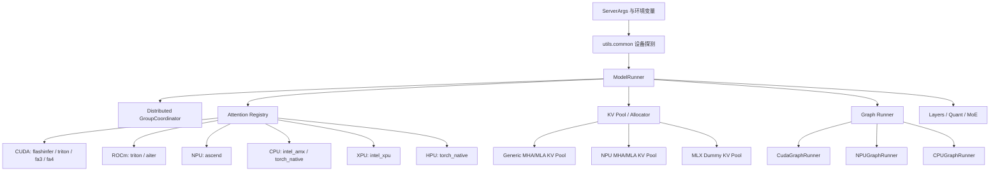
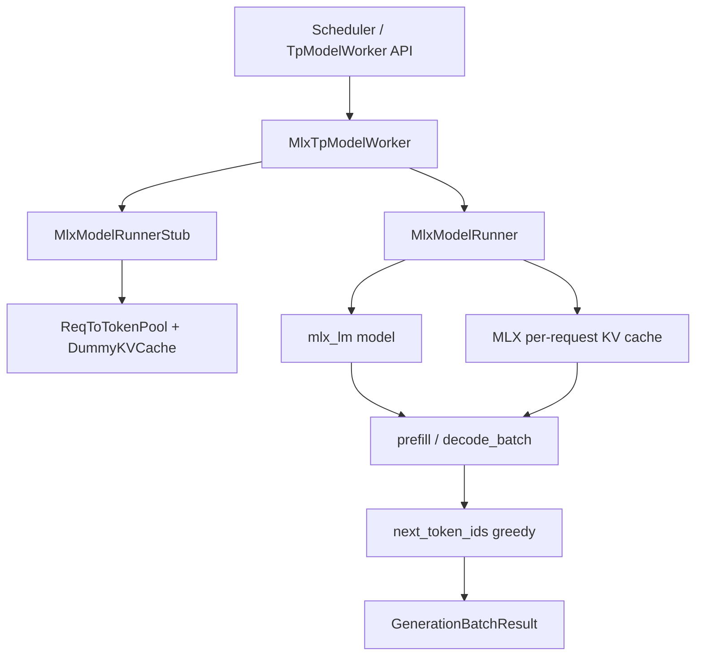
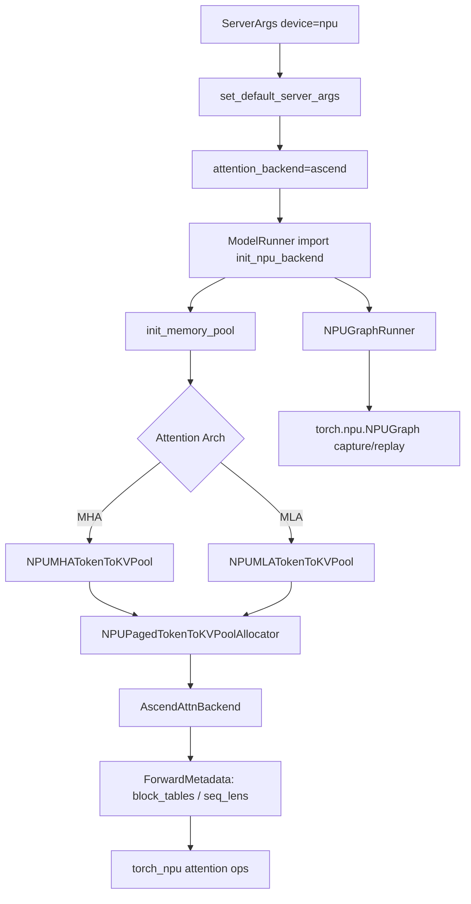

# `python/sglang/srt/hardware_backend` 源码分析

## 1. 模块定位

`hardware_backend` 不是 SRT 的统一硬件抽象层，而是面向少数硬件的专门适配目录。当前源码中最重要的两条路径是：

- `mlx/`：Apple Silicon / MLX 路径，绕开 PyTorch MPS 常规执行链，使用 `mlx_lm` 端到端加载和执行模型。
- `npu/`：Ascend / NPU 路径，深度接入常规 SRT 执行链，提供 Ascend attention、NPU graph、KV cache、allocator、MoE、量化、MLA 预处理等实现。

CUDA、ROCm、XPU、HPU、MUSA、CPU 的适配并不集中在本目录，而是横切分散在 `utils/common.py`、`server_args.py`、`model_executor`、`distributed`、`layers/attention`、`layers/moe`、`layers/quantization` 等模块中。因此理解本目录时需要区分两层：

1. **目录内实现**：MLX 和 NPU 的专门代码。
2. **全局硬件适配机制**：设备探测、ServerArgs 默认值、attention registry、graph runner、KV cache、distributed communicator、layers kernel 分支。

## 2. 目录结构

```text
hardware_backend/
  mlx/
    model_runner.py
    model_runner_stub.py
    tp_worker.py
  npu/
    allocator_npu.py
    cmo.py
    memory_pool_npu.py
    utils.py
    attention/
      ascend_backend.py
      ascend_torch_native_backend.py
      mla_preprocess.py
    graph_runner/
      eagle_draft_extend_npu_graph_runner.py
      eagle_draft_npu_graph_runner.py
      npu_graph_runner.py
      vit_npu_graph_runner.py
    modules/
      deepseek_v2_attention_mla_npu.py
      qwen_vl_processor.py
    moe/
      topk.py
    quantization/
      fused_moe_method_npu.py
      linear_method_npu.py
```

关键源码入口：

- [mlx/model_runner.py](/mnt/shanhai-ai/shanhai-workspace/zhouhao6/sglang/python/sglang/srt/hardware_backend/mlx/model_runner.py)
- [mlx/model_runner_stub.py](/mnt/shanhai-ai/shanhai-workspace/zhouhao6/sglang/python/sglang/srt/hardware_backend/mlx/model_runner_stub.py)
- [mlx/tp_worker.py](/mnt/shanhai-ai/shanhai-workspace/zhouhao6/sglang/python/sglang/srt/hardware_backend/mlx/tp_worker.py)
- [npu/utils.py](/mnt/shanhai-ai/shanhai-workspace/zhouhao6/sglang/python/sglang/srt/hardware_backend/npu/utils.py)
- [npu/attention/ascend_backend.py](/mnt/shanhai-ai/shanhai-workspace/zhouhao6/sglang/python/sglang/srt/hardware_backend/npu/attention/ascend_backend.py)
- [npu/graph_runner/npu_graph_runner.py](/mnt/shanhai-ai/shanhai-workspace/zhouhao6/sglang/python/sglang/srt/hardware_backend/npu/graph_runner/npu_graph_runner.py)
- [npu/memory_pool_npu.py](/mnt/shanhai-ai/shanhai-workspace/zhouhao6/sglang/python/sglang/srt/hardware_backend/npu/memory_pool_npu.py)
- [npu/allocator_npu.py](/mnt/shanhai-ai/shanhai-workspace/zhouhao6/sglang/python/sglang/srt/hardware_backend/npu/allocator_npu.py)

## 3. 横切硬件适配架构

SRT 的硬件适配不是单一接口，而是由多个层次组合：



### 3.1 设备探测

[utils/common.py](/mnt/shanhai-ai/shanhai-workspace/zhouhao6/sglang/python/sglang/srt/utils/common.py) 负责集中判断硬件环境，关键函数包括：

- `is_cuda()` / `is_hip()` / `is_cuda_alike()`
- `is_npu()` / `is_xpu()` / `is_hpu()` / `is_musa()` / `is_mps()` / `is_cpu()`
- `get_device()` / `get_device_count()`
- `get_available_gpu_memory()` / `get_npu_memory_capacity()`
- `get_device_core_count()`
- `get_compiler_backend()`

`get_device()` 的优先级大致为 CPU engine 环境变量、CUDA、XPU、NPU、HPU、MUSA、MPS。上层代码大量通过 `torch.get_device_module(device)` 获取设备模块，避免把执行逻辑写死为 `torch.cuda`。

### 3.2 ServerArgs 默认值

[server_args.py](/mnt/shanhai-ai/shanhai-workspace/zhouhao6/sglang/python/sglang/srt/server_args.py) 根据硬件修正默认后端：

- `_handle_npu_backends()` 调用 `hardware_backend.npu.utils.set_default_server_args()`，默认或强制使用 `ascend` attention。
- `_handle_hpu_backends()` 默认 `attention_backend="torch_native"`、`sampling_backend="pytorch"`。
- `_handle_cpu_backends()` 默认 `attention_backend="intel_amx"`、`sampling_backend="pytorch"`。
- `_handle_xpu_backends()` 禁用 piecewise CUDA graph。
- `_handle_piecewise_cuda_graph()` 在 ROCm、NPU、CPU、MPS、XPU 等非 CUDA 主路径上默认禁用 piecewise CUDA graph。
- `_handle_dllm_inference()` 中 AMD/HIP 使用 `triton` 或 `aiter`，NPU 强制 `ascend`。

### 3.3 Attention registry

[layers/attention/attention_registry.py](/mnt/shanhai-ai/shanhai-workspace/zhouhao6/sglang/python/sglang/srt/layers/attention/attention_registry.py) 通过注册表把字符串配置映射到 attention backend。NPU 的注册点是：

```python
@register_attention_backend("ascend")
def create_ascend_backend(runner):
    from sglang.srt.hardware_backend.npu.attention.ascend_backend import (
        AscendAttnBackend,
    )

    return AscendAttnBackend(runner)
```

这意味着 NPU 不是在 `ModelRunner` 里硬编码构造 attention，而是沿用 SRT 通用的 attention backend 选择机制。

### 3.4 ModelRunner 中心化装配

[model_executor/model_runner.py](/mnt/shanhai-ai/shanhai-workspace/zhouhao6/sglang/python/sglang/srt/model_executor/model_runner.py) 是硬件适配落地的中心：

- import 阶段如果 `is_npu()` 为真，会调用 `init_npu_backend()`。
- 初始化 distributed 后，使用设备模块创建 forward stream。
- `init_attention_backend()` 通过 registry 构造 attention backend。
- `init_device_graphs()` 按设备选择 `CudaGraphRunner`、`CPUGraphRunner` 或 `NPUGraphRunner`。
- KV cache 选择由 [model_runner_kv_cache_mixin.py](/mnt/shanhai-ai/shanhai-workspace/zhouhao6/sglang/python/sglang/srt/model_executor/model_runner_kv_cache_mixin.py) 完成，NPU + `ascend` 会替换为 NPU 专用 KV pool 和 allocator。

## 4. MLX / Apple Silicon 路径

MLX 路径是特殊绕行架构，不复用大部分 PyTorch `ModelRunner` 的真实执行能力。它通过一个 stub 满足 scheduler 需要，再用真实 MLX runner 完成模型推理。



### 4.1 `MlxModelRunner`

[mlx/model_runner.py](/mnt/shanhai-ai/shanhai-workspace/zhouhao6/sglang/python/sglang/srt/hardware_backend/mlx/model_runner.py) 中的 `MlxModelRunner` 负责真实 MLX 推理：

- 使用 `mlx_lm.load()` 加载模型。
- 管理 MLX KV cache，包括 `KVCache`、`RotatingKVCache`、`BatchKVCache`、`BatchRotatingKVCache`。
- 维护 `_request_states`，记录每个请求的 token 与 cache。
- 提供 `prefill()`、`prefill_batch()`、`decode_batch()`、`remove_request()` 等接口。
- 当前采样路径为 greedy，对最后 logits 做 `mx.argmax()`。

这一路径适合 Apple Silicon 上的轻量端到端 MLX 推理，但它不提供常规 SRT logits processor、复杂采样、CUDA graph、attention backend 等能力。

### 4.2 `MlxModelRunnerStub`

[mlx/model_runner_stub.py](/mnt/shanhai-ai/shanhai-workspace/zhouhao6/sglang/python/sglang/srt/hardware_backend/mlx/model_runner_stub.py) 中的 `MlxModelRunnerStub` 继承常规 `ModelRunner`，但覆写加载和初始化：

- 不加载 PyTorch 权重。
- 创建 `_DummyKVCache`，不分配真实 GPU KV cache。
- 只创建 scheduler 所需的 `ReqToTokenPool` 和 `TokenToKVPoolAllocator`。
- `attn_backend=None`、`graph_runner=None`。

它的作用是让上层调度器继续以 `ModelRunner` 风格访问必要字段，同时避免真实 PyTorch runner 初始化。

### 4.3 `MlxTpModelWorker`

[mlx/tp_worker.py](/mnt/shanhai-ai/shanhai-workspace/zhouhao6/sglang/python/sglang/srt/hardware_backend/mlx/tp_worker.py) 中的 `MlxTpModelWorker` 继承 `TpModelWorker`：

- `_init_model_runner()` 同时创建 `MlxModelRunnerStub` 和真实 `MlxModelRunner`。
- `forward_batch_generation()` 把 extend/decode 请求转发给 MLX runner。
- 返回 `GenerationBatchResult`，主要填充 `next_token_ids`。

MLX 当前更像独立执行后端，而不是完全融入 SRT 标准 logits 和 attention 后端体系。

## 5. NPU / Ascend 路径

NPU 是本目录内接入最完整的常规 SRT 后端。它不是绕开 SRT，而是替换常规执行链中的关键组件。



### 5.1 NPU 初始化与默认参数

[npu/utils.py](/mnt/shanhai-ai/shanhai-workspace/zhouhao6/sglang/python/sglang/srt/hardware_backend/npu/utils.py) 是 NPU 路径入口。

`set_default_server_args(args)` 负责修正 NPU 默认行为：

- 设置 `attention_backend="ascend"`。
- 同步设置 `prefill_attention_backend="ascend"` 与 `decode_attention_backend="ascend"`。
- 默认 `page_size=128`。
- 根据 NPU 显存容量调整 `chunked_prefill_size` 和 `cuda_graph_max_bs`。
- 禁用 custom allreduce：`disable_custom_all_reduce=True`。
- hierarchical cache 场景设置 `hicache_io_backend="kernel_ascend"`，并按 MHA/MLA 设置 `hicache_mem_layout`。

`init_npu_backend()` 负责初始化厂商栈：

- 导入 `sgl_kernel_npu`、`torch_npu`、`transfer_to_npu`。
- 导入后重新设置 `torch.cuda.is_available = lambda: False`，避免 NPU 转换包把 CUDA 可用性改为 true。
- 设置 `torch_npu.npu.config.allow_internal_format=True`。
- 设置 `torch_npu.npu.set_compile_mode(jit_compile=False)`。

这个初始化有全局副作用，排查硬件状态时要确认其它模块是否在它之前缓存过 CUDA/NPU 判断结果。

### 5.2 ACL/NZ 权重格式

`npu_format_cast()` 对权重做 Ascend ACL 格式转换，常用目标是 `FRACTAL_NZ`。相关枚举：

- `NPUACLFormat.ACL_FORMAT_ND`
- `NPUACLFormat.ACL_FORMAT_FRACTAL_NZ`

关键约束：

- `SGLANG_NPU_DISABLE_ACL_FORMAT_WEIGHT=1` 可关闭权重格式转换。
- `_is_nz_aligned()` 会检查 BF16、FP16、INT8、INT4、FP4 的 NZ 对齐条件。
- CPU offload 场景无法在 CPU 上完成 ND 到 NZ 转换，源码会 warning，性能可能下降。

### 5.3 Ascend attention

[npu/attention/ascend_backend.py](/mnt/shanhai-ai/shanhai-workspace/zhouhao6/sglang/python/sglang/srt/hardware_backend/npu/attention/ascend_backend.py) 是 NPU attention 主实现。

核心类：

- `ForwardMetadata`：保存 block table、SWA block table、seq lens、actual seq lengths、prefix lens、flatten prefix block tables 等信息，用于普通 forward 和 graph capture/replay。
- `AscendAttnMaskBuilder`：构造普通 mask、FIA mask、MTP mask、mixed chunk mask、ringmla mask。
- `AscendAttnBackend`：继承通用 `AttentionBackend`，根据 `model_config.attention_arch` 区分 MHA/MLA，并接入 hybrid SWA、speculative、DLLM、ALiBi、FIA、MLA、NSA 等路径。

[npu/attention/ascend_torch_native_backend.py](/mnt/shanhai-ai/shanhai-workspace/zhouhao6/sglang/python/sglang/srt/hardware_backend/npu/attention/ascend_torch_native_backend.py) 提供 torch native fallback：

- `run_sdpa_forward_extend()` 和 `run_sdpa_forward_decode()` 从 KV cache 与 `req_to_token` 中逐请求取 K/V。
- 使用 PyTorch `scaled_dot_product_attention()`。
- `support_triton()` 返回 `False`。

[npu/attention/mla_preprocess.py](/mnt/shanhai-ai/shanhai-workspace/zhouhao6/sglang/python/sglang/srt/hardware_backend/npu/attention/mla_preprocess.py) 提供 NPU MLA 权重预处理：

- `NPUFusedMLAPreprocess.transdata()`
- `NPUFusedMLAPreprocess.trans_rope_weight()`
- 受 `SGLANG_NPU_USE_MLAPO` 控制。
- `SGLANG_USE_FIA_NZ` 需要与 `SGLANG_NPU_USE_MLAPO` 配套启用。

### 5.4 NPU graph runner

[npu/graph_runner/npu_graph_runner.py](/mnt/shanhai-ai/shanhai-workspace/zhouhao6/sglang/python/sglang/srt/hardware_backend/npu/graph_runner/npu_graph_runner.py) 中的 `NPUGraphRunner` 继承 `CudaGraphRunner`，但底层使用 NPU graph：

- `_create_device_graph()` 返回 `torch.npu.NPUGraph()`。
- `_capture_graph()` 使用 `torch.npu.graph(..., auto_dispatch_capture=True)`。
- `enable_torch_compile` 时调用 `torch.compile(..., backend=get_compiler_backend("npugraph_ex"))`。
- `replay()` 中会更新 seq lens 等输入后执行 graph replay。
- profiling 使用 `torch_npu.profiler`，目录由 `SGLANG_TORCH_PROFILER_DIR` 控制。

这里大量参数和类名仍带有 `cuda_graph`，这是历史命名复用，并不表示该路径只支持 CUDA。

其它 NPU graph 文件：

- [eagle_draft_npu_graph_runner.py](/mnt/shanhai-ai/shanhai-workspace/zhouhao6/sglang/python/sglang/srt/hardware_backend/npu/graph_runner/eagle_draft_npu_graph_runner.py)：EAGLE draft decode graph。
- [eagle_draft_extend_npu_graph_runner.py](/mnt/shanhai-ai/shanhai-workspace/zhouhao6/sglang/python/sglang/srt/hardware_backend/npu/graph_runner/eagle_draft_extend_npu_graph_runner.py)：EAGLE draft extend graph。
- [vit_npu_graph_runner.py](/mnt/shanhai-ai/shanhai-workspace/zhouhao6/sglang/python/sglang/srt/hardware_backend/npu/graph_runner/vit_npu_graph_runner.py)：视觉模型 graph。

### 5.5 NPU KV cache 与 allocator

[npu/memory_pool_npu.py](/mnt/shanhai-ai/shanhai-workspace/zhouhao6/sglang/python/sglang/srt/hardware_backend/npu/memory_pool_npu.py) 提供 NPU KV pool：

- `NPUMHATokenToKVPool`
  - 继承 `MHATokenToKVPool`。
  - 使用 `(2, layer_num, pages, page_size, head_num, head_dim)` 连续布局。
  - `k_buffer = kv_buffer[0]`，`v_buffer = kv_buffer[1]`。
  - `ASCEND_USE_FIA` 开启时把每层 buffer view 成 FIA 所需布局。
  - `set_kv_buffer()` 在 FIA 路径使用 `torch_npu.npu_scatter_nd_update_()`，普通路径使用 `_npu_reshape_and_cache()`。
  - `get_contiguous_buf_infos()` 支持 disaggregation / KV transfer。
- `NPUMLATokenToKVPool`
  - 对齐 MLA cache layout。
  - 创建 `k_buffer`、`v_buffer`，并在 NSA 场景下可创建 `index_k_buffer`。

[npu/allocator_npu.py](/mnt/shanhai-ai/shanhai-workspace/zhouhao6/sglang/python/sglang/srt/hardware_backend/npu/allocator_npu.py) 中的 `NPUPagedTokenToKVPoolAllocator` 继承通用 paged allocator：

- `alloc_extend()` 小页数时调用 `sgl_kernel_npu.mem_cache.allocator.alloc_extend_kernel`。
- 大页数 fallback 到通用 `alloc_extend_naive()`。
- `alloc_decode()` 按 page 边界判断是否需要新页。
- `free()` 按 page 粒度释放。

接入点在 [model_executor/model_runner_kv_cache_mixin.py](/mnt/shanhai-ai/shanhai-workspace/zhouhao6/sglang/python/sglang/srt/model_executor/model_runner_kv_cache_mixin.py)。当 `server_args.attention_backend == "ascend"` 且模型不是 mambaish：

- hybrid SWA 使用 `SWAKVPool(... token_to_kv_pool_class=NPUMHATokenToKVPool)`。
- MLA 使用 `NPUMLATokenToKVPool`。
- MHA 使用 `NPUMHATokenToKVPool`。
- allocator 使用 `NPUPagedTokenToKVPoolAllocator`。

### 5.6 NPU MoE 与量化

NPU MoE/quantization 位于：

- [npu/moe/topk.py](/mnt/shanhai-ai/shanhai-workspace/zhouhao6/sglang/python/sglang/srt/hardware_backend/npu/moe/topk.py)
- [npu/quantization/linear_method_npu.py](/mnt/shanhai-ai/shanhai-workspace/zhouhao6/sglang/python/sglang/srt/hardware_backend/npu/quantization/linear_method_npu.py)
- [npu/quantization/fused_moe_method_npu.py](/mnt/shanhai-ai/shanhai-workspace/zhouhao6/sglang/python/sglang/srt/hardware_backend/npu/quantization/fused_moe_method_npu.py)

关键实现：

- `NPUW8A8Int8LinearMethod`：load 后转置权重并执行 `npu_format_cast()`，forward 使用 `torch.ops.npu.npu_quantize()` 和 `torch.ops.npu.npu_quant_matmul()`。
- `NPUW8A8Int8DynamicLinearMethod`：activation 通过 `npu_dynamic_quant()` 动态量化后 matmul。
- `NPU_W4A4DynamicLinearMethod`：使用 `npu_convert_weight_to_int4pack()` 和 `torch.quint4x2`。
- `fused_topk_npu()`：优先走 `torch.ops.npu.npu_moe_gating_top_k_softmax()` 或 `npu_moe_gating_top_k()`，不满足条件时 fallback 到通用 `select_experts()`。
- `npu_fused_experts()`、`npu_fused_experts_w4a4()`、`npu_fused_experts_w8a8_decode()`：接入 NPU grouped matmul、routing、finalize routing 等 op。

这些能力还与 `layers/quantization/modelslim`、`layers/quantization/compressed_tensors`、`layers/moe/ep_moe` 中的硬件选择分支配合使用。

## 6. 其它硬件的全局适配点

虽然其它硬件不主要实现在 `hardware_backend`，但理解 SRT 硬件体系需要知道它们的接入位置。

### 6.1 CUDA

CUDA 是默认主路径：

- 设备探测：`is_cuda()`、`is_cuda_alike()`。
- attention：`flashinfer`、`triton`、`fa3`、`fa4`、`flashmla`、`cutlass_mla`、`trtllm_*`。
- graph：[model_executor/cuda_graph_runner.py](/mnt/shanhai-ai/shanhai-workspace/zhouhao6/sglang/python/sglang/srt/model_executor/cuda_graph_runner.py)。
- distributed：PyNccl、custom allreduce、MSCCLPP、torch symmetric memory。
- layers：Triton、FlashInfer、FlashAttention、DeepGEMM、Cutlass、TRT-LLM 等 kernel。

### 6.2 ROCm / AMD HIP

ROCm 通过 `is_hip()` 判断，通常被视为 CUDA-like：

- ROCm FP8 使用 `HIP_FP8_E4M3_FNUZ_MAX=224.0`。
- attention / MoE 可走 `aiter` 或 `triton`。
- 常见环境变量包括 `SGLANG_USE_AITER`、`SGLANG_ROCM_FUSED_DECODE_MLA`、`SGLANG_ROCM_DISABLE_LINEARQUANT`。
- DLLM on HIP 会禁用 CUDA graph，并默认选择 `triton` 或 `aiter`。

### 6.3 XPU

XPU 接入点：

- `is_xpu()` 检查 `torch.xpu.is_available()`。
- `get_device()` 返回 `xpu` 或 `xpu:N`。
- attention registry 注册名为 `intel_xpu`。
- `server_args._handle_xpu_backends()` 禁用 piecewise CUDA graph。
- distributed 中使用 XPU communicator。

### 6.4 HPU / Habana

HPU 接入点：

- `is_hpu()` 检查 `torch.hpu.is_available()`。
- `get_compiler_backend()` 返回 `hpu_backend`。
- ServerArgs 默认 `torch_native` attention 和 PyTorch sampling。
- distributed 中 `GroupCoordinator.all_gather()` 优先使用 HPU communicator。
- HPU memory 查询依赖 `hl-smi`。

### 6.5 MUSA

MUSA 通过 `torchada` / `torch.version.musa` 检测：

- `get_device()` 可返回 `musa`。
- `ModelRunner` 将 `cuda` 和 `musa` 放在相似初始化路径，执行 cublas、attention warmup、graph 等逻辑。
- PyNccl wrapper 和 custom allreduce 中有 MUSA 分支。

### 6.6 CPU

CPU engine 需要 `SGLANG_USE_CPU_ENGINE=1`：

- ServerArgs 默认 `attention_backend="intel_amx"`。
- x86 AMX 通过 `cpu_has_amx_support()` 判断。
- CPU graph 使用 `CPUGraphRunner`，主要与 `torch.compile` 搭配。
- 相关环境变量：`SGLANG_SET_CPU_AFFINITY`、`SGLANG_CPU_QUANTIZATION`、`SGLANG_CPU_OMP_THREADS_BIND`。

## 7. 配置与环境变量

通用硬件变量：

- `SGLANG_USE_CPU_ENGINE`
- `SGLANG_SET_CPU_AFFINITY`
- `SGLANG_CPU_QUANTIZATION`
- `SGLANG_CPU_OMP_THREADS_BIND`
- `SGLANG_USE_MLX`
- `SGLANG_USE_AITER`
- `SGLANG_ROCM_FUSED_DECODE_MLA`
- `SGLANG_ROCM_DISABLE_LINEARQUANT`
- `SGLANG_TORCH_PROFILER_DIR`

NPU 变量：

- `SGLANG_NPU_DISABLE_ACL_FORMAT_WEIGHT`
- `SGLANG_NPU_USE_MULTI_STREAM`
- `SGLANG_NPU_USE_MLAPO`
- `SGLANG_NPU_FORWARD_NATIVE_GELUTANH`
- `SGLANG_NPU_FORWARD_NATIVE_GEMMA_RMS_NORM`
- `SGLANG_USE_AG_AFTER_QLORA`
- `SGLANG_NPU_FUSED_MOE_MODE`
- `ASCEND_USE_FIA`
- `SGLANG_USE_FIA_NZ`
- `ASCEND_NPU_PHY_ID`
- `ENABLE_ASCEND_TRANSFER_WITH_MOONCAKE`
- `DEEPEP_HCCL_BUFFSIZE`
- `HCCL_BUFFSIZE`

Disaggregation / Mooncake 相关变量也会影响硬件路径：

- `SGLANG_MOONCAKE_CUSTOM_MEM_POOL`
- `SGLANG_DISAGG_STAGING_BUFFER`
- `SGLANG_DISAGG_STAGING_BUFFER_SIZE_MB`
- `SGLANG_DISAGG_STAGING_POOL_SIZE_MB`
- `MOONCAKE_DEVICE`
- `MOONCAKE_PROTOCOL`
- `MOONCAKE_GLOBAL_SEGMENT_SIZE`

## 8. 扩展新硬件的建议路径

新增硬件时，不应只在 `hardware_backend` 下放一个目录。更稳妥的接入路径是：

1. 在 `utils/common.py` 增加设备探测、device name、显存、core count、compiler backend 等能力。
2. 在 `server_args.py` 增加默认后端与不兼容选项处理。
3. 在 `layers/attention/attention_registry.py` 注册 attention backend。
4. 如果 KV layout 特殊，实现新的 `TokenToKVPool` 和 `PagedTokenToKVPoolAllocator`，并在 `ModelRunnerKVCacheMixin` 接入。
5. 如果支持 graph capture/replay，实现 graph runner，并在 `ModelRunner.init_device_graphs()` 映射中接入。
6. 在 `distributed/device_communicators` 和 `parallel_state.py` 接入通信器。
7. 在 `layers/linear.py`、`layers/layernorm.py`、`layers/moe`、`layers/quantization` 中补齐 kernel 或 fallback。
8. 在 `environ.py` 中声明 typed env，避免业务代码散落裸 `os.environ.get()`。

## 9. 常见问题与排障

- **NPU 初始化副作用**：`init_npu_backend()` 会在导入 `transfer_to_npu` 后重新 mock `torch.cuda.is_available=False`。如果其它模块提前缓存设备状态，可能出现不一致。
- **NPU attention 被强制为 ascend**：`set_default_server_args()` 会默认或强制设置 `ascend`，排查用户配置未生效时先看 `_handle_npu_backends()`。
- **ACL/NZ 对齐导致性能波动**：权重不满足 NZ 对齐会退回 ND，可用 `SGLANG_NPU_DISABLE_ACL_FORMAT_WEIGHT=1` 做对照排障。
- **CPU offload 与 NPU 格式转换冲突**：NPU 权重在 CPU 上不能做 ND 到 NZ 转换，offload 场景可能明显降速。
- **NPU graph 命名混乱**：代码中很多字段仍叫 `cuda_graph`，但实际可能运行 `torch.npu.NPUGraph()`。
- **NPU graph + torch.compile 依赖 torchair**：`get_compiler_backend()` 在 NPU 上需要 `torchair`，缺失会 ImportError。
- **HPU memory 查询依赖驱动工具**：`hl-smi` 缺失会导致显存查询失败。
- **MLX 能力边界**：当前 MLX runner 是端到端 MLX + greedy sampling，不提供标准 logits 输出与复杂采样链路。
- **distributed backend 混用**：NPU/XPU/mooncake 默认禁用 PyNccl，通信问题需要同时检查 device、group name、HCCL buffer 相关环境变量。

## 10. 阅读路线

1. 先读 [utils/common.py](/mnt/shanhai-ai/shanhai-workspace/zhouhao6/sglang/python/sglang/srt/utils/common.py) 和 [server_args.py](/mnt/shanhai-ai/shanhai-workspace/zhouhao6/sglang/python/sglang/srt/server_args.py)，理解硬件选择和默认配置。
2. 再读 [model_executor/model_runner.py](/mnt/shanhai-ai/shanhai-workspace/zhouhao6/sglang/python/sglang/srt/model_executor/model_runner.py)，确认硬件组件如何被装配。
3. 如果关注 NPU，按 `npu/utils.py`、`npu/attention/ascend_backend.py`、`npu/memory_pool_npu.py`、`npu/graph_runner/npu_graph_runner.py` 的顺序阅读。
4. 如果关注 MLX，按 `mlx/tp_worker.py`、`mlx/model_runner_stub.py`、`mlx/model_runner.py` 的顺序阅读。
5. 最后回到 `layers/attention`、`layers/moe`、`layers/quantization` 和 `distributed/parallel_state.py` 查看横切分支。
