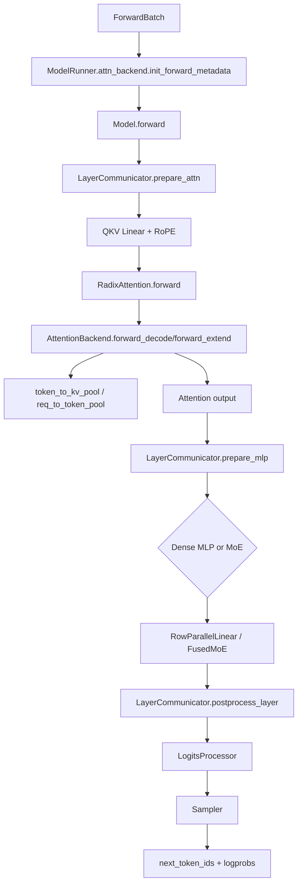
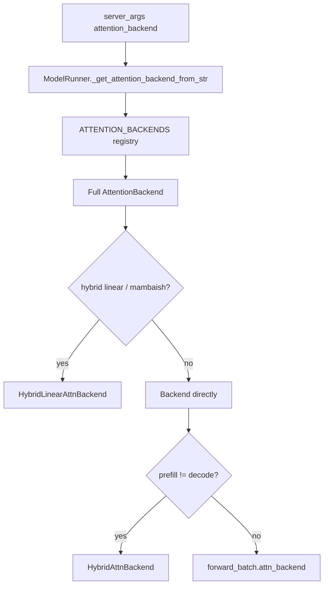
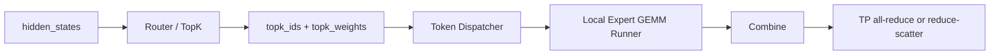

# srt/layers 源码分析

## 1. 模块定位

`python/sglang/srt/layers` 是 SRT 推理执行栈中的层与 kernel 适配层。它不负责请求调度，也不管理完整模型生命周期，而是给 `models/*`、`model_executor/*` 提供可复用 Transformer 组件。

核心能力：

- attention 层入口与多后端 kernel 分派。
- TP/EP/DP aware 的 Linear、Embedding、LM Head。
- MoE 路由、token dispatch/combine、expert GEMM runner。
- RMSNorm/LayerNorm、activation、elementwise fused op。
- quantization config/method 抽象，服务 Linear、MoE、KV cache。
- logits 生成与 sampler。
- DP attention、LayerCommunicator 等跨并行维度通信胶水。

典型调用方是模型文件和 `model_runner.py`。模型组合 `RadixAttention`、`ColumnParallelLinear`、`FusedMoE`、`LogitsProcessor`、`Sampler` 等组件；`ModelRunner` 根据 server args 创建 attention backend、sampler 和 DP attention 状态。

## 2. 目录地图

```text
python/sglang/srt/layers/
├── activation.py
├── communicator.py
├── dp_attention.py
├── layernorm.py
├── linear.py
├── logits_processor.py
├── parameter.py
├── radix_attention.py
├── radix_linear_attention.py
├── sampler.py
├── vocab_parallel_embedding.py
├── attention/
├── moe/
└── quantization/
```

关键文件：

- [radix_attention.py](/mnt/shanhai-ai/shanhai-workspace/zhouhao6/sglang/python/sglang/srt/layers/radix_attention.py)
- [linear.py](/mnt/shanhai-ai/shanhai-workspace/zhouhao6/sglang/python/sglang/srt/layers/linear.py)
- [moe/fused_moe_triton/layer.py](/mnt/shanhai-ai/shanhai-workspace/zhouhao6/sglang/python/sglang/srt/layers/moe/fused_moe_triton/layer.py)
- [logits_processor.py](/mnt/shanhai-ai/shanhai-workspace/zhouhao6/sglang/python/sglang/srt/layers/logits_processor.py)
- [sampler.py](/mnt/shanhai-ai/shanhai-workspace/zhouhao6/sglang/python/sglang/srt/layers/sampler.py)
- [communicator.py](/mnt/shanhai-ai/shanhai-workspace/zhouhao6/sglang/python/sglang/srt/layers/communicator.py)

## 3. 核心运行链路



生成场景主数据流：

1. Scheduler 构造 batch，`ForwardBatch` 携带 KV pool、positions、sampling info、attention backend。
2. `ModelRunner` 初始化 forward metadata。
3. 模型逐层执行：通信准备、QKV/MLP projection、attention、MoE/dense MLP、postprocess。
4. `LogitsProcessor` 把 hidden states 和 LM head 转成 logits/logprobs。
5. `Sampler` 根据 sampling params 选择 next token。

## 4. Attention

`RadixAttention` 是 attention 层 facade：

- 保存 `tp_q_head_num`、`tp_k_head_num`、`head_dim`、`v_head_dim`、`layer_id`、`sliding_window_size`、`logit_cap`、`pos_encoding_mode`、`quant_method`。
- 在 `forward()` 中把 `k/v` reshape 为 `[tokens, kv_heads, head_dim]`。
- 通过 `forward_batch.attn_backend.forward(...)` 转交给后端。
- 在 piecewise CUDA graph extend 模式下走 `unified_attention_with_output()` custom op，便于 torch compile split op。

attention backend 抽象在 `attention/base_attn_backend.py`：

- `init_forward_metadata(forward_batch)`
- `init_cuda_graph_state(...)`
- `init_forward_metadata_capture_cuda_graph(...)`
- `init_forward_metadata_replay_cuda_graph(...)`
- `forward_decode()` / `forward_extend()`
- `get_indexer_metadata()`

backend registry 在 `attention/attention_registry.py`，包含：

- `flashinfer`
- `triton`
- `fa3`
- `fa4`
- `flashmla`
- `cutlass_mla`
- `trtllm_mha`
- `trtllm_mla`
- `aiter`
- `wave`
- `nsa`
- `torch_native`
- `flex_attention`
- `intel_amx`
- `intel_xpu`
- `dual_chunk_flash_attn`
- `ascend`



特殊包装：

- `HybridAttnBackend`：prefill/decode 使用不同 backend。
- `HybridLinearAttnBackend`：混合全 attention 与 linear attention/Mamba/GDN/KDA/Lightning。
- `TboAttnBackend`：two batch overlap 包装 attention backend。
- `NativeSparseAttnBackend`：NSA sparse attention。

## 5. Linear

主文件：[linear.py](/mnt/shanhai-ai/shanhai-workspace/zhouhao6/sglang/python/sglang/srt/layers/linear.py)。

核心类：

- `LinearBase`：保存 input/output size、dtype、`quant_config`，从 quant config 获得 `quant_method`。
- `ReplicatedLinear`：非 TP shard 的普通 linear。
- `ColumnParallelLinear`：按输出维切分权重，常用于 QKV、gate/up projection。
- `MergedColumnParallelLinear`：多个 column projection 融合到一个参数。
- `QKVParallelLinear`：QKV 专用 packed projection，处理 MQA/GQA 下 q/k/v shard 规则。
- `RowParallelLinear`：按输入维切分权重，forward 后通常 all-reduce。
- `MergedColumnParallelRepeatedLinear`、`ColumnParallelBatchedLinear`：特殊 packed/repeated/batched linear 场景。

关键机制：

- Linear 不写死 matmul kernel，而是调用 `quant_method.create_weights()` 创建参数，`quant_method.apply()` 执行。
- `weight_loader` / `weight_loader_v2` 处理 checkpoint shard 到 TP 参数的拷贝、narrow、packed scale、Marlin/BitsAndBytes 特例。
- `RowParallelLinear.forward(..., skip_all_reduce=False)` 与 communicator 的 reduce/all-reduce 策略关联。

## 6. MoE

主层是 `FusedMoE`，位于 `moe/fused_moe_triton/layer.py`。

核心组件：

- `FusedMoE`：维护 expert 权重、EP/TP 切分、runner config、dispatcher、quant method。
- `create_moe_dispatcher()`：根据 `get_moe_a2a_backend()` 选择 token dispatcher。
- `TopK`：expert 选择，支持 standard、grouped、biased grouped、bypassed top-k。
- `FusedMoeRouter` / `fused_moe_router_shim()`：fused router kernel。
- `MoeRunner`：统一 runner 调用。
- `MoeRunnerConfig`、`FusedOpPool`、`PermuteMethodPool`：注册 fused expert 与 permute/post-permute 实现。
- `DeepEPMoE` / `NpuFuseEPMoE` / `MoriEPMoE`：EP MoE 实现。

MoE backend 配置：

- `MoeA2ABackend`: `none`、`deepep`、`mooncake`、`nixl`、`mori`、`ascend_fuseep`、`flashinfer`、`customized`。
- `MoeRunnerBackend`: `auto`、`deep_gemm`、`triton`、`flashinfer_trtllm`、`flashinfer_cutlass`、`cutlass`、`marlin` 等。
- `DeepEPMode`: `auto`、`normal`、`low_latency`。

MoE 数据流：



## 7. Norm 与 Activation

Norm 文件：[layernorm.py](/mnt/shanhai-ai/shanhai-workspace/zhouhao6/sglang/python/sglang/srt/layers/layernorm.py)。

核心类：

- `RMSNorm`
- `LayerNorm`
- `GemmaRMSNorm`
- `Gemma3RMSNorm`

特点：

- 继承 `MultiPlatformOp`，按 CUDA/HIP/NPU/CPU/XPU/native 分派。
- `RMSNorm.forward_with_allreduce_fusion()` 和 `GemmaRMSNorm.forward_with_allreduce_fusion()` 支持 all-reduce + residual + norm 融合。
- `communicator.py` 决定是否走 FlashInfer/AITER all-reduce fusion。

Activation 文件：[activation.py](/mnt/shanhai-ai/shanhai-workspace/zhouhao6/sglang/python/sglang/srt/layers/activation.py)。

核心类/函数：

- `SiluAndMul`
- `GeluAndMul`
- `NewGELU`
- `QuickGELU`
- `XIELU`
- `ScaledActivation`
- `get_act_fn()`

## 8. Quantization

入口：

- [quantization/__init__.py](/mnt/shanhai-ai/shanhai-workspace/zhouhao6/sglang/python/sglang/srt/layers/quantization/__init__.py)
- [quantization/base_config.py](/mnt/shanhai-ai/shanhai-workspace/zhouhao6/sglang/python/sglang/srt/layers/quantization/base_config.py)

抽象：

- `QuantizeMethodBase`
- `LinearMethodBase`
- `FusedMoEMethodBase`
- `QuantizationConfig`

```mermaid
flowchart TD
    A[ModelConfig.quantization / HF quant config] --> B[model_loader quant config]
    B --> C[QuantizationConfig]
    C --> D[get_quant_method(layer, prefix)]
    D --> E[LinearMethodBase]
    D --> F[FusedMoEMethodBase]
    D --> G[Attention/KV quant method]
    E --> H[create_weights + apply]
    F --> I[create_weights + create_moe_runner + apply]
```

常见方法：

- fp8/mxfp8
- blockwise int8
- w8a8 int8/fp8
- awq/gptq/marlin
- bitsandbytes
- gguf
- compressed-tensors
- modelopt fp8/fp4/mixed
- mxfp4/petit nvfp4
- quark/auto-round/modelslim
- MoE 专用 quant

## 9. LogitsProcessor 与 Sampler

`LogitsProcessor`：

- 输入 hidden states 和 `lm_head`。
- 输出 `LogitsProcessorOutput`。
- 支持 next-token logits、input logprobs、top logprobs、multi-item scoring、diffusion full logits、chunked logprobs。

关键开关：

- `enable_dp_lm_head`
- `enable_fp32_lm_head`
- `SGLANG_ENABLE_LOGITS_PROCESSER_CHUNK`
- `SGLANG_LOGITS_PROCESSER_CHUNK_SIZE`
- `multi_item_scoring_delimiter`
- `final_logit_softcapping`

`Sampler`：

- 输入 `next_token_logits`。
- 应用 custom logit processor。
- 可选 NaN 检测。
- greedy 用 argmax。
- 非 greedy 用 temperature、softmax、top-k/top-p/min-p 或 multinomial。
- return logprob 时回填 next token logprobs/top logprobs。
- `SYNC_TOKEN_IDS_ACROSS_TP` 时跨 TP 同步采样结果。

sampler backend：

- `flashinfer`
- `pytorch`
- `ascend`
- 可通过 `register_sampler_backend()` 扩展。

## 10. Communicator 与 DP Attention

`dp_attention.py`：

- 初始化 DP attention rank/size、本地 DP rank/size。
- 管理 DP gather buffer。
- 支持 `DpPaddingMode.MAX_LEN` / `SUM_LEN`。
- 暴露 attention TP/CP group 和 gather/scatter/reduce-scatter 函数。

`communicator.py`：

- `ScatterMode`: `SCATTERED`、`TP_ATTN_FULL`、`FULL`。
- `LayerScatterModes`: 计算 attention/MLP/residual/output layout。
- `LayerCommunicator`: 模型层中的通信封装。
- `CommunicateSimpleFn`、`CommunicateWithAllReduceAndLayerNormFn`、`CommunicateSummableTensorPairFn`：根据 layout 选择通信路径。
- `AttnTpContext`: 支持 `enable_attn_tp_input_scattered` 下延迟 gather。

## 11. 与其他模块的关系

### model_executor

- `ModelRunner.init_attention_backend()` 创建 attention backend。
- `ForwardBatch` 持有 `req_to_token_pool`、`token_to_kv_pool`、`attn_backend`、positions、cache loc。
- 每次 forward 前调用 `attn_backend.init_forward_metadata(forward_batch)`。
- CUDA graph capture/replay 依赖 backend metadata 初始化函数。

### distributed

Linear 使用 TP rank/world size 和 TP all-reduce/all-gather。

MoE 使用 MoE EP/TP/DP rank。

DP attention 使用 attention TP/DP/CP group，与普通 TP group 不完全相同。

### mem_cache

- `ForwardBatch.token_to_kv_pool` 是 attention backend 写入/读取 KV cache 的核心对象。
- `req_to_token_pool` 维护 request 到 token KV location 的映射。
- `out_cache_loc` 是当前输出 token 写入 KV pool 的位置。
- SWA 模式下有 `out_cache_loc_swa`。
- memory pool 方法直接接受 `RadixAttention layer`，根据 layer 信息 set/get KV buffer。

## 12. 配置与环境变量

主要 server args：

- `--attention-backend`
- `--decode-attention-backend`
- `--prefill-attention-backend`
- `--sampling-backend`
- `--quantization`
- `--enable-dp-attention`
- `--enable-dp-lm-head`
- `--attn-cp-size`
- `--moe-a2a-backend`
- `--moe-runner-backend`
- `--deepep-mode`
- `--enable-two-batch-overlap`
- `--enable-single-batch-overlap`
- `--enable-flashinfer-allreduce-fusion`
- `--enable-aiter-allreduce-fusion`
- `--enable-attn-tp-input-scattered`
- `--enable-fp32-lm-head`

环境变量：

- `SGLANG_ROCM_DISABLE_LINEARQUANT`
- `SGLANG_USE_AITER`
- `SYNC_TOKEN_IDS_ACROSS_TP`
- `SGLANG_RETURN_ORIGINAL_LOGPROB`
- `SGLANG_ENABLE_LOGITS_PROCESSER_CHUNK`
- `SGLANG_LOGITS_PROCESSER_CHUNK_SIZE`
- `SGLANG_USE_AG_AFTER_QLORA`
- `SGLANG_USE_ROCM700A`

## 13. 扩展点

- 新 attention backend：在 `attention_registry.py` 注册 factory，并实现 `AttentionBackend` 抽象。
- 新 quantization：新增 `QuantizationConfig` 与 quant method，注册到 `QUANTIZATION_METHODS`。
- 新 Linear 行为：优先通过 quant method 扩展 `create_weights/apply`。
- 新 MoE runner：在 `moe_runner` 注册 fused func、pre/post permute，实现 runner。
- 新 MoE A2A dispatcher：实现 `BaseDispatcher`，接入 `create_moe_dispatcher()` 与 `MoeA2ABackend`。
- 新 sampler：用 `register_sampler_backend()` 注册 factory。
- 新模型：组合 Linear、RadixAttention、FusedMoE、LogitsProcessor，并通过 `prefix` 和 `packed_modules_mapping` 对齐权重加载。

## 14. 风险与排障

- attention backend 与模型类型不匹配会在运行时失败或回退。
- prefill/decode 混合 backend 是实验性路径，遇到不稳定先统一 backend。
- quantization 受 GPU capability、activation dtype、checkpoint quant config 共同约束。
- Linear weight loader 对 packed QKV、gate/up、scale 参数敏感，排查时看 `prefix`、`shard_id`、`packed_modules_mapping`。
- DP attention 会改变 TP group 语义，logits、sampler、communicator 必须使用 attention TP group。
- all-reduce fusion 与 DP attention、CP、FlashInfer/AITER 可用性、batch size 有条件约束。
- MoE backend 与 quantization 强绑定，不同 runner 支持的 quantization 不同。
- DeepEP normal mode、TBO/SBO 会改变通信路径。
- NSA/SWA/Mamba hybrid cache 涉及额外 cache location 转换。
- 跨 TP token 不一致时检查 `SYNC_TOKEN_IDS_ACROSS_TP` 与 DP attention group。
- logits NaN 可通过 `enable_nan_detection` 排查。

