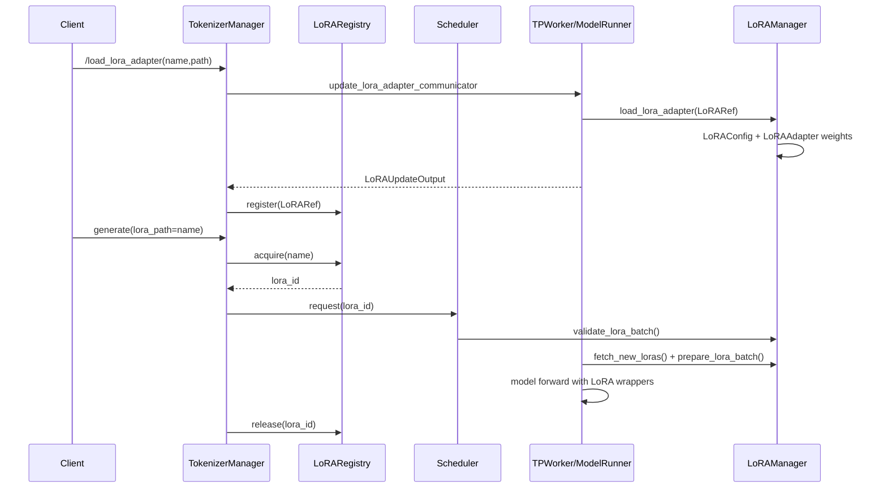
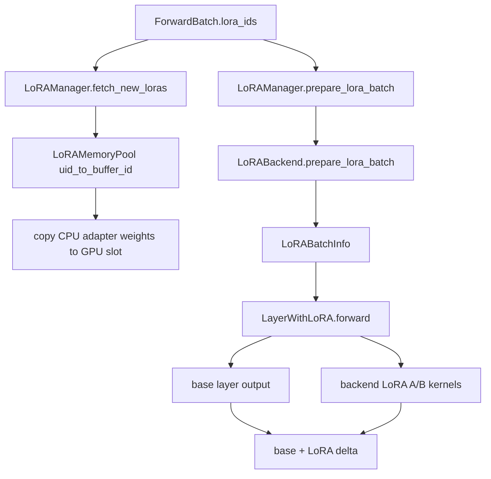

# `python/sglang/srt/lora` 源码分析

## 1. 模块定位

`lora` 是 SRT 的多 LoRA serving 子系统。它把 PEFT LoRA adapter 读入并转换成 SGLang 内部统一格式，在 worker 侧用固定容量 GPU buffer 承载当前 batch 需要的 adapter，再通过 LoRA backend kernel 对同一 batch 内不同请求应用不同 LoRA delta。

整体思路接近 S-LoRA / Punica：

- adapter 权重主要保存在 CPU 侧。
- 每轮调度时，把当前 batch 需要的 adapter 映射到有限数量的 GPU LoRA slot。
- 模型中的 linear、embedding、lm_head、MoE 层被 wrapper 替换。
- forward 时先执行 base layer，再按 token segment 加上对应 adapter 的 LoRA delta。
- MoE 路径较特殊，LoRA delta 插入 gate/up/down projection 的中间计算，而不是在最终输出处统一相加。

关键入口：

- [lora_manager.py](/mnt/shanhai-ai/shanhai-workspace/zhouhao6/sglang/python/sglang/srt/lora/lora_manager.py)
- [lora.py](/mnt/shanhai-ai/shanhai-workspace/zhouhao6/sglang/python/sglang/srt/lora/lora.py)
- [mem_pool.py](/mnt/shanhai-ai/shanhai-workspace/zhouhao6/sglang/python/sglang/srt/lora/mem_pool.py)
- [layers.py](/mnt/shanhai-ai/shanhai-workspace/zhouhao6/sglang/python/sglang/srt/lora/layers.py)
- [backend/base_backend.py](/mnt/shanhai-ai/shanhai-workspace/zhouhao6/sglang/python/sglang/srt/lora/backend/base_backend.py)

## 2. 目录结构

```text
lora/
  backend/
    ascend_backend.py
    base_backend.py
    chunked_backend.py
    lmhead_mixing.py
    lora_registry.py
    torch_backend.py
    triton_backend.py
  torch_ops/
  triton_ops/
  eviction_policy.py
  layers.py
  lora.py
  lora_config.py
  lora_manager.py
  lora_moe_runners.py
  lora_overlap_loader.py
  lora_registry.py
  mem_pool.py
  utils.py
```

职责划分：

- `lora_config.py`：读取 adapter config，形成 `LoRAConfig`。当前不支持 adapter 扩 vocab，`added_tokens.json` 会触发错误。
- `lora.py`：定义 `LoRAAdapter`、`LoRALayer`，加载和归一化 adapter 权重。
- `lora_manager.py`：worker/model runner 侧总控，负责 adapter 加载、模型层替换、memory pool 初始化、batch metadata 准备。
- `mem_pool.py`：GPU LoRA buffer 池、slot 映射、LRU/FIFO 驱逐、TP 切分和 H2D 拷贝。
- `layers.py`：各类 SRT layer 的 LoRA wrapper。
- `lora_registry.py`：TokenizerManager 侧 registry，维护 adapter name 到唯一 `lora_id` 的映射和引用计数。
- `lora_overlap_loader.py`：异步 H2D 加载，使用独立 CUDA stream overlap LoRA buffer 填充与 GPU compute。
- `backend/`：LoRA backend 抽象和具体实现，支持 `csgmv`、`triton`、`ascend`、`torch_native`。

## 3. 生命周期



### 3.1 启动期

[server_args.py](/mnt/shanhai-ai/shanhai-workspace/zhouhao6/sglang/python/sglang/srt/server_args.py) 解析：

- `--enable-lora`
- `--lora-paths`
- `--max-lora-rank`
- `--lora-target-modules`
- `--max-loras-per-batch`
- `--max-loaded-loras`
- `--lora-backend`

如果提供 `--lora-paths` 且没有显式关闭 LoRA，SRT 会自动启用 LoRA。`--lora-paths` 会被规范化为 `LoRARef`。

### 3.2 TokenizerManager 侧 registry

[managers/tokenizer_manager.py](/mnt/shanhai-ai/shanhai-workspace/zhouhao6/sglang/python/sglang/srt/managers/tokenizer_manager.py) 初始化 `LoRARegistry`。registry 是 tokenizer manager 侧的单一事实源：

- `lora_name -> LoRARef`
- `lora_id` 全局唯一，用于请求、prefix cache extra key、worker 侧 adapter 查找。
- `acquire()` / `release()` 用引用计数保护在途请求。
- `unregister()` 阻止新请求继续进入即将卸载的 adapter。

### 3.3 ModelRunner 侧 LoRAManager

[model_executor/model_runner.py](/mnt/shanhai-ai/shanhai-workspace/zhouhao6/sglang/python/sglang/srt/model_executor/model_runner.py) 在 `enable_lora` 时调用 `init_lora_manager()`。

`LoRAManager` 初始化时会：

1. 读取初始 adapter config/weights。
2. 推导或校验 `target_modules`、`max_lora_rank`。
3. 将 base model 中匹配模块替换成 `*WithLoRA` wrapper。
4. 创建 `LoRAMemoryPool`。
5. 初始化 base-only slot，即 `{None}`。

### 3.4 请求期

OpenAI API 可通过 `model="base:adapter"` 或请求字段 `lora_path` 指定 adapter。TokenizerManager 将 adapter name/path 解析成 `lora_id` 后，把 `lora_id` 放入 tokenized 请求。

Scheduler 在调度准入时调用 `lora_manager.validate_lora_batch()`，确保 running batch 中 adapter 数量不会超过 worker 侧 GPU slot 容量。启用 overlap loading 时，会尝试 `LoRAOverlapLoader.try_overlap_load_lora()` 提前搬运权重。

### 3.5 Forward 前准备

[model_executor/forward_batch_info.py](/mnt/shanhai-ai/shanhai-workspace/zhouhao6/sglang/python/sglang/srt/model_executor/forward_batch_info.py) 中的 `ForwardBatch.lora_ids` 承载每个 request 的 adapter ID。非 overlap 模式下，`ForwardBatch.init_new()` 会先：

1. `fetch_new_loras(set(ret.lora_ids))`
2. `prepare_lora_batch(ret)`

随后 layer wrapper forward 时根据 `LoRABatchInfo` 执行对应 adapter 的 LoRA kernel。

## 4. 动态加载与卸载

动态 API 入口位于：

- [entrypoints/http_server.py](/mnt/shanhai-ai/shanhai-workspace/zhouhao6/sglang/python/sglang/srt/entrypoints/http_server.py)：`/load_lora_adapter`、`/load_lora_adapter_from_tensors`、`/unload_lora_adapter`
- [entrypoints/engine.py](/mnt/shanhai-ai/shanhai-workspace/zhouhao6/sglang/python/sglang/srt/entrypoints/engine.py)：Python Engine 同步/异步方法

加载链路：

```text
HTTP / Engine
  -> TokenizerManager.load_lora_adapter()
  -> 生成 LoRARef(lora_id, name, path, pinned)
  -> update_lora_adapter_communicator(obj)
  -> Scheduler.load_lora_adapter()
  -> TPWorker.load_lora_adapter()
  -> ModelRunner.load_lora_adapter()
  -> LoRAManager.load_lora_adapter()
  -> LoRAConfig + LoRAAdapter.initialize_weights()
  -> TokenizerManager 注册到 LoRARegistry
```

卸载链路：

```text
HTTP / Engine
  -> TokenizerManager.unload_lora_adapter()
  -> LoRARegistry.unregister(name)
  -> LoRARegistry.wait_for_unload(lora_id)
  -> update_lora_adapter_communicator(obj)
  -> Scheduler / TPWorker / ModelRunner
  -> LoRAManager.unload_lora_adapter()
  -> 删除 configs / loras / lora_refs
```

注意：`LoRAManager.unload_lora_adapter()` 只删除 CPU metadata 和 adapter cache，不主动清空 GPU pool slot。GPU slot 会在后续 `prepare_lora_batch()` 中按 slot 映射和驱逐策略复用或覆盖。

## 5. Batch 混合推理

核心数据结构是 [utils.py](/mnt/shanhai-ai/shanhai-workspace/zhouhao6/sglang/python/sglang/srt/lora/utils.py) 中的 `LoRABatchInfo`：

- `seg_indptr`：每个 segment 的 token 范围。
- `weight_indices`：每个 segment 使用哪个 LoRA buffer slot。
- `lora_ranks`：每个 slot 的 rank。
- `scalings`：每个 slot 的 scaling。
- `permutation`：chunked backend 重排 token 时使用。
- `expected_tokens`：lm_head LoRA 校验 logits pruning 后 token 数。
- `has_active_lora`：CPU 侧标记，避免 GPU sync。

普通 dense LoRA 公式：

```text
base_output = x @ W
delta = (x @ A^T) @ B^T
output = base_output + delta
```

同一 batch 中不同请求可使用不同 `lora_id`，backend 根据 segment 对不同 token 段选择不同 slot 权重。`None` 表示 base model，无 LoRA；memory pool 会为 `None` slot 写零权重，保证 delta 为零。

worker 内部数据流：



`csgmv` backend 会按 token 数决定 chunk size，把相同 adapter 的 tokens 聚合成 chunk segment，再使用 chunked SGMV shrink/expand kernel。`--max-lora-chunk-size` 限制 chunk 上限。

lm_head LoRA 要与 logits processor 的 hidden pruning 保持同步，`get_lm_head_pruned_lens()` 必须和 [layers/logits_processor.py](/mnt/shanhai-ai/shanhai-workspace/zhouhao6/sglang/python/sglang/srt/layers/logits_processor.py) 的 pruning 逻辑一致。

## 6. 核心类

- `LoRARef`：adapter 引用记录，包含 `lora_id`、`lora_name`、`lora_path`、`pinned`。
- `LoRARegistry`：TokenizerManager 侧 registry，支持 register/unregister/acquire/release/wait_for_unload。
- `LoRAConfig`：从 adapter config 提取 `target_modules`、`r`、`lora_alpha`。
- `LoRAAdapter`：CPU adapter 权重容器，使用 `DefaultModelLoader` 迭代权重，并归一化 module name。
- `LoRAManager`：worker 侧总控，负责加载 adapter、替换模型层、创建 memory pool、准备 batch metadata。
- `LoRAMemoryPool`：GPU LoRA 权重池，维护 `uid_to_buffer_id` 和 `buffer_id_to_uid`，负责 slot 分配、驱逐、TP 切片和权重拷贝。
- `BaseLayerWithLoRA`：基础 wrapper，提供 `set_lora_info()`、`slice_lora_a_weights()`、`slice_lora_b_weights()`。
- `BaseLoRABackend`：backend API，定义 `run_lora_a_sgemm()`、`run_lora_b_sgemm()`、`run_qkv_lora()`、`run_gate_up_lora()`、`prepare_lora_batch()` 等。
- `LoRAOverlapLoader`：独立 CUDA stream 异步加载 LoRA 权重。

## 7. 与其它模块的关系

- `model_executor`：`ModelRunner` 初始化 `LoRAManager`；`ForwardBatch` 携带 `lora_ids`；CUDA graph/profile capture 需要初始化 LoRA batch info。
- `layers`：LoRA wrapper 包装 `ColumnParallelLinear`、`MergedColumnParallelLinear`、`QKVParallelLinear`、`RowParallelLinear`、`VocabParallelEmbedding`、`ParallelLMHead`、`FusedMoE`。
- `model_loader`：`LoRAAdapter.initialize_weights()` 复用 `DefaultModelLoader` 加载 adapter 权重。
- `managers`：TokenizerManager 解析请求与引用计数；Scheduler 校验 batch LoRA 容量；TpWorker 转发管理请求。
- `mem_cache`：LoRA ID 会参与 prefix cache extra key，避免不同 adapter 复用错误 prefix KV。

## 8. 配置与限制

主要 ServerArgs：

- `--enable-lora`
- `--enable-lora-overlap-loading`
- `--max-lora-rank`
- `--lora-target-modules`
- `--lora-paths`
- `--max-loras-per-batch`
- `--max-loaded-loras`
- `--lora-eviction-policy`
- `--lora-backend`
- `--max-lora-chunk-size`
- `--experts-shared-outer-loras` / `--no-experts-shared-outer-loras`

相关环境变量：

- `SGLANG_ENABLE_LOGITS_PROCESSER_CHUNK`
- `SGLANG_LOGITS_PROCESSER_CHUNK_SIZE`
- `SGLANG_USE_AITER`
- `SGLANG_MOE_PADDING`

重要限制：

- 动态 LoRA 加载当前要求 `dp_size == 1`。
- LoRA 只兼容 `NGRAM` speculative decoding 或不开 speculative。
- 无初始 `--lora-paths` 时，必须显式指定 `--max-lora-rank` 和 `--lora-target-modules`。
- added tokens 当前不支持。
- overlap loading 要求 `max_loaded_loras` 不为空且不超过 `2 * max_loras_per_batch`。
- `ServerArgs.lora_backend` 默认是 `csgmv`，不是 `triton`。

## 9. 扩展点

- 新 backend：在 `backend/lora_registry.py` 注册，并实现 `BaseLoRABackend` API。
- 新 layer 类型：在 `layers.py` 增加 wrapper，并加入 `get_lora_layer()` 支持列表。
- 新模型特殊 shape：模型类可实现 `get_hidden_dim()` 和 `should_apply_lora()`。
- 新 target module：同步更新 target module 归一化、hidden dim 推导、memory pool shape 初始化和 layer wrapper。
- 新 eviction 策略：继承 `EvictionPolicy` 并在 `get_eviction_policy()` 注册。
- from tensors 加载：已有 `load_lora_adapter_from_tensors` 链路，可用于远程下发权重。

## 10. 常见问题与排障

- **容量混淆**：`max_loras_per_batch` 是 GPU slot/batch 容量，`max_loaded_loras` 是 registry/CPU adapter 数。
- **pinned starvation**：pinned adapter 不能占满所有 slot，否则 base 或非 pinned 请求无槽可用。
- **added tokens 不支持**：包含新增词表的 adapter 会在 `LoRAConfig` 阶段失败。
- **target module 不匹配**：rank 超过 `--max-lora-rank` 或 target 不在允许集合中，会报 memory pool incompatible。
- **TP + embedding/lm_head OOM**：embedding LoRA 在 TP 下可能复制权重，大 vocab/high rank 风险较高。
- **MoE adapter 格式混用**：shared outer 与 per-expert 格式混用会失败。
- **lm_head pruning 不一致**：`expected_tokens` 与 logits processor pruning 后 token 数不一致会触发错误。
- **动态加载 DP 限制**：当前动态加载 assert `dp_size == 1`。
