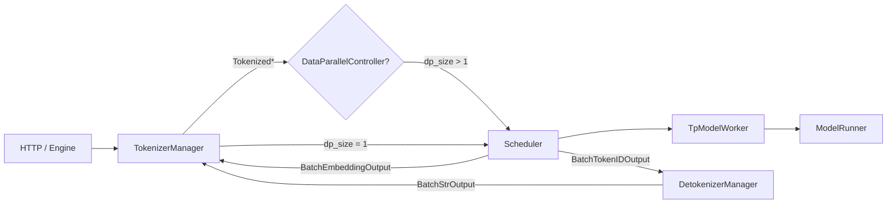
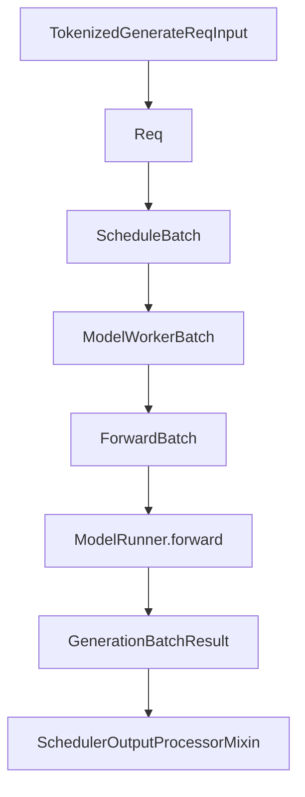
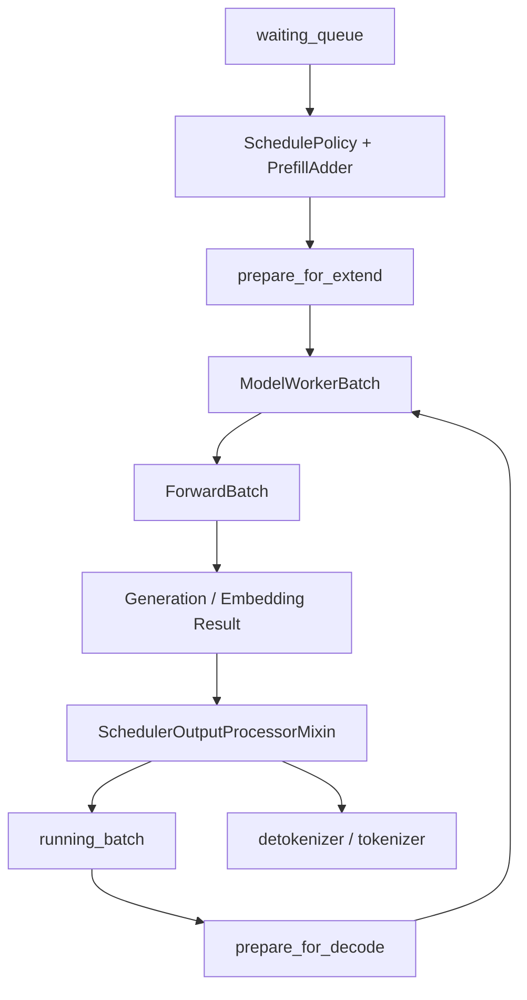

# `python/sglang/srt/managers` 源码分析

## 1. 模块定位

`managers` 是 SRT 的运行时控制平面与请求数据面核心目录。它连接上层 `entrypoints` API/Engine、下层 `model_executor` 模型前向、`mem_cache` KV cache、`disaggregation` PD/EPD 传输，以及 ZMQ / torch.distributed 多进程通信。

核心链路可以概括为：

```text
HTTP/Engine
  -> TokenizerManager
  -> Scheduler 或 DataParallelController
  -> TpModelWorker / ModelRunner
  -> DetokenizerManager
  -> TokenizerManager
  -> API response
```

该目录的复杂性来自一个事实：请求生命周期、批调度、KV cache、LoRA、grammar、speculative decoding、多模态、disaggregation、DP/PP attention、profile、权重更新等能力最终都要汇入 scheduler 主循环。

## 2. 文件结构

```text
managers/
  async_dynamic_batch_tokenizer.py
  cache_controller.py
  configure_logging.py
  data_parallel_controller.py
  detokenizer_manager.py
  disagg_service.py
  hisparse_coordinator.py
  io_struct.py
  mm_utils.py
  multi_tokenizer_mixin.py
  multimodal_processor.py
  overlap_utils.py
  prefill_delayer.py
  schedule_batch.py
  schedule_policy.py
  scheduler.py
  scheduler_dp_attn_mixin.py
  scheduler_input_blocker.py
  scheduler_output_processor_mixin.py
  scheduler_pp_mixin.py
  scheduler_profiler_mixin.py
  scheduler_recv_skipper.py
  scheduler_runtime_checker_mixin.py
  scheduler_update_weights_mixin.py
  session_controller.py
  template_manager.py
  tokenizer_communicator_mixin.py
  tokenizer_manager.py
  tokenizer_manager_score_mixin.py
  tp_worker.py
  utils.py
```

按职责分组：

- **跨进程协议与批结构**：[io_struct.py](/mnt/shanhai-ai/shanhai-workspace/zhouhao6/sglang/python/sglang/srt/managers/io_struct.py)、[schedule_batch.py](/mnt/shanhai-ai/shanhai-workspace/zhouhao6/sglang/python/sglang/srt/managers/schedule_batch.py)
- **前端 token 化与响应聚合**：[tokenizer_manager.py](/mnt/shanhai-ai/shanhai-workspace/zhouhao6/sglang/python/sglang/srt/managers/tokenizer_manager.py)、[tokenizer_communicator_mixin.py](/mnt/shanhai-ai/shanhai-workspace/zhouhao6/sglang/python/sglang/srt/managers/tokenizer_communicator_mixin.py)、[tokenizer_manager_score_mixin.py](/mnt/shanhai-ai/shanhai-workspace/zhouhao6/sglang/python/sglang/srt/managers/tokenizer_manager_score_mixin.py)
- **调度与执行控制**：[scheduler.py](/mnt/shanhai-ai/shanhai-workspace/zhouhao6/sglang/python/sglang/srt/managers/scheduler.py)、[schedule_policy.py](/mnt/shanhai-ai/shanhai-workspace/zhouhao6/sglang/python/sglang/srt/managers/schedule_policy.py)、`scheduler_*_mixin.py`、[prefill_delayer.py](/mnt/shanhai-ai/shanhai-workspace/zhouhao6/sglang/python/sglang/srt/managers/prefill_delayer.py)
- **detokenize**：[detokenizer_manager.py](/mnt/shanhai-ai/shanhai-workspace/zhouhao6/sglang/python/sglang/srt/managers/detokenizer_manager.py)
- **DP 与多 tokenizer**：[data_parallel_controller.py](/mnt/shanhai-ai/shanhai-workspace/zhouhao6/sglang/python/sglang/srt/managers/data_parallel_controller.py)、[multi_tokenizer_mixin.py](/mnt/shanhai-ai/shanhai-workspace/zhouhao6/sglang/python/sglang/srt/managers/multi_tokenizer_mixin.py)
- **KV/HiCache 控制**：[cache_controller.py](/mnt/shanhai-ai/shanhai-workspace/zhouhao6/sglang/python/sglang/srt/managers/cache_controller.py)
- **多模态与模板**：[mm_utils.py](/mnt/shanhai-ai/shanhai-workspace/zhouhao6/sglang/python/sglang/srt/managers/mm_utils.py)、[multimodal_processor.py](/mnt/shanhai-ai/shanhai-workspace/zhouhao6/sglang/python/sglang/srt/managers/multimodal_processor.py)、[template_manager.py](/mnt/shanhai-ai/shanhai-workspace/zhouhao6/sglang/python/sglang/srt/managers/template_manager.py)
- **执行 worker 与辅助**：[tp_worker.py](/mnt/shanhai-ai/shanhai-workspace/zhouhao6/sglang/python/sglang/srt/managers/tp_worker.py)、[overlap_utils.py](/mnt/shanhai-ai/shanhai-workspace/zhouhao6/sglang/python/sglang/srt/managers/overlap_utils.py)、[hisparse_coordinator.py](/mnt/shanhai-ai/shanhai-workspace/zhouhao6/sglang/python/sglang/srt/managers/hisparse_coordinator.py)

## 3. 运行时进程与 IPC

`managers` 通过 `PortArgs` 中的 IPC name 建立 ZMQ 通道。关键通道包括：

- `tokenizer_ipc_name`：scheduler / detokenizer 返回到 tokenizer。
- `scheduler_input_ipc_name`：tokenizer 或 DP controller 发给 scheduler。
- `detokenizer_ipc_name`：scheduler 发给 detokenizer。
- `rpc_ipc_name`：Engine 到 Scheduler 的 RPC。
- `metrics_ipc_name`：scheduler metrics。
- `tokenizer_worker_ipc_name`：多 tokenizer worker 模式。

常见拓扑：



ZMQ socket 形态：

- `TokenizerManager`：`PULL tokenizer_ipc_name`，`PUSH scheduler_input_ipc_name`。
- `Scheduler` rank 入口：`PULL scheduler_input_ipc_name`，`DEALER rpc_ipc_name`，`PUSH tokenizer_ipc_name` 或 `detokenizer_ipc_name`。
- `DetokenizerManager`：`PULL detokenizer_ipc_name`，`PUSH tokenizer_ipc_name`。
- `DataParallelController`：`PULL scheduler_input_ipc_name`，再对每个 DP worker `PUSH`。

内部队列：

- Scheduler：`waiting_queue`、`running_batch`、`cur_batch`、`last_batch`、`result_queue`、grammar queue、disagg prefill/decode queues。
- HiCache：`load_queue`、`write_queue`、`prefetch_queue`、`backup_queue`、ack queues。
- Detokenizer：`LimitedCapacityDict decode_status`，容量由 `SGLANG_DETOKENIZER_MAX_STATES` 控制，默认 `1 << 16`。

## 4. 核心 Manager

### 4.1 TokenizerManager

[tokenizer_manager.py](/mnt/shanhai-ai/shanhai-workspace/zhouhao6/sglang/python/sglang/srt/managers/tokenizer_manager.py) 中的 `TokenizerManager` 运行在主进程，负责把上层 API 请求转换为 scheduler 可消费的 tokenized 请求，并把输出聚合回 async response。

主要职责：

- 请求规范化与参数校验。
- tokenizer、chat template、stop token、prompt logprob 等前处理。
- 多模态预处理与共享内存包装。
- LoRA name/path 解析。
- 维护 `ReqState`，支持流式与非流式响应。
- 控制类 API 转发，如 abort、flush cache、profile、更新权重、加载 LoRA。
- metrics、request dump、crash dump。

关键入口：

- `TokenizerManager.generate_request()`
- `_handle_batch_output()`
- `send_to_scheduler`
- `recv_from_detokenizer`

### 4.2 Scheduler

[scheduler.py](/mnt/shanhai-ai/shanhai-workspace/zhouhao6/sglang/python/sglang/srt/managers/scheduler.py) 是最核心的调度进程。每个 TP/PP/DP rank 都有 scheduler 实例。

主要职责：

- 接收 `TokenizedGenerateReqInput` / `TokenizedEmbeddingReqInput` / 控制请求。
- 构造内部 `Req`。
- 维护 `waiting_queue` 和 `running_batch`。
- 执行 prefill、decode、extend、retract、abort、pause、continue。
- 管理 KV cache、prefix cache、grammar cache、LoRA 生命周期。
- 调用 `TpModelWorker`。
- 处理输出、finish reason、metrics、profile、watchdog。
- 在 disaggregation 模式下管理 bootstrap、prealloc、transfer 队列。

关键方法：

- `event_loop_normal()`
- `recv_requests()`
- `get_next_batch_to_run()`
- `run_batch()`
- `process_input_requests()`

Scheduler 通过 mixin 扩展横切能力：

- [scheduler_output_processor_mixin.py](/mnt/shanhai-ai/shanhai-workspace/zhouhao6/sglang/python/sglang/srt/managers/scheduler_output_processor_mixin.py)：输出处理、finish、cache release。
- [scheduler_update_weights_mixin.py](/mnt/shanhai-ai/shanhai-workspace/zhouhao6/sglang/python/sglang/srt/managers/scheduler_update_weights_mixin.py)：权重更新。
- [scheduler_dp_attn_mixin.py](/mnt/shanhai-ai/shanhai-workspace/zhouhao6/sglang/python/sglang/srt/managers/scheduler_dp_attn_mixin.py)：DP attention。
- [scheduler_pp_mixin.py](/mnt/shanhai-ai/shanhai-workspace/zhouhao6/sglang/python/sglang/srt/managers/scheduler_pp_mixin.py)：pipeline parallel。
- [scheduler_profiler_mixin.py](/mnt/shanhai-ai/shanhai-workspace/zhouhao6/sglang/python/sglang/srt/managers/scheduler_profiler_mixin.py)：profiling。
- [scheduler_runtime_checker_mixin.py](/mnt/shanhai-ai/shanhai-workspace/zhouhao6/sglang/python/sglang/srt/managers/scheduler_runtime_checker_mixin.py)：运行时检查。

### 4.3 DetokenizerManager

[detokenizer_manager.py](/mnt/shanhai-ai/shanhai-workspace/zhouhao6/sglang/python/sglang/srt/managers/detokenizer_manager.py) 接收 scheduler 输出的 `BatchTokenIDOutput`，做增量 detokenize 后返回 `BatchStrOutput`。

核心逻辑：

- 每个请求维护 `DecodeStatus`。
- 处理 Unicode 不完整字符和 stop trim。
- 批量 decode token ids，提高吞吐。
- embedding 输出不需要 detokenize，可直接透传。
- `decode_status` 容量受 `SGLANG_DETOKENIZER_MAX_STATES` 控制。

Detokenizer 是文本流式输出的稳定性边界。若请求状态被逐出，错误会提示增大 `SGLANG_DETOKENIZER_MAX_STATES`。

### 4.4 DataParallelController

[data_parallel_controller.py](/mnt/shanhai-ai/shanhai-workspace/zhouhao6/sglang/python/sglang/srt/managers/data_parallel_controller.py) 在 `dp_size > 1` 时接管 TokenizerManager 到 scheduler 的路由。

支持路由策略：

- `round_robin`
- `follow_bootstrap_room`
- `total_requests`
- `total_tokens`

它还会处理 `WatchLoadUpdateReq`，根据每个 DP worker 的负载更新路由预算。

### 4.5 TpModelWorker

[tp_worker.py](/mnt/shanhai-ai/shanhai-workspace/zhouhao6/sglang/python/sglang/srt/managers/tp_worker.py) 是 scheduler 与 `model_executor` 的边界。

主要职责：

- 将 `ModelWorkerBatch` 转为 `ForwardBatch`。
- 调用 `ModelRunner.forward()`。
- 封装 generation、embedding、idle、profile、memory pool 操作。
- 代理权重更新与 LoRA 加载/卸载。
- 提供 `pad_input_ids` 等模型执行辅助。

它让 scheduler 不需要直接感知模型 runner 的硬件细节。

### 4.6 HiCacheController

[cache_controller.py](/mnt/shanhai-ai/shanhai-workspace/zhouhao6/sglang/python/sglang/srt/managers/cache_controller.py) 管理 GPU、host、storage 三层 KV cache 传输：

- device-host load/write 队列。
- storage prefetch/backup 线程。
- 动态 attach/detach storage backend。
- 与 hierarchical cache、disaggregation、HiRadixCache 协同。

## 5. 跨进程协议：`io_struct.py`

[io_struct.py](/mnt/shanhai-ai/shanhai-workspace/zhouhao6/sglang/python/sglang/srt/managers/io_struct.py) 是 managers 的协议中心。多数请求/响应继承 `BaseReq` 或 `BaseBatchReq`。

关键类型：

- API 输入：`GenerateReqInput`、`EmbeddingReqInput`
- tokenized 输入：`TokenizedGenerateReqInput`、`BatchTokenizedGenerateReqInput`、`TokenizedEmbeddingReqInput`、`BatchTokenizedEmbeddingReqInput`
- scheduler 输出：`BatchTokenIDOutput`、`BatchEmbeddingOutput`
- detokenized 输出：`BatchStrOutput`
- 控制请求：`AbortReq`、`FlushCacheReqInput`、`PauseGenerationReqInput`、`ContinueGenerationReqInput`、`ProfileReq`、`FreezeGCReq`
- 权重/LoRA：`UpdateWeightFromDiskReqInput`、`UpdateWeightsFromTensorReqInput`、`UpdateWeightsFromIPCReqInput`、`LoadLoRAAdapterReqInput`
- 状态/负载：`GetLoadReqOutput`、`GetLoadsReqOutput`、`WatchLoadUpdateReq`
- HiCache：`AttachHiCacheStorageReqInput`、`DetachHiCacheStorageReqInput`、`ClearHiCacheReqInput`

新增控制请求时，应同时检查：

- TokenizerManager 是否能接收并转发。
- Scheduler dispatcher 是否注册处理。
- DP controller 是否需要 fan-out 或聚合。
- 返回类型是否被上层 API 正确消费。

## 6. 批状态边界：`Req -> ScheduleBatch -> ModelWorkerBatch -> ForwardBatch`

`schedule_batch.py` 是 scheduler 与 model executor 之间最重要的数据边界。



### 6.1 `Req`

`Req` 是 scheduler 内部请求状态，包含：

- 输入 token 与输出 token。
- sampling params、return logprob、top logprob。
- prefix cache 命中信息。
- KV cache 分配状态。
- grammar / constrained decoding 状态。
- session、多模态、LoRA、disaggregation metadata。
- metrics、finish reason、streaming 状态。

修改 `Req` 字段风险很高，因为 TokenizerManager、Scheduler、ScheduleBatch、OutputProcessor、Detokenizer 都可能依赖其语义。

### 6.2 `ScheduleBatch`

`ScheduleBatch` 是 scheduler 的 CPU 侧批结构，负责把若干 `Req` 组织成一次 prefill 或 decode。

关键方法：

- `prepare_for_extend()`
- `prepare_for_decode()`
- `mix_with_running()`
- `filter_batch()`
- `merge_batch()`
- `retract_decode()`

它直接负责 KV cache 分配、batch 合并/过滤、chunked prefill、decode retract 等调度关键行为。

### 6.3 `ModelWorkerBatch`

`ModelWorkerBatch` 是传给 `TpModelWorker` / `ModelRunner` 的执行批结构，包含 tensor 化后的：

- input ids
- seq lens
- out cache loc
- req pool indices
- sampling info
- multimodal inputs
- LoRA ids
- speculative metadata
- DP attention 信息

### 6.4 `ForwardBatch`

`ForwardBatch` 位于 `model_executor`，由 `TpModelWorker` 调用 `ForwardBatch.init_new()` 创建。它是模型 forward 真正消费的结构，包含 attention backend、KV cache、positions、logits metadata 等硬件相关信息。

## 7. 调度流程

Scheduler 的主循环核心是接收请求、选择下一批、执行模型、处理输出。



主要步骤：

1. `TokenizerManager.generate_request()` 规范化请求、执行 tokenization / MM preprocessing，构造 tokenized 请求。
2. 请求通过 ZMQ 发送到 scheduler；`dp_size > 1` 时先经 `DataParallelController`。
3. `Scheduler.recv_requests()` 接收请求，并在 TP/DP attention/PP rank 间 broadcast 或 point-to-point 分发。
4. `handle_generate_request()` 将 tokenized 请求转为 `Req`，处理 session、MM padding、长度校验、grammar，再进入 `waiting_queue` 或 disagg 队列。
5. `get_next_batch_to_run()` 决定下一批是 prefill 还是 decode。
6. Prefill 走 `SchedulePolicy` 与 `PrefillAdder`，decode 走 `running_batch`、内存检查和必要的 `retract_decode()`。
7. `ScheduleBatch.prepare_for_extend()` 或 `prepare_for_decode()` 分配 KV cache 并构造 tensor 字段。
8. `run_batch()` 调用 `TpModelWorker` 执行。
9. `SchedulerOutputProcessorMixin` 更新 output ids、logprobs、finish reason、cache stats，释放或缓存 KV，并生成输出。
10. 文本生成默认送 DetokenizerManager；embedding 或 `skip_tokenizer_init=True` 场景可直接返回 TokenizerManager。

## 8. 与其它模块的依赖关系

- `entrypoints`：`engine.py` 和 `http_server.py` 启动 managers，并把 OpenAI/native API 请求转成 `GenerateReqInput` / `EmbeddingReqInput`。
- `model_executor`：`tp_worker.py` 使用 `ForwardBatch.init_new()` 和 `ModelRunner.forward()`。
- `mem_cache`：scheduler 初始化 `RadixCache`、`ChunkCache`、`HiRadixCache`、`SessionAwareCache`、`LMCRadixCache`；`schedule_policy.py` 利用 prefix match 影响优先级；`schedule_batch.py` 负责 KV 分配与释放。
- `disaggregation`：scheduler 混入 prefill/decode disaggregation mixin，PD 模式下管理 bootstrap room、prealloc queue、transfer queue。
- `constrained`：grammar cache 与 grammar queue 支撑 JSON/schema/regex 等 constrained decoding。
- `lora`：TokenizerManager 解析 LoRA 名称，Scheduler 和 TpModelWorker 负责加载、激活与卸载 adapter。
- `multimodal`：TokenizerManager 与 `multimodal_processor.py` 负责 MM 输入预处理，scheduler 负责跨 rank 传输与 batch 合并。
- `observability`：metrics、trace、profile、request dump、watchdog 均在 managers 生命周期中挂接。

## 9. 配置项

常用 `ServerArgs` 字段会直接改变 managers 行为：

- 并行：`tp_size`、`pp_size`、`dp_size`、`enable_dp_attention`、`attn_cp_size`、`moe_dp_size`、`ep_size`
- 调度：`schedule_policy`、`enable_priority_scheduling`、`disable_overlap_schedule`、`chunked_prefill_size`、`enable_mixed_chunk`、`prefill_max_requests`
- cache：`disable_radix_cache`、`enable_hierarchical_cache`、`hicache_storage_backend`、`radix_eviction_policy`、`enable_streaming_session`
- tokenizer：`skip_tokenizer_init`、`enable_dynamic_batch_tokenizer`、`tokenizer_worker_num`
- disaggregation：`disaggregation_mode`、`disaggregation_transfer_backend`、`disaggregation_bootstrap_port`、`encoder_transfer_backend`
- speculative / LoRA：`speculative_algorithm`、`enable_lora`、`enable_lora_overlap_loading`
- observability：`enable_metrics`、`enable_trace`、`watchdog_timeout`、`soft_watchdog_timeout`

重要环境变量：

- `SGLANG_DETOKENIZER_MAX_STATES`：detokenizer 请求状态容量。
- `SGLANG_EXTERNAL_MM_PROCESSOR_PACKAGE`：加载外部多模态 processor。
- 与 cache、disaggregation、LoRA、profile 相关变量会通过对应子模块间接影响 managers。

## 10. 扩展点

- **新增请求类型**：在 `io_struct.py` 定义 dataclass，并加入 TokenizerManager / Scheduler 的 dispatcher。
- **新增调度策略**：扩展 `schedule_policy.py` 的 policy enum 与优先级计算。
- **新增 cache/storage backend**：接入 `mem_cache.storage.StorageBackendFactory`，再通过 `AttachHiCacheStorageReqInput` 动态启用。
- **新增模型执行后端**：扩展 `TpModelWorker` 或 `ModelRunner`，但保持 `ModelWorkerBatch -> ForwardBatch` 合约。
- **新增多模态 processor**：通过 `multimodal_processor.py` registry 和 `SGLANG_EXTERNAL_MM_PROCESSOR_PACKAGE` 接入。
- **新增控制 API**：优先走 `TokenizerCommunicatorMixin` 的 communicator，DP 场景需要考虑 fan-out 与聚合语义。

## 11. 常见问题与排障

- **ZMQ 端口或 IPC 错配**：检查 `PortArgs`、DP attention TCP 端口、`dist_init_addr`。
- **detokenizer 状态被逐出**：增大 `SGLANG_DETOKENIZER_MAX_STATES`。
- **KV OOM 或 decode retract 频繁**：关注 `retract_decode()` 日志、`num_retracted_reqs`、`new_token_ratio`、`max_total_num_tokens`。
- **多模态共享内存竞态**：scheduler 在 broadcast 后才 `unwrap_shm_features()`，TP 多 rank 下依赖 barrier。
- **HiCache attach/detach 失败**：要求无 in-flight request，storage 线程也必须停干净。
- **priority 与 queue full**：未启用 priority scheduling 时传 priority 可能按配置 abort；队列满时可能拒绝请求或抢占低优先级请求。
- **disaggregation 缺 bootstrap room**：非 fake backend 下 scheduler 会直接 abort。
- **overlap 调度的一拍延迟**：输出处理和下一批执行可重叠，修改 `Req` 或 `ScheduleBatch.copy()` 字段时要注意浅拷贝遗漏。

## 12. 阅读路线

1. 先读 [io_struct.py](/mnt/shanhai-ai/shanhai-workspace/zhouhao6/sglang/python/sglang/srt/managers/io_struct.py)，建立跨进程协议地图。
2. 再读 [tokenizer_manager.py](/mnt/shanhai-ai/shanhai-workspace/zhouhao6/sglang/python/sglang/srt/managers/tokenizer_manager.py) 和 [detokenizer_manager.py](/mnt/shanhai-ai/shanhai-workspace/zhouhao6/sglang/python/sglang/srt/managers/detokenizer_manager.py)，理解请求进出边界。
3. 重点读 [scheduler.py](/mnt/shanhai-ai/shanhai-workspace/zhouhao6/sglang/python/sglang/srt/managers/scheduler.py)、[schedule_batch.py](/mnt/shanhai-ai/shanhai-workspace/zhouhao6/sglang/python/sglang/srt/managers/schedule_batch.py)、[schedule_policy.py](/mnt/shanhai-ai/shanhai-workspace/zhouhao6/sglang/python/sglang/srt/managers/schedule_policy.py)。
4. 然后读 [tp_worker.py](/mnt/shanhai-ai/shanhai-workspace/zhouhao6/sglang/python/sglang/srt/managers/tp_worker.py)，把 scheduler 批结构与 `model_executor` forward 连接起来。
5. 最后按需要补读 DP、PP、HiCache、disaggregation、多模态、LoRA 相关 mixin 和辅助文件。
