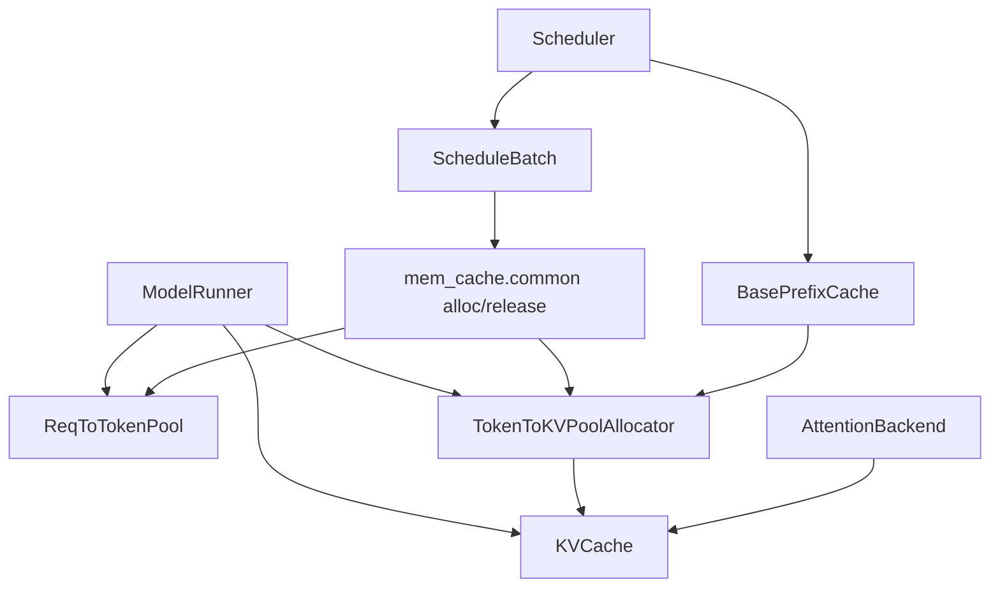
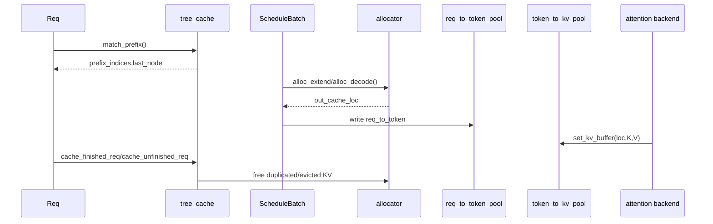
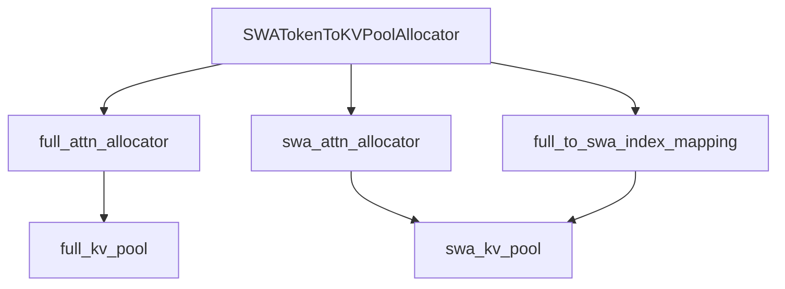
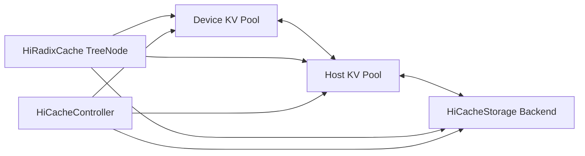

# `python/sglang/srt/mem_cache` 源码分析

## 1. 模块定位

`mem_cache` 是 SRT 的运行时内存缓存层，负责 request 到 token KV slot 的映射、物理 KV buffer 管理、prefix cache 复用，以及 HiCache/HiSparse/SWA/Mamba/MLA/NSA 等变体。

它服务于四条关键链路：

- `ModelRunnerKVCacheMixin` 初始化物理池和 allocator。
- `Scheduler` 根据模型与配置选择 `tree_cache`。
- `ScheduleBatch` 在 prefill/decode 阶段分配 KV slot 并写入 `req_to_token_pool`。
- attention backend 通过 `token_to_kv_pool` 读写实际 K/V buffer。

## 2. 目录结构

核心文件：

- [memory_pool.py](/mnt/shanhai-ai/shanhai-workspace/zhouhao6/sglang/python/sglang/srt/mem_cache/memory_pool.py)：物理 KV cache 和 request/token 映射池。
- [allocator.py](/mnt/shanhai-ai/shanhai-workspace/zhouhao6/sglang/python/sglang/srt/mem_cache/allocator.py)：token/page allocator 与 Triton allocation kernels。
- [base_prefix_cache.py](/mnt/shanhai-ai/shanhai-workspace/zhouhao6/sglang/python/sglang/srt/mem_cache/base_prefix_cache.py)：prefix cache 抽象。
- [radix_cache.py](/mnt/shanhai-ai/shanhai-workspace/zhouhao6/sglang/python/sglang/srt/mem_cache/radix_cache.py)：Python radix tree prefix cache。
- [radix_cache_cpp.py](/mnt/shanhai-ai/shanhai-workspace/zhouhao6/sglang/python/sglang/srt/mem_cache/radix_cache_cpp.py)、`cpp_radix_tree/`：实验性 C++ radix tree。
- [chunk_cache.py](/mnt/shanhai-ai/shanhai-workspace/zhouhao6/sglang/python/sglang/srt/mem_cache/chunk_cache.py)：禁用 radix cache 时的 chunked prefill 生命周期缓存。
- [swa_memory_pool.py](/mnt/shanhai-ai/shanhai-workspace/zhouhao6/sglang/python/sglang/srt/mem_cache/swa_memory_pool.py)、[swa_radix_cache.py](/mnt/shanhai-ai/shanhai-workspace/zhouhao6/sglang/python/sglang/srt/mem_cache/swa_radix_cache.py)：SWA 双池和 radix cache。
- [mamba_radix_cache.py](/mnt/shanhai-ai/shanhai-workspace/zhouhao6/sglang/python/sglang/srt/mem_cache/mamba_radix_cache.py)、[hi_mamba_radix_cache.py](/mnt/shanhai-ai/shanhai-workspace/zhouhao6/sglang/python/sglang/srt/mem_cache/hi_mamba_radix_cache.py)：Mamba/SSM 状态缓存。
- [hiradix_cache.py](/mnt/shanhai-ai/shanhai-workspace/zhouhao6/sglang/python/sglang/srt/mem_cache/hiradix_cache.py)：HiCache 版 radix cache。
- [memory_pool_host.py](/mnt/shanhai-ai/shanhai-workspace/zhouhao6/sglang/python/sglang/srt/mem_cache/memory_pool_host.py)：host 侧 KV cache 池。
- [hicache_storage.py](/mnt/shanhai-ai/shanhai-workspace/zhouhao6/sglang/python/sglang/srt/mem_cache/hicache_storage.py)、`storage/`：L3 storage backend。
- [hisparse_memory_pool.py](/mnt/shanhai-ai/shanhai-workspace/zhouhao6/sglang/python/sglang/srt/mem_cache/hisparse_memory_pool.py)、`sparsity/`：HiSparse / DeepSeek NSA 稀疏 KV。
- [common.py](/mnt/shanhai-ai/shanhai-workspace/zhouhao6/sglang/python/sglang/srt/mem_cache/common.py)：batch 级 KV 分配/释放公共路径。
- [session_aware_cache.py](/mnt/shanhai-ai/shanhai-workspace/zhouhao6/sglang/python/sglang/srt/mem_cache/session_aware_cache.py)：streaming session 包装。
- [multimodal_cache.py](/mnt/shanhai-ai/shanhai-workspace/zhouhao6/sglang/python/sglang/srt/mem_cache/multimodal_cache.py)：多模态 embedding cache。
- [evict_policy.py](/mnt/shanhai-ai/shanhai-workspace/zhouhao6/sglang/python/sglang/srt/mem_cache/evict_policy.py)：LRU/LFU/FIFO/MRU/FILO/Priority/SLRU 策略。

## 3. KV Pool 与 Allocator

`memory_pool.py` 中最基础的设计是两层映射：

1. `ReqToTokenPool`
   - 二维 tensor `req_to_token[size, max_context_len]`。
   - 将 request slot 映射到 token KV index。
   - `alloc(reqs)` 分配 request slot，支持 chunked prefill 复用已有 `req_pool_idx`。
2. `TokenToKVPoolAllocator` / `PagedTokenToKVPoolAllocator`
   - 管理 token KV index 的空闲表。
   - `page_size == 1` 按 token 分配。
   - `page_size > 1` 按 page 分配，但返回 token-level indices。
3. `KVCache` 子类
   - 持有实际 K/V buffer。
   - attention backend 通过 `get_key_buffer()`、`get_value_buffer()`、`set_kv_buffer()` 访问。

主要 KV pool：

- `MHATokenToKVPool`：传统 MHA/GQA K/V 分离 buffer。
- `MHATokenToKVPoolFP4`：FP4 KV 和 scale buffer。
- `MLATokenToKVPool`：MLA fused KV。
- `MLATokenToKVPoolFP4`：MLA FP4。
- `NSATokenToKVPool`：MLA 基础上增加 NSA index K 与 scale buffer。
- `DoubleSparseTokenToKVPool`：维护 heavy channel label buffer。
- `MambaPool`：存储 Mamba conv / temporal state。
- `HybridLinearKVPool`：混合 full attention KV 与 Mamba/linear state。
- `SWAKVPool`：full attention layers 与 SWA layers 拆成两个 KV pool。

## 4. Allocator

[allocator.py](/mnt/shanhai-ai/shanhai-workspace/zhouhao6/sglang/python/sglang/srt/mem_cache/allocator.py) 是所有 KV slot 分配基础。

- `BaseTokenToKVPoolAllocator`
  - 持有 `size`、`page_size`、`free_pages`、`release_pages`、`need_sort`。
  - 支持 `backup_state()` / `restore_state()`，用于 speculative 或失败回滚。
  - 支持 `free_group_begin()` / `free_group_end()` 批量释放。
- `TokenToKVPoolAllocator`
  - `page_size=1`。
  - slot 0 保留给 padded dummy output，因此 free slots 从 `1..size`。
- `PagedTokenToKVPoolAllocator`
  - `num_pages = size // page_size`。
  - `alloc_extend()` 根据 prefix length、seq length、last loc 计算新 page。
  - `alloc_decode()` 为 decode step 判断是否需要新 page。
  - 使用 Triton `alloc_extend_kernel`、`alloc_decode_kernel`。
  - `SGLANG_DEBUG_MEMORY_POOL` 开启后检查 page alignment 与重复 index。
- `SWATokenToKVPoolAllocator`
  - 同时管理 full attention allocator 与 SWA allocator。
  - 维护 `full_to_swa_index_mapping`。
- `HiSparseTokenToKVPoolAllocator`
  - 区分 logical KV index 和 hisparse device buffer index。

## 5. Prefix Cache 抽象

[base_prefix_cache.py](/mnt/shanhai-ai/shanhai-workspace/zhouhao6/sglang/python/sglang/srt/mem_cache/base_prefix_cache.py) 定义统一接口：

- `match_prefix(MatchPrefixParams) -> MatchResult`
- `cache_finished_req(req, is_insert=True)`
- `cache_unfinished_req(req, **kwargs)`
- `evict(EvictParams) -> EvictResult`
- `inc_lock_ref(node)` / `dec_lock_ref(node)`
- HiCache hooks：`init_load_back()`、`ready_to_load_host_cache()`、`check_hicache_events()`
- 能力声明：`supports_swa()`、`supports_mamba()`、`is_chunk_cache()`、`is_tree_cache()`

`MatchResult` 是调度层和 cache 层之间的重要合约：

- `device_indices`：device 上命中的 KV indices。
- `last_device_node`：device prefix 命中的最后节点。
- `last_host_node`：host/storage 层命中的最后节点。
- `host_hit_length`：HiCache host 命中长度。
- `mamba_branching_seqlen`：Mamba radix 分支点。
- `cache_protected_len`：实际被 cache lock 保护的长度。

## 6. Radix Cache

[radix_cache.py](/mnt/shanhai-ai/shanhai-workspace/zhouhao6/sglang/python/sglang/srt/mem_cache/radix_cache.py) 是普通 prefix cache 主实现。

核心数据结构：

- `RadixKey`
  - `token_ids`
  - `extra_key`：LoRA、cache salt 等 namespace 隔离。
  - `is_bigram`：EAGLE 场景可使用 bigram key。
- `TreeNode`
  - `children`、`parent`、`key`、`value`
  - `lock_ref`
  - `last_access_time`、`hit_count`
  - `host_ref_counter`、`host_value`
  - `hash_value`
  - `priority`

核心流程：

- `match_prefix()`：只匹配 page-aligned prefix；若命中落在节点中间，会 `_split_node()` 暴露精确边界。
- `insert()`：插入 key/value，返回重叠长度，调用方据此释放重复 KV slot。
- `cache_finished_req()`：从 `origin_input_ids + output_ids` 和 `req_to_token_pool` 提取 committed KV，插入 radix tree，释放重复 prefix、未对齐尾部和 request slot。
- `cache_unfinished_req()`：chunked prefill 中间态插入当前完成部分，再更新 `req.prefix_indices`、`req.last_node`、`req.cache_protected_len`。
- `evict()`：从可淘汰叶子建 heap，根据 eviction policy 释放 KV slots 并删除叶子。

## 7. Prefill/Decode 数据流

Prefill/extend：

1. `Req.init_next_round_input(tree_cache)` 调用 `match_prefix()`。
2. `ScheduleBatch.init_new()` 绑定 `req_to_token_pool`、allocator、tree cache。
3. `alloc_for_extend(batch)` 分配 request slot 和 token/page slot。
4. `write_cache_indices()` 写 `req_to_token_pool.req_to_token`。
5. attention layer 调 `set_kv_buffer()` 写物理 KV。
6. 请求完成走 `cache_finished_req()`；chunk 暂停走 `cache_unfinished_req()`。

Decode：

1. `ScheduleBatch.prepare_for_decode()`。
2. `alloc_for_decode(batch, token_per_req)` 分配当前 decode token KV loc。
3. attention backend 根据 block table / req_to_token 读取历史 KV。
4. 内存不足时 scheduler 触发 retract 或 evict。

## 8. Chunk Cache

[chunk_cache.py](/mnt/shanhai-ai/shanhai-workspace/zhouhao6/sglang/python/sglang/srt/mem_cache/chunk_cache.py) 用于禁用 radix cache 但仍启用 chunked prefill 的场景：

- `match_prefix()` 永远返回空命中。
- `cache_unfinished_req()` 把当前请求已分配 KV indices 存回 `req.prefix_indices`。
- `cache_finished_req()` 直接释放 committed KV。
- `SWAChunkCache` 为 SWA 模型提供禁用 radix 时的生命周期支持。

## 9. SWA

SWA 有两层实现：

- 物理层：`SWAKVPool` / `SWATokenToKVPoolAllocator`
  - full attention layers 使用 full pool。
  - SWA layers 使用 swa pool。
  - 对外返回 full indices。
  - 用 `full_to_swa_index_mapping` 翻译 SWA loc。
- prefix 层：`SWARadixCache`
  - 节点同时维护 full KV 和 SWA KV 的锁与淘汰状态。
  - 与 `ScheduleBatch.maybe_evict_swa()` 配合释放窗口外 SWA KV。

## 10. HiCache

HiCache 是 device KV -> host KV -> storage backend 的分层缓存。

主要组件：

- `HiRadixCache`：继承 `RadixCache`，管理 device/host/storage 节点状态和 ongoing write/load/prefetch/backup。
- `memory_pool_host.py`：host tensor pool，支持 `layer_first`、`page_first`、`page_first_direct` 等 layout。
- `hicache_storage.py`：定义 `HiCacheStorage`、page hash、`PoolTransfer` 和 file backend。
- `storage/backend_factory.py`：注册 `file`、`nixl`、`mooncake`、`hf3fs`、`aibrix`、`eic`，支持 dynamic backend。

典型流程：

1. request 入队时 `_prefetch_kvcache()`。
2. `tree_cache.prefetch_from_storage()` 将 storage page 预取到 host。
3. prefill batch 构建后 `ready_to_load_host_cache()` 将 host KV load back 到 device。
4. device cache eviction 前可 write-through 到 host/storage。
5. decode 期间 `check_hicache_events()` 和 `flush_write_through_acks()` 回收事件与 lock。

## 11. HiSparse 与 Mamba

HiSparse 主要面向 DSA/DeepSeek NSA：

- `HiSparseNSATokenToKVPool`：继承 `NSATokenToKVPool`，把 logical loc 翻译成 hisparse device loc。
- `HiSparseTokenToKVPoolAllocator`：同时维护 logical allocator 和 hisparse device buffer allocator。
- `sparsity/`：包含 `SparseConfig`、`SparseCoordinator`、`QuestAlgorithm`、`DeepSeekNSAAlgorithm`、backend adaptor。

Mamba / Hybrid Linear：

- `MambaPool`：存 conv state 与 temporal/SSM state。
- `HybridReqToTokenPool`：request slot 分配时同时分配 Mamba state。
- `HybridLinearKVPool`：full attention KV 与 mamba state 分开管理。
- `MambaRadixCache`：prefix tree 同时管理 KV 与 Mamba state。
- `HiMambaRadixCache`：HiCache 版 Mamba cache。

## 12. 与其它模块的关系

- `model_executor`：[model_runner_kv_cache_mixin.py](/mnt/shanhai-ai/shanhai-workspace/zhouhao6/sglang/python/sglang/srt/model_executor/model_runner_kv_cache_mixin.py) 按 MLA/MHA/NSA/SWA/Mamba/NPU/FP4/HiSparse 选择 pool 和 allocator。
- `managers`：`scheduler.py` 选择 tree cache；`schedule_batch.py` 调用 `alloc_for_extend()`、`alloc_for_decode()`、`release_kv_cache()`。
- `disaggregation`：通过 `KVCache.get_contiguous_buf_infos()` 和 `get_state_buf_infos()` 注册 RDMA/NIXL/Mooncake 传输 buffer。
- `hardware_backend`：NPU 提供 `NPUMHATokenToKVPool`、`NPUMLATokenToKVPool`、`NPUPagedTokenToKVPoolAllocator`。
- `multimodal`：多模态 transformers backend 可能禁用 radix cache，避免 prefix-cache mismatch。

## 13. 配置与环境变量

主要 ServerArgs：

- `--disable-radix-cache`
- `--chunked-prefill-size`
- `--page-size`
- `--radix-eviction-policy`
- `--enable-streaming-session`
- `--enable-hierarchical-cache`
- `--hicache-ratio`
- `--hicache-size`
- `--hicache-write-policy`
- `--hicache-io-backend`
- `--hicache-mem-layout`
- `--hicache-storage-backend`
- `--hicache-storage-prefetch-policy`
- `--hicache-storage-backend-extra-config`
- `--enable-hisparse`
- `--hisparse-config`
- `--enable-lmcache`
- `--enable-double-sparsity`
- `--max-total-tokens`
- `--mem-fraction-static`

主要环境变量：

- `SGLANG_DEBUG_MEMORY_POOL`
- `SGLANG_NATIVE_MOVE_KV_CACHE`
- `SGLANG_EXPERIMENTAL_CPP_RADIX_TREE`
- `SGLANG_HICACHE_FILE_BACKEND_STORAGE_DIR`
- `SGLANG_HICACHE_NIXL_BACKEND_STORAGE_DIR`
- `SGLANG_HICACHE_HF3FS_CONFIG_PATH`
- `SGLANG_HICACHE_MOONCAKE_CONFIG_PATH`
- `SGLANG_HICACHE_MOONCAKE_REUSE_TE`
- `SGLANG_HICACHE_DECODE_OFFLOAD_STRIDE`
- `SGLANG_CHUNKED_PREFIX_CACHE_THRESHOLD`
- `SGLANG_NSA_PREFILL_DENSE_ATTN_KV_LEN_THRESHOLD`
- `SGLANG_VLM_CACHE_SIZE_MB`
- `SGLANG_MM_FEATURE_CACHE_MB`
- `SGLANG_MEMORY_SAVER_CUDA_GRAPH`
- `SGLANG_EMPTY_CACHE_INTERVAL`

## 14. 扩展点

- 新 KV pool：继承 `KVCache`，实现 buffer get/set 和 disaggregation buffer info。
- 新 allocator：继承 `BaseTokenToKVPoolAllocator`，实现 `alloc/free/clear`，必要时支持 extend/decode。
- 新 prefix cache：继承 `BasePrefixCache`，保证 scheduler 生命周期方法可用。
- 新 eviction 策略：实现 `EvictionStrategy.get_priority()` 并注册。
- 新 HiCache storage backend：继承 `HiCacheStorage`，通过 factory 注册或 dynamic extra config 导入。
- 新 sparse algorithm：继承 `BaseSparseAlgorithm` 并注册。
- 新硬件后端：提供硬件专属 memory pool/allocator，并在 `ModelRunnerKVCacheMixin` 接入。

## 15. 常见问题与排障

- **page alignment 错误**：`page_size > 1` 时 radix key、KV index、chunked prefill size、SWA evict seqlen 都要求 page-aligned。
- **KV OOM**：检查 `max_total_tokens`、`mem_fraction_static`、`max_running_requests`、chunked prefill、HiCache。
- **重复释放或泄漏**：prefix cache 插入后必须释放重复 KV；`cache_protected_len` 处理 page tail。
- **SWA 重复释放**：`free_swa()` 非幂等，mapping 清零后重复释放会出错。
- **HiCache host 内存不足**：`hicache_ratio/hicache_size` 过大时 host pool 会抛错。
- **HiCache attach/detach race**：需要确保无 running/queued request。
- **NSA page size 限制**：非 HIP 通常要求 `page_size == 64`，HIP 路径要求 `page_size == 1`。
- **C++ radix 限制**：实验性路径不支持 HiCache host cache 和 KV cache events。
- **storage backend 依赖缺失**：Mooncake/NIXL/HF3FS/Aibrix/EIC 都依赖外部库或配置。
