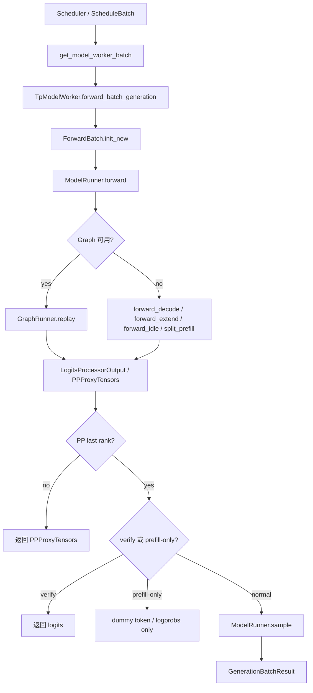
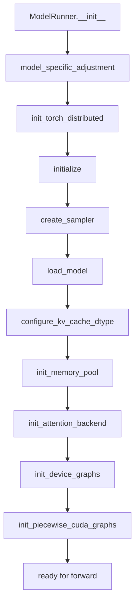
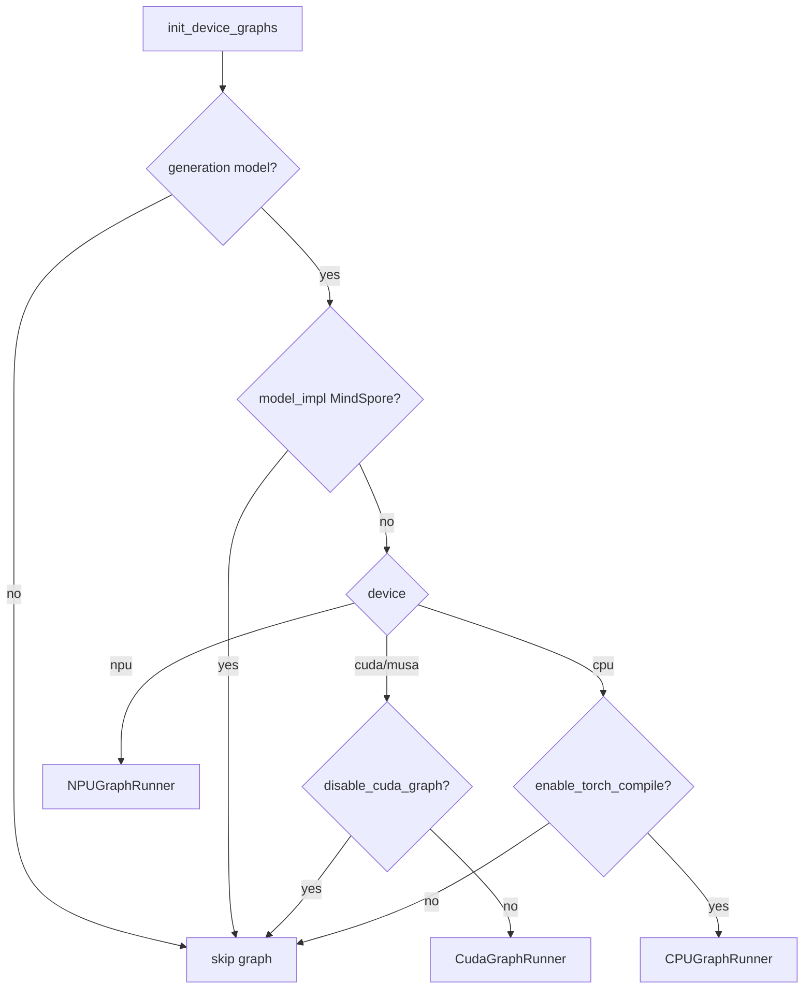

# `python/sglang/srt/model_executor` 源码分析

## 1. 模块定位

`model_executor` 是 SRT 的模型执行层，位于 `managers/scheduler` 与具体 `models/layers/mem_cache` 之间。它负责初始化模型执行环境，并把调度层的 `ModelWorkerBatch` 转换为低层 `ForwardBatch` 后执行模型 forward。

核心职责：

- 初始化分布式、设备、权重加载、采样器、KV cache、attention backend、graph runner。
- 执行 decode、extend/prefill、mixed、idle、split prefill、speculative verify 等 forward mode。
- 在 PP last rank 上调用 sampling，生成 `next_token_ids`。
- 管理 CUDA graph、NPU graph、CPU torch.compile graph、piecewise CUDA graph。
- 对接 LoRA、DP attention、PP、MoE/EP/EPLB、speculative、HiCache/HiSparse、Mamba/SWA/MLA/NSA。

关键源码：

- [model_runner.py](/mnt/shanhai-ai/shanhai-workspace/zhouhao6/sglang/python/sglang/srt/model_executor/model_runner.py)
- [forward_batch_info.py](/mnt/shanhai-ai/shanhai-workspace/zhouhao6/sglang/python/sglang/srt/model_executor/forward_batch_info.py)
- [model_runner_kv_cache_mixin.py](/mnt/shanhai-ai/shanhai-workspace/zhouhao6/sglang/python/sglang/srt/model_executor/model_runner_kv_cache_mixin.py)
- [cuda_graph_runner.py](/mnt/shanhai-ai/shanhai-workspace/zhouhao6/sglang/python/sglang/srt/model_executor/cuda_graph_runner.py)
- [cpu_graph_runner.py](/mnt/shanhai-ai/shanhai-workspace/zhouhao6/sglang/python/sglang/srt/model_executor/cpu_graph_runner.py)
- [piecewise_cuda_graph_runner.py](/mnt/shanhai-ai/shanhai-workspace/zhouhao6/sglang/python/sglang/srt/model_executor/piecewise_cuda_graph_runner.py)
- [managers/tp_worker.py](/mnt/shanhai-ai/shanhai-workspace/zhouhao6/sglang/python/sglang/srt/managers/tp_worker.py)

## 2. 文件结构

```text
model_executor/
  cpu_graph_runner.py
  cuda_graph_runner.py
  forward_batch_deepseek_mha_mixin.py
  forward_batch_info.py
  hook_manager.py
  input_buffers.py
  mindspore_runner.py
  model_runner.py
  model_runner_kv_cache_mixin.py
  piecewise_cuda_graph_runner.py
```

职责：

- `model_runner.py`：主执行器，封装模型加载、memory pool、attention backend、graph runner、forward、sample。
- `forward_batch_info.py`：定义 `ForwardMode`、`CaptureHiddenMode`、`ForwardBatch`、`PPProxyTensors`。
- `model_runner_kv_cache_mixin.py`：KV cache 容量估算、pool/allocator 选择。
- `cuda_graph_runner.py`：常规 decode CUDA graph 和 torch.compile 捕获/replay。
- `piecewise_cuda_graph_runner.py`：extend/prefill 的 piecewise graph。
- `cpu_graph_runner.py`：CPU torch.compile graph。
- `input_buffers.py`：graph runner 静态输入 buffer 复用。
- `forward_batch_deepseek_mha_mixin.py`：DeepSeek MHA/MLA chunked prefix cache 元数据。
- `hook_manager.py`：按 `server_args.forward_hooks` 注册 forward hook。
- `mindspore_runner.py`：NPU + MindSpore backend 分布式初始化辅助。

## 3. 总体数据流



调度到执行的数据结构流是：

```text
ScheduleBatch -> ModelWorkerBatch -> ForwardBatch
```

`ScheduleBatch` 属于 scheduler 管理，多数状态在 CPU；`ModelWorkerBatch` 是 scheduler 传给 worker 的模型相关子集；`ForwardBatch` 是 `ModelRunner` 消费的低层张量结构，多数 tensor 已在目标 device 上。

## 4. ModelRunner

[model_runner.py](/mnt/shanhai-ai/shanhai-workspace/zhouhao6/sglang/python/sglang/srt/model_executor/model_runner.py) 中的 `ModelRunner` 是执行层核心。

初始化主线：



关键步骤：

- 构造时保存 device、TP/PP/DP/EP rank、model config、server args、speculative、MLA/SWA/Mamba 状态。
- `model_specific_adjustment()` 根据模型和开关修正参数，例如 double sparsity 强制 triton 并禁用 CUDA graph，多模态不支持 chunked prefill 时关闭相关路径。
- `init_torch_distributed()` 初始化 TP/PP/DP/EP/attention DP/CP 等进程组。
- `load_model()` 通过 `get_model_loader()` 选择 loader 并加载权重。
- `init_memory_pool()` 由 `ModelRunnerKVCacheMixin` 实现，按显存预算、模型结构、backend 选择 request pool、KV pool、allocator。
- `init_attention_backend()` 从 `ATTENTION_BACKENDS` 构造 attention backend，可包装 hybrid backend 或 TBO backend。
- `init_device_graphs()` 按设备选择 CUDA/NPU/CPU graph runner。

关键 forward 方法：

- `forward_decode()`：decode 路径，初始化 attention metadata 后调用模型 forward。
- `forward_extend()`：prefill/extend 路径，优先尝试 piecewise graph，否则 eager forward。
- `forward_idle()`：DP attention idle worker 路径。
- `forward_split_prefill()`：PD multiplexing split prefill。
- `forward()`：外层包装 expert recorder、Elastic EP、EPLB hook、debug dumper。
- `_forward_raw()`：真正分派 graph/eager forward。
- `sample()`：sampling 入口，处理 grammar vocab mask、logits bias、sampler、ngram table 更新。

## 5. TpModelWorker

[managers/tp_worker.py](/mnt/shanhai-ai/shanhai-workspace/zhouhao6/sglang/python/sglang/srt/managers/tp_worker.py) 是 scheduler 与 `ModelRunner` 的桥。

职责：

- 从 `ServerArgs` 构造 `ModelConfig`。
- 创建一个或多个 `ModelRunner`；多层 EAGLE/MTP 时会创建 `model_runner_list`。
- 初始化 tokenizer/processor。
- 暴露 memory pool、weight update、LoRA load/unload 等管理能力。
- 在 `forward_batch_generation()` 中将 `ModelWorkerBatch` 转为 `ForwardBatch`。
- PP 非最后段返回 `PPProxyTensors`；PP last rank 才 sampling。
- `is_verify=True` 的 speculative target verify 跳过 sampling。
- prefill-only 请求不正常采样，可单独计算 logprob。

调用入口：

```text
Scheduler / ScheduleBatch
  -> ScheduleBatch.get_model_worker_batch()
  -> TpModelWorker.forward_batch_generation()
  -> ForwardBatch.init_new()
  -> ModelRunner.forward()
  -> ModelRunner.sample()
```

## 6. ForwardBatch

[forward_batch_info.py](/mnt/shanhai-ai/shanhai-workspace/zhouhao6/sglang/python/sglang/srt/model_executor/forward_batch_info.py) 定义执行层批结构。

`ForwardMode` 覆盖：

- `EXTEND`：prefill/extend。
- `DECODE`：单 token decode。
- `MIXED`：chunked prefill 中 decode + extend 混合。
- `IDLE`：DP attention 无请求 worker。
- `TARGET_VERIFY`：speculative target verify。
- `DRAFT_EXTEND` / `DRAFT_EXTEND_V2`：speculative draft extend。
- `PREBUILT`：disaggregated decode worker。
- `SPLIT_PREFILL`：PD multiplexing split prefill。
- `DLLM_EXTEND`：diffusion LLM。

`ForwardBatch` 关键字段：

- 基础输入：`input_ids`、`positions`、`req_pool_indices`、`seq_lens`、`out_cache_loc`、`seq_lens_sum`。
- extend 信息：`extend_num_tokens`、`extend_seq_lens`、`extend_prefix_lens`、`extend_start_loc`。
- sampling/logprob：`sampling_info`、`return_logprob`、`top_logprobs_nums`、`token_ids_logprobs`。
- KV/cache：`req_to_token_pool`、`token_to_kv_pool`、`out_cache_loc_swa`。
- attention backend：`attn_backend`。
- DP attention / MLP sync：`global_num_tokens_cpu/gpu`、`dp_padding_mode`、`global_dp_buffer_len`。
- speculative：`spec_info`、`spec_algorithm`、`capture_hidden_mode`。
- multimodal：`mm_inputs`、`input_embeds`、`mrope_positions`。
- PP：`PPProxyTensors` 传递中间 hidden/residual。

`ForwardBatch.init_new()` 是核心转换函数：复制 `ModelWorkerBatch` 字段，转 device tensor，计算 positions，处理 DP global token、mrope、SWA loc、LoRA batch、ngram metadata。

## 7. Forward 分派路径

核心路径：

```text
TpModelWorker.forward_batch_generation()
  -> ForwardBatch.init_new()
  -> ModelRunner.forward()
     -> ModelRunner._forward_raw()
        -> if graph 可用:
             graph_runner.replay()
           else:
             prepare_mlp_sync_batch()
             prepare_attn_tp_scatter_input()
             set_swa_loc()
             attach hisparse_coordinator
             dispatch by ForwardMode
```

graph 判断：

- CPU：`forward_batch.forward_mode.is_cpu_graph()`，目前主要是 decode。
- 非 CPU：`forward_batch.forward_mode.is_cuda_graph()`，包括 decode、target verify、idle、dLLM extend。
- 必须 `self.graph_runner` 存在且 `graph_runner.can_run(forward_batch)` 为真。

extend/prefill 的 piecewise graph 是另一条路径：`forward_extend()` 内部检查 `piecewise_cuda_graph_runner.can_run()`。

## 8. Graph Runner



### 8.1 CudaGraphRunner

[cuda_graph_runner.py](/mnt/shanhai-ai/shanhai-workspace/zhouhao6/sglang/python/sglang/srt/model_executor/cuda_graph_runner.py) 主要用于 decode、target verify、idle、dLLM extend 等固定形状路径。

关键点：

- `DecodeInputBuffers` 预分配静态 input/output buffer。
- `get_batch_sizes_to_capture()` 从 `server_args.cuda_graph_bs` 得到 capture batch sizes。
- `capture()` 按 batch size 从大到小捕获，复用 graph memory pool。
- `can_run()` 检查 batch size、DP CUDA graph、encoder lens、hidden capture mode、TBO、ngram shape。
- `replay_prepare()` 把真实 `ForwardBatch` copy 到静态 buffer 并 pad。
- `replay()` 执行 `graph.replay()`，再 slice 回真实 token 数。

### 8.2 CPUGraphRunner

[cpu_graph_runner.py](/mnt/shanhai-ai/shanhai-workspace/zhouhao6/sglang/python/sglang/srt/model_executor/cpu_graph_runner.py) 本质是 CPU `torch.compile` graph：

- 复用 `server_args.cuda_graph_bs` 作为 CPU graph batch sizes。
- 注册 `sgl_kernel::*` fake ops 支持 torch.compile。
- 不支持 LoRA、TBO、MLP TP gather、MLP sync、speculative、encoder-decoder、DP、PP 等复杂路径。
- replay 调用编译后的 Python callable，不是 `CUDAGraph.replay()`。

### 8.3 NPUGraphRunner

[hardware_backend/npu/graph_runner/npu_graph_runner.py](/mnt/shanhai-ai/shanhai-workspace/zhouhao6/sglang/python/sglang/srt/hardware_backend/npu/graph_runner/npu_graph_runner.py) 继承 `CudaGraphRunner`，但底层使用 `torch.npu.NPUGraph()`：

- `_create_device_graph()` 返回 `torch.npu.NPUGraph()`。
- `_capture_graph()` 使用 `torch.npu.graph(..., auto_dispatch_capture=True)`。
- replay 时可通过 `graph.update(cpu_update_input=[...])` 更新 CPU-side seq lens。
- profile 目录受 `SGLANG_TORCH_PROFILER_DIR` 影响。

### 8.4 PiecewiseCudaGraphRunner

[piecewise_cuda_graph_runner.py](/mnt/shanhai-ai/shanhai-workspace/zhouhao6/sglang/python/sglang/srt/model_executor/piecewise_cuda_graph_runner.py) 用于 extend/prefill：

- 依赖 `server_args.piecewise_cuda_graph_tokens`。
- 只支持 language model 且模型需要有 `layers`。
- 会收集 attention/MoE layers 和 fusions，通过 compilation context 捕获子图。
- input embeddings 和部分 logprob 情况会禁用。

## 9. Sampling

sampling 从 `TpModelWorker.forward_batch_generation()` 进入：

- PP last rank 才 sampling。
- `is_verify=True` 时跳过 sampling，用于 speculative verify。
- `is_prefill_only` 时不采样，返回 dummy token，可额外计算 logprob。
- 正常路径调用 `ModelRunner.sample(logits_output, forward_batch)`。

`ModelRunner.sample()` 流程：

1. tuple logits output 递归采样多个 output stream。
2. `_preprocess_logits()` 更新 grammar vocab mask、应用 logits bias，并清空 `sampling_info.vocab_mask` 防止 overlap + grammar 场景内存泄漏。
3. 调用 `self.sampler(...)`，sampler 来自 [layers/sampler.py](/mnt/shanhai-ai/shanhai-workspace/zhouhao6/sglang/python/sglang/srt/layers/sampler.py)。
4. prefill 使用 `seq_lens - 1` 作为最后 token position，decode 使用 `forward_batch.positions`。
5. `maybe_update_ngram_token_table()` 更新 ngram token table。

## 10. 与其它模块的关系

- `layers`：attention registry、sampler、logits processor、MoE、quantization、model parallel layers。
- `model_loader`：`get_model_loader()`、`LoadConfig`、`DefaultModelLoader` 加载权重。
- `mem_cache`：`ModelRunnerKVCacheMixin` 选择 `ReqToTokenPool`、KV pool、allocator。
- `managers`：`tp_worker.py` 是直接上游，`schedule_batch.py` 产生 `ModelWorkerBatch`。
- `speculative`：`TARGET_VERIFY`、`DRAFT_EXTEND`、`spec_info`、EAGLE/ngram graph capture 都依赖 speculative metadata。
- `lora`：`ForwardBatch.lora_ids`、LoRA batch info、LoRA MoE buffer 与 graph capture 交织。
- `hardware_backend`：NPU graph、NPU KV pool、Ascend attention 通过执行层接入。

## 11. 配置与环境变量

重要 ServerArgs：

- graph：`disable_cuda_graph`、`cuda_graph_bs`、`cuda_graph_max_bs`、`disable_cuda_graph_padding`、`enable_torch_compile`、`torch_compile_max_bs`、`enable_profile_cuda_graph`
- piecewise graph：`disable_piecewise_cuda_graph`、`piecewise_cuda_graph_tokens`、`piecewise_cuda_graph_compiler`
- memory：`mem_fraction_static`、`max_total_tokens`、`max_running_requests`、`page_size`
- attention：`attention_backend`、`speculative_draft_attention_backend`、`enable_dp_attention`、`attn_cp_size`、`enable_pdmux`、`enable_two_batch_overlap`
- KV dtype：`kv_cache_dtype`、`quantization_param_path`
- speculative：`speculative_algorithm`、`speculative_num_draft_tokens`、`speculative_num_steps`
- LoRA：`enable_lora`、`enable_lora_overlap_loading`、`max_loras_per_batch`、`max_lora_rank`、`lora_backend`
- MoE/EP：`enable_eplb`、`elastic_ep_backend`、`enable_elastic_expert_backup`、`moe_a2a_backend`
- debug/hooks：`forward_hooks`、`debug_tensor_dump_output_folder`、`enable_return_hidden_states`

重要环境变量：

- `SGLANG_DISTRIBUTED_INIT_METHOD_OVERRIDE`
- `SGLANG_DETECT_SLOW_RANK`
- `SGLANG_LOG_EXPERT_LOCATION_METADATA`
- `SGLANG_CPU_OMP_THREADS_BIND`
- `SGLANG_TORCH_COMPILE_MODE`
- `SGLANG_TORCH_DYNAMIC_SHAPE`
- `SGLANG_MEMORY_SAVER_CUDA_GRAPH`
- `SGLANG_TORCH_PROFILER_DIR`
- `SGLANG_SYMM_MEM_PREALLOC_GB_SIZE`
- `SGLANG_ENABLE_TP_MEMORY_INBALANCE_CHECK`
- `ASCEND_USE_FIA`

## 12. 扩展点

- 新 attention backend：注册到 `ATTENTION_BACKENDS`，实现 forward metadata 和 graph replay metadata。
- 新模型：实现 `forward(input_ids, positions, forward_batch, **kwargs)`；PP 需支持 `PPProxyTensors`；split prefill 需实现 `forward_split_prefill()`。
- 新 KV cache 类型：扩展 `ModelRunnerKVCacheMixin._init_pools()`。
- 新 graph backend：仿 `CudaGraphRunner` 实现 capture/replay，并在 `init_device_graphs()` 接入。
- 新 sampling backend：扩展 `layers/sampler.py:create_sampler()`。
- 新 speculative 算法：定义 `spec_info`，接入 `ForwardMode`、positions、custom mask 和 graph capture。
- 自定义 hook：通过 `server_args.forward_hooks` 与 `hook_manager.py` 指定。

## 13. 常见问题与排障

- **CUDA graph 捕获失败**：通常与显存、batch size、torch.compile、动态 shape、LoRA/MoE/TBO/DP 组合有关。优先降低 `--mem-fraction-static` 或 `--cuda-graph-max-bs`，再考虑关闭 torch compile 或 graph。
- **ForwardBatch 字段遗漏**：跨 DP/TP/PP/spec/mm/Mamba/SWA，多处 padding 后还要 slice 回真实大小，容易产生 silent correctness bug。
- **graph replay 地址要求**：静态 buffer 不能随意替换 tensor storage。
- **capture_hidden_mode 变化**：可能触发 recapture，引起线上延迟突刺。
- **CPU graph 支持窄**：开启前确认无 LoRA、PP、DP、speculative、encoder-decoder、MLP sync。
- **NPU graph 动态输入**：seq lens 等 CPU-side 属性更新路径和 attention arch 相关。
- **piecewise graph 自动禁用**：非标准 layer 命名或不满足模型结构要求时会 fallback。
- **prefill-only 不采样**：需要 logprob 时走 `compute_logprobs_only()`。
- **online weight update 后 graph 正确性**：关注是否传入 `recapture_cuda_graph`。
