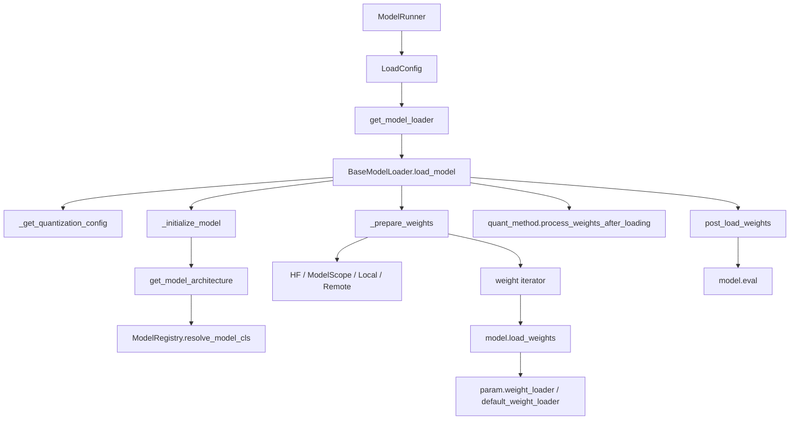
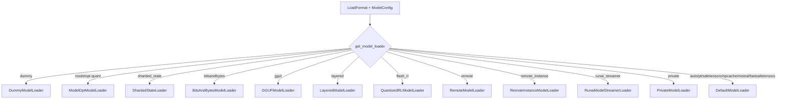
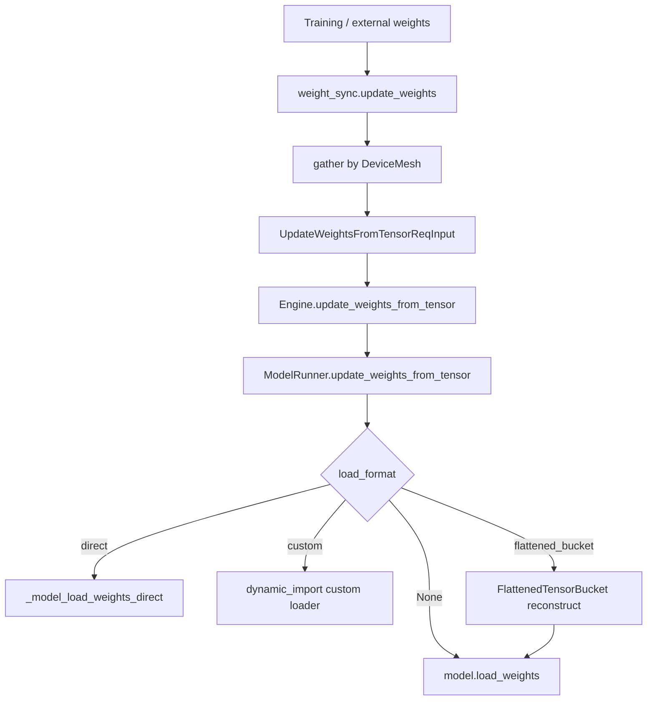

# `python/sglang/srt/model_loader` 源码分析

## 1. 模块定位

`model_loader` 是 SRT 的模型权重加载层。它把 `ModelConfig + LoadConfig + DeviceConfig` 转换成已经实例化、加载权重并完成量化后处理的 `nn.Module`。

它不直接定义模型结构，而是：

1. 通过模型注册表解析模型类。
2. 根据 `LoadFormat` 选择 loader。
3. 把本地、HF、ModelScope、remote、GGUF、safetensors、bitsandbytes 等来源转换为统一的 `(name, tensor)` iterator。
4. 调用模型类自己的 `load_weights()` 消费权重。
5. 调用 layer quant method 的 `process_weights_after_loading()` 做后处理。

关键入口：

- [model_loader/__init__.py](/mnt/shanhai-ai/shanhai-workspace/zhouhao6/sglang/python/sglang/srt/model_loader/__init__.py)：`get_model()`、`get_model_loader()`、`get_model_architecture()`
- [loader.py](/mnt/shanhai-ai/shanhai-workspace/zhouhao6/sglang/python/sglang/srt/model_loader/loader.py)：loader 主实现
- [weight_utils.py](/mnt/shanhai-ai/shanhai-workspace/zhouhao6/sglang/python/sglang/srt/model_loader/weight_utils.py)：下载、文件过滤、iterator、weight loader 工具
- [utils.py](/mnt/shanhai-ai/shanhai-workspace/zhouhao6/sglang/python/sglang/srt/model_loader/utils.py)：模型架构解析、dtype context、post-load hook
- [remote_instance_weight_loader_utils.py](/mnt/shanhai-ai/shanhai-workspace/zhouhao6/sglang/python/sglang/srt/model_loader/remote_instance_weight_loader_utils.py)：remote instance / TransferEngine / ModelExpress 辅助

## 2. 目录结构

```text
model_loader/
  __init__.py
  ci_weight_validation.py
  loader.py
  remote_instance_weight_loader_utils.py
  utils.py
  weight_utils.py
```

## 3. 冷启动加载链路



调用入口在 [model_executor/model_runner.py](/mnt/shanhai-ai/shanhai-workspace/zhouhao6/sglang/python/sglang/srt/model_executor/model_runner.py)：

```text
ModelRunner.load_model()
  -> LoadConfig(...)
  -> get_model_loader(load_config, model_config)
  -> loader.load_model(model_config, device_config)
     -> _get_quantization_config(...)
     -> _initialize_model(...)
     -> _get_all_weights(...)
     -> model.load_weights(iterator)
     -> quant_method.process_weights_after_loading(...)
  -> model.eval()
```

## 4. Loader 类型

`LoadFormat` 定义在 [configs/load_config.py](/mnt/shanhai-ai/shanhai-workspace/zhouhao6/sglang/python/sglang/srt/configs/load_config.py)，包括：

- `auto`
- `pt`
- `safetensors`
- `npcache`
- `dummy`
- `sharded_state`
- `gguf`
- `bitsandbytes`
- `mistral`
- `layered`
- `flash_rl`
- `jax`
- `remote`
- `remote_instance`
- `rdma`
- `local_cached`
- `fastsafetensors`
- `private`
- `runai_streamer`

`get_model_loader()` 的主要选择：



说明：

- `DefaultModelLoader`：普通本地/HF/ModelScope 权重加载路径。
- `DummyModelLoader`：随机初始化，用于 profiling。
- `ShardedStateLoader`：每个 TP rank 读取自己的 `model-rank-{rank}-part-{part}.safetensors`。
- `BitsAndBytesModelLoader`：bnb 4bit/8bit，含 pre-quant 和在线量化。
- `GGUFModelLoader`：读取 `.gguf` 并映射为 HF state dict name。
- `LayeredModelLoader`：meta device 初始化，逐 module materialize/load，降低峰值内存。
- `QuantizedRLModelLoader`：RL 场景 FP8 初始量化与权重重载。
- `RemoteModelLoader`：从 remote connector 的 KV/FS 后端读取权重。
- `RemoteInstanceModelLoader`：从另一个 SGLang instance 通过 NCCL / TransferEngine / ModelExpress 拉取权重。
- `RunaiModelStreamerLoader`：使用 Run:ai streamer 流式加载 safetensors。
- `PrivateModelLoader`：动态导入 `sglang.private.private_model_loader`。

注意：当前源码没有 `tensorizer` 作为 `LoadFormat`，也没有 `TensorizerModelLoader`。

## 5. 权重来源与格式

```mermaid
flowchart LR
    A[model_path] --> B{server_args._handle_load_format}
    B -->|local dir/file| C[Local files]
    B -->|HF repo id| D[Hugging Face snapshot_download]
    B -->|SGLANG_USE_MODELSCOPE| E[ModelScope snapshot_download]
    B -->|remote url| F[Remote connector KV/FS]
    B -->|runai object uri| G[Runai Model Streamer]
    B -->|remote_instance| H[NCCL / TransferEngine / ModelExpress]
    C --> I[(name, tensor) iterator]
    D --> I
    E --> I
    F --> I
    G --> I
    H --> J[direct parameter copy / broadcast / RDMA]
    I --> K[model.load_weights]
```

### 5.1 DefaultModelLoader

`DefaultModelLoader._prepare_weights()` 按 load format 准备文件：

- `auto`：优先 `*.safetensors`，否则 `*.bin`，部分模型允许追加 `*.pt`。
- `safetensors`：只读 `*.safetensors`。
- `fastsafetensors`：使用 `fastsafetensors` 库。
- `mistral`：读 `consolidated*.safetensors` 和 `consolidated.safetensors.index.json`。
- `pt`：读 `*.pt`。
- `npcache`：读 `*.bin`，首次转 numpy cache。

权重 iterator 在 `weight_utils.py` 中实现：

- `safetensors_weights_iterator()`
- `buffered_multi_thread_safetensors_weights_iterator()`
- `fastsafetensors_weights_iterator()`
- `pt_weights_iterator()`
- `multi_thread_pt_weights_iterator()`
- `np_cache_weights_iterator()`
- `gguf_quant_weights_iterator()`
- `runai_safetensors_weights_iterator()`

### 5.2 HF 与 ModelScope

HF 路径：

- 非本地目录时用 `snapshot_download()`。
- 通过 file lock 避免多进程重复下载。
- 会检查本地 snapshot 中匹配权重和 safetensors index 是否完整。
- CI 环境走 `ci_weight_validation.py` 的严格校验与重试。
- `HF_HUB_OFFLINE` 会影响 `local_files_only`。

ModelScope 路径：

- `SGLANG_USE_MODELSCOPE=true/1` 时启用。
- 调用 `modelscope.hub.snapshot_download.snapshot_download()`。
- `server_args._handle_modelscope_paths()` 会提前处理部分路径。

### 5.3 Remote 与 Remote Instance

`RemoteModelLoader` 通过 `create_remote_connector(model_weights, device=...)` 创建 connector：

- `ConnectorType.KV`：`client.weight_iterator(rank)`，按 TP rank 取权重。
- `ConnectorType.FS`：`client.weight_iterator()`。
- `save_model()` 可将 state dict 和配置写入 KV 后端。

`RemoteInstanceModelLoader` 支持：

- `nccl`：目标实例和 seed 实例建立通信组，seed broadcast parameter。
- `transfer_engine`：注册本地权重显存区域，从 seed metadata 做 RDMA read。
- `modelexpress`：通过 ModelExpress 服务发现 metadata，再用 TransferEngine 拉取。

### 5.4 GGUF

`GGUFModelLoader` 要求 `model_path` 是文件：

1. 导入 `gguf`。
2. 根据 HF config 的 `model_type` 找 GGUF arch。
3. 用 `gguf.get_tensor_name_map()` 建立 GGUF name 到 HF name 的映射。
4. 对非 F32 tensor yield `*.qweight_type` 和 `*.qweight`。
5. 调用 `model.load_weights()`。
6. 执行量化后处理。

## 6. Quant 与 Weight Mapping

量化配置入口：

- `loader.py::_get_quantization_config()`
- `weight_utils.py::get_quant_config()`
- `layers/quantization/base_config.py`

流程：

1. `get_model_architecture(model_config)` 找到模型类。
2. 从模型类读取 `packed_modules_mapping`、`remap_prefix`、`hf_to_sglang_mapper`。
3. `get_quant_config()` 从 HF config、text config、compression config 或外部 json 读取量化配置。
4. `_get_quantization_config()` 检查硬件 capability 和 activation dtype。
5. 若模型类有 mapper，调用 `quant_config.apply_weight_name_mapper()`。
6. 模型初始化时传入 `quant_config`。
7. 权重加载后执行 `quant_method.process_weights_after_loading(module)`。

weight loader 机制：

- layer 参数通过 `set_weight_attrs(param, {"weight_loader": ...})` 挂载专用加载函数。
- 模型类 `load_weights()` 遍历 `(name, loaded_weight)`，做 qkv/gate_up/expert mapping，然后调用 `param.weight_loader(...)` 或 `default_weight_loader(...)`。
- 通用函数包括 `default_weight_loader()`、`row_parallel_weight_loader()`、`sharded_weight_loader()`、`composed_weight_loader()`、`maybe_remap_kv_scale_name()`。

## 7. 与其它模块的关系

- `model_executor`：`ModelRunner` 是主要调用方，并负责在线更新磁盘/张量权重。
- `models`：模型类是权重名解释的最终责任方，负责 `load_weights()` 和 mapping。
- `layers`：parallel linear、embedding、quant method 提供参数与加载切片逻辑。
- `lora`：基础模型加载后由 LoRA 子系统包装目标模块；部分 loader 需要处理 LoRA padding。
- `weight_sync`：在线权重更新外层工具，最终仍进入 `model.load_weights()` 或自定义 update path。

在线更新链路：



## 8. 配置与环境变量

常用参数：

- `--load-format`
- `--model-loader-extra-config`
- `--trust-remote-code`
- `--weight-loader-disable-mmap`
- `--remote-instance-weight-loader-*`
- `--custom-weight-loader`
- `--modelopt-*`
- `--rl-quant-profile`

`LoadConfig` 字段包括：

- `load_format`
- `download_dir`
- `model_loader_extra_config`
- `ignore_patterns`
- `tp_rank`
- remote instance seed ip/service port/group ports/backend/transfer engine
- ModelExpress url/name
- ModelOpt checkpoint restore/save/export
- `draft_model_idx`

环境变量：

- `SGLANG_USE_MODELSCOPE`
- `SGLANG_SORT_WEIGHT_FILES`
- `SGL_CPU_QUANTIZATION`
- `SGLANG_EMBEDDINGS_SPARSE_HEAD`
- `HF_HUB_OFFLINE`
- `RUNAI_STREAMER_CONCURRENCY`
- `RUNAI_STREAMER_MEMORY_LIMIT`
- `RUNAI_STREAMER_S3_ENDPOINT` / `AWS_ENDPOINT_URL`

## 9. 扩展点

- 新增 `LoadFormat` 并在 `get_model_loader()` 注册 loader。
- 直接传入自定义 loader class。
- 实现 `sglang.private.private_model_loader.PrivateModelLoader`。
- 模型类提供 `load_weights()`、`packed_modules_mapping`、`hf_to_sglang_mapper`、`secondary_weights`、`post_load_weights()`。
- layer 参数挂载 `weight_loader`。
- 量化 method 实现 `process_weights_after_loading()`。
- 在线更新通过 `--custom-weight-loader` 接入动态导入 path。

## 10. 常见问题与排障

- **权重格式误判**：`auto` 优先 safetensors；混合 consolidated/sharded 文件时依赖 index 过滤。
- **safetensors index 不完整**：检查 shard 是否缺失，CI 会自动清理/重试，普通环境可能要手动清 cache。
- **mmap 问题**：`--weight-loader-disable-mmap` 可规避，但增加内存压力。
- **多线程加载内存峰值**：默认多线程加载，峰值和 shard size/线程数相关。
- **量化 dtype/capability 不匹配**：检查 `_get_quantization_config()` 报错。
- **bitsandbytes 限制**：需要 `bitsandbytes>=0.44.0`，pre-quant bnb 不支持 TP > 1。
- **remote instance metadata 不匹配**：tensor name、numel、element_size 必须一致。
- **LoRA padding shape mismatch**：sharded/remote state copy 时需要 narrow。
- **`jax/rdma/local_cached` 枚举未注册专用 loader**：可能落到 default 后报 unknown load_format。
