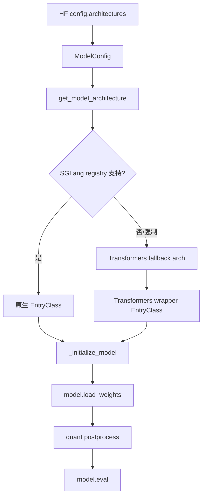
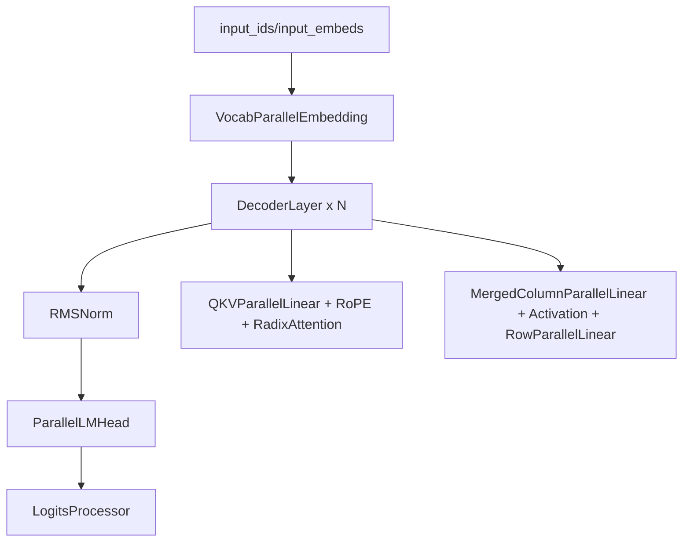
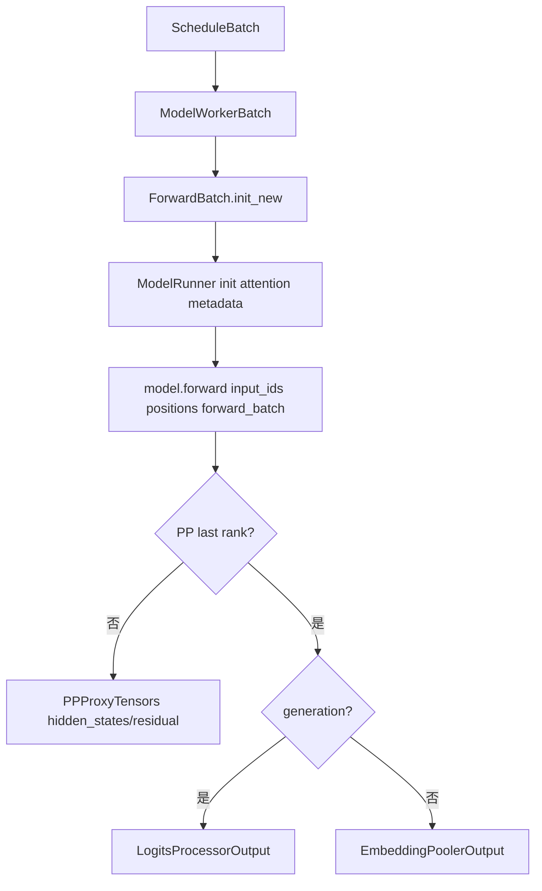
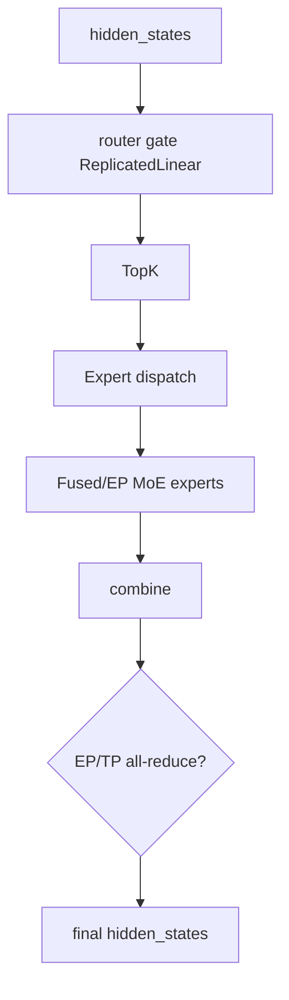
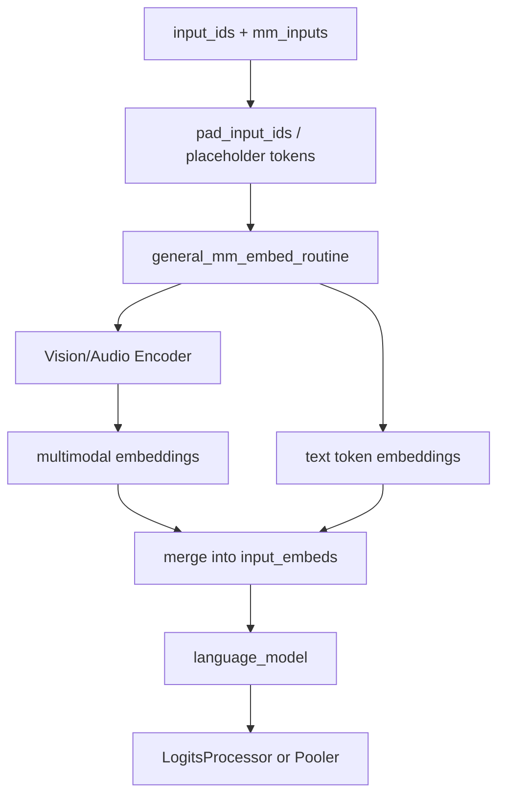
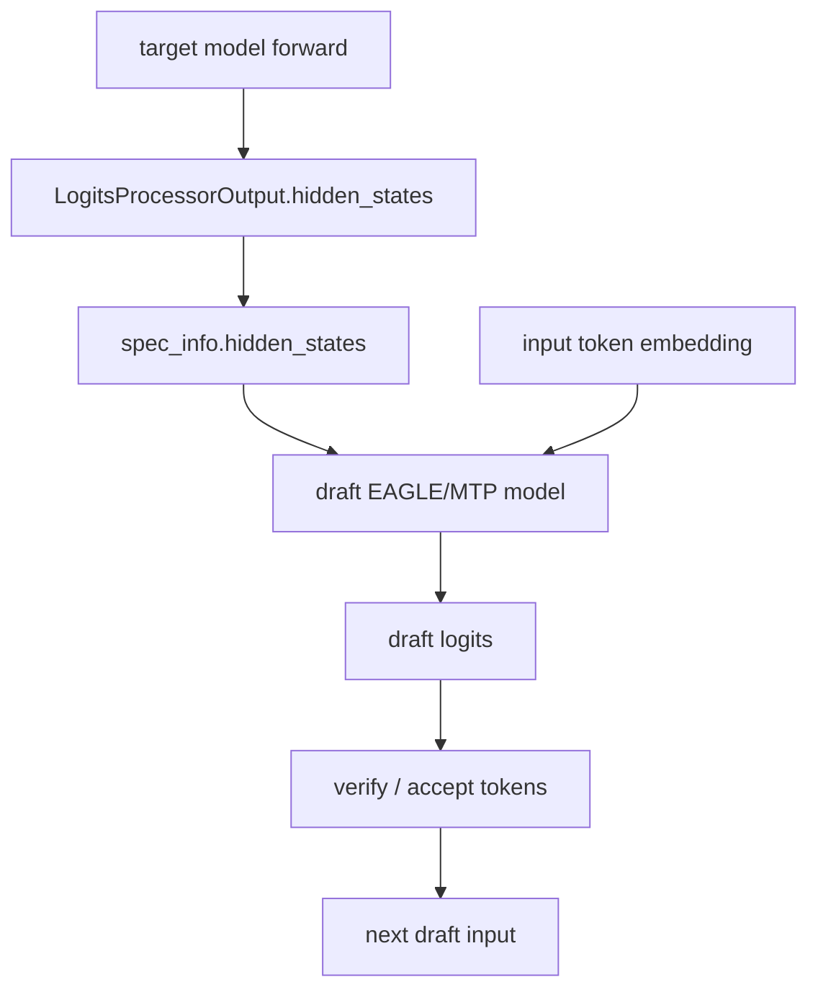

# `python/sglang/srt/models` 源码分析

## 1. 模块定位

`models` 是 SRT 的模型实现层。它把 HuggingFace `config.architectures` 中的架构名映射到 SGLang 原生 `nn.Module`，并实现统一 forward 合约、权重加载、PP/TP/EP/MoE、多模态、speculative/MTP 等适配点。

边界关系：

- `models/`：具体模型结构、forward、权重名映射、架构特殊逻辑。
- `model_loader/`：解析模型类并调用 `model.load_weights()`。
- `model_executor/`：构造 `ForwardBatch`，初始化 attention metadata，调用模型 forward。
- `layers/`：提供 parallel linear、embedding、RadixAttention、LogitsProcessor、Pooler、MoE 等组件。
- `managers/mm_utils.py`：多模态 embedding 拼接通用流程。

## 2. 目录结构与注册模式

`models` 目录整体扁平，绝大多数模型是单文件实现，例如：

- [llama.py](/mnt/shanhai-ai/shanhai-workspace/zhouhao6/sglang/python/sglang/srt/models/llama.py)
- [qwen2.py](/mnt/shanhai-ai/shanhai-workspace/zhouhao6/sglang/python/sglang/srt/models/qwen2.py)
- [qwen3_moe.py](/mnt/shanhai-ai/shanhai-workspace/zhouhao6/sglang/python/sglang/srt/models/qwen3_moe.py)
- [deepseek_v2.py](/mnt/shanhai-ai/shanhai-workspace/zhouhao6/sglang/python/sglang/srt/models/deepseek_v2.py)
- [qwen2_vl.py](/mnt/shanhai-ai/shanhai-workspace/zhouhao6/sglang/python/sglang/srt/models/qwen2_vl.py)
- [llama_eagle.py](/mnt/shanhai-ai/shanhai-workspace/zhouhao6/sglang/python/sglang/srt/models/llama_eagle.py)
- [qwen3_5_mtp.py](/mnt/shanhai-ai/shanhai-workspace/zhouhao6/sglang/python/sglang/srt/models/qwen3_5_mtp.py)
- [transformers.py](/mnt/shanhai-ai/shanhai-workspace/zhouhao6/sglang/python/sglang/srt/models/transformers.py)

少量公共子目录如 `deepseek_common/` 用于共享 DeepSeek 系列工具。

每个模型文件末尾通常定义：

```python
EntryClass = FooForCausalLM
```

或：

```python
EntryClass = [FooForCausalLM, FooForConditionalGeneration]
```

## 3. 模型注册与架构选择

注册入口是 [models/registry.py](/mnt/shanhai-ai/shanhai-workspace/zhouhao6/sglang/python/sglang/srt/models/registry.py)。



机制：

1. `ModelRegistry.register("sglang.srt.models")` 扫描 models 包。
2. 模块存在 `EntryClass` 时，把类名注册为 architecture key。
3. `SGLANG_DISABLED_MODEL_ARCHS` 可跳过指定模型模块。
4. `SGLANG_EXTERNAL_MODEL_PACKAGE` 可注册外部模型包并覆盖内置注册。
5. [model_loader/utils.py](/mnt/shanhai-ai/shanhai-workspace/zhouhao6/sglang/python/sglang/srt/model_loader/utils.py) 的 `get_model_architecture()` 根据 `model_config.hf_config.architectures` 解析最终模型类。
6. 不支持或显式 `--model-impl=transformers` 时走 Transformers fallback wrapper。

## 4. 常见实现模式

Dense LLM 的典型层次：



常见类：

- `XXXAttention`：QKV projection、RoPE/MRoPE、`RadixAttention`、output projection。
- `XXXMLP`：gate/up fused projection、activation、down projection。
- `XXXDecoderLayer`：norm、attention、mlp、residual。
- `XXXModel`：embedding、`make_layers()`、final norm。
- `XXXForCausalLM`：model、lm head、`LogitsProcessor`、`load_weights()`。

权重加载常见模式：

- `params_dict = dict(self.named_parameters())`
- 用 `get_layer_id(name)` 跳过非当前 PP rank 层。
- 跳过 `rotary_emb.inv_freq`、cached sin/cos、无用 projector、旧版 kv scale。
- `q_proj/k_proj/v_proj -> qkv_proj`
- `gate_proj/up_proj -> gate_up_proj`
- 调用参数上的 `weight_loader` 做 TP shard、expert shard 或量化权重加载。

## 5. Forward 合约

`ModelRunner` 统一调用模型：

```python
forward(
    input_ids: torch.Tensor,
    positions: torch.Tensor,
    forward_batch: ForwardBatch,
    input_embeds: torch.Tensor = None,
    get_embedding: bool = False,
    pp_proxy_tensors: Optional[PPProxyTensors] = None,
)
```

主要返回：

- generation 模型 PP last rank：`LogitsProcessorOutput`
- embedding/rerank 模型：`EmbeddingPoolerOutput`
- 非 PP last rank：`PPProxyTensors`
- split prefill 中间段：可返回 `None`，最后段返回 logits output



模型常用 `ForwardBatch` 字段：

- `forward_mode`
- `input_ids`、`positions`
- `seq_lens`、`extend_seq_lens`、`extend_prefix_lens`
- `out_cache_loc`
- `attn_backend`
- `req_to_token_pool`、`token_to_kv_pool`
- `mm_inputs`、`mm_input_embeds`、`mrope_positions`
- `spec_info`、`spec_algorithm`
- `hidden_states`、`residual`
- `dimensions`

## 6. Layers 与 LogitsProcessor

模型 attention 通常只完成 QKV projection、RoPE，然后调用 `RadixAttention`：

```text
self.attn(q, k, v, forward_batch)
```

[layers/radix_attention.py](/mnt/shanhai-ai/shanhai-workspace/zhouhao6/sglang/python/sglang/srt/layers/radix_attention.py) 会把请求转给 `forward_batch.attn_backend.forward(...)`。具体 kernel/backend 不写在模型文件中。

常用 layer：

- `QKVParallelLinear`
- `MergedColumnParallelLinear`
- `ColumnParallelLinear`
- `RowParallelLinear`
- `ReplicatedLinear`
- `VocabParallelEmbedding`
- `ParallelLMHead`
- `RMSNorm` / `GemmaRMSNorm`
- `PPMissingLayer`
- `FusedMoE`

[layers/logits_processor.py](/mnt/shanhai-ai/shanhai-workspace/zhouhao6/sglang/python/sglang/srt/layers/logits_processor.py) 负责：

- 按 forward metadata 剪出需要算 logits 的 hidden states。
- 执行 lm head。
- TP all-gather / DP attention lm head。
- return logprob、top logprobs、prefill-only、多 item scoring。
- 返回 `LogitsProcessorOutput`。

## 7. 并行与特殊模型

### 7.1 PP

- `make_layers()` 根据 PP rank 只实例化当前层。
- 非本 rank 层用 `PPMissingLayer` 占位。
- 首 rank 才有 embedding，末 rank 才有 norm/lm_head/logits。
- 中间 rank 返回 `PPProxyTensors`。

### 7.2 TP

- 主干矩阵使用 parallel layers。
- attention heads 按 TP 切分。
- KV heads 小于 TP size 时允许复制，否则要求可整除。
- 权重加载由参数 `weight_loader` 处理 shard。

### 7.3 EP / MoE

MoE 代表：[qwen3_moe.py](/mnt/shanhai-ai/shanhai-workspace/zhouhao6/sglang/python/sglang/srt/models/qwen3_moe.py)。



特点：

- 使用 MoE TP/EP/DP 并行组。
- router 通常是 `ReplicatedLinear + TopK`。
- experts 通过 `get_moe_impl_class(quant_config)` 选择。
- 权重加载用 `FusedMoE.make_expert_params_mapping()` 映射 gate/up/down。
- 支持 EPLB / expert location。

## 8. 多模态模型

多模态代表：[qwen2_vl.py](/mnt/shanhai-ai/shanhai-workspace/zhouhao6/sglang/python/sglang/srt/models/qwen2_vl.py)。

通用流程在 [managers/mm_utils.py](/mnt/shanhai-ai/shanhai-workspace/zhouhao6/sglang/python/sglang/srt/managers/mm_utils.py)：



模型通常实现：

- `pad_input_ids(input_ids, mm_inputs)`
- `get_image_feature(items)`
- `get_video_feature(items)`
- `get_audio_feature(items)`

`general_mm_embed_routine()` 负责把多模态 embedding scatter 到文本 embedding 序列。

## 9. Speculative / EAGLE / MTP

代表文件：

- [llama_eagle.py](/mnt/shanhai-ai/shanhai-workspace/zhouhao6/sglang/python/sglang/srt/models/llama_eagle.py)
- [llama_eagle3.py](/mnt/shanhai-ai/shanhai-workspace/zhouhao6/sglang/python/sglang/srt/models/llama_eagle3.py)
- [qwen3_5_mtp.py](/mnt/shanhai-ai/shanhai-workspace/zhouhao6/sglang/python/sglang/srt/models/qwen3_5_mtp.py)



要点：

- EAGLE draft model 从 `forward_batch.spec_info.hidden_states` 读取目标 hidden states。
- EAGLE3 支持捕获目标模型中间层 hidden states。
- MTP/NextN 模型通常只跑少量预测层。
- `ModelConfig._config_draft_model()` 会把目标 architecture 改写为对应 draft 架构。

## 10. 配置项

[configs/model_config.py](/mnt/shanhai-ai/shanhai-workspace/zhouhao6/sglang/python/sglang/srt/configs/model_config.py) 中的关键字段：

- `model_path`
- `revision`
- `trust_remote_code`
- `context_length`
- `model_override_args`
- `is_embedding`
- `enable_multimodal`
- `dtype`
- `quantization`
- `override_config_file`
- `is_draft_model`
- `model_impl`
- `sampling_defaults`
- `quantize_and_serve`
- `encoder_only`
- `language_only`

环境变量/全局参数：

- `SGLANG_DISABLED_MODEL_ARCHS`
- `SGLANG_EXTERNAL_MODEL_PACKAGE`
- `SGLANG_ALLOW_OVERWRITE_LONGER_CONTEXT_LEN`
- `SGLANG_ENABLE_LOGITS_PROCESSER_CHUNK`
- `SGLANG_LOGITS_PROCESSER_CHUNK_SIZE`
- `enable_dp_lm_head`
- `enable_fp32_lm_head`
- `enable_multimodal`
- `language_only`
- `enable_adaptive_dispatch_to_encoder`

## 11. 扩展新模型步骤

1. 在 `python/sglang/srt/models/<model_name>.py` 新增实现。
2. 定义与 HF `architectures` 匹配的入口类，并在文件末尾设置 `EntryClass`。
3. Dense LLM 参考 `llama.py` / `qwen2.py`，MoE 参考 `qwen3_moe.py`，多模态参考 `qwen2_vl.py`。
4. 实现 `Attention`、`MLP`、`DecoderLayer`、`Model`、`ForCausalLM`。
5. 遵守 forward 合约。
6. 使用 SGLang parallel layers 和 `RadixAttention`。
7. 用 `make_layers()`、`PPMissingLayer` 支持 PP。
8. 实现 `load_weights()`，处理 qkv/gate_up/expert/tied embedding/量化 scale。
9. 多模态模型实现 `pad_input_ids()` 和 feature extraction 方法。
10. draft 模型从 `spec_info.hidden_states` 读取目标 hidden states，并在需要时更新 `ModelConfig._config_draft_model()`。

## 12. 常见问题与排障

- **architecture 找不到**：检查 `EntryClass`、类名、import warning、`SGLANG_DISABLED_MODEL_ARCHS`。
- **权重缺失/多余**：检查 `load_weights()` mapping 和 `params_dict` key。
- **PP 下失败**：检查 layer range、`PPMissingLayer`、`PPProxyTensors`。
- **qkv/gate_up 映射顺序错误**：可能不报错但输出异常。
- **TP head 不可整除**：attention heads 与 KV heads 需要满足切分要求。
- **tied embedding 在 PP 下出错**：embedding 只在首 rank，lm_head 只在末 rank。
- **多模态错位**：检查 placeholder token、`pad_input_ids()`、`mrope_positions`、`mm_inputs` 生命周期。
- **MoE expert OOM 或路由错**：检查 EP size、冗余专家、expert location dispatch。
- **Transformers fallback 特性不完整**：性能、量化、PP、MoE、多模态、speculative 可能受限。
