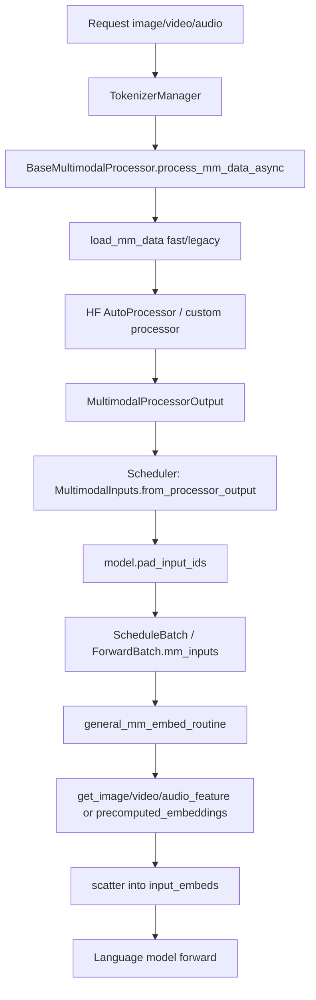
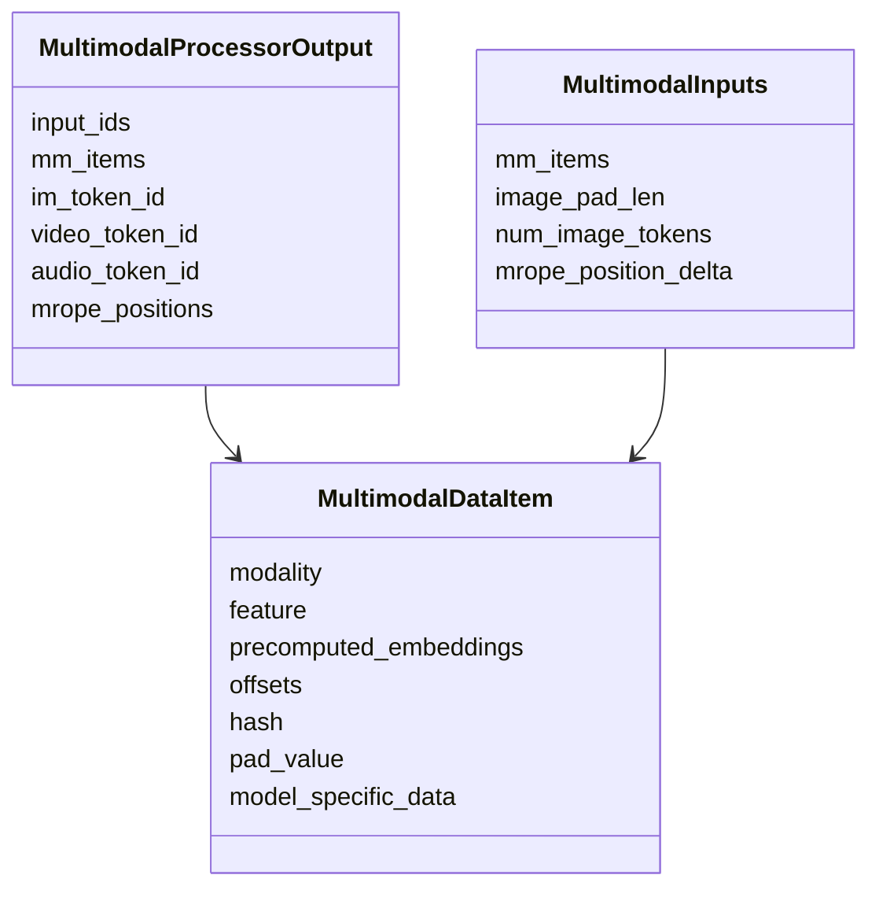
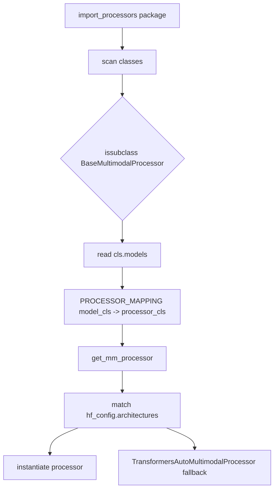
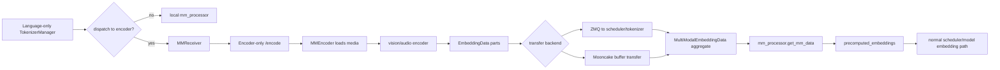

# `python/sglang/srt/multimodal` 源码分析

## 1. 模块定位

`multimodal` 是 SRT 的多模态预处理与视觉/音频编码辅助层。它不直接调度请求，也不直接执行 LLM forward，而是把客户端的 image/video/audio 输入转换为 SRT 内部的 `MultimodalProcessorOutput` / `MultimodalInputs`，供 scheduler 和模型 forward 使用。

主链路：

```text
client image/video/audio
  -> TokenizerManager
  -> multimodal processor
  -> MultimodalProcessorOutput
  -> Scheduler / MultimodalInputs
  -> ForwardBatch.mm_inputs
  -> model get_image/video/audio_feature
  -> general_mm_embed_routine
  -> scatter embedding into text embedding
```

核心职责：

- 统一 image/video/audio 的加载、校验、token 扩展和 processor 调用。
- 将 HF processor 输出整理成 `MultimodalDataItem`。
- 通过 registry 将模型 architecture 映射到对应 processor。
- 支持 `processor_output` / `precomputed_embedding`，服务 encoder disaggregation。
- 提供 Qwen、InternVL、LLaVA 等模型族 processor。
- 提供 ViT CUDA Graph runner、EVS 视频 token pruning 等优化模块。

## 2. 目录结构

```text
multimodal/
  customized_mm_processor_utils.py
  internvl_utils.py
  internvl_vit_cuda_graph_runner.py
  mm_utils.py
  vit_cuda_graph_runner.py
  evs/
  processors/
```

关键文件：

- [processors/base_processor.py](/mnt/shanhai-ai/shanhai-workspace/zhouhao6/sglang/python/sglang/srt/multimodal/processors/base_processor.py)：`BaseMultimodalProcessor`、special tokens、媒体加载、processor output 归一化。
- `processors/*.py`：模型族专用 processor，如 Qwen-VL、LLaVA、InternVL、Gemma3、Qwen Audio、Whisper、Phi4MM。
- [processors/transformers_auto.py](/mnt/shanhai-ai/shanhai-workspace/zhouhao6/sglang/python/sglang/srt/multimodal/processors/transformers_auto.py)：Transformers backend generic processor。
- [mm_utils.py](/mnt/shanhai-ai/shanhai-workspace/zhouhao6/sglang/python/sglang/srt/multimodal/mm_utils.py)：LLaVA/anyres 图像处理工具。
- [customized_mm_processor_utils.py](/mnt/shanhai-ai/shanhai-workspace/zhouhao6/sglang/python/sglang/srt/multimodal/customized_mm_processor_utils.py)：自定义 HF processor 注册。
- [vit_cuda_graph_runner.py](/mnt/shanhai-ai/shanhai-workspace/zhouhao6/sglang/python/sglang/srt/multimodal/vit_cuda_graph_runner.py)：通用 ViT CUDA Graph runner。
- `evs/`：Efficient Video Sampling，视频 embedding 后做相邻帧冗余 token pruning。

## 3. 主流程



非 EPD 本地路径：

1. `TokenizerManager` 收到 request，发现 `contains_mm_input()`。
2. 调用 `self.mm_processor.process_mm_data_async(...)`。
3. processor 返回 `MultimodalProcessorOutput`，必要时替换 `input_ids`。
4. Scheduler 调 `MultimodalInputs.from_processor_output()`。
5. 模型特定 `pad_input_ids()` 用 `pad_value` 替换/扩展 placeholder token。
6. `ScheduleBatch -> ModelWorkerBatch -> ForwardBatch.mm_inputs`。
7. 模型 forward 调 [managers/mm_utils.py](/mnt/shanhai-ai/shanhai-workspace/zhouhao6/sglang/python/sglang/srt/managers/mm_utils.py) 的 `general_mm_embed_routine()`。
8. 模型方法 `get_image_feature()` / `get_video_feature()` / `get_audio_feature()` 产出 embedding。
9. embedding scatter 到 text embedding 后继续 LLM forward。

## 4. 输入格式

输入字段来自 request object：

- `image_data`
- `video_data`
- `audio_data`

`BaseMultimodalProcessor.load_mm_data()` 支持：

1. 普通媒体输入：URL、文件、base64、bytes。
2. `{"format": "processor_output", ...}`：调用方已提供 processor 输出。
3. `{"format": "precomputed_embedding", ...}`：调用方已提供最终 encoder embedding，常见于 EPD language-only 侧。

约束：

- 对每个 modality，如果使用 `processor_output` 或 `precomputed_embedding`，列表必须只有一个 dict item。
- 不能把 processor/precomputed dict 和普通媒体 item 混用。
- fast path 要求 prompt 特殊 token 数量和媒体 item 数量对齐。
- legacy path 可按 prompt 中特殊 token 顺序加载数据，处理视频拆帧和动态 frame expansion。

## 5. Processor 基类与输出

`BaseMultimodalProcessor` 在 [processors/base_processor.py](/mnt/shanhai-ai/shanhai-workspace/zhouhao6/sglang/python/sglang/srt/multimodal/processors/base_processor.py)。

关键对象：

- `MultimodalSpecialTokens`：定义 image/video/audio token 文本、token id、regex，并映射到 `Modality`。
- `BaseMultiModalProcessorOutput`：processor 前半段输出，包含 input text 和 loaded media。
- `BaseMultimodalProcessor`：所有模型族 processor 基类。

典型流程：

1. 子类实现 `process_mm_data_async()`。
2. 调 `load_mm_data()` 加载并对齐媒体。
3. 调 `process_and_combine_mm_data()` 执行 HF processor。
4. 调 `collect_mm_items_from_processor_output()` 把 output 字段按 modality 归类为 `MultimodalDataItem`。
5. 返回 `MultimodalProcessorOutput`。



## 6. Processor Registry

registry 在 [managers/multimodal_processor.py](/mnt/shanhai-ai/shanhai-workspace/zhouhao6/sglang/python/sglang/srt/managers/multimodal_processor.py)。



机制：

- `import_processors("sglang.srt.multimodal.processors")` 扫描 processor classes。
- 每个 processor class 通过 `models = [...]` 声明支持的 model class。
- `get_mm_processor()` 根据 `hf_config.architectures` 匹配 processor。

外部扩展：

- `SGLANG_EXTERNAL_MM_PROCESSOR_PACKAGE`：导入外部 processor package，可覆盖内置映射。
- `SGLANG_EXTERNAL_MM_MODEL_ARCH`：model_config 侧注册外部 multimodal architecture。
- `@register_customized_processor(processor_class=...)`：替换 HF `AutoProcessor.from_pretrained()`。

## 7. EPD / Encoder Transfer

EPD 指 encoder disaggregation：把视觉/音频 encoder 从 language model 服务中拆出去。



关键参数：

- `--encoder-only`
- `--language-only`
- `--encoder-urls`
- `--encoder-transfer-backend`
- `--enable-adaptive-dispatch-to-encoder`
- `--enable-prefix-mm-cache`
- `--enable-mm-global-cache`

传输 backend：

- `zmq_to_scheduler`
- `zmq_to_tokenizer`
- `mooncake`

核心文件：

- [disaggregation/encode_receiver.py](/mnt/shanhai-ai/shanhai-workspace/zhouhao6/sglang/python/sglang/srt/disaggregation/encode_receiver.py)
- [disaggregation/encode_server.py](/mnt/shanhai-ai/shanhai-workspace/zhouhao6/sglang/python/sglang/srt/disaggregation/encode_server.py)
- [disaggregation/encode_grpc_server.py](/mnt/shanhai-ai/shanhai-workspace/zhouhao6/sglang/python/sglang/srt/disaggregation/encode_grpc_server.py)

EPD 结果最终被封装为 `precomputed_embeddings`，进入普通 `MultimodalInputs` 路径。本地 language-only forward 不再运行视觉/音频 encoder。

## 8. 与其它模块的关系

- `managers/tokenizer_manager.py`：初始化 HF processor 和 SGLang processor，处理 request 的媒体字段，执行 EPD dispatch。
- `managers/scheduler.py`：把 raw processor output 转为 `MultimodalInputs`，执行模型 padding，处理 `zmq_to_scheduler` 等待队列。
- `managers/schedule_batch.py`：定义 `Modality`、`MultimodalDataItem`、`MultimodalProcessorOutput`、`MultimodalInputs`。
- `models`：模型实现 `pad_input_ids()`、`get_image_feature()`、`get_video_feature()`、`get_audio_feature()`。
- `model_executor/forward_batch_info.py`：`ForwardBatch` 携带 `mm_inputs`、`encoder_lens`、M-RoPE 等。
- `entrypoints`：Engine 层有 encode 相关 API；HTTP/gRPC encoder service 主要在 `disaggregation`。

## 9. 配置与环境变量

ServerArgs：

- `--enable-multimodal`
- `--disable-fast-image-processor`
- `--keep-mm-feature-on-device`
- `--mm-attention-backend`
- `--mm-process-config`
- `--limit-mm-data-per-request`
- `--enable-broadcast-mm-inputs-process`
- `--mm-enable-dp-encoder`
- `--enable-prefix-mm-cache`
- `--enable-mm-global-cache`
- `--encoder-only`
- `--language-only`
- `--encoder-transfer-backend`
- `--encoder-urls`
- `--enable-adaptive-dispatch-to-encoder`

环境变量：

- `SGLANG_IO_WORKERS`
- `SGLANG_CPU_WORKERS`
- `SGLANG_IMAGE_MAX_PIXELS`
- `SGLANG_MM_BUFFER_SIZE_MB`
- `SGLANG_MM_PRECOMPUTE_HASH`
- `SGLANG_MM_SKIP_COMPUTE_HASH`
- `SGLANG_USE_CUDA_IPC_TRANSPORT`
- `SGLANG_USE_IPC_POOL_HANDLE_CACHE`
- `SGLANG_MM_FEATURE_CACHE_MB`
- `SGLANG_MM_ITEM_MEM_POOL_RECYCLE_INTERVAL_SEC`
- `SGLANG_VLM_CACHE_SIZE_MB`
- `SGLANG_ENCODER_MM_RECEIVER_MODE`
- `SGLANG_ENCODER_RECV_TIMEOUT`
- `SGLANG_ENCODER_SEND_TIMEOUT`
- `SGLANG_ENCODER_GRPC_TIMEOUT_SECS`
- `SGLANG_ENCODER_DISPATCH_MIN_ITEMS`
- `SGLANG_ENCODER_IMAGE_PROCESSOR_USE_GPU`
- `SGLANG_ENCODER_MM_LOAD_WORKERS`
- `SGLANG_EXTERNAL_MM_PROCESSOR_PACKAGE`
- `SGLANG_EXTERNAL_MM_MODEL_ARCH`

## 10. 扩展点

新增 processor：

1. 在 `multimodal/processors/` 下新增文件。
2. 继承 `BaseMultimodalProcessor`。
3. 设置 `models = [YourModelClass]`。
4. 构造 `MultimodalSpecialTokens(...).build(_processor)`。
5. 实现 `process_mm_data_async()`。
6. 在 model class 中实现 `pad_input_ids()` 与 feature extraction 方法。

外部扩展：

- 用 `SGLANG_EXTERNAL_MM_PROCESSOR_PACKAGE` 注入 package。
- 用 `@register_customized_processor` 替换 HF AutoProcessor。
- Transformers backend 可走 `TransformersAutoMultimodalProcessor`，复杂模型建议写专用 processor。

优化扩展：

- ViT CUDA Graph runner 适合固定/重复 shape 的视觉 encoder。
- EVS 适合视频 token pruning，但不适合所有依赖 positional embedding 的 VLM。

## 11. 常见问题与排障

- **prompt token 数与媒体数量不一致**：可能退到 legacy path 或报错。
- **processor/precomputed 与普通媒体混用**：同一 modality 不允许混用。
- **feature scatter 数量不匹配**：检查 `pad_input_ids()`、`item.offsets`、`pad_value`。
- **M-RoPE 错位**：检查 `image_grid_thw/video_grid_thw` 和 `mrope_position_delta`。
- **EPD 超时**：检查 encoder `/encode`、scheduler receive URL、ZMQ port、`SGLANG_ENCODER_RECV_TIMEOUT`。
- **Mooncake 传输问题**：检查 IB device、buffer register/deregister、dtype/shape metadata。
- **CUDA IPC 问题**：可临时关闭 `SGLANG_USE_CUDA_IPC_TRANSPORT` 对比。
- **prefix MM cache 命中异常**：`SGLANG_MM_SKIP_COMPUTE_HASH` 会牺牲真实 hash 语义。
