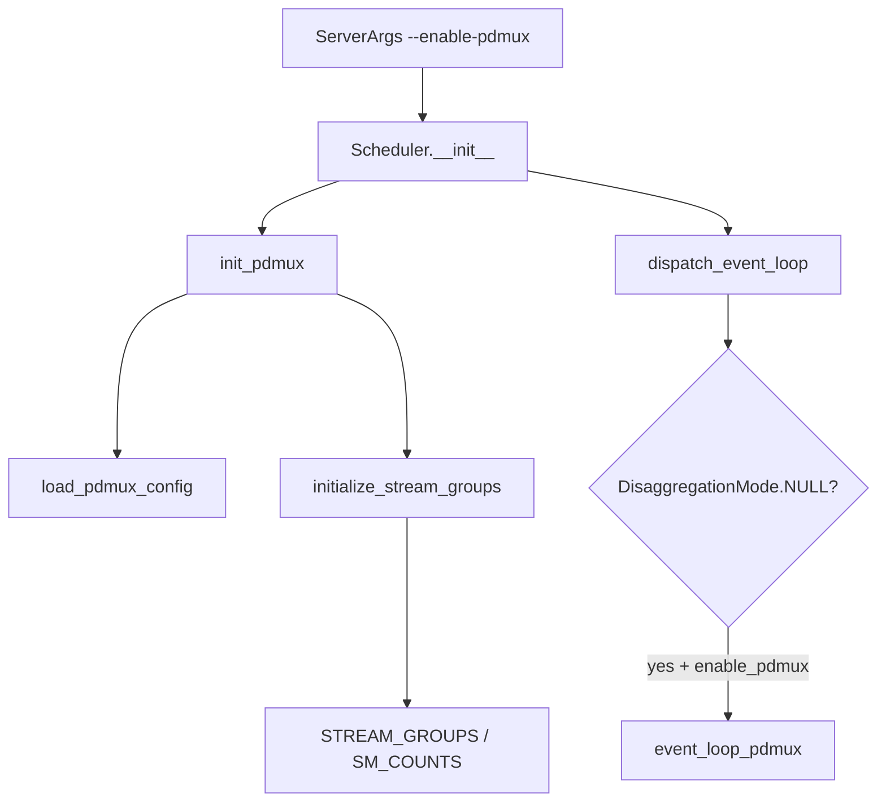
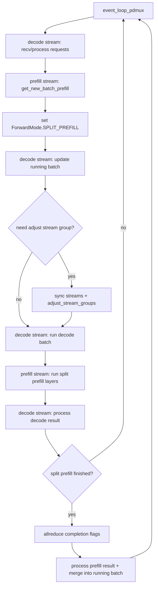
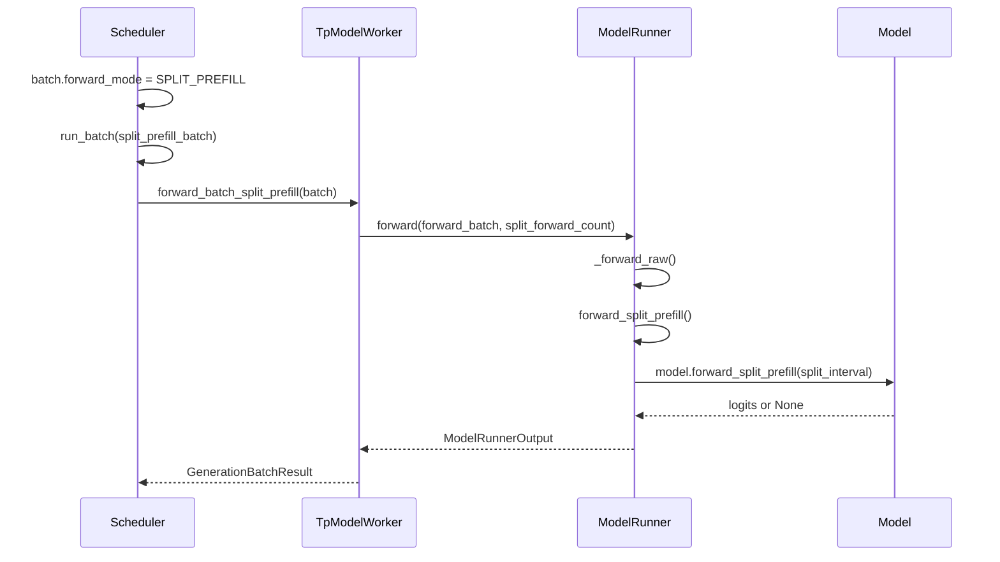

# `python/sglang/srt/multiplex` 源码分析

## 1. 模块定位

`multiplex` 目录很小，只包含 PDMux 相关实现，不是通用 HTTP request routing、DP routing、模型路由器或多租户 multiplexing 框架。

它聚焦 **PD-Multiplexing**：在同一 GPU 上使用 CUDA Green Context / stream group，把 prefill 与 decode 放到不同 CUDA stream 和 SM 配额中推进，并在 scheduler event loop 内交错执行 split prefill 与 decode。

边界：

- 覆盖 scheduler/model executor 层的 PD multiplexing。
- 不负责 OpenAI entrypoints 的 `x-smg-routing-key` 路由决策。
- 不兼容 disaggregation mode，配置校验要求 `disaggregation_mode == "null"`。
- 依赖模型实现 `forward_split_prefill()`。

## 2. 文件结构

```text
multiplex/
  pdmux_context.py
  multiplexing_mixin.py
```

- [pdmux_context.py](/mnt/shanhai-ai/shanhai-workspace/zhouhao6/sglang/python/sglang/srt/multiplex/pdmux_context.py)：PDMux 配置、SM 分组、Green Context stream group 初始化、当前 stream index 全局状态。
- [multiplexing_mixin.py](/mnt/shanhai-ai/shanhai-workspace/zhouhao6/sglang/python/sglang/srt/multiplex/multiplexing_mixin.py)：`SchedulerMultiplexMixin`，接入 scheduler 初始化、stream group 调整、split prefill batch 更新和 PDMux event loop。

## 3. 启动与调度入口



启动链路：

```text
ServerArgs
  -> Scheduler.__init__
    -> self.enable_pdmux = server_args.enable_pdmux
    -> self.init_pdmux()
      -> load_pdmux_config()
      -> initialize_stream_groups()
      -> get_stream_groups()
      -> get_sm_counts()
```

调度入口：

```text
dispatch_event_loop(scheduler)
  -> if disaggregation_mode == NULL and scheduler.enable_pdmux
    -> scheduler.event_loop_pdmux()
```

## 4. `pdmux_context.py`

`PDMuxConfig` 字段：

- `sm_group_num=8`：默认 stream/SM 分组数。
- `manual_divisions=[]`：手动 SM 分配，格式 `[prefill_sm, decode_sm, decode_bs_threshold]`。
- `split_forward_token_budget=65536`：每轮 split prefill 层数推进预算。
- `decode_bs_divisor=36`：无手动配置时，根据 decode batch size 映射 stream group。

`load_pdmux_config(config_path)`：

- 无配置文件时返回默认配置。
- 有配置文件时读取 YAML。
- 校验 `sm_group_num >= 3`。
- 校验 `manual_divisions` 长度等于 `sm_group_num - 2`。

`divide_sm(total_sms, compute_capability, groups)`：

- 根据 GPU compute capability 限制 SM 划分粒度。
- 只保留 `prefill_sm >= decode_sm` 且 `decode_sm >= 16` 的候选。
- 生成 `(prefill_sm, decode_sm)` 列表并 reverse。

`initialize_stream_groups(gpu_id, config)`：

- 依赖 `sgl_kernel.spatial`。
- 通过 `spatial.get_sm_available(gpu_id)` 获取可用 SM。
- 构造模块级全局 `SM_COUNTS`、`STREAM_GROUPS`、`CURRENT_STREAM_IDX`、`CURRENT_STREAM_GROUP`。
- group index 0 偏 prefill，最后 index 偏 decode，中间 index 为 Green Context stream group。

## 5. `SchedulerMultiplexMixin`

`init_pdmux()`：

- 初始化 `self.split_prefill_batch = None`。
- 加载 PDMux config。
- 初始化 stream groups。
- 保存 `self.stream_groups`、`self.sm_counts`、`self.real_sm_group_num`。

`adjust_stream_groups()`：

- 同时有 decode 与 split prefill：按 `manual_divisions` 或 `decode_bs_divisor` 选择中间 group。
- 只有 decode：选择最后 group。
- 无 running decode：选择 index 0。
- 调用 `set_current_stream_idx(stream_idx)`。
- 调用 `model_runner.update_decode_attn_backend(stream_idx)`。

`update_split_prefill_batch(sm_count)`：

- 若已有 `split_prefill_batch`，不取新 batch。
- 调用 scheduler 原有 `get_new_batch_prefill()`。
- 将 batch `forward_mode` 设置为 `ForwardMode.SPLIT_PREFILL`。

## 6. PDMux Event Loop



主要步骤：

1. decode stream 接收请求并处理输入。
2. prefill stream 尝试获取新的 split prefill batch。
3. decode stream 更新 running batch。
4. 需要时同步 prefill/decode stream 并调整 stream group。
5. decode stream 执行 running decode batch。
6. prefill stream 按层推进 split prefill。
7. decode stream 处理 decode 结果。
8. prefill stream 等待 split prefill kernel 完成，通过 TP CPU group allreduce 确认所有 TP rank 完成。
9. 处理 prefill 结果并 merge 到 running batch。

## 7. Split Prefill 调用链



关键字段：

- `ScheduleBatch.split_index`
- `ScheduleBatch.split_prefill_finished`
- `ScheduleBatch.split_forward_count`
- `ScheduleBatch.split_forward_batch`
- `ScheduleBatch.seq_lens_cpu_cache`
- `ForwardBatch.hidden_states`
- `ForwardBatch.residual`
- `ForwardBatch.model_specific_states`
- `ForwardBatch.split_index`

## 8. 与其它模块的关系

### 8.1 Managers

`Scheduler` 通过 `SchedulerMultiplexMixin` 继承 PDMux 能力。`event_loop_pdmux()` 复用 scheduler 的：

- `recv_requests()`
- `process_input_requests()`
- `get_new_batch_prefill()`
- `update_running_batch()`
- `run_batch()`
- `process_batch_result()`
- `check_memory()`
- `check_tree_cache()`

`Scheduler.run_batch()` 对 `SPLIT_PREFILL` 特判，调用 `tp_worker.forward_batch_split_prefill(batch)`。

### 8.2 Model Executor

`ModelRunner`：

- 分布式初始化时 `duplicate_tp_group=enable_pdmux`，为 prefill 创建重复 TP group。
- PDMux 开启时创建多个 decode attention backend。
- decode forward 根据当前 stream index 切换 `decode_attn_backend`。
- `forward_split_prefill()` 调模型自己的 `forward_split_prefill()`。

`CudaGraphRunner`：

- PDMux 开启时 graph key 为 `{stream_idx}_{bs}`。
- capture 阶段遍历 stream groups。
- replay 按当前 stream index 选择 graph。

### 8.3 Distributed / Disaggregation

- PDMux 创建 `_PDMUX_PREFILL_TP_GROUP`。
- `set_pdmux_status(True)` 后 `get_tp_group()` 返回 prefill 专用 TP group。
- PDMux 与 disaggregation mode 互斥。它是同进程/同 GPU 内 prefill-decode multiplex，不是 prefill/decode worker 分离。

### 8.4 Entrypoints

`x-smg-routing-key` 在 entrypoints 中提取并进入 request/metrics，但 `multiplex` 不读取 routing key，也不按 routing key 选择 stream group。

## 9. 配置

ServerArgs：

- `enable_pdmux`
- `pdmux_config_path`
- `sm_group_num`

CLI：

- `--enable-pdmux`
- `--pdmux-config-path`
- `--sm-group-num`

启用约束：

- `pp_size == 1`
- `chunked_prefill_size == -1`
- `disaggregation_mode == "null"`
- `disable_overlap_schedule == True`
- torch 2.7+ 有 CUDA Green Context + CudaGraph 性能退化 warning，建议 torch 2.6.x。

YAML 示例：

```yaml
sm_group_num: 8
split_forward_token_budget: 65536
decode_bs_divisor: 36
manual_divisions:
  - [120, 16, 1]
  - [112, 24, 8]
  - [104, 32, 16]
  - [96, 40, 32]
  - [88, 48, 64]
  - [80, 56, 128]
```

`manual_divisions` 长度必须是 `sm_group_num - 2`。

## 10. 扩展点

- 新模型支持 PDMux：实现 `model.forward_split_prefill(input_ids, positions, forward_batch, split_interval, ...)`。
- 调整 SM 划分：修改 YAML `manual_divisions` 或 `decode_bs_divisor`。
- 调整 split prefill 粒度：修改 `split_forward_token_budget`。
- 扩展 attention backend：PDMux 需要每个 stream index 对应独立 decode attention backend。
- 扩展 CUDA graph：graph key 必须覆盖 stream index 与 batch size。

## 11. 常见问题与排障

- **配置不合法**：`sm_group_num < 3`、`manual_divisions` 长度不对、SM partition 无合法候选都会报错。
- **启动参数冲突**：PDMux 不兼容 PP、chunked prefill、disaggregation、overlap schedule。
- **模型不支持**：缺少 `forward_split_prefill()` 会失败。
- **全局状态风险**：`CURRENT_STREAM_IDX`、`STREAM_GROUPS` 是模块级全局变量。
- **过度切换 stream group**：切换前会同步 stream，频繁切换可能抵消收益。
- **TP group 错误**：prefill stream 必须设置 PDMux status，否则 `get_tp_group()` 不会返回专用 group。
- **attention backend 错配**：stream index 变化后必须更新 decode attention backend。
- **CUDA graph key 缺失**：当前 stream index 对应 graph 未 capture 时无法 replay。
- **KV cache stream 行为不同**：PDMux 下禁用 alt stream。
