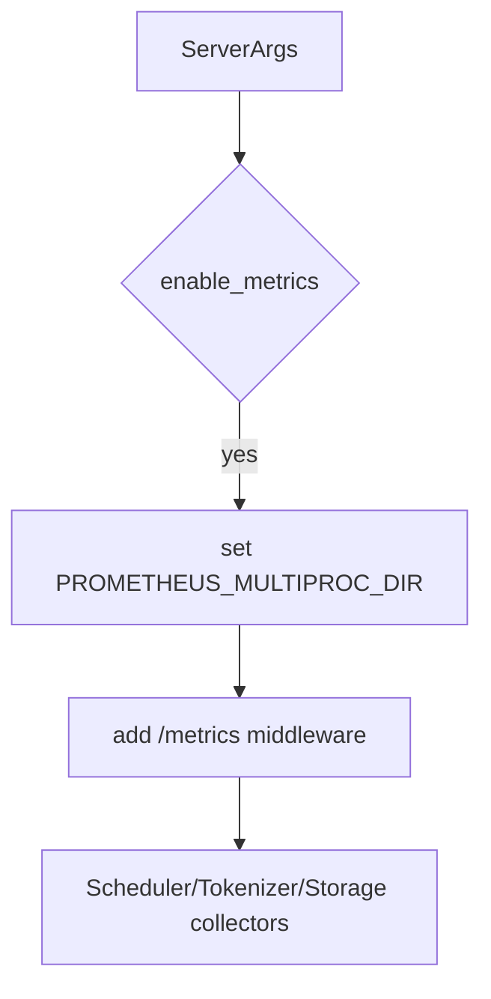
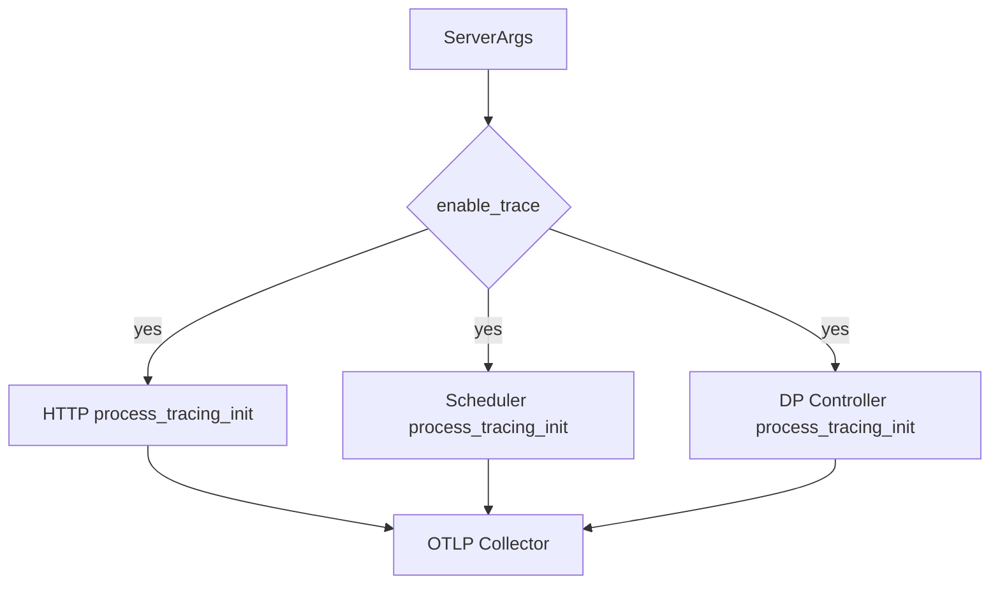
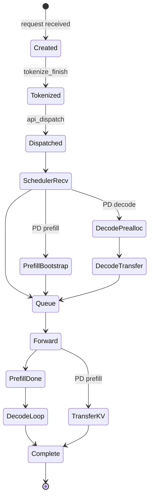

# `python/sglang/srt/observability` 源码分析

## 1. 模块定位

`observability` 是 SRT 的可观测性支撑层，覆盖三类能力：

- Prometheus metrics：scheduler、tokenizer、storage、radix cache、CPU、function、startup 等指标。
- OpenTelemetry tracing：请求级 root span、线程 span、阶段 slice/event、跨进程 trace context 传播。
- 请求耗时统计与导出：TTFT、ITL、E2E、queue、prefill/decode、PD disaggregation 阶段耗时，以及按请求落文件。

它不驱动推理逻辑，而是被 `entrypoints`、`managers`、cache/storage、EPLB 等模块调用。对 `model_executor` 的直接依赖较少，主要读取 `ForwardMode` 和 scheduler 内部的 model runner 状态来上报 MFU、LoRA、显存等指标。

## 2. 文件结构

```text
observability/
  cpu_monitor.py
  func_timer.py
  label_transform.py
  metrics_collector.py
  req_time_stats.py
  request_metrics_exporter.py
  scheduler_metrics_mixin.py
  startup_func_log_and_timer.py
  trace.py
  utils.py
```

关键文件：

- [metrics_collector.py](/mnt/shanhai-ai/shanhai-workspace/zhouhao6/sglang/python/sglang/srt/observability/metrics_collector.py)：Prometheus collector 主文件。
- [req_time_stats.py](/mnt/shanhai-ai/shanhai-workspace/zhouhao6/sglang/python/sglang/srt/observability/req_time_stats.py)：请求耗时状态机。
- [trace.py](/mnt/shanhai-ai/shanhai-workspace/zhouhao6/sglang/python/sglang/srt/observability/trace.py)：OpenTelemetry 初始化、span、跨进程传播。
- [scheduler_metrics_mixin.py](/mnt/shanhai-ai/shanhai-workspace/zhouhao6/sglang/python/sglang/srt/observability/scheduler_metrics_mixin.py)：混入 `Scheduler` 的统计逻辑。
- [request_metrics_exporter.py](/mnt/shanhai-ai/shanhai-workspace/zhouhao6/sglang/python/sglang/srt/observability/request_metrics_exporter.py)：请求级性能记录导出。
- [cpu_monitor.py](/mnt/shanhai-ai/shanhai-workspace/zhouhao6/sglang/python/sglang/srt/observability/cpu_monitor.py)：后台线程采集进程 CPU seconds。
- [func_timer.py](/mnt/shanhai-ai/shanhai-workspace/zhouhao6/sglang/python/sglang/srt/observability/func_timer.py)：函数耗时 histogram。
- [startup_func_log_and_timer.py](/mnt/shanhai-ai/shanhai-workspace/zhouhao6/sglang/python/sglang/srt/observability/startup_func_log_and_timer.py)：启动阶段耗时。

## 3. 模块关系

```mermaid
flowchart LR
    HTTP[entrypoints/http_server] --> TM[TokenizerManager]
    Engine[entrypoints/engine] --> PROMDIR[set_prometheus_multiproc_dir]
    TM --> TMC[TokenizerMetricsCollector]
    TM --> RTS[APIServerReqTimeStats]
    DPC[DataParallelController] --> DRTS[DPControllerReqTimeStats]
    SCH[Scheduler] --> SMX[SchedulerMetricsMixin]
    SMX --> SMC[SchedulerMetricsCollector]
    SCH --> SRTS[SchedulerReqTimeStats]
    RTS --> TRACE[TraceReqContext]
    SRTS --> TRACE
    TRACE --> OTLP[OTLP exporter]
    SMC --> PROM[/metrics]
    TMC --> PROM
```

## 4. Prometheus Metrics

核心 collector：

- `SchedulerMetricsCollector`
  - 注册和更新 scheduler 指标。
  - `log_stats()` 将 `SchedulerStats` 写入 gauges/histograms。
  - 覆盖 running/queue req、token usage、throughput、cache hit、retract、PD 队列、LoRA、HiCache、routing key。
- `TokenizerMetricsCollector`
  - 请求级 token、TTFT、ITL、E2E、abort、cached token source breakdown。
- `StorageMetricsCollector`
  - HiCache/L3 storage prefetch/backup tokens、pages、bandwidth。
- `RadixCacheMetricsCollector`
  - eviction/load-back duration 和 token 数。
- `ExpertDispatchCollector`
  - expert dispatch 相关统计。

典型指标：

- `sglang:num_running_reqs`
- `sglang:num_used_tokens`
- `sglang:token_usage`
- `sglang:gen_throughput`
- `sglang:cache_hit_rate`
- `sglang:num_retracted_requests_total`
- `sglang:queue_time_seconds`
- `sglang:per_stage_req_latency_seconds`
- `sglang:prompt_tokens_total`
- `sglang:generation_tokens_total`
- `sglang:time_to_first_token_seconds`
- `sglang:inter_token_latency_seconds`
- `sglang:e2e_request_latency_seconds`

Prometheus 初始化链路：



要点：

- `PROMETHEUS_MULTIPROC_DIR` 必须在导入 `prometheus_client` 前设置。
- `/metrics` 通过 `prometheus_client.multiprocess.MultiProcessCollector` 汇总多进程指标。
- 默认只有 TP rank 0 上报 scheduler metrics；需要全 rank 时使用 `--enable-metrics-for-all-schedulers`。

## 5. Tracing

[trace.py](/mnt/shanhai-ai/shanhai-workspace/zhouhao6/sglang/python/sglang/srt/observability/trace.py) 是 OpenTelemetry 适配层。

核心能力：

- `process_tracing_init(otlp_endpoint, server_name)` 初始化 tracer provider、batch processor、OTLP exporter。
- 支持 `grpc` 和 `http/protobuf` 两种 OTLP traces protocol。
- `TRACE_HEADERS = ["traceparent", "tracestate"]`。
- `TraceReqContext` 维护请求 root span、thread span、slice span、event。
- `__getstate__` / `__setstate__` 通过 carrier 传播 root span context，适配 ZMQ/pickle。
- `SpanAttributes` 定义 GenAI 语义属性，如 prompt tokens、completion tokens、cached tokens、TTFT、E2E、model、finish reason。

OTLP 初始化：



## 6. 请求耗时状态机

[req_time_stats.py](/mnt/shanhai-ai/shanhai-workspace/zhouhao6/sglang/python/sglang/srt/observability/req_time_stats.py) 定义：

- `APIServerReqTimeStats`
- `DPControllerReqTimeStats`
- `SchedulerReqTimeStats`
- `RequestStage`

它们负责分阶段时间戳、跨进程时间基准转换、Prometheus per-stage latency、trace slice 生成、返回 `meta_info`。



请求统计链路：

1. `TokenizerManager._req_stats_init()` 创建 `APIServerReqTimeStats`，提取 trace headers。
2. tokenization 完成后记录 tokenize finish；发送 scheduler 前后记录 dispatch。
3. Scheduler 创建 `Req` 时转为 `SchedulerReqTimeStats`。
4. 入队、forward、prefill/decode 完成、completion 等节点记录阶段。
5. Scheduler 输出时把 `time_stats` 放入 `BatchTokenIDOutput` / `BatchEmbeddingOutput`。
6. Tokenizer 收到结果后记录 first token、finished、E2E，并调用 `collect_metrics()`。

## 7. Logging 与 Exporter

日志分三层：

- `SchedulerMetricsMixin.report_prefill_stats()` / `report_decode_stats()`：batch 周期日志。
- `Req.log_time_stats()`：单请求 queue/forward/bootstrap/transfer 耗时，受 `--enable-request-time-stats-logging` 控制。
- `RequestMetricsExporterManager`：请求级性能记录导出，标准实现是 `FileRequestMetricsExporter`。

[cpu_monitor.py](/mnt/shanhai-ai/shanhai-workspace/zhouhao6/sglang/python/sglang/srt/observability/cpu_monitor.py) 以 daemon thread 递增 `sglang:process_cpu_seconds_total{component=...}`。

## 8. 与其它模块的关系

- `entrypoints/http_server.py`：挂载 `/metrics`、启用 function timer、初始化 tracing。
- `entrypoints/engine.py`：启动前设置 Prometheus multiprocess dir。
- `managers/tokenizer_manager.py`：创建 tokenizer metrics collector、请求 stats、request exporter、CPU monitor。
- `managers/scheduler.py`：继承 `SchedulerMetricsMixin`，初始化 tracing，创建 `Req` 时传入 stats。
- `managers/scheduler_output_processor_mixin.py`：设置输出完成时间，把 `time_stats` 带回 tokenizer。
- `managers/data_parallel_controller.py`：生成 DP dispatch span。
- `managers/detokenizer_manager.py`：透传输出中的 `time_stats`，启用 CPU monitor。
- `model_executor`：间接提供 model config、LoRA manager、graph memory usage、ForwardMode。

## 9. 配置与环境变量

ServerArgs：

- `--enable-metrics`
- `--enable-mfu-metrics`
- `--enable-metrics-for-all-schedulers`
- `--extra-metric-labels`
- `--bucket-time-to-first-token`
- `--bucket-inter-token-latency`
- `--bucket-e2e-request-latency`
- `--collect-tokens-histogram`
- `--prompt-tokens-buckets`
- `--generation-tokens-buckets`
- `--decode-log-interval`
- `--enable-request-time-stats-logging`
- `--kv-events-config`
- `--enable-trace`
- `--otlp-traces-endpoint`
- `--export-metrics-to-file`
- `--export-metrics-to-file-dir`

环境变量：

- `PROMETHEUS_MULTIPROC_DIR`
- `OTEL_EXPORTER_OTLP_TRACES_PROTOCOL`
- `SGLANG_OTLP_EXPORTER_SCHEDULE_DELAY_MILLIS`
- `SGLANG_OTLP_EXPORTER_MAX_EXPORT_BATCH_SIZE`
- `SGLANG_ENABLE_METRICS_DEVICE_TIMER`
- `SGLANG_ENABLE_METRICS_DP_ATTENTION`
- `SGLANG_LOG_FORWARD_ITERS`
- `SGLANG_RECORD_STEP_TIME`
- `SGLANG_TEST_REQUEST_TIME_STATS`
- `SGLANG_BUCKET_EVICTION_DURATION`
- `SGLANG_BUCKET_LOAD_BACK_DURATION`
- `SGLANG_LOG_REQUEST_HEADERS`
- `SGLANG_DISABLE_REQUEST_LOGGING`
- `SGLANG_LOG_REQUEST_EXCEEDED_MS`
- `SGLANG_LOG_SCHEDULER_STATUS_TARGET`
- `SGLANG_LOG_SCHEDULER_STATUS_INTERVAL`

## 10. 扩展点

- 新 Prometheus 指标：扩展 `SchedulerStats`、collector、scheduler mixin。
- 新请求级指标：扩展 `TokenizerMetricsCollector` 和 `TokenizerManager.collect_metrics()`。
- 新请求阶段：扩展 `RequestStage`，在业务点记录 stage。
- 新 trace 属性：扩展 `SpanAttributes` 并注入 converter。
- 新 request metrics exporter：实现 `RequestMetricsExporter.write_record()` 并接入 factory。
- 新 histogram bucket：扩展 `generate_buckets()` 或相关 env bucket。

## 11. 常见问题与排障

- **Prometheus 无指标**：检查 `--enable-metrics`、`PROMETHEUS_MULTIPROC_DIR` 设置时机、HTTP lifespan、访问 `/metrics`。
- **trace 初始化失败**：检查 OpenTelemetry 依赖、OTLP protocol、endpoint。
- **trace 断链**：检查 `traceparent/tracestate` header 和 `TraceReqContext` 是否跨进程传播。
- **指标 cardinality 过高**：注意 `extra_metric_labels`、custom labels、priority、routing key。
- **性能开销**：metrics、device timer、trace、token histogram 都会增加开销。
- **请求耗时异常**：可用 `SGLANG_TEST_REQUEST_TIME_STATS=true` 触发断言。
- **request metrics 落文件失败**：`--export-metrics-to-file` 必须同时设置目录；写失败只打日志。
