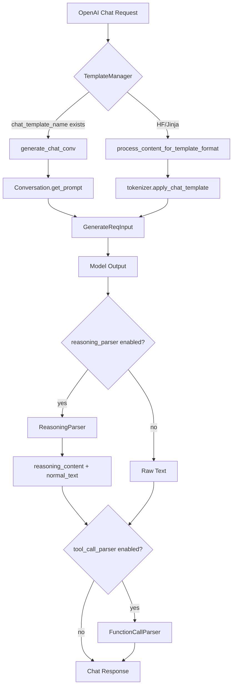
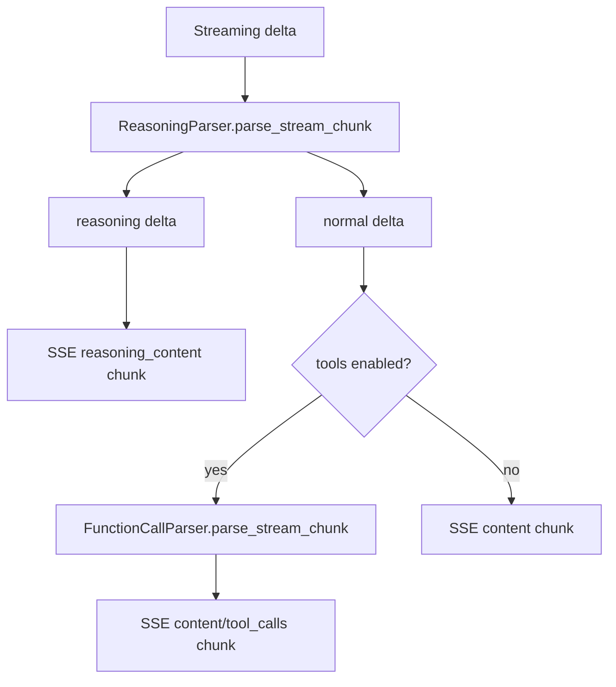

# `python/sglang/srt/parser` 源码分析

## 1. 模块定位

`parser` 是 SRT 的文本协议适配与输出切分模块。它不负责模型推理，而是在 OpenAI/内部请求、模型模板、模型输出格式之间做转换。

核心职责：

- 输入侧：chat/completion/embedding prompt 模板化，包括传统 `Conversation` 模板、HF Jinja chat template、多模态内容抽取、FIM code completion。
- 输出侧：reasoning 内容与普通回答分离，支持 `<think>...</think>`、Kimi、Mistral、GPT-OSS Harmony 等格式。
- Harmony：提供 `HarmonyParser`，被 GPT-OSS reasoning parser 和 GPT-OSS tool-call detector 共同复用。

tool parser 主体不在本目录，而在 `function_call`；`parser` 目录只通过 `HarmonyParser` 为 GPT-OSS 工具调用提供底层事件解析能力。

## 2. 文件结构

```text
parser/
  code_completion_parser.py
  conversation.py
  harmony_parser.py
  jinja_template_utils.py
  reasoning_parser.py
```

- [conversation.py](/mnt/shanhai-ai/shanhai-workspace/zhouhao6/sglang/python/sglang/srt/parser/conversation.py)：传统 conversation template 注册、选择、渲染。
- [code_completion_parser.py](/mnt/shanhai-ai/shanhai-workspace/zhouhao6/sglang/python/sglang/srt/parser/code_completion_parser.py)：FIM code completion 模板。
- [jinja_template_utils.py](/mnt/shanhai-ai/shanhai-workspace/zhouhao6/sglang/python/sglang/srt/parser/jinja_template_utils.py)：HF Jinja chat template content format 探测与多模态消息预处理。
- [reasoning_parser.py](/mnt/shanhai-ai/shanhai-workspace/zhouhao6/sglang/python/sglang/srt/parser/reasoning_parser.py)：reasoning 输出分离 facade。
- [harmony_parser.py](/mnt/shanhai-ai/shanhai-workspace/zhouhao6/sglang/python/sglang/srt/parser/harmony_parser.py)：GPT-OSS/Harmony 文本流解析器。

## 3. Chat 输入与输出链路



非流式：

1. `ServingChat._process_messages()` 判断工具、模板、多模态。
2. 无传统模板时走 HF Jinja；否则走 `generate_chat_conv()`。
3. 模型生成返回 text。
4. 若开启 reasoning 且请求要求分离，调用 `ReasoningParser.parse_non_stream()`。
5. 若开启 tool call 且请求包含 tools，调用 `FunctionCallParser.parse_non_stream()`。
6. 构造 OpenAI chat response。

流式：



## 4. Reasoning Parser

`ReasoningParser` 对外接口：

- `parse_non_stream(full_text) -> (reasoning_text, normal_text)`
- `parse_stream_chunk(chunk_text) -> (reasoning_text, normal_text)`

`BaseReasoningFormatDetector` 维护：

- `think_start_token`
- `think_end_token`
- `_in_reasoning`
- `_buffer`
- `stream_reasoning`
- `tool_start_token`
- `continue_final_message`
- `previous_content`

逻辑：

- 非流式：按 start/end token 切分 reasoning 与 normal；缺 end token 时认为 reasoning 被截断。
- 流式：缓冲 partial token；进入 reasoning 后按 `stream_reasoning` 决定实时吐出还是等 end token。
- 有 `tool_start_token` 时，工具段会提前结束 reasoning，并把工具起始 token 留给 normal text。

支持的 detector 包括：

- `deepseek-r1`
- `deepseek-v3`
- `glm45`
- `gpt-oss`
- `kimi`
- `kimi_k2`
- `qwen3`
- `qwen3-thinking`
- `mistral`
- `nemotron_3`
- `minimax`
- `step3`
- `interns1`

特殊点：

- `gpt-oss` 使用 `HarmonyParser`，将 `analysis` channel 转为 reasoning。
- `MistralDetector` 使用 `[THINK]` / `[/THINK]`。
- `KimiK2Detector` 与 `Glm45Detector` 使用 tool start token 避免 reasoning 吞掉工具结构。

## 5. Harmony Parser

`HarmonyParser` 解析 GPT-OSS/Harmony 文本流，输出事件：

- `reasoning`
- `normal`
- `tool_call`

```mermaid
flowchart TD
    A[HarmonyParser.parse(chunk)] --> B{strategy selected?}
    B -->|canonical markers| C[CanonicalStrategy]
    B -->|text fallback markers| D[TextStrategy]
    C --> E[Event: reasoning]
    C --> F[Event: normal]
    C --> G[Event: tool_call raw_text]
    D --> E
    D --> F
    G --> H[GPT-OSS FunctionCall Detector]
    E --> I[GPT-OSS Reasoning Detector]
    F --> I
```

关键结构：

- `Event(event_type, content, raw_text=None)`
- `Token(type, start, end)`
- `prefix_hold(text, tokens)`：流式安全函数，chunk 尾部可能是结构 token 前缀时暂不输出。
- `iter_tokens(text)`：扫描 `<|start|>`、`<|channel|>`、`<|message|>`、`<|constrain|>`、`<|end|>`、`<|call|>`、`<|return|>`。
- `CanonicalStrategy`：标准 Harmony 格式。
- `TextStrategy`：fallback 文本格式。

GPT-OSS tool call 形态：

```text
<|channel|>commentary to={namespace.function}<|constrain|>json<|message|>{args}<|call|>
```

`function_call/gpt_oss_detector.py` 也持有 `HarmonyParser`，用 `tool_call` event 的 `raw_text` 提取工具名和 JSON 参数。

## 6. Conversation / Template

[conversation.py](/mnt/shanhai-ai/shanhai-workspace/zhouhao6/sglang/python/sglang/srt/parser/conversation.py) 中的 `Conversation` 表示传统 prompt 模板：

- `system_template`
- `system_message`
- `roles`
- `messages`
- `sep_style`
- `sep` / `sep2`
- `stop_str`
- `image_token` / `video_token` / `audio_token`
- `image_data` / `video_data` / `audio_data` / `modalities`

注册机制：

- `chat_templates`
- `register_conv_template()`
- `register_conv_template_matching_function()`
- `get_conv_template_by_model_path()`

构造函数：

- `generate_chat_conv(request, template_name)`
- `generate_embedding_convs(texts, images, videos, template_name)`

[managers/template_manager.py](/mnt/shanhai-ai/shanhai-workspace/zhouhao6/sglang/python/sglang/srt/managers/template_manager.py) 负责显式 `--chat-template`、model path 猜测、HF tokenizer/processor template fallback、`.jinja`、JSON conversation template、completion template 加载。

## 7. Jinja Template Utils

[jinja_template_utils.py](/mnt/shanhai-ai/shanhai-workspace/zhouhao6/sglang/python/sglang/srt/parser/jinja_template_utils.py) 负责：

- `detect_jinja_template_content_format(chat_template)`：返回 `string` 或 `openai`。
- `process_content_for_template_format(...)`：
  - `openai`：保留结构化 content list，并把 image/video/audio URL 归一化。
  - `string`：只拼 text。
  - `use_dpsk_v32_encoding=True`：提取多模态数据，但 content 转字符串。

调用点在 `entrypoints/openai/serving_chat.py::_apply_jinja_template()`。

## 8. Code Completion Parser

[code_completion_parser.py](/mnt/shanhai-ai/shanhai-workspace/zhouhao6/sglang/python/sglang/srt/parser/code_completion_parser.py) 提供 FIM prompt：

- `FimPosition.MIDDLE`
- `FimPosition.END`
- `CompletionTemplate`
- `generate_completion_prompt_from_request(request)`
- `generate_completion_prompt(prompt, suffix, template_name)`

内置模板：

- `deepseek_coder`
- `star_coder`
- `qwen_coder`

如果 `suffix == ""`，直接返回原 prompt；否则按模板拼 FIM。

## 9. 与其它模块的关系

- `entrypoints/openai/serving_chat.py`：模板化、reasoning/tool call 流式输出。
- `entrypoints/openai/serving_completions.py`：FIM completion。
- `entrypoints/openai/serving_responses.py`：Responses API reasoning output items。
- `entrypoints/http_server.py`：native `/parse_function_call` 和 `/separate_reasoning`。
- `function_call`：tool parser 主体，GPT-OSS detector 复用 `HarmonyParser`。
- `constrained`：Scheduler 根据 reasoning parser 的 `think_end_id` 包装 grammar backend，避免 reasoning 阶段被结构化输出约束。
- `managers/detokenizer_manager.py`：GPT-OSS tool call stop token 不裁掉。

## 10. 配置

ServerArgs：

- `--chat-template`
- `--hf-chat-template-name`
- `--completion-template`
- `--reasoning-parser`
- `--tool-call-parser`

请求级开关：

- `separate_reasoning`
- `stream_reasoning`
- `chat_template_kwargs`
- `reasoning_effort`
- `continue_final_message`

`chat_template_kwargs` 常见字段：

- `enable_thinking`
- `thinking`
- `force_nonempty_content`

## 11. 扩展点

- 新 reasoning 格式：在 `reasoning_parser.py` 增加 detector 并注册到 `DetectorMap`。
- 新 Harmony 事件规则：修改 `CanonicalStrategy` 或 `TextStrategy`，注意 partial token hold。
- 新传统 chat template：调用 `register_conv_template()`，必要时增加 `SeparatorStyle`。
- 新 model path 自动匹配：添加 `@register_conv_template_matching_function`。
- 新 FIM 模板：调用 `register_completion_template()` 或提供 JSON completion template。
- 新 HF Jinja 内容处理：修改 AST 检测或 content conversion。

## 12. 常见问题与排障

- **detector 构造参数不兼容**：`continue_final_message`、`force_nonempty_content` 可能传给不支持这些参数的 detector。
- **think_end_id 只取首 token**：多 token end marker 可能让 grammar wrapping 不准确。
- **Harmony strategy 不切换**：首次选定 canonical/text 后不会切换。
- **GPT-OSS tool call 顺序依赖**：reasoning parser 需要先运行，并把 tool raw text 留给 function-call parser。
- **Jinja content format 误判**：包含 image/audio/video/vision 关键词会倾向判为 `openai`。
- **Conversation.copy 不复制多模态字段**：直接外部使用 copy 时要谨慎。
- **tool call + reasoning 流式问题**：先看 reasoning parser 输出的 normal delta 是否仍保留工具结构 token。
