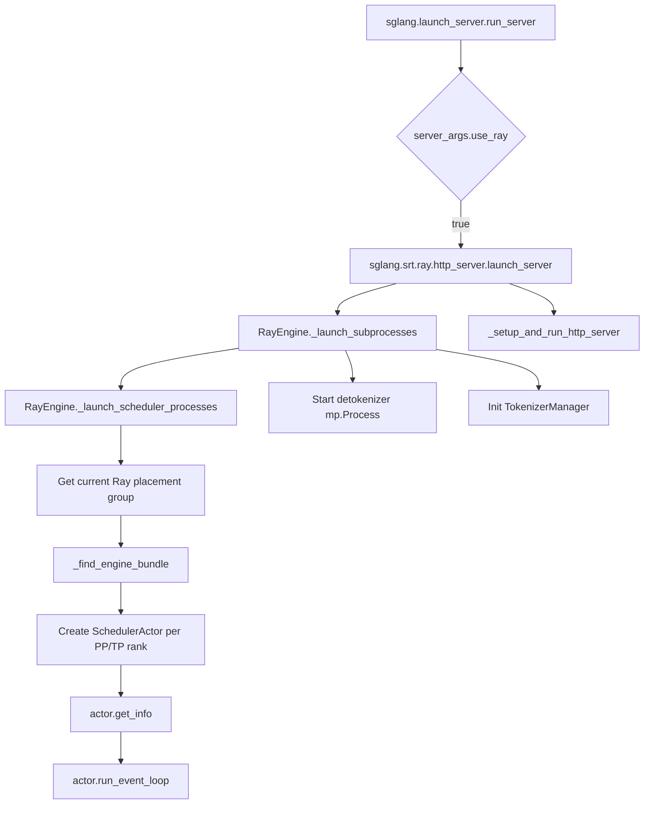
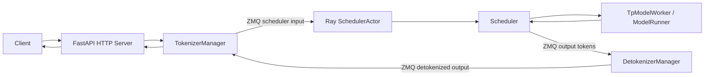
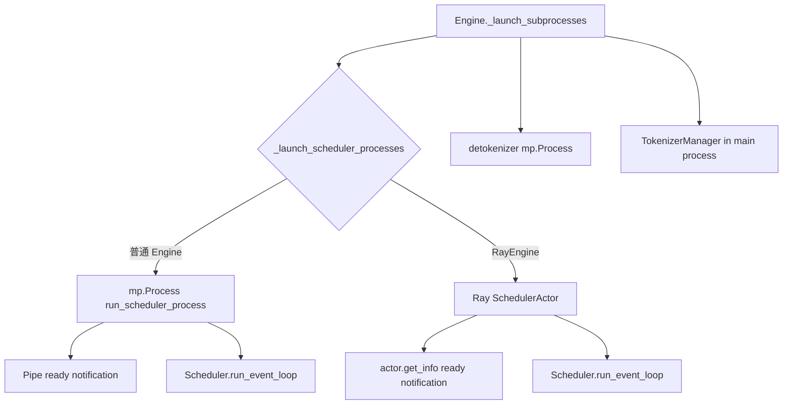

# `python/sglang/srt/ray` 源码分析

## 1. 模块定位

`ray` 是 SRT 对 Ray 的轻量适配层。它不重写推理通信或调度逻辑，而是把普通 `Engine` 中使用 `multiprocessing.Process` 启动 scheduler 的方式，替换为 Ray actor 启动与管理。

Ray 模式保留原有 SRT 数据通路：

```text
HTTP/FastAPI -> TokenizerManager -> ZMQ -> Scheduler -> DetokenizerManager -> TokenizerManager
```

Ray 只负责：

- scheduler 生命周期
- placement group 调度
- GPU 资源分配
- 跨节点 actor 放置

目录不包含 Ray Serve、Ray cluster bootstrap、Ray HTTP 服务实现。

## 2. 文件结构

```text
ray/
  __init__.py
  engine.py
  http_server.py
  scheduler_actor.py
```

- [__init__.py](/mnt/shanhai-ai/shanhai-workspace/zhouhao6/sglang/python/sglang/srt/ray/__init__.py)：导出 `RayEngine`。
- [engine.py](/mnt/shanhai-ai/shanhai-workspace/zhouhao6/sglang/python/sglang/srt/ray/engine.py)：Ray 版本 engine，定义 `RaySchedulerInitResult`、`RayEngine`。
- [scheduler_actor.py](/mnt/shanhai-ai/shanhai-workspace/zhouhao6/sglang/python/sglang/srt/ray/scheduler_actor.py)：Ray actor 包装器，每个 actor 对应一个 GPU 上的 scheduler + worker。
- [http_server.py](/mnt/shanhai-ai/shanhai-workspace/zhouhao6/sglang/python/sglang/srt/ray/http_server.py)：Ray-aware HTTP launcher，复用普通 HTTP server。

## 3. 启动链路



CLI 总入口在 [python/sglang/launch_server.py](/mnt/shanhai-ai/shanhai-workspace/zhouhao6/sglang/python/sglang/launch_server.py)。当 `server_args.use_ray` 为真时，导入 `sglang.srt.ray.http_server.launch_server()`。

若未安装 Ray，会提示：

```text
pip install 'sglang[ray]'
```

## 4. Ray HTTP Server

[ray/http_server.py](/mnt/shanhai-ai/shanhai-workspace/zhouhao6/sglang/python/sglang/srt/ray/http_server.py) 的 `launch_server()` 基本复用普通 HTTP server：

1. 引入 `_execute_server_warmup` 和 `_setup_and_run_http_server`。
2. 调用 `RayEngine._launch_subprocesses(...)`。
3. 将 tokenizer manager、template manager、port args、scheduler infos、watchdog 交给普通 HTTP setup。

因此 Ray 模式没有新的 HTTP 层，也没有使用 Ray Serve。

## 5. RayEngine

`RayEngine` 继承普通 [entrypoints/engine.py](/mnt/shanhai-ai/shanhai-workspace/zhouhao6/sglang/python/sglang/srt/entrypoints/engine.py) 中的 `Engine`。

覆盖行为：

- `shutdown()`：先 `ray.kill(actor)` 清理 scheduler actors，再调用 `super().shutdown()`。
- `_launch_scheduler_processes()`：将普通 `mp.Process` scheduler 替换为 Ray actor。

启动流程：

1. 检查 `dp_size`，当前 `dp_size > 1` 直接 `NotImplementedError`。
2. 获取当前 Ray placement group，必须非空。
3. 计算 `world_size = tp_size * pp_size`、`nnodes`、`gpus_per_node`。
4. `_find_engine_bundle()` 找到 Engine actor 所在 bundle。
5. 强制 rank-0 scheduler 与 Engine 同节点。
6. 设置 `dist_init_addr = rank0_node_ip : server_args.port + ZMQ_TCP_PORT_DELTA`。
7. 遍历每个 logical node 和 PP/TP rank。
8. 创建 `SchedulerActor.options(num_cpus=0, num_gpus=1, scheduling_strategy=PlacementGroupSchedulingStrategy(...)).remote(...)`。
9. `actor.get_info.remote()` 获取 scheduler init info。
10. `actor.run_event_loop.remote()` 启动 scheduler 主循环。

`RaySchedulerInitResult` 保存：

- `scheduler_infos`
- `scheduler_actors`
- event loop refs
- `wait_for_completion()` 中用 `ray.get(event_loop_refs)` 等待 actor。

## 6. Placement Group

`_find_engine_bundle(placement_group, nnodes)` 负责确定 Engine 当前运行在哪个 placement group bundle 上：

1. 读取 Engine 所在节点 IP。
2. 在每个 bundle 上调度 `num_cpus=0, num_gpus=0` 临时 remote function。
3. 收集各 bundle 的 node IP。
4. 找到与 Engine IP 匹配的 bundle index。
5. 找不到则报错。

RayEngine 将 logical node 0 映射到 Engine 所在 bundle，其它 node 使用剩余 bundle。

这和普通多节点 Engine 不同：普通模式每个节点独立启动本节点 scheduler；Ray 模式由一个 Engine actor 创建所有 scheduler actor。

## 7. SchedulerActor

[scheduler_actor.py](/mnt/shanhai-ai/shanhai-workspace/zhouhao6/sglang/python/sglang/srt/ray/scheduler_actor.py) 定义 `@ray.remote` actor。

每个 actor：

- 管理一个 GPU。
- 初始化普通 `Scheduler`。
- 运行 `scheduler.run_event_loop()`。
- 请求通信仍由 SGLang ZMQ 管理。

初始化流程：

1. 可选覆盖 `server_args.dist_init_addr`。
2. 从 Ray runtime context 获取实际 GPU id。
3. 调用普通 scheduler 的 `configure_scheduler()`。
4. 创建 `Scheduler`。
5. `get_info()` 返回 `scheduler.get_init_info()`。
6. `run_event_loop()` 先 `torch.cuda.set_device(self.scheduler.gpu_id)`，再调用 scheduler 主循环。

Ray actor 路径复用 `configure_scheduler` 和 `Scheduler`，但没有走普通 `run_scheduler_process()` 中的父进程死亡检测、CPU affinity、NUMA binding、trace 初始化和 pipe ready 通知逻辑。

## 8. 数据流



Ray 不在请求数据面转发 token 或请求；它只在控制面创建、调度和销毁 actor。

## 9. 与普通 Engine 的差异



通用 `_launch_subprocesses()` 仍会：

- configure logger/env
- check server args
- init PortArgs
- 启动 detokenizer process
- 初始化 TokenizerManager
- 等待 scheduler ready
- 启动 watchdog

RayEngine 只覆盖 scheduler 启动步骤。detokenizer 仍是本地 `mp.Process`。

## 10. 配置与边界

显式参数：

- `--use-ray`
- `--nnodes`
- `--tp-size`
- `--pp-size`
- `--dp-size`
- `--dist-init-addr`
- `--port`
- `--nccl-port`

限制：

- 不实现 Ray Serve。
- 不负责 Ray cluster 创建。
- `use_ray=True` 要求当前执行上下文已有 Ray placement group。
- 当前只支持 `dp_size == 1`。
- Scheduler actor 每个占用 `num_gpus=1`。
- Detokenizer 不是 Ray actor。
- `base_gpu_id` / `gpu_id_step` 对 Ray 实际 GPU 分配影响有限，actor 优先使用 Ray runtime context GPU id。
- Ray 目录本身没有新增 `SGLANG_*` 或 `RAY_*` 环境变量读取。

## 11. 扩展点

- 支持 `dp_size > 1`：需要 Ray actor 版 DataParallelController 或改造 controller 启动模式。
- 将 detokenizer 也 Ray actor 化。
- 在 `SchedulerActor` 中补齐 trace、CPU affinity、NUMA binding、父进程/actor 生命周期联动。
- 支持自定义 `run_scheduler_process_func` 或自定义 SchedulerActor。
- 提供 placement group 创建辅助。
- 增加 Ray actor 健康检查和重启策略。
- 校验多节点 bundle 拓扑、GPU 数、`nnodes` 与 placement group 的一致性。

## 12. 常见问题与排障

- **未安装 Ray**：入口导入失败，提示安装 `sglang[ray]`。
- **没有 placement group**：`use_ray=True` 会抛 `RuntimeError`。
- **Engine 不在 placement group bundle 中**：`_find_engine_bundle()` 报错。
- **`dp_size > 1`**：直接 `NotImplementedError`。
- **actor 初始化失败**：RayEngine 会 kill 已创建 actors 并抛 `Scheduler actor failed to initialize`。
- **event loop 崩溃**：`wait_for_completion()` 中 `ray.get()` 会记录 actor 终止错误。
- **GPU 分配异常**：检查 Ray runtime context 的 assigned GPU。
- **trace/NUMA/CPU affinity 差异**：Ray actor 路径没有执行普通 scheduler process 的相关逻辑。
- **watchdog 覆盖不足**：`scheduler_procs=None`，本地 watchdog 不直接监控 Ray scheduler actor。
