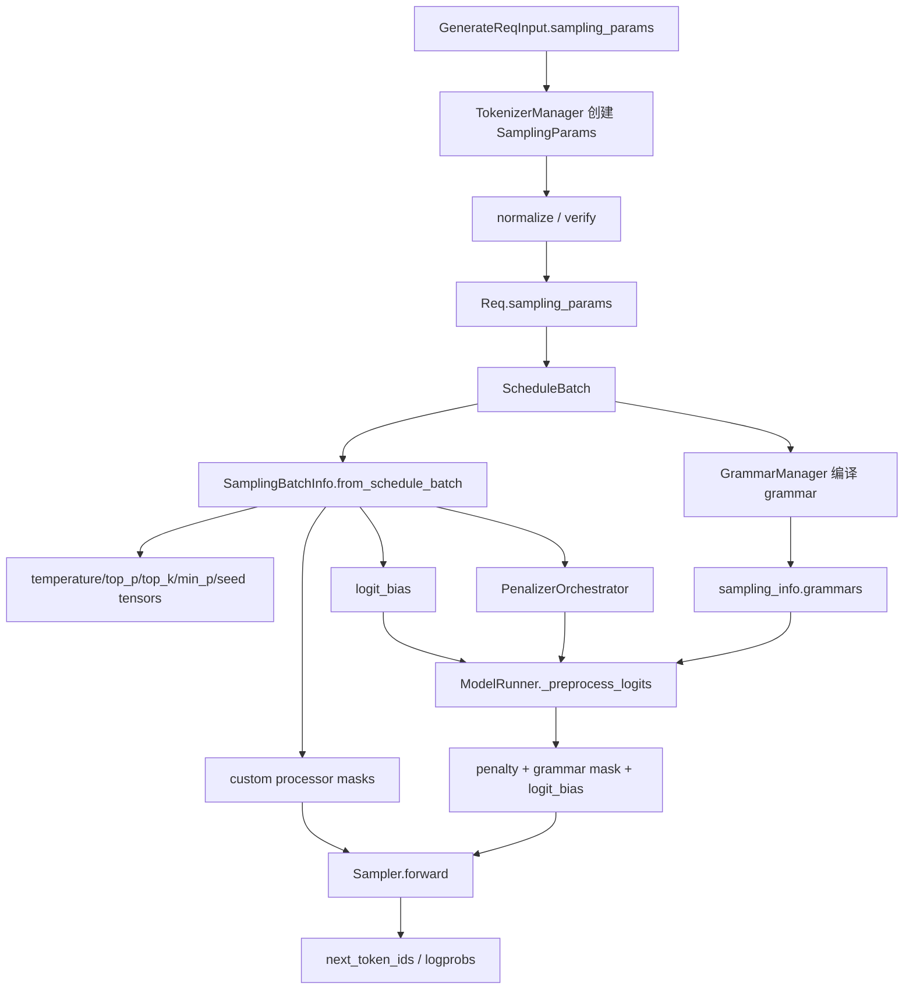

# `python/sglang/srt/sampling` 源码分析

## 1. 模块定位

`sampling` 是 SRT 生成链路中连接“请求级采样参数”和“模型 logits 后处理/抽样”的中间层。它本身不直接完成最终 token 抽样，最终抽样主要在 `python/sglang/srt/layers/sampler.py` 的 `Sampler` 中完成；本目录负责：

- 定义并校验请求级 `SamplingParams`。
- 将一批请求的采样参数 tensor 化为 `SamplingBatchInfo`。
- 维护 frequency/presence/repetition/min-new-tokens 等 penalty 状态。
- 为 grammar/constrained decoding 准备 vocab mask。
- 管理 `logit_bias` 与自定义 logit processor。
- 支持 batch filter/merge/copy，以及 overlap/speculative 路径中的前向状态复制。

核心设计思想是把用户 API 里的灵活采样配置转化为模型执行阶段可高效批处理的张量状态，并把 penalty、grammar mask、bias 等 logits 约束统一收敛到一个批级对象中。

## 2. 文件结构

```text
python/sglang/srt/sampling/
├── sampling_params.py          # 请求级采样参数与校验
├── sampling_batch_info.py      # 批级采样张量、penalty、grammar mask、bias
├── custom_logit_processor.py   # 自定义 logits processor 序列化与执行协议
└── penaltylib/
    ├── orchestrator.py         # BatchedPenalizerOrchestrator 与基类
    ├── frequency_penalty.py    # frequency penalty
    ├── presence_penalty.py     # presence penalty
    ├── repetition_penalty.py   # repetition penalty
    └── min_new_tokens.py       # min_new_tokens 前屏蔽 stop/eos
```

关键源码：

- `python/sglang/srt/sampling/sampling_params.py`
- `python/sglang/srt/sampling/sampling_batch_info.py`
- `python/sglang/srt/sampling/custom_logit_processor.py`
- `python/sglang/srt/sampling/penaltylib/orchestrator.py`
- `python/sglang/srt/layers/sampler.py`
- `python/sglang/srt/model_executor/model_runner.py`
- `python/sglang/srt/managers/schedule_batch.py`

## 3. 总体架构



数据分层非常明确：

- `SamplingParams`：每个请求一份，偏 API 语义。
- `SamplingBatchInfo`：每个 batch 一份，偏 GPU 执行语义。
- `PenalizerOrchestrator`：隐藏多种 penalty 的启用、状态累计、应用、filter/merge。
- `Sampler`：消费 `SamplingBatchInfo` 与 logits，做实际概率分布过滤和 token 选择。

## 4. `SamplingParams`

`SamplingParams` 是请求级对象，覆盖长度、停止条件、采样分布、penalty、约束生成和扩展参数。

主要字段：

- 长度与停止：`max_new_tokens`、`stop`、`stop_token_ids`、`stop_regex`、`min_new_tokens`。
- 采样分布：`temperature`、`top_p`、`top_k`、`min_p`。
- penalty：`frequency_penalty`、`presence_penalty`、`repetition_penalty`。
- 结构化约束：`json_schema`、`regex`、`ebnf`、`structural_tag`。
- 输出控制：`ignore_eos`、`skip_special_tokens`、`spaces_between_special_tokens`、`no_stop_trim`、`stream_interval`。
- 扩展能力：`custom_params`、`custom_logit_processor`、`logit_bias`、`sampling_seed`。

关键归一化规则：

- `0 <= temperature < 1e-6` 会转为 greedy：`temperature=1.0` 且 `top_k=1`。
- `top_k == -1` 会转成 `TOP_K_ALL = 1 << 30`。
- `stop_token_ids` 转成 `set`，方便结束判断。
- `regex/json_schema/ebnf` 最多只能设置一种。
- `normalize(tokenizer)` 会把 `stop` 与 `stop_regex` 归一成列表，并估算 stop regex 需要的最大缓冲长度。

入口通常在 `TokenizerManager._create_tokenized_object`：它合并 `preferred_sampling_params` 与请求参数，实例化 `SamplingParams`，再调用 `normalize()` 与 `verify(vocab_size)`。

## 5. 批级状态：`SamplingBatchInfo`

`SamplingBatchInfo.from_schedule_batch(batch, vocab_size)` 将 batch 内所有请求的采样参数转为 GPU tensor：

- `temperatures`: `[bs, 1]`
- `top_ps`: `[bs]`
- `top_ks`: `[bs]`
- `min_ps`: `[bs]`
- `sampling_seed`: deterministic inference 时启用
- `logit_bias`: 可选 `[bs, vocab_size]`

同时它维护快速分支标志：

- `is_all_greedy`
- `need_top_p_sampling`
- `need_top_k_sampling`
- `need_min_p_sampling`
- `has_custom_logit_processor`

`filter_batch()` 与 `merge_batch()` 是调度层的关键接口。scheduler 会频繁过滤已结束请求、合并新请求，因此所有批级张量、penalty 状态、custom processor mask、logit bias 都必须保持和请求顺序一致。

## 6. Penalty 系统

`penaltylib` 使用统一 orchestrator 管理四类 penalty：

- `BatchedFrequencyPenalizer`：按输出 token 出现次数累计扣分。
- `BatchedPresencePenalizer`：只要 token 出现过就扣一次。
- `BatchedRepetitionPenalizer`：乘法型 penalty，正 logits 除以 penalty，负 logits 乘以 penalty。
- `BatchedMinNewTokensPenalizer`：生成长度不足 `min_new_tokens` 时屏蔽 stop/eos。

每个 penalizer 都实现相同生命周期：

- `_is_required()`：判断 batch 内是否有请求需要启用。
- `_prepare()`：分配状态 tensor。
- `_cumulate_output_tokens(output_ids)`：每步 decode 后累计状态。
- `_apply(logits)`：就地修改 logits。
- `_filter()` / `_merge()`：随 batch filter/merge 同步状态。
- `_teardown()`：释放引用，避免状态泄漏。

penalty 状态推进发生在 decode 步之间。overlap 路径中，`SamplingBatchInfo.copy_for_forward()` 会先把 penalty 累计到 `acc_additive_penalties` 与 `acc_scaling_penalties`，再复制给 forward 闭包，避免闭包长期持有 orchestrator。

## 7. Logits 后处理顺序

`SamplingBatchInfo.apply_logits_bias(logits)` 名称偏窄，但实际统一处理三类 logits 修改：

1. overlap 模式下应用预累计 additive/scaling penalties。
2. 非 overlap 模式下调用 `penalizer_orchestrator.apply(logits)`。
3. 如果存在 grammar vocab mask，调用 constrained backend 的 `apply_vocab_mask`。
4. 如果存在 `logit_bias`，执行 `logits.add_(logit_bias)`。

随后 `layers.sampler.Sampler.forward` 再应用 custom logit processor、NaN 检测、temperature 缩放、top-k/top-p/min-p 过滤和抽样。

这个顺序很重要：custom logit processor 看到的是已经经过 penalty、grammar mask、logit bias 处理后的 logits。

## 8. Grammar Mask 集成

`sampling` 不负责编译 grammar，而是消费 `constrained` 模块生成的 grammar 对象。

典型流程：

```text
请求带 regex/json_schema/ebnf
  -> GrammarManager 编译或复用 grammar
  -> ScheduleBatch 将 req.grammar 放入 sampling_info.grammars
  -> ModelRunner._preprocess_logits 调 update_regex_vocab_mask()
  -> apply_logits_bias() 调 grammar backend apply_vocab_mask()
  -> 应用后清空 sampling_info.vocab_mask
```

清空 `vocab_mask` 是重要的显存保护，尤其在 overlap 中，如果 result queue 或闭包继续持有大 GPU mask，容易造成显存无法及时释放。

## 9. 自定义 Logit Processor

`custom_logit_processor.py` 提供 `CustomLogitProcessor` 抽象基类，支持把 processor 通过 `dill` 序列化为字符串传入请求，再在 worker 侧反序列化执行。

关键机制：

- `to_str()`：`dill.dumps(cls).hex()` 后包成 JSON。
- `from_str()`：`orjson.loads` + `dill.loads`，并使用 `lru_cache` 避免重复反序列化。
- `SamplingBatchInfo.from_schedule_batch` 会按 processor 字符串分组，相同 processor 只反序列化一次，并维护 batch mask。

安全边界由 `--enable-custom-logit-processor` 控制。未启用时，`TokenizerManager._validate_one_request` 会拒绝带 custom processor 的请求。

## 10. 与 `layers.sampler` 的边界

`sampling` 模块准备参数和 logits 修改，实际抽样由 `layers/sampler.py` 完成：

- 全 greedy：`torch.argmax(logits, -1)`。
- 无 top-p/top-k/min-p：直接按概率 multinomial。
- FlashInfer backend：使用 flashinfer sampling kernel。
- PyTorch backend：使用 torch 版 top-k/top-p/min-p 过滤。
- Ascend backend：走 NPU 专用路径。
- deterministic inference：通过 `sampling_seed` 使用 seeded multinomial，且会强制 sampling backend 为 PyTorch。

因此新增采样参数时通常需要同时检查三处：`SamplingParams`、`SamplingBatchInfo`、`Sampler.forward`。

## 11. 配置与环境变量

常见 server args：

- `--sampling-backend`
- `--enable-deterministic-inference`
- `--enable-custom-logit-processor`
- `--preferred-sampling-params`
- `--sampling-defaults`

常见环境变量：

- `SYNC_TOKEN_IDS_ACROSS_TP`：强制 TP rank 同步 next token。
- `SGLANG_RETURN_ORIGINAL_LOGPROB`：返回 temperature/filter 前的原始 logprob。
- `SGLANG_DISABLE_CONSECUTIVE_PREFILL_OVERLAP`：影响 overlap 调度。
- `SGLANG_ENABLE_DETERMINISTIC_INFERENCE`：确定性推理相关运行时标记。

## 12. 扩展指南

新增采样参数：

1. 在 `SamplingParams` 中定义字段、默认值、校验和归一化逻辑。
2. 在 `SamplingBatchInfo.from_schedule_batch` 中转为批级 tensor 或列表。
3. 如果参与调度状态，需要补齐 `filter_batch()`、`merge_batch()`、`copy_for_forward()`。
4. 在 `ModelRunner` 或 `Sampler` 中消费该状态。

新增 penalty：

1. 实现 `_BatchedPenalizer` 子类。
2. 定义 `_is_required/_prepare/_cumulate_output_tokens/_apply/_filter/_merge`。
3. 注册到 `SamplingBatchInfo.from_schedule_batch` 创建的 orchestrator。

新增 sampler backend：

1. 在 `layers/sampler.py` 中实现 `Sampler` 子类或 factory。
2. 通过 `register_sampler_backend(backend, factory)` 注册。
3. 明确 deterministic、min-p、logprob、TP sync 的支持边界。

## 13. 风险与排障

- penalty 与 logit bias 可能形成 `[batch, vocab_size]` 大张量，大 batch/大 vocab 下显存压力明显。
- `dill` 反序列化 custom processor 具备代码执行能力，生产环境必须谨慎开启。
- grammar、penalty、logit bias、custom processor 的顺序会改变模型输出，修改时必须明确语义。
- deterministic inference 与 FlashInfer sampling seed 不兼容，开启确定性推理会走 PyTorch backend。
- `min_new_tokens` 会屏蔽 stop/eos，如果用户观察到 EOS 不生效，需要先检查该参数。
- `top_k=-1` 在内部会显示为 `TOP_K_ALL` 大整数，这是预期行为。
- overlap/speculative 路径对 `copy_for_forward`、filter、merge 的一致性要求高，漏同步字段会导致请求错位或输出异常。
