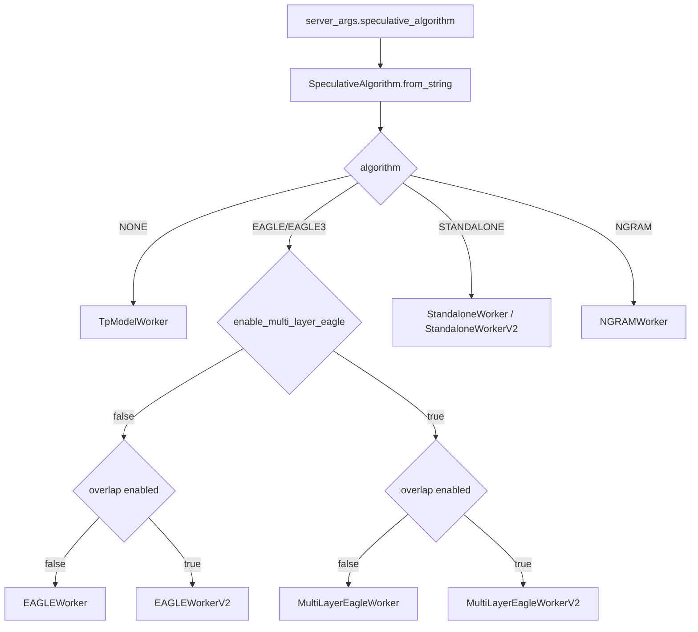
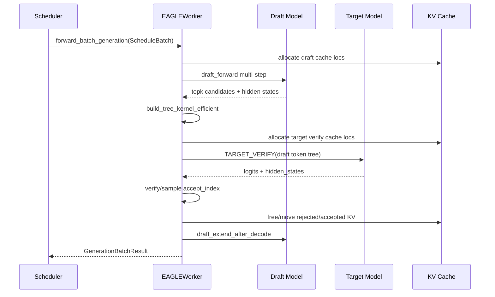
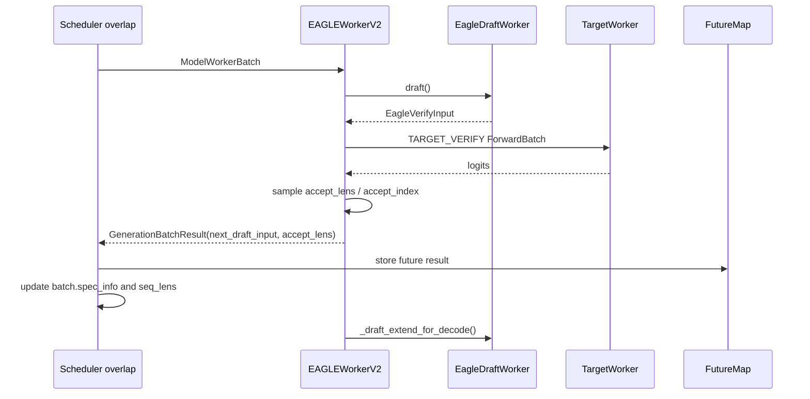
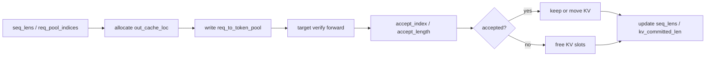
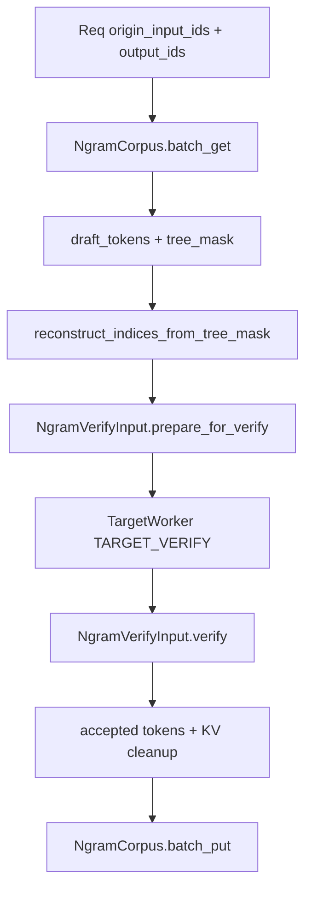

# `python/sglang/srt/speculative` 源码分析

## 1. 模块定位

`speculative` 是 SRT 的推测解码实现层，位于 scheduler 与 model executor 之间。它通过便宜的 draft 阶段生成候选 token/tree，再让 target 模型一次验证多个候选，从而减少昂贵 target forward 次数。

当前支持的算法族：

- `EAGLE`
- `EAGLE3`
- `STANDALONE`
- `NGRAM`
- 多层 EAGLE/MTP

核心职责：

- 根据 `server_args.speculative_algorithm` 选择 worker。
- 管理 draft/target 两阶段执行。
- 构造 speculative attention mask、positions、retrieve index 和 KV cache 位置。
- 执行 target verify、接受/拒绝候选 token。
- 更新请求输出、grammar 状态、Mamba/Hybrid state、target/draft KV cache。
- 对接非 overlap 的 spec v1 与 overlap scheduler 的 spec v2。

## 2. 文件结构

```text
python/sglang/srt/speculative/
├── spec_info.py                         # 算法枚举、SpecInput 抽象、worker 分发
├── base_spec_worker.py                  # spec v2 worker 抽象
├── eagle_worker.py                      # 非 overlap EAGLE/EAGLE3
├── eagle_worker_v2.py                   # overlap/spec v2 EAGLE
├── eagle_info.py                        # v1 draft/verify 输入输出和 cache 更新
├── eagle_info_v2.py                     # v2 ModelWorkerBatch 级 prepare/sample mixin
├── eagle_utils.py                       # tree 构建、draft 结果整理、verify kernel 包装
├── spec_utils.py                        # cache loc、tree traversal、grammar bitmask、debug
├── draft_utils.py                       # draft attention backend factory
├── eagle_draft_cuda_graph_runner.py
├── eagle_draft_extend_cuda_graph_runner.py
├── multi_layer_eagle_worker.py
├── multi_layer_eagle_worker_v2.py
├── multi_layer_eagle_utils.py
├── standalone_worker.py
├── standalone_worker_v2.py
├── ngram_worker.py
├── ngram_info.py
└── cpp_ngram/ngram_corpus.py
```

## 3. Worker 选择

`spec_info.py` 中的 `SpeculativeAlgorithm.create_worker()` 是算法分发入口。scheduler 初始化时读取 `server_args.speculative_algorithm`，创建 draft/spec worker，并在 speculative 打开时把 `self.model_worker` 替换为该 worker。



## 4. Draft 与 Target 分工

target worker：

- 原始主模型。
- 负责 prefill/extend。
- 负责 `TARGET_VERIFY`，即对 draft token tree 一次性计算 logits。
- verify 后保留 accepted token 的 KV cache，释放或移动 rejected token 的 KV cache。

draft worker：

- EAGLE：加载 EAGLE draft 模型，通常共享 target embedding/lm_head。
- EAGLE3：可只共享 embedding，lm_head 是否共享取决于 draft model 配置。
- STANDALONE：加载独立 draft model，不共享 target embedding/lm_head。
- NGRAM：不加载神经 draft model，候选来自 ngram corpus。
- 负责生成候选 token/tree，并维护 draft KV cache。

非 overlap v1 的 `EAGLEWorker` 同时继承 `TpModelWorker` 作为 draft worker，并持有 `target_worker`。overlap v2 把职责拆成 `EagleDraftWorker` 与 `EAGLEWorkerV2`，便于 scheduler 用 `ModelWorkerBatch`、future map、stream/event 管理重叠执行。

## 5. EAGLE v1 主流程



decode 路径：

1. `draft()` 为每个请求生成 draft token tree。
2. `EagleVerifyInput.prepare_for_verify()` 将 `batch.input_ids` 改成 draft tokens，并为 target verify 分配 KV cache。
3. target worker 以 `ForwardMode.TARGET_VERIFY` 执行，只返回 logits，不做常规采样。
4. `EagleVerifyInput.verify()` 根据 greedy 或 sampling 规则接受候选 token。
5. 更新请求输出、grammar、统计信息和 KV cache。
6. `forward_draft_extend_after_decode()` 用 accepted tokens 让 draft model KV 追上 target。

extend/prefill 路径通常先跑 target 获取 full hidden states，再用 hidden states 和 next token 填充 draft KV。

## 6. EAGLE v2 与 Overlap

spec v2 服务于 overlap scheduler，核心对象从 `ScheduleBatch` 转向 `ModelWorkerBatch`。



v2 的重点是 GPU/CPU 状态复制、stream 生命周期和 future 解析。`GenerationBatchResult` 会携带 `next_draft_input` 与 `accept_lens`，scheduler 再根据接受长度把 flat token ids 还原为每个 request 的 accepted token list。

## 7. Verify 逻辑

EAGLE verify 的核心在 `eagle_info.py` 与 `eagle_info_v2.py`。

主要步骤：

1. 对 target logits 应用 custom logit processor、penalty、logit bias、grammar vocab mask。
2. 判断 greedy 还是 sampling。
3. greedy 路径调用 `verify_tree_greedy_func()`，底层通常走 `sgl_kernel.verify_tree_greedy`。
4. sampling 路径构造 target probs，执行 top-k/top-p renorm，再调用 tree speculative sampling kernel。
5. 得到 `predict`、`accept_index`、`accept_length`。
6. 将 accepted tokens 追加到 `req.output_ids`。
7. 调用 `req.check_finished()` 与 grammar `accept_token`。
8. 更新 `kv_committed_len`、`kv_allocated_len`、acceptance 统计。
9. 释放 rejected KV cache，必要时移动 accepted KV。
10. 对 Mamba/Hybrid 模型更新 intermediate state。

NGRAM 的 `NgramVerifyInput.verify()` 复用类似 target verify 逻辑，但 draft token/tree 来自 ngram corpus，不需要 draft model extend。

## 8. KV Cache 生命周期



speculative 的正确性高度依赖 cache loc 与请求长度同步：

- draft decode 会临时分配 draft cache loc。
- target verify 会为 draft tree 分配 target cache loc。
- accepted cache 保留或移动到 committed 区域。
- rejected cache 必须释放。
- page size、topk、paged attention backend 会引入额外分支。

Mamba/Hybrid 模型还会为每个 draft token 保存中间 state，verify 后按 accepted step 更新真实 state。

## 9. NGRAM Speculative

NGRAM 不依赖神经 draft model，而是维护历史 token trie/corpus。



NGRAM 适合候选高度可由上下文重复片段预测的场景，但它当前有更强的硬件和调度限制，例如 CUDA、DP attention、overlap/mixed chunked prefill 等组合需要按源码限制确认。

## 10. 与周边模块的依赖

model executor：

- `forward_batch_info.py` 定义 `ForwardMode.TARGET_VERIFY`、`DRAFT_EXTEND`、`DRAFT_EXTEND_V2`。
- `model_runner.py` 初始化 `spec_algorithm`，并在 CUDA graph/dummy run 中处理 target verify。
- CUDA graph runner 下 target verify 的 token shape 与 `speculative_num_draft_tokens` 绑定。

managers：

- `scheduler.py` 创建 draft worker，决定 v1/v2 路径。
- `schedule_batch.py` 持有请求、KV loc、sampling info。
- `scheduler_output_processor_mixin.py` 推进 grammar 与 finish 状态。
- `managers/utils.py:get_alloc_len_per_decode()` 根据 speculative 参数决定 decode 预分配长度。

sampling/constrained：

- verify 阶段复用 `SamplingBatchInfo` 的 greedy/top-p/top-k/min-p、penalty、logit bias、grammar mask 和 custom processor。
- grammar 与 speculative tree 同时启用时，需要确保 bitmask、retrieve index、accept token 顺序一致。

mem_cache：

- speculative 依赖 `req_to_token_pool`、`token_to_kv_pool_allocator`、Mamba/Hybrid pool。
- draft worker 与 target worker共享部分 allocator/req pool，但各自有 KV pool。

## 11. 配置与限制

主要 server args：

- `speculative_algorithm`
- `speculative_draft_model_path`
- `speculative_num_steps`
- `speculative_eagle_topk`
- `speculative_num_draft_tokens`
- `speculative_accept_threshold_single`
- `speculative_accept_threshold_acc`
- `speculative_token_map`
- `speculative_attention_mode`
- `speculative_draft_attention_backend`
- `speculative_draft_model_quantization`
- `enable_multi_layer_eagle`
- NGRAM 相关 `speculative_ngram_*`

环境变量：

- `SGLANG_ENABLE_SPEC_V2`
- `SGLANG_ENABLE_OVERLAP_PLAN_STREAM`
- `SGLANG_SIMULATE_ACC_LEN`
- `SGLANG_SIMULATE_ACC_METHOD`
- `SGLANG_SPEC_ENABLE_STRICT_FILTER_CHECK`
- `SGLANG_NGRAM_FORCE_GREEDY_VERIFY`
- `SGLANG_RETURN_ORIGINAL_LOGPROB`

重要限制：

- spec v2 当前限制 `topk == 1`。
- STANDALONE 当前不支持 DP attention。
- NGRAM 当前只支持 CUDA，且不支持 DP attention。
- NGRAM 会禁用 overlap scheduler 和 mixed chunked prefill。
- `topk > 1 && page_size > 1` 对 paged attention backend 有风险，源码有特定限制。
- `trtllm_mha` speculative 只支持 `topk == 1`。

## 12. 扩展点

新增 speculative 算法：

1. 扩展 `SpeculativeAlgorithm`。
2. 实现对应 worker。
3. 在 `create_worker()` 中分发。
4. 定义新的 `SpecInputType` 与 `SpecInput` 子类。
5. 补齐 verify prepare、attention arg、filter/merge batch、KV cache 生命周期。

新增 draft attention backend：

1. 扩展 `draft_utils.py` 的 backend factory。
2. 实现 decode multi-step backend 与 draft extend/prefill backend。
3. 支持 `ForwardMode.DRAFT_EXTEND` 或 `DRAFT_EXTEND_V2` metadata。

新增 EAGLE/MTP 模型：

1. 确认 draft model forward 接口兼容 `ModelRunner`。
2. 对 EAGLE3 明确是否共享 target lm_head、是否使用 aux hidden states。
3. 多层 MTP 需要 `model_runner_list`，并确认 hidden state chain 方式。

## 13. 风险与排障

- KV cache 错位会表现为 speculative 开启后输出错误、重复 token 或后续 logits 异常。优先检查 `out_cache_loc`、`req_to_token_pool`、`seq_lens`、`kv_committed_len`。
- draft KV 如果没有在 decode 后追上 target，下一轮 draft 会基于过期状态。
- v1 使用 `ScheduleBatch`，v2 使用 `ModelWorkerBatch`，混用会造成状态错位。
- grammar 与 speculative tree 同时启用时，重点检查 `generate_token_bitmask`、`retrive_next_token`、`retrive_next_sibling`。
- Mamba/Hybrid state 更新错误通常需要检查 accepted steps 与 intermediate state index。
- overlap v2 中 `record_stream`、event、future map 生命周期必须严格匹配。
- CUDA graph capture shape 与 `speculative_num_draft_tokens` 强绑定，配置变更后需重新确认 capture 条件。
