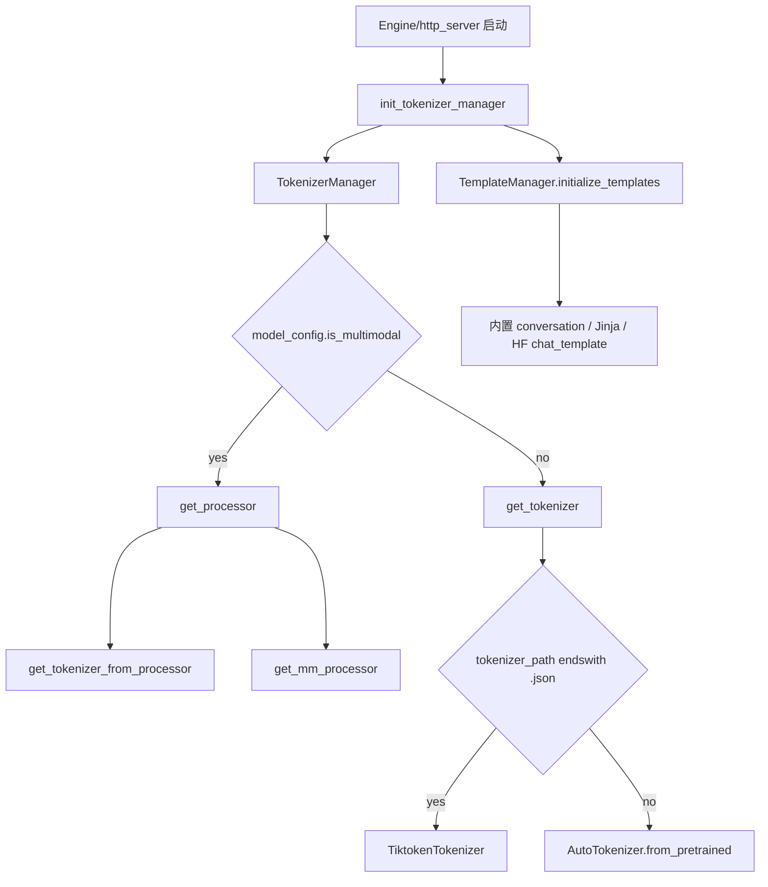

# `python/sglang/srt/tokenizer` 源码分析

## 1. 模块定位

`python/sglang/srt/tokenizer` 当前不是 SRT 的完整 tokenizer 子系统，而是一个很小的补充适配层，专门为 tiktoken JSON tokenizer 提供 HuggingFace 风格包装。

SRT 的主 tokenizer 管线分散在周边模块：

- `python/sglang/srt/utils/hf_transformers_utils.py`：统一加载 HF tokenizer、processor 和 tiktoken JSON tokenizer。
- `python/sglang/srt/managers/tokenizer_manager.py`：运行时请求 tokenization 编排。
- `python/sglang/srt/managers/template_manager.py`：chat template 初始化与选择。
- `python/sglang/srt/entrypoints/openai/serving_chat.py`：OpenAI chat 请求的模板应用。
- `python/sglang/srt/multimodal/processors/base_processor.py`：多模态 prompt 与特殊 token 对齐。

因此本目录的核心价值是“让 tiktoken 模型看起来像一个 SRT 可用的 tokenizer”，而不是承担全部 tokenizer 功能。

## 2. 文件结构

```text
python/sglang/srt/tokenizer/
└── tiktoken_tokenizer.py
```

`tiktoken_tokenizer.py` 提供：

- `TiktokenTokenizer`：读取 tiktoken JSON，构造 `tiktoken.Encoding`，暴露 `encode/decode/batch_decode/apply_chat_template/__call__/init_xgrammar`。
- `TiktokenProcessor`：非常薄的 processor wrapper，主要提供 `image_processor(image)` 兼容接口。
- 特殊 token 常量：`PAD`、`EOS`、`SEP`、`RESERVED_TOKEN_TEXTS`、`CONTROL_TOKEN_TEXTS`。

## 3. 初始化链路



当 `utils.hf_transformers_utils.get_tokenizer()` 发现 tokenizer 路径以 `.json` 结尾时，会直接返回 `TiktokenTokenizer(tokenizer_name)`；其他情况走 `AutoTokenizer.from_pretrained()` 并执行 Transformers v5 兼容修复、特殊 token 修复和 `patch_tokenizer()`。

## 4. `TiktokenTokenizer`

`TiktokenTokenizer` 的输入是 xtok/tiktoken 风格 JSON 文件，典型字段包括：

- `regular_tokens`
- `special_tokens`
- `word_split`
- 可选 `pat_str`
- 可选 `vocab_size`

当前只支持 `word_split == "V1"`。初始化后会构造底层 `tiktoken.Encoding`，并把默认控制 token、保留 token 加入 allowed special 集合，降低遇到特殊 token 时崩溃的概率。

对外接口：

- `encode(x, add_special_tokens=False)`：调用底层 `tiktoken.Encoding.encode`。注意 `add_special_tokens` 参数存在但未实际使用。
- `decode(x, *args, **kwargs)`：调用 tiktoken decode。
- `batch_decode(batch, skip_special_tokens=True, spaces_between_special_tokens=False)`：对 batch 调用 decode。注意 `skip_special_tokens` 参数未真正过滤 special tokens。
- `__call__(text: List[str], **kwargs)`：返回 `{"input_ids": [self.encode(x) for x in text]}`，用于兼容 HF tokenizer 调用方式。
- `apply_chat_template(...)`：使用内置 Jinja 模板渲染 messages。
- `init_xgrammar()`：生成 xgrammar 需要的 `TokenizerInfo` 与 override stop tokens。

## 5. 特殊 Token 语义

源码中默认 token：

- `PAD = "<|pad|>"`
- `EOS = "<|eos|>"`
- `SEP = "<|separator|>"`

需要特别注意的是 `DEFAULT_CONTROL_TOKENS = {"pad": PAD, "sep": EOS, "eos": SEP}` 的映射从命名上看并不直观：`sep` 映射到 `EOS`，`eos` 映射到 `SEP`。文档和调试时应按源码行为描述，不要自行“修正”。

其他重要行为：

- `encode_patched` 会忽略调用方传入的 `disallowed_special`，实际使用 `disallowed_special=()`。
- `eos_token_id` 来自 `tokenizer._special_tokens[EOS]`。
- `bos_token_id = None`。
- `additional_stop_token_ids = None`。

## 6. Chat Template

`TiktokenTokenizer` 自带一个简单 Jinja 模板：

```text
system:    System: ...<|separator|>
user:      Human: ...<|separator|>
assistant: Assistant: ...<|separator|>
```

当 `add_generation_prompt=True` 时会追加 `Assistant:`。该模板接受 `tools`、`reasoning_effort` 等参数，但默认模板并不实际使用这些高级能力，因此 tool calling 或复杂 reasoning 模板通常应交给 `TemplateManager`、内置 conversation template 或 HF tokenizer/processor 的 `chat_template`。

OpenAI chat 路径中，模板选择一般发生在：

```text
OpenAIServingChat
  -> TemplateManager 决定模板类型
  -> Jinja apply_chat_template 或 Conversation.get_prompt()
  -> GenerateReqInput(text 或 input_ids)
  -> TokenizerManager
  -> Scheduler
```

## 7. xgrammar 支持

`init_xgrammar()` 会把 mergeable ranks 与 special tokens 合并为 vocab，并返回 `(TokenizerInfo, override_stop_tokens)`。

特殊处理：

- hardcode `override_stop_tokens = [2]`。
- 以 `b"\x00"` 开头的 token 会被替换成 `<|xg_special_token_i|>`，避免 xgrammar 将其误判为特殊 token。

这意味着更换 tiktoken vocab 或 EOS id 时，需要特别验证结构化输出/grammar decoding 是否仍然正确。

## 8. 与运行时 Manager 的关系

`TokenizerManager` 是真正的 runtime 编排者：

- 初始化 tokenizer 与 multimodal processor。
- 处理 `text/input_ids/input_embeds/mm data` 的优先级。
- 调用 `_tokenize_texts()` 或多模态 processor。
- 构造 `TokenizedGenerateReqInput` 或 `TokenizedEmbeddingReqInput`。
- 调用 `sampling_params.normalize(self.tokenizer)` 与 `verify(vocab_size)`。
- 将请求发送给 scheduler，并等待 detokenizer/scheduler 输出。

多模态路径中，如果 processor 生成了 `mm_inputs.input_ids`，会覆盖文本 tokenization 结果。因此本目录的 tiktoken wrapper 只提供基础 tokenizer 能力，多模态 prompt 对齐主要由 `multimodal` 与 `managers` 完成。

## 9. 配置与环境变量

相关 server args：

- `model_path`
- `tokenizer_path`
- `tokenizer_mode`
- `tokenizer_worker_num`
- `skip_tokenizer_init`
- `trust_remote_code`
- `revision`
- `chat_template`
- `hf_chat_template_name`
- `completion_template`
- `enable_tokenizer_batch_encode`
- `enable_dynamic_batch_tokenizer`
- `dynamic_batch_tokenizer_batch_size`
- `dynamic_batch_tokenizer_batch_timeout`

相关环境变量：

- `SGLANG_PATCH_TOKENIZER`：控制 Kimi special token cache patch。
- `SGLANG_EXTERNAL_MM_PROCESSOR_PACKAGE`：外部多模态 processor 包。
- `SGLANG_REQUEST_STATE_WAIT_TIMEOUT`：TokenizerManager 请求状态等待超时。
- `TOKENIZERS_PARALLELISM=false`：多模态 processor tokenizer 初始化后由代码设置。
- `SGLANG_IO_WORKERS` / `SGLANG_CPU_WORKERS`：多模态 processor IO/CPU worker 数。
- `SGLANG_DETOKENIZER_MAX_STATES`：detokenizer decode state 容量。

## 10. 扩展点

新增 tokenizer 类型：

- 最直接是在 `utils.hf_transformers_utils.get_tokenizer()` 增加路径/格式分支。
- 或提供 HF `AutoTokenizer` 可识别的 tokenizer，并通过 `trust_remote_code` 加载。

扩展 tiktoken JSON：

- 当前只支持 `word_split == "V1"`。
- 新 word split 需要扩展 `TiktokenTokenizer.__init__`。
- 需要补齐 special token、decode、xgrammar 行为测试。

新增 chat template：

- 内置 conversation template：在 parser conversation registry 注册。
- 外部 JSON conversation template：通过 `--chat-template path.json`。
- Jinja template：通过 `--chat-template path.jinja`。
- HF 多模板 dict：通过 `--hf-chat-template-name` 选择。

## 11. 风险与排障

- `TiktokenTokenizer.encode(add_special_tokens=False)` 不使用 `add_special_tokens`，和 HF tokenizer 行为不同。
- `batch_decode(skip_special_tokens=True)` 不真正过滤 special tokens。
- 默认 chat template 很简单，不适合复杂 tool calling 或多模板场景。
- `.json` tokenizer 文件必须包含源码期望字段，且当前只接受 `word_split == "V1"`。
- `skip_tokenizer_init=True` 时 text prompt 会报错，必须传 `input_ids` 或 `input_embeds`。
- `enable_tokenizer_batch_encode` 与 `enable_dynamic_batch_tokenizer` 互斥。
- batch tokenization 不支持多模态 processing。
- HF custom tokenizer 加载失败时，常见修复是确认 `--trust-remote-code`。
- Kimi tokenizer patch 是类级 monkey patch，patch 后禁止继续添加 special tokens。
