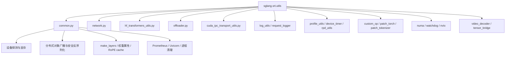
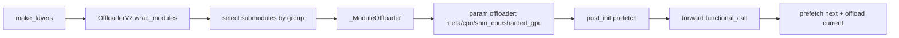
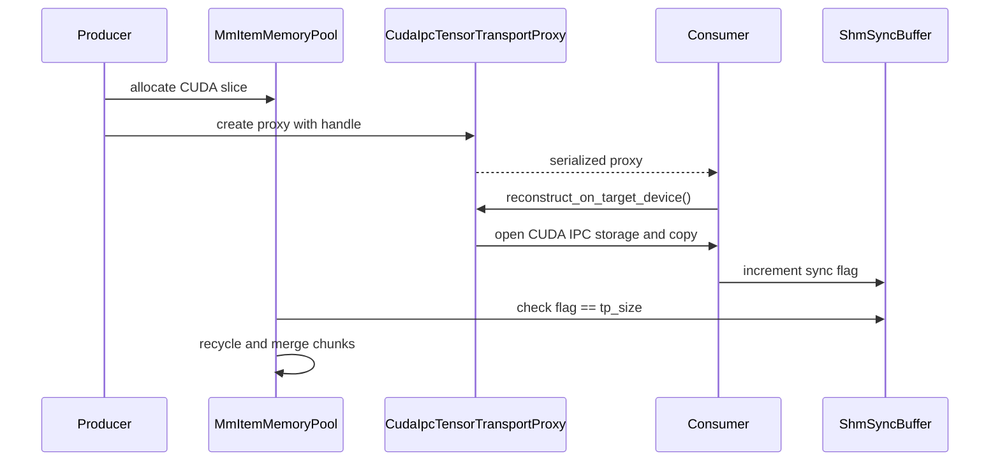
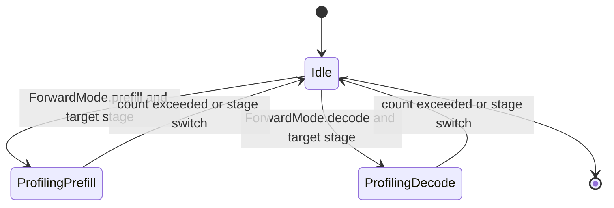

# `python/sglang/srt/utils` 源码分析

## 1. 模块定位

`utils` 是 SRT 运行时基础设施层，覆盖设备探测、模型/Tokenizer 兼容、网络端口、进程与日志、序列化、分布式辅助、profiling、CUDA IPC、多模态媒体加载、offload、补丁兼容和排障诊断。

入口文件 `python/sglang/srt/utils/__init__.py` 只有：

```python
from sglang.srt.utils.common import *
```

这意味着历史代码大量通过 `from sglang.srt.utils import ...` 消费 `common.py` 的符号。新代码更建议显式从子模块导入，例如 `sglang.srt.utils.network.NetworkAddress`、`sglang.srt.utils.hf_transformers_utils.get_tokenizer`、`sglang.srt.utils.offloader.get_offloader`，以降低依赖边界模糊和循环 import 风险。

## 2. 目录结构

核心大文件：

- `common.py`：通用工具主干，包含设备判断、运行时开关、媒体加载、分布式对象广播、模型层构造、Prometheus、进程清理、安全反序列化、Triton cache、GC 诊断等。
- `hf_transformers_utils.py`：HF/ModelScope/Transformers/RunAI/GGUF/Mistral/processor 兼容加载。
- `offloader.py`：模型层或参数 offload。
- `network.py`：端口、IP、ZMQ endpoint、IPv6 地址模型。
- `cuda_ipc_transport_utils.py`：多模态 feature tensor 的 CUDA IPC 传输。
- `rpd_utils.py`：ROCm RPD sqlite 转 Chrome Trace。

中型功能文件：

- `profile_utils.py`
- `request_logger.py`
- `mistral_utils.py`
- `custom_op.py`
- `nvtx_pytorch_hooks.py`
- `model_file_verifier.py`
- `watchdog.py`
- `tensor_bridge.py`
- `numa_utils.py`

小型辅助文件：

- `auth.py`
- `aio_rwlock.py`
- `bench_utils.py`
- `device_timer.py`
- `gauge_histogram.py`
- `host_shared_memory.py`
- `http_middleware_patch.py`
- `json_response.py`
- `log_utils.py`
- `multi_stream_utils.py`
- `patch_tokenizer.py`
- `patch_torch.py`
- `poll_based_barrier.py`
- `runai_utils.py`
- `scheduler_status_logger.py`
- `slow_rank_detector.py`
- `torch_memory_saver_adapter.py`
- `video_decoder.py`
- `weight_checker.py`

## 3. 总体架构



典型启动链：

```mermaid
sequenceDiagram
  participant CLI as CLI/launch_server
  participant Args as server_args
  participant Utils as common/network
  participant HF as hf_transformers_utils
  participant Model as model_runner
  participant Off as offloader

  CLI->>Utils: configure_logger / set_ulimit / get_open_port
  Args->>Utils: get_device / get_device_memory_capacity
  Args->>HF: get_config / get_tokenizer / get_processor
  Model->>Utils: make_layers
  Utils->>Off: get_offloader().wrap_modules
  Off-->>Model: ModuleList with optional offload hooks
```

## 4. `common.py`

`common.py` 是历史聚合层，功能很宽。

设备探测：

- `is_cuda()`、`is_hip()`、`is_cuda_alike()`
- `is_hpu()`、`is_xpu()`、`is_npu()`、`is_musa()`、`is_mps()`
- `is_cpu()`：需要 `SGLANG_USE_CPU_ENGINE=1`
- `get_device()`、`get_device_count()`、`get_device_capability()`
- `get_device_memory_capacity()`、`get_available_gpu_memory()`

硬件能力判断：

- Ampere/Hopper/Blackwell/SM90/SM100/SM120 检测
- AMX/XMX 检测
- FlashInfer 可用性
- cuBLAS 版本
- MXFP/GFX95 等硬件特性

执行上下文：

- `DynamicGradMode`：在 `torch.inference_mode` 和 `torch.set_grad_enabled(False)` 之间切换。
- `device_context(device)`：按设备进入 torch device context。
- `temp_attr_context()`：临时覆盖对象属性。

模型层构造：

- `make_layers()`：结合 pipeline parallel 分片创建层，缺失层用 `PPMissingLayer`，并接入 offloader。
- `make_layers_non_pp()`：非 pipeline parallel 版本。
- `set_weight_attrs()`、`replace_submodule()`、`prepack_weight_if_needed()`：模型结构与权重属性辅助。
- `require_mlp_tp_gather()`、`require_attn_tp_gather()` 等：按模型/配置判断 TP gather/sync。

媒体加载：

- `load_image()`：支持 base64 data URI、HTTP(S)、file、本地路径和 PIL。
- `load_audio()`：支持 bytes、data URI、HTTP(S)、file、本地路径。
- `load_video()`、`sample_video_frames()`、`encode_video()`：统一视频解码与抽帧。

进程和系统资源：

- `kill_process_tree()`
- `set_ulimit()`
- `kill_itself_when_parent_died()`
- `set_gpu_proc_affinity()`
- `pyspy_dump_schedulers()`

序列化与分布式：

- `broadcast_pyobj()`、`point_to_point_pyobj()`
- `init_custom_process_group()`
- `MultiprocessingSerializer`
- `SafeUnpickler` / `safe_pickle_load()`：带危险入口阻断的 pickle 加载。

JIT/custom op：

- `get_compiler_backend()`
- `direct_register_custom_op()`
- `cached_triton_kernel()`
- `get_current_device_stream_fast()`
- `reserve_rope_cache_for_long_sequences()`

## 5. `hf_transformers_utils.py`

该文件屏蔽 Transformers、ModelScope、HF Hub、remote code、GGUF、Mistral 原生配置、RunAI object storage、多模态 processor 的差异。

主要入口：

- `download_from_hf()`
- `get_config()`
- `get_hf_text_config()`
- `get_tokenizer()`
- `get_processor()`
- `get_context_length()`
- `get_generation_config()`
- `get_rope_config()`
- `check_gguf_file()`

重要兼容逻辑：

- Transformers v5 tokenizer component 修复。
- BOS/EOS 行为修复。
- `rope_scaling` legacy `type` 兼容。
- Llama flash attention 兼容。
- special token pattern 和 added token encoding 修复。
- `SGLANG_USE_MODELSCOPE` 下改用 ModelScope。
- RunAI object storage URI 映射本地缓存。
- 远程 URL 通过 connector 拉取非权重文件。
- Mistral Large/Small/Leanstral 原生 `params.json` 解析。

风险在于这些补丁高度依赖 Transformers 版本行为。升级 HF 后，tokenizer、processor、rope、remote code 是首要回归点。

## 6. `network.py`

职责：

- 端口选择与可用性检查。
- IPv4/IPv6 bind。
- ZMQ socket bind/connect。
- 本机 IP 自动探测。
- `NetworkAddress` 统一地址对象。

关键函数：

- `get_open_port()`
- `try_bind_socket()`
- `is_port_available()`
- `wait_port_available()`
- `get_zmq_socket_on_host()`
- `get_zmq_socket()`
- `get_local_ip_auto()`
- `NetworkAddress.parse()/to_url()/to_tcp()`

安全设计点：`get_zmq_socket_on_host()` 默认绑定 `127.0.0.1`，避免未认证 socket 暴露到网络；但 `get_zmq_socket()` 未给 endpoint 时可能绑定 `tcp://*`，部署时需要明确区分内部通信和跨机通信。

## 7. Offloader 与 Shared Memory

`offloader.py` 提供两套 offload 机制：

- `OffloaderV1`：按参数粒度把部分参数放到 CPU，每次 forward 临时搬回设备并用 `torch.func.functional_call()` 执行。
- `OffloaderV2`：按 layer group 选择子模块 offload，支持 `meta`、`cpu`、`shm_cpu`、`sharded_gpu`，用 CUDA stream/event 做 onload/prefetch/offload。

入口：

- `get_offloader()` / `set_offloader()`
- `create_offloader_from_server_args(server_args, dp_rank)`
- `common.make_layers()` 中调用 `get_offloader().wrap_modules(...)`

`host_shared_memory.py` 为 `OffloaderV2` 的 `shm_cpu` 模式服务：rank 0 创建 shared memory，其他 rank 连接，并用 `cudaHostRegister` 注册 host memory。



限制与风险：

- V2 当前多处断言 `tp_size == 1`。
- 参数需要 contiguous。
- `SGLANG_RUN_ID` 是 V2 初始化依赖。
- shared memory 资源释放需要重点关注异常路径。

## 8. CUDA IPC 多模态传输

`cuda_ipc_transport_utils.py` 负责在多进程之间共享多模态 feature tensor。

核心类：

- `ShmSyncBuffer`：小块 POSIX shared memory，用 float32 flag 做消费同步。
- `MmItemMemoryChunk`：表示 CUDA 池中的一段 `[start, end)`。
- `MmItemMemoryPool`：CUDA int8 大池，维护 available/occupied chunks，后台 recycle/merge。
- `CudaIpcTensorTransportProxy`：producer 侧记录 CUDA IPC handle，consumer 侧重建 tensor。



风险：

- Producer storage 生命周期必须覆盖 consumer 重建。
- 所有 consumer 必须正确递增 sync flag，否则池无法回收。
- `/tmp/shm_wr_lock.lock` 是全局文件锁，跨实例可能竞争。
- 非 CUDA 路径会退化为直接 tensor_data 搬运。

## 9. Auth、日志与 HTTP

`auth.py`：

- `AuthLevel`: `NORMAL`、`ADMIN_OPTIONAL`、`ADMIN_FORCE`
- `decide_request_auth()` 是纯函数，便于单测。
- `add_api_key_middleware()` 使用 ASGI-native middleware，避免破坏 client disconnect。
- `/health*` 与 `/metrics*` 永远放行。
- Bearer token 用 `secrets.compare_digest()` 常量时间比较。

`request_logger.py`：

- 支持 plain text 与 JSON request log。
- `log_requests_level` 控制字段省略和截断。
- `SGLANG_LOG_REQUEST_HEADERS` 控制白名单 header。
- `SGLANG_LOG_REQUEST_EXCEEDED_MS` 只记录慢请求。

`http_middleware_patch.py`：

- 替换 FastAPI `@app.middleware("http")` 注册方式，改为 pure ASGI middleware。
- 目标是保留原始 `receive`，让非 streaming 请求也能感知 client disconnect。

`json_response.py`：

- 统一 ORJSON options，支持 numpy 和非字符串 key。

## 10. Profiling 与观测辅助

相关文件：

- `profile_utils.py`
- `profile_merger.py`
- `rpd_utils.py`
- `device_timer.py`
- `gauge_histogram.py`
- `nvtx_pytorch_hooks.py`

`ProfileManager` 支持按 prefill/decode stage 触发 profiler：

- CPU/GPU：`torch.profiler`
- MEM：CUDA memory snapshot
- CUDA_PROFILER：`cudaProfilerStart/Stop`
- RPD：ROCm profiler



`ProfileMerger` 可合并多 rank Chrome trace，并按 TP/DP/PP/EP rank 标记 pid。`DeviceTimer` 基于 CUDA Event 做无阻塞耗时上报，`GaugeHistogram` 用 Prometheus Gauge 模拟非累计 bucket。

## 11. Patch 与 Custom Op

`custom_op.py`：

- `register_custom_op()` 装饰器注册 SGLang custom op。
- `register_custom_op_from_extern()` 将外部库函数包装成 torch custom op，避免 torch.compile 追踪外部 JIT/IO。

`patch_torch.py`：

- patch multiprocessing tensor reduction，将 CUDA device index 替换为 UUID，解决可见设备重映射问题。
- 对 PyTorch < 2.8 patch auto-functionalized ops 的 cacheable 属性。

`patch_tokenizer.py`：

- 受 `envs.SGLANG_PATCH_TOKENIZER` 控制。
- 当前主要优化 Kimi `TikTokenTokenizer` 的 special tokens 属性缓存。

这些 patch 都是进程级副作用，应尽量在启动期集中调用，并避免在请求路径动态切换。

## 12. 系统、并发与排障工具

- `aio_rwlock.py`：async reader-writer lock，有 waiting writer 时阻止新 reader，避免 writer 饥饿。
- `multi_stream_utils.py`：在默认 stream 和 aux stream 并行执行两个函数。
- `poll_based_barrier.py`：用 CPU process group all-reduce 轮询式 barrier。
- `numa_utils.py`：基于 NVML/numactl 做 NUMA 绑定。
- `watchdog.py`：监控进程卡死或子进程异常退出，必要时 dump py-spy 并向父进程发 `SIGQUIT`。
- `slow_rank_detector.py`：rank 间 GEMM/elementwise benchmark，定位慢 rank。

## 13. 模型文件、媒体与对象存储

- `model_file_verifier.py`：生成/校验模型文件 SHA256 manifest。
- `weight_checker.py`：snapshot/reset/compare 模型参数和 buffer，支持部分 FP8 dequant 比较。
- `video_decoder.py`：优先 torchcodec，失败 fallback decord，统一返回 NHWC uint8 numpy。
- `runai_utils.py`：支持 `s3://`、`gs://`、`az://` object storage URI，预下载 metadata，避免多进程重复拉取大权重。
- `tensor_bridge.py`：MLX 与 PyTorch tensor/array 转换，主要服务 Apple Silicon/MPS。
- `torch_memory_saver_adapter.py`：可选依赖 `torch_memory_saver` 的统一 adapter。

## 14. 与 SRT 各模块的依赖

- `server_args`：使用 env parsing、设备判断、network address、GGUF 判断和 RunAI 工具。
- `model_executor`：使用设备/显存工具、`make_layers`、offloader、NVTX、WeightChecker、stream helper。
- `layers`：使用硬件检测、compiler backend、custom op 注册、权重属性辅助。
- `managers`：使用 request logger、RWLock、ZMQ、HF tokenizer/processor、对象广播。
- `multimodal`：使用媒体加载、CUDA IPC、VideoDecoderWrapper。
- `observability`：使用 GaugeHistogram、DeviceTimer、SchedulerStatusLogger。
- `speculative`：使用设备判断、`fast_topk`、`next_power_of_2`、显存查询。
- `mem_cache`：使用 page 计算、对齐和后端选择 helper。

## 15. 扩展指南

- 新设备支持：补齐 `is_xxx/get_device/get_device_count/get_device_capability/get_device_memory_capacity/get_available_gpu_memory/get_compiler_backend`。
- 新环境变量：优先收敛到 `sglang.srt.environ.envs`，临时变量才用 `get_bool_env_var/get_int_env_var`。
- 新模型 config：注册到 `hf_transformers_utils` 的 config registry。
- 新 Transformers 兼容补丁：集中放在 `hf_transformers_utils.py`，避免散落到模型实现。
- 新 object storage scheme：扩展 `runai_utils.SUPPORTED_SCHEMES` 与底层 streamer。
- 新 custom op：优先用 `utils.custom_op.register_custom_op`。
- 新 offload 模式：扩展参数 offloader mode map，并实现对应 tensor/onload/offload 生命周期。
- 新 profiling backend：扩展 `_ProfilerBase.create()` 与具体 profiler 子类。

## 16. 风险与排障

- `common.py` 导入副作用多，轻量 HTTP/单测模块应避免直接依赖 `sglang.srt.utils`。
- `__init__.py` 星号重导出导致依赖边界模糊，新代码建议显式子模块导入。
- 设备判断大量使用 `lru_cache(maxsize=1)`，运行中修改环境或设备可见性后不会自动刷新。
- `is_npu()` 在检测到 torch.npu 但不可用时可能抛 RuntimeError。
- `broadcast_pyobj()` 使用 pickle，跨版本 class 变化会破坏兼容。
- `SafeUnpickler` 不是任意不可信输入的安全沙箱。
- Transformers 版本升级后，要重点回归 tokenizer、processor、rope、remote code。
- `/metrics` 在 `auth.py` 中永远放行，公网部署需要网关或网络层保护。
- `network.get_zmq_socket()` 默认 bind `tcp://*` 时暴露面较大。
- CUDA IPC 依赖 producer 生命周期和共享内存 flag，异常退出可能残留 shm。
- OffloaderV2 对 TP size、参数 contiguous、`SGLANG_RUN_ID` 有硬限制。
- NUMA 自动绑定常因容器权限、numactl、NVML、mempolicy 限制而跳过。
- Watchdog 非 soft 模式会向父进程发 `SIGQUIT`，调试时需合理设置 timeout。
