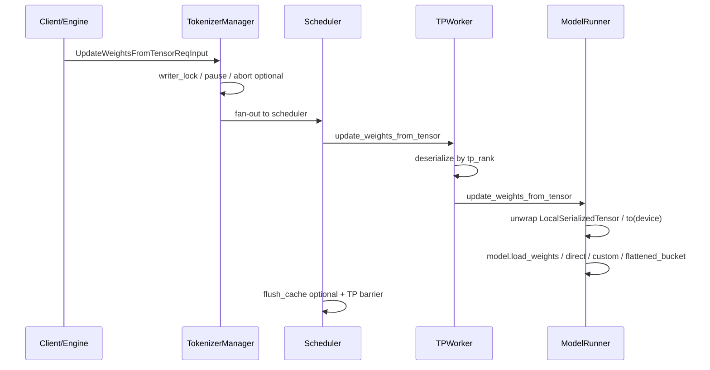
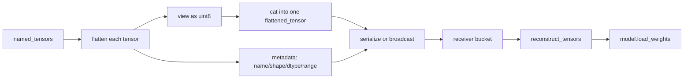
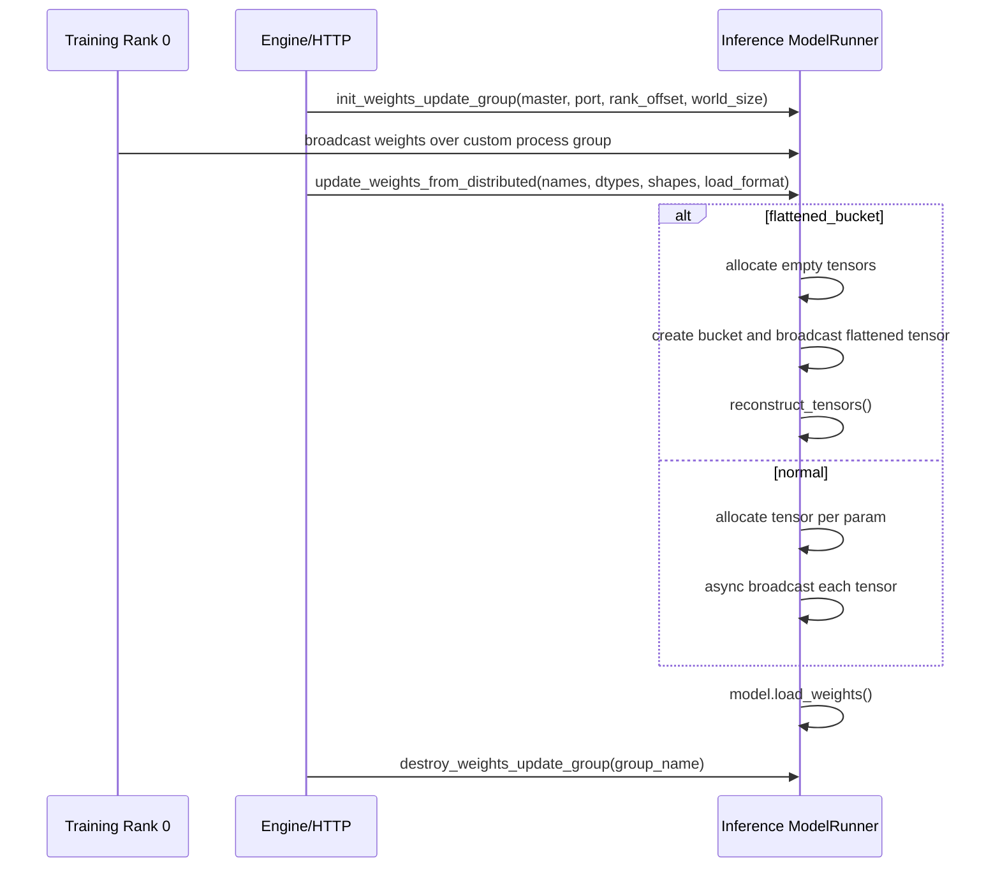

# `python/sglang/srt/weight_sync` 源码分析

## 1. 模块定位

`weight_sync` 是 SRT 在线权重同步的轻量工具目录，不是完整的权重更新子系统。它只包含 tensor 打包/还原和训练侧批量同步 helper；HTTP API、暂停/锁、请求中止、缓存 flush、模型加载、TP/DP 转发、LoRA 加载等逻辑分散在 `entrypoints`、`managers`、`model_executor` 和 `model_loader`。

本目录的核心价值：

- 将多个 named tensors 打包成单个 `uint8` flattened tensor，降低传输/广播次数。
- 通过 metadata 还原不同 dtype/shape 的 tensor。
- 为训练侧 SPMD 进程提供 `update_weights()` helper，将每个 TP rank 的 tensor 序列化后交给 inference engine。

## 2. 文件结构

```text
python/sglang/srt/weight_sync/
├── tensor_bucket.py   # FlattenedTensorBucket 与 metadata
└── utils.py           # 训练侧 update_weights helper
```

关键周边文件：

- `python/sglang/srt/entrypoints/engine.py`
- `python/sglang/srt/entrypoints/http_server.py`
- `python/sglang/srt/entrypoints/http_server_engine.py`
- `python/sglang/srt/managers/tokenizer_manager.py`
- `python/sglang/srt/managers/tokenizer_communicator_mixin.py`
- `python/sglang/srt/managers/scheduler_update_weights_mixin.py`
- `python/sglang/srt/managers/tp_worker.py`
- `python/sglang/srt/model_executor/model_runner.py`
- `python/sglang/srt/model_loader/loader.py`
- `python/sglang/srt/utils/common.py`

## 3. 在线权重更新总览

SRT 在线更新主要有三类路径：

1. 从磁盘更新：`/update_weights_from_disk`
2. 从 serialized tensor 更新：`/update_weights_from_tensor`
3. 从分布式 broadcast 更新：`/init_weights_update_group`、`/update_weights_from_distributed`、`/destroy_weights_update_group`

`weight_sync` 直接参与第 2、3 类中的 bucket/serialization；第 1 类只在总链路文档中需要关联。



## 4. `FlattenedTensorBucket`

`tensor_bucket.py` 定义两个核心对象：

- `FlattenedTensorMetadata`
- `FlattenedTensorBucket`

`FlattenedTensorMetadata` 保存每个 tensor 的恢复信息：

- `name`
- `shape`
- `dtype`
- `start_idx`
- `end_idx`
- `numel`

`FlattenedTensorBucket` 将多个 named tensors 打包为一个 flattened byte tensor：



打包流程：

1. 对每个 tensor 执行 `tensor.flatten().view(torch.uint8)`。
2. 记录该 tensor 在 byte buffer 中的 `[start_idx, end_idx)`。
3. 保存原始 `shape`、`dtype`、`name` 和 `numel`。
4. 用 `torch.cat(flattened_tensors, dim=0)` 得到单个 `uint8` tensor。

还原流程：

1. 按 metadata 从 flattened tensor 切片。
2. 对切片执行 `.view(meta.dtype)`。
3. 再 `.reshape(meta.shape)`。
4. 返回 `dict[name, tensor]`。

设计要点：

- `supports_multi_dtypes = True`，因为拼接前统一转成 byte view，还原时再按 metadata 的 dtype view 回去。
- 还原出的 tensor 通常是 flattened buffer 的视图，避免不必要拷贝。
- 空 `named_tensors` 会抛 `ValueError("Cannot create empty tensor bucket")`。

## 5. 训练侧 Helper：`utils.update_weights`

`utils.py` 的 `update_weights(engine, params_batch, device_mesh_key, device_mesh, load_format=None)` 面向训练/producer 进程。

职责：

- 每个 rank 传入本 rank 的 tensor。
- 对 `DTensor` 调 `full_tensor()`，非 `DTensor` 原样返回。
- 按 device mesh 的 TP 维度 gather 每个 rank 的序列化 tensor。
- rank 0 组装 `LocalSerializedTensor(values=[rank0_bytes, rank1_bytes, ...])`。
- 调用 `engine.update_weights_from_tensor()`。

这让训练侧无需自己理解 SRT 内部 TPWorker 反序列化细节，只要提供按 mesh 对齐的参数批次。

## 6. Tensor 更新路径

普通 tensor 更新：

1. Client/Engine 构造 `UpdateWeightsFromTensorReqInput`。
2. 普通格式下，Engine 使用 `MultiprocessingSerializer.serialize()` 将 named tensors 序列化并复制为每个 TP rank 一份。
3. 若 `load_format == "flattened_bucket"`，Engine 对 bucket 特判，直接使用传入的 serialized bucket list。
4. TokenizerManager 通过 writer lock 防止与生成读路径并发。
5. Scheduler 将请求转发给 TPWorker。
6. TPWorker 按 `self.tp_rank` 反序列化对应 tensor。
7. `ModelRunner.update_weights_from_tensor()` 执行真正更新。

`ModelRunner.update_weights_from_tensor()` 支持：

- `load_format is None`：调用 `self.model.load_weights(named_tensors)`。
- `load_format == "direct"`：按参数名直接用 `default_weight_loader` 写入。
- `load_format in server_args.custom_weight_loader`：动态导入自定义 loader。
- `load_format == "flattened_bucket"`：从 bucket dict 还原 tensor 后调用模型加载逻辑。

## 7. Distributed Broadcast 更新路径

distributed 更新通过自定义 process group 让 training rank 向 inference ranks broadcast 权重。



普通格式会为每个参数单独分配 `torch.empty(shape, dtype, device)` 并 broadcast。`flattened_bucket` 格式先按 names/dtypes/shapes 构造空 tensor bucket，只 broadcast 一个 flattened tensor，再 reconstruct 并 `model.load_weights()`。

## 8. 从磁盘更新路径

虽然 `weight_sync` 不实现磁盘更新，但它属于同一在线权重更新体系。

调用链：

```text
HTTP/Engine
  -> TokenizerManager.update_weights_from_disk()
  -> SchedulerUpdateWeightsMixin
  -> TPWorker
  -> ModelRunner.update_weights_from_disk()
  -> LoadConfig + get_model_loader()
```

当前在线 disk update 明确只接受 `DefaultModelLoader`。加载失败时会尝试重新读取原 iterator 回滚原权重，但错误信息也提示这类运行期更新敏感，失败后不应假设模型状态完全无影响。

## 9. Serialization 与 SafeUnpickler

权重 tensor 的进程间传输依赖 `utils.common.MultiprocessingSerializer`：

- 基于 `ForkingPickler` 序列化 tensor/对象。
- HTTP 场景中可 `output_str=True`，把 pickle bytes base64 编码。
- 反序列化时使用 `SafeUnpickler` allowlist。

由于 bucket metadata 会通过 pickle 传输，`SafeUnpickler` 需要允许：

- `sglang.srt.weight_sync.tensor_bucket.`
- `sglang.srt.model_executor.model_runner.`

新增可序列化类型时必须同步审视 allowlist。不要为了快速修复反序列化失败而粗暴扩大 allowlist。

## 10. 与 EntryPoints 的关系

`entrypoints/engine.py`：

- `Engine.update_weights_from_tensor()` 处理普通 tensor 与 `flattened_bucket`。
- `Engine.update_weights_from_distributed()` 封装 names/dtypes/shapes/group/load_format。
- `Engine.load_lora_adapter_from_tensors()` 也支持 `load_format == "flattened_bucket"`。

`entrypoints/http_server.py`：

- 暴露 `/update_weights_from_disk`。
- 暴露 `/update_weights_from_tensor`。
- 暴露 `/init_weights_update_group`。
- 暴露 `/update_weights_from_distributed`。
- 暴露 `/destroy_weights_update_group`。

`entrypoints/http_server_engine.py`：

- `HttpServerEngineAdapter.update_weights_from_tensor()` 使用 base64 字符串形式向 HTTP server 发送 serialized tensor。

## 11. 与 Managers 的关系

`TokenizerManager`：

- 持有 `model_update_lock`、`model_update_result`、pause 状态。
- disk update 会默认使用 `server_args.load_format`。
- 成功后可能更新 `server_args.model_path/load_format`。

`TokenizerCommunicatorMixin`：

- 对 DP scheduler fan-out。
- tensor/distributed update 都使用 writer lock。
- 对 DP 场景要求 `dp_size == 1 or enable_dp_attention`。

`SchedulerUpdateWeightsMixin`：

- 将 update 请求转发给 TPWorker。
- 成功后按 `flush_cache` 清 KV cache。
- tensor/ipc 路径会额外做 TP CPU group barrier。
- speculative 场景下，`disable_draft_model` 决定更新 target worker 还是 draft worker。

`TPWorker`：

- 反序列化 `serialized_named_tensors[self.tp_rank]`。
- 调用 `ModelRunner`。
- LoRA tensor 加载中，`load_format == "flattened_bucket"` 也使用 `FlattenedTensorBucket` 还原。

## 12. 与 Model Executor / Loader 的关系

`ModelRunner` 是在线更新真正落点：

- `update_weights_from_disk()`
- `update_weights_from_tensor()`
- `update_weights_from_distributed()`
- `_update_weights_from_flattened_bucket()`
- `_update_bucketed_weights_from_distributed()`
- process group init/destroy

`model_loader/loader.py`：

- disk update 使用 `LoadConfig(load_format=...)` 与 `get_model_loader()`。
- `DefaultModelLoader.load_weights_and_postprocess()` 是当前在线 disk update 支持路径。
- 非默认 loader 的在线 disk update 会被拒绝。

## 13. 配置与请求字段

请求对象常见字段：

- `UpdateWeightFromDiskReqInput`: `model_path`、`load_format`、`abort_all_requests`、`weight_version`、`is_async`、`torch_empty_cache`、`keep_pause`、`recapture_cuda_graph`、`token_step`、`flush_cache`、`manifest`
- `UpdateWeightsFromTensorReqInput`: `serialized_named_tensors`、`load_format`、`flush_cache`、`abort_all_requests`、`weight_version`、`disable_draft_model`
- `UpdateWeightsFromDistributedReqInput`: `names`、`dtypes`、`shapes`、`group_name`、`flush_cache`、`abort_all_requests`、`weight_version`、`load_format`
- `InitWeightsUpdateGroupReqInput`: `master_address`、`master_port`、`rank_offset`、`world_size`、`group_name`、`backend`

相关 server args：

- `load_format`
- `custom_weight_loader`
- `enable_dp_attention`
- `enable_memory_saver`

常见分布式环境变量：

- `RANK`
- `WORLD_SIZE`
- `MASTER_ADDR`
- `MASTER_PORT`
- `LOCAL_RANK`

## 14. 扩展点

新增 `load_format`：

- tensor 更新可通过 `server_args.custom_weight_loader` 动态加载。
- disk 更新受 `DefaultModelLoader` 检查限制，新增格式需要确认在线重载语义。

新增序列化格式：

- 需要同步处理 Engine、TPWorker、ModelRunner、SafeUnpickler allowlist。
- 要明确 HTTP base64 与 multiprocessing pickle 两种传输模式。

新增 bucket 策略：

- 当前是全量拼接为单个 `uint8` tensor。
- 可扩展为按大小、层、模块类型分桶，降低峰值内存和单次 broadcast 延迟。

LoRA：

- `load_lora_adapter_from_tensors(..., load_format="flattened_bucket")` 已复用 bucket 格式。
- 新 LoRA tensor format 可以沿用 `FlattenedTensorBucket` 的 metadata 思路。

## 15. 风险与排障

- distributed update 异常可能造成部分权重已更新，失败后建议丢弃该模型实例或重新完整加载。
- flattened bucket 会引入额外 flattened tensor，超大模型全量 bucket 可能造成显存峰值 OOM。
- metadata 的 dtype/shape/range 必须正确，否则 `view(dtype).reshape(shape)` 会失败或还原错误。
- 普通 tensor 路径按 `serialized_named_tensors[self.tp_rank]` 取值，列表长度必须覆盖 TP size。
- DP 场景需要满足 `dp_size == 1 or enable_dp_attention`。
- speculative 场景默认可能更新 draft worker；如需 target-only 更新，使用 `disable_draft_model`。
- HTTP 传输 serialized tensor 必须使用 base64 字符串形式，二进制 bytes 不能直接放 JSON。
- 自定义 process group 使用后应 destroy，避免资源泄漏。
- 权重更新成功后通常应 `flush_cache=True`，否则旧 KV cache 可能对应旧权重。
- SafeUnpickler allowlist 是安全边界，新增类型时应最小化放行范围。
