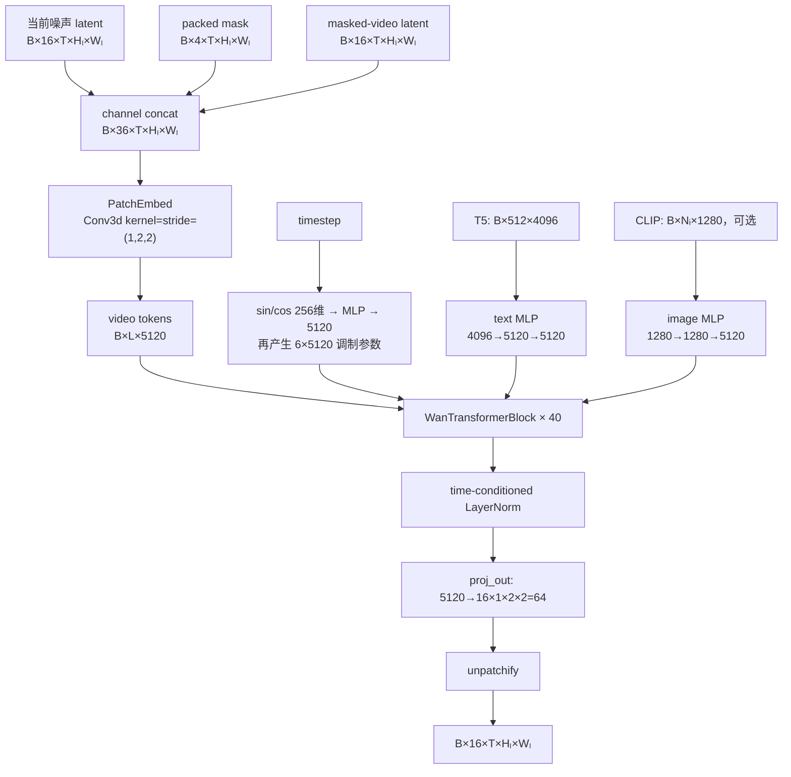
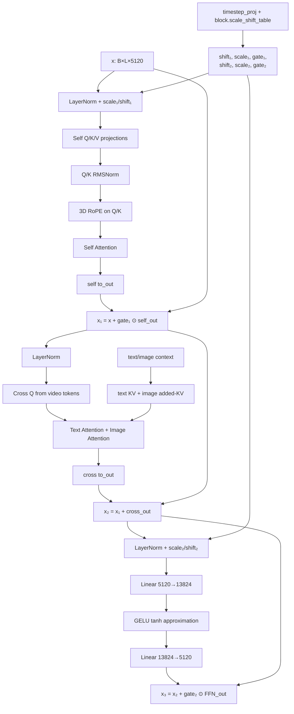
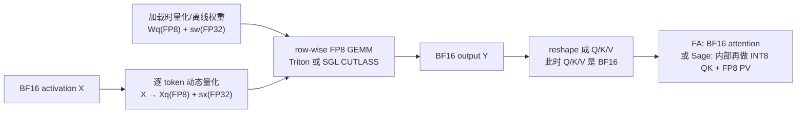

# VideoEdit DiT 架构、Attention/QKV 计算与 FP8 量化全链路

> 依据：2026-07-23 当前工作区代码，包括最近加入的 FP8 Linear、fused QKV/KV、按角色选择 Attention backend 和 SageAttention 低精度路径。  
> 目标：读完以后，能够沿源码复述一次完整 DiT forward，并能画出“整个 DiT”“单个 block”“量化 Linear”三张结构图。

## 1. 先建立一张总地图

VideoEdit 的 DiT 不是“输入直接过 40 次 Attention”这么简单。一次 DiT forward 可以压缩成下面五段：

1. 把噪声 latent、4 通道 mask、被遮挡视频 latent 拼成 36 通道输入；
2. 用 `Conv3d(1×2×2)` 把 5D latent 变成宽度为 5120 的 token 序列；
3. 同时把 timestep、T5 文本、可选的 CLIP 图像 token 投影到 5120 维；
4. 依次执行 40 个相同结构的 Transformer block；
5. 最后归一化、线性投影、unpatchify，输出 16 通道噪声/流预测。



核心配置来自 [`wan_videoedit.py`](../python/sglang/multimodal_gen/configs/models/dits/wan_videoedit.py) 和 [`wanvideo.py`](../python/sglang/multimodal_gen/configs/models/dits/wanvideo.py)：

| 项目 | 值 | 含义 |
|---|---:|---|
| `in_channels` | 36 | 16 noisy latent + 4 mask + 16 masked-video latent |
| `out_channels` | 16 | 预测 16 通道 latent |
| `patch_size` | `(1, 2, 2)` | 时间不降采样，latent 高宽各减半 |
| `num_layers` | 40 | Transformer block 数量 |
| `num_attention_heads` | 40 | 每层 40 个 attention head |
| `attention_head_dim` | 128 | 每个 head 128 维 |
| hidden size `D` | 5120 | `40 × 128` |
| `ffn_dim` | 13824 | block 内 FFN 中间宽度 |
| `text_len` | 512 | VideoEdit cross-attention 约定的文本 token 数 |
| `text_dim` | 4096 | T5 输出维度 |
| `image_dim` | 1280 | CLIP 图像 token 输入维度 |
| `eps` | `1e-6` | LayerNorm/RMSNorm epsilon |

### 一个很容易混淆的概念

模型有 **40 个 block**，采样默认也可能有 **40 个 denoise step**，但两者不是一回事：

- `num_layers=40`：一次 DiT forward 内部串行经过 40 层；
- `num_inference_steps=40`：scheduler 调用 DiT 40 轮；
- 开启 CFG 时，每个 step 通常还要分别做 conditional 和 unconditional 两次 DiT forward。

因此，在不考虑 TeaCache 跳过的情况下，一个 40-step、开启 CFG 的窗口最多会执行：

```text
40 denoise steps × 2 CFG forwards × 40 blocks = 3200 次 block forward
```

## 2. 本文使用的符号

| 符号 | 含义 |
|---|---|
| `B` | batch size，VideoEdit 常见为 1 |
| `F` | 输入视频帧数，当前窗口固定为 81 |
| `T` | VAE latent 帧数，`T=(F-1)/4+1=21` |
| `Hₗ, Wₗ` | VAE latent 高宽，分别为输入图像高宽的 `1/8` |
| `Hₚ, Wₚ` | patch 后高宽，分别为 `Hₗ/2, Wₗ/2` |
| `L` | video token 数，`T×Hₚ×Wₚ` |
| `D` | DiT hidden size，5120 |
| `Nh` | attention head 数，40 |
| `Dh` | head dim，128 |
| `S_txt` | 文本 token 数，512 |
| `S_img` | 图像 token 数；典型 CLIP 输入时为 257，也允许为 0 或动态长度 |
| `R_tp` | tensor-parallel world size |
| `R_sp` | sequence-parallel world size |

本文先按 `TP=1, SP=1` 写公式，再单独解释并行时 shape 如何变化。

## 3. DiT 的输入是怎样准备出来的

### 3.1 三组 latent 拼成 36 通道

去噪循环位于 [`videoedit_wan.py`](../python/sglang/multimodal_gen/runtime/pipelines_core/stages/model_specific_stages/videoedit_wan.py#L515)。每个 timestep 都执行：

```python
latent_model_input = torch.cat(
    [latents, runtime_cond_masks, runtime_cond_latents], dim=1
)
```

三项分别是：

```text
latents               : [B, 16, T, Hₗ, Wₗ]  当前带噪 latent
runtime_cond_masks    : [B,  4, T, Hₗ, Wₗ]  时间打包后的 mask
runtime_cond_latents  : [B, 16, T, Hₗ, Wₗ]  masked video 经 VAE 编码后的条件
----------------------------------------------------------------
latent_model_input    : [B, 36, T, Hₗ, Wₗ]
```

4 通道 mask 不是四种语义类别，而是为了匹配 VAE 的时间压缩方式做的打包。预处理代码在 [`preprocess.py`](../python/sglang/multimodal_gen/runtime/videoedit/preprocess.py#L544)：

1. 第一帧 mask 重复 4 次；
2. 后续 80 帧接在后面，共得到 84 个 mask frame；
3. 空间下采样 `1/8`；
4. reshape 为 `21 × 4`，再转置为 `[B,4,21,Hₗ,Wₗ]`。

所以 81 个视频帧对应 21 个 latent timestep，同时每个 latent timestep 携带 4 个 mask 通道。

### 3.2 文本、图像和 timestep 条件

DiT 调用点传入：

```text
hidden_states               = [B,36,T,Hₗ,Wₗ]
timestep                    = [B]
encoder_hidden_states       = T5 prompt embedding，通常 [B,512,4096]
encoder_hidden_states_image = CLIP hidden state，可选，典型 [B,257,1280]
```

当 CFG 开启时，同一个 `hidden_states` 和 `timestep` 会再配合 negative prompt 跑一次；图像条件保持不变，之后用：

```text
noise_pred = noise_uncond + cfg × (noise_cond - noise_uncond)
```

注意，CFG 是在两次完整 DiT forward 之后组合输出，不是在某个 block 内完成。

## 4. 进入 `WanVideoEditTransformer3DModel`

VideoEdit 类定义在 [`wan_videoedit.py`](../python/sglang/multimodal_gen/runtime/models/dits/wan_videoedit.py#L96)，但它继承了 `WanTransformer3DModel`。因此：

- 模型主体、40 个 block、patchify、RoPE、输出头都在 [`wanvideo.py`](../python/sglang/multimodal_gen/runtime/models/dits/wanvideo.py#L1018)；
- VideoEdit 子类主要把每个 block 的 `attn2` 替换为能动态拆分 image/text token 的 `WanVideoEditCrossAttention`；
- 最近加入的按角色 Attention backend override 也从 VideoEdit 子类进入父类构造流程。

### 4.1 Patch embedding

`PatchEmbed` 实际是一个普通 `nn.Conv3d`：

```text
Conv3d(
    in_channels=36,
    out_channels=5120,
    kernel_size=(1,2,2),
    stride=(1,2,2)
)
```

计算可写为：

```text
X_patch[b,d,t,h,w]
  = bias[d]
  + Σ(c,ih,iw) W[d,c,0,ih,iw] · X[b,c,t,2h+ih,2w+iw]
```

shape 变化：

```text
[B,36,T,Hₗ,Wₗ]
  → Conv3d
[B,5120,T,Hₗ/2,Wₗ/2]
  → flatten spatial-temporal axes + transpose
[B,L,5120]
```

其中：

```text
L = T × (Hₗ/2) × (Wₗ/2)
```

PatchEmbed 是 `nn.Conv3d`，不是仓库的 `LinearBase`，所以当前 FP8 Linear 量化不会量化它。

### 4.2 一个真实 shape 例子

现有 L20 实验中的模型输入分辨率为 `592×1728`，窗口为 81 帧：

```text
原视频空间       : 592 × 1728
VAE latent 空间  : 74 × 216
latent 帧数      : 21
patch 后空间     : 37 × 108
完整 token 数 L  : 21 × 37 × 108 = 83,916
```

因此，patchify 后主干张量是：

```text
[1, 83916, 5120]
```

当 `SP=2` 且启用 sequence shard 时，每个 rank 在 block 入口先持有：

```text
[1, 41958, 5120]
```

这正是 profiler 中大量 Linear 的 `M=41958, K=5120` 的来源。

### 4.3 timestep 条件怎样变成六组调制参数

一次普通 VideoEdit forward 的 `timestep` 是 `[B]`：

```text
timestep
  → sinusoidal embedding: 256
  → Linear 256→5120
  → SiLU
  → Linear 5120→5120
  = temb [B,5120]
```

随后另一路：

```text
temb
  → SiLU
  → Linear 5120→30720
  → reshape [B,6,5120]
  = timestep_proj
```

每个 block 都有自己学习到的 `scale_shift_table[1,6,5120]`，与共享的 `timestep_proj` 相加后切成：

```text
shift_msa, scale_msa, gate_msa,
c_shift_msa, c_scale_msa, c_gate_msa
```

它们分别控制 self-attention 前的调制、self-attention 残差门、FFN 前的调制和 FFN 残差门。

### 4.4 文本与图像条件投影

文本投影：

```text
[B,512,4096]
  → Linear 4096→5120
  → GELU(approximate="tanh")
  → Linear 5120→5120
  = [B,512,5120]
```

图像投影：

```text
[B,S_img,1280]
  → FP32 LayerNorm
  → Linear 1280→1280
  → GELU
  → Linear 1280→5120
  → FP32 LayerNorm
  = [B,S_img,5120]
```

若存在图像条件，父类先执行：

```text
context = concat([image_context, text_context], dim=sequence)
```

VideoEdit cross-attention 再按照“最后 512 个 token 是文本”动态切分：

```text
context_img = context[:, :context_len-512]
context_txt = context[:, context_len-512:]
```

这就是 VideoEdit 子类不能直接使用 Wan I2V 固定 257 个 image token 切分逻辑的原因。

### 4.5 3D RoPE

每个 self-attention head 是 128 维，代码将它分给时间、高度、宽度三个坐标轴：

```text
rope_dim_list = [44, 42, 42]
```

每个 video token 都由 `(t_idx, h_idx, w_idx)` 唯一定位。RoPE 只施加到 self-attention 的 Q/K：

```text
Q_rot = RoPE(Q, t, h, w)
K_rot = RoPE(K, t, h, w)
```

CUDA 且 Q/K shape 相同时优先走 `apply_flashinfer_rope_qk_inplace`；否则走 `_apply_rotary_emb`。Cross-attention 不使用这套 video-grid RoPE。

## 5. 一个 block 内究竟做什么

40 个 block 的结构完全相同，但参数不共享。单个 block 可以画成：



下面按源码顺序拆开。

### 5.1 时间调制的 LayerNorm

先计算：

```text
x_sa = LayerNorm(x) ⊙ (1 + scale_msa) + shift_msa
```

对应 `LayerNormScaleShift`。该融合算子的 native 公式在 [`layernorm.py`](../python/sglang/multimodal_gen/runtime/layers/layernorm.py#L452)，CUDA 路径优先使用 `fused_norm_scale_shift`。

### 5.2 Self-attention 的 Q/K/V

未开启 fused projection 时：

```text
Q = x_sa · Wq + bq
K = x_sa · Wk + bk
V = x_sa · Wv + bv
```

其中 `Wq/Wk/Wv` 都是 `5120→5120`。随后：

```text
Q = RMSNorm_across_heads(Q)
K = RMSNorm_across_heads(K)

Q,K,V: [B,L,5120]
       → reshape
       [B,L,40,128]
```

然后只对 Q/K 加 3D RoPE，再执行 scaled dot-product attention：

```text
score[b,h,i,j] = <Q[b,i,h,:], K[b,j,h,:]> / sqrt(128)
P[b,h,i,:]     = softmax(score[b,h,i,:])
O[b,i,h,:]     = Σj P[b,h,i,j] · V[b,j,h,:]
```

这是概念公式。FlashAttention/SageAttention 会分块融合计算，不会真的在显存中保存完整的 `L×L` score 矩阵。

最后：

```text
O: [B,L,40,128] → flatten heads → [B,L,5120]
self_out = O · Wo + bo
```

### 5.3 Self-attention 残差与下一次归一化

代码把三个操作融合起来：

```text
x1       = x + gate_msa ⊙ self_out
x_cross  = LayerNorm(x1)
```

对应 `ScaleResidualLayerNormScaleShift`。这里传入的额外 shift/scale 为 0，所以它只做门控残差和 LayerNorm。

### 5.4 Cross-attention：Q 来自视频，K/V 来自条件

这是最需要区分 Q/K/V 来源的地方：

```text
Q_video = x_cross · Wq_cross

K_text  = text_context · Wk_text
V_text  = text_context · Wv_text

K_img   = image_context · Wk_img     # 有图像条件时
V_img   = image_context · Wv_img
```

shape 为：

```text
Q_video : [B,L,40,128]
K_text  : [B,512,40,128]
V_text  : [B,512,40,128]
K_img   : [B,S_img,40,128]
V_img   : [B,S_img,40,128]
```

Q、text K、image K 分别经过 RMSNorm；cross-attention 不施加 video RoPE。然后分别做两次 attention：

```text
O_text = Attention(Q_video, K_text, V_text)
O_img  = Attention(Q_video, K_img,  V_img)   # 可选
O      = O_text + O_img
cross_out = O · Wo_cross + bo_cross
```

这里不是把 text K/V 和 image K/V 拼成一条序列后只做一次 softmax，而是各做一次独立 softmax，再将两个输出相加。

随后：

```text
x2    = x1 + cross_out
x_ffn = LayerNorm(x2) ⊙ (1 + c_scale_msa) + c_shift_msa
```

Cross-attention 残差在当前代码中 gate 固定为 1；`c_gate_msa` 留给下一段 FFN。

### 5.5 FFN

Wan block 的 FFN 不是 SwiGLU/GEGLU，而是普通两层 MLP：

```text
u       = x_ffn · W_up + b_up          # 5120 → 13824
u_act   = GELU_tanh(u)
ffn_out = u_act · W_down + b_down      # 13824 → 5120
x3      = x2 + c_gate_msa ⊙ ffn_out
```

`x3` 就是下一个 block 的 `hidden_states`。

### 5.6 一个 block 有多少个主要 Linear

未融合时，每个 block 有 12 个 Linear：

| 子模块 | Linear | 数量 |
|---|---|---:|
| Self-attention | Q、K、V、Out | 4 |
| Cross-attention | Q、text K、text V、image K、image V、Out | 6 |
| FFN | Up、Down | 2 |
| 合计 |  | 12 |

40 个 block 因而有 `40×12=480` 个 Linear。再加 condition embedder 的 7 个和 `proj_out` 的 1 个，整个 DiT 一共有 488 个 `LinearBase` 实例。

## 6. 40 个 block 之后

最后一层输出仍为 `[B,L,5120]`。输出头执行：

```text
shift_out, scale_out = split(scale_shift_table_out + temb)
x = LayerNorm(x) ⊙ (1 + scale_out) + shift_out
x = proj_out(x)                         # 5120 → 64
```

为什么是 64：

```text
out_channels × patch_t × patch_h × patch_w
= 16 × 1 × 2 × 2
= 64
```

随后 reshape、permute、flatten，将每个 token 的 64 个值还原为空间上的 `16×1×2×2` 小块：

```text
[B,L,64] → [B,16,T,Hₗ,Wₗ]
```

这个结果返回去噪循环，再由 scheduler 更新 16 通道 `latents`。36 通道只存在于 DiT 输入；DiT 不会输出 mask 或 masked-video 条件通道。

## 7. Attention backend 和并行通信

### 7.1 `USPAttention` 是调度层，不是另一种数学 Attention

Self/cross attention 最终都通过 [`USPAttention`](../python/sglang/multimodal_gen/runtime/layers/attention/layer.py#L335) 调度。它负责：

1. 选择 FlashAttention、SageAttention 等 backend；
2. 在需要时做 Ulysses sequence/head all-to-all；
3. 在配置 ring parallel 时调用 Ring Attention；
4. 最后调用 backend 的 `forward(q,k,v)`。

数学上仍是 `softmax(QKᵀ/√Dh)V`。

### 7.2 Self-attention 与 cross-attention 的 SP 差异

- Self-attention 的 Q/K/V 都来自被 sequence-shard 的 video token。Ulysses 会把“局部 sequence、全部 heads”重排成“完整 sequence、局部 heads”，算完再 all-to-all 回去。
- Cross-attention 的 text/image KV 在各 rank 上是复制的，而 Q 只需要本 rank 的 video token，因此构造时设置 `skip_sequence_parallel=True`，直接让本地 Q attend 完整 KV，避免多余通信。

在前面的 `SP=2` 实例中，实际审计 shape 是：

```text
self attention 进入 backend:
Q/K/V = [1, 83916, 20, 128]

cross attention 进入 backend:
Q     = [1, 41958, 40, 128]
K_txt = [1,   512, 40, 128]
K_img = [1,   257, 40, 128]
```

上面这组具体 shape 假设 `TP=1`；20 个 self-attention head 是 Ulysses `SP=2` 重排后的结果。

### 7.3 Tensor parallel 怎样切 Linear 和 head

当 `TP=R_tp>1` 时：

- Q/K/V 等 `ColumnParallelLinear` 沿输出维切分，每个 TP rank 得到 `5120/R_tp` 维，即 `40/R_tp` 个 head；
- self/cross 的 `RowParallelLinear.to_out` 接收已经按 head 切分的输入，各 rank 先做局部 GEMM，再 all-reduce 成完整 5120 维输出；
- FFN up 在 13824 输出维上切分，FFN down 接收这份切片并 all-reduce；
- TP 切的是 hidden/head/FFN 维，SP 切的是 video sequence 维，两者不要混为一类。

### 7.4 FlashAttention 算子

`fa` backend 最终落到 [`flash_attn.py`](../python/sglang/multimodal_gen/runtime/layers/attention/backends/flash_attn.py#L373)：

- FA3：`sgl_kernel.flash_attn.flash_attn_varlen_func`；
- FA4：仓库的 `flash_attn_varlen_func` custom op；
- 输入 layout 是 `[B,S,H,Dh]`；
- 当前 attention 为 non-causal，scale 为 `1/sqrt(128)`。

### 7.5 VideoEdit 按角色覆盖 backend

最近的改动允许分别选择：

```text
--videoedit-self-attention-backend fa|sage_attn
--videoedit-cross-attention-backend fa|sage_attn
```

若 self 显式设成 `sage_attn` 而 cross 未设置，代码自动把 cross 设为 `fa`。这是当前 L20 最优实验采用的组合：长序列 self 用 Sage 低精度 kernel，短 KV 的 text/image cross 保持 FlashAttention BF16。

## 8. 最近加入的 FP8 量化：先分清两件事

当前“量化”其实包含两条相互独立的路径：

1. **Linear W8A8 FP8**：量化 Q/K/V 投影、Attention output、FFN、condition 和输出头里的矩阵乘；
2. **SageAttention 低精度 Attention**：在 `softmax(QKᵀ)V` 内部把 Q/K 和 P/V 计算降到 INT8/FP8。

不要把二者混成一句“Attention 被 FP8 了”。



最关键的事实是：**FP8 Linear 的输出是 BF16。Q/K/V 不会以 FP8 tensor 一路传进后续算子。** 如果使用 SageAttention，它会在 Attention kernel 内按自己的规则再次量化 Q/K/V activation。

## 9. Linear FP8 是怎样接进去的

### 9.1 从命令行到每个 Linear

启用入口：

```text
--transformer-quantization fp8_dynamic
```

调用链：

```text
ServerArgs.transformer_quantization
  → transformer_load_utils._resolve_quant_config
  → Fp8Config(
        is_checkpoint_fp8_serialized=False,
        activation_scheme="dynamic",
        gemm_backend=...
    )
  → 构造 WanVideoEditTransformer3DModel(..., quant_config)
  → 每个 Column/Row/MergedColumnParallelLinear
  → quant_config.get_quant_method(layer, prefix)
  → Fp8LinearMethod
```

`Fp8Config.get_quant_method` 会匹配所有 `LinearBase`，只有名字命中 `ignored_layers` 才回退 BF16。当前 runtime `fp8_dynamic` 没有 ignored layer，因此：

```text
未开 fused projections：488 / 488 个 Linear 使用 Fp8LinearMethod
开启 fused projections：328 / 328 个 Linear 使用 Fp8LinearMethod
```

328 不是少量化了 160 层，而是多个投影合并成了一个 Linear 实例，逻辑投影仍完整。

当前不属于 `LinearBase`、因此不被这条路径量化的主要部分有：

- `PatchEmbed.proj` 的 `nn.Conv3d`；
- LayerNorm/RMSNorm；
- `scale_shift_table`；
- RoPE；
- GELU/SiLU；
- residual/scale/shift elementwise；
- Attention kernel 本身。

### 9.2 在线 weight 量化：只在模型加载后做一次

在线 `fp8_dynamic` 先把 BF16 权重加载进模型，然后 `process_weights_after_loading` 逐层量化。

对原始权重 `W[N,K]`，按输出通道计算：

```text
FP8_MAX = 448  # E4M3FN 最大有限值

sw[n]    = max_k(abs(W[n,k])) / FP8_MAX
Wq[n,k]  = cast_fp8(clamp(W[n,k] / sw[n], -448, 448))
```

得到：

```text
Wq    : FP8 E4M3FN，每个输出 channel 一组 scale
sw    : FP32
```

代码在 L20/CUTLASS 支持路径中使用 `per_token_group_quant_fp8(weight, K)`。虽然函数名写着 per-token，但此时 weight 的每一行就是一个 output channel，所以语义上是 **per-output-channel weight quantization**。

量化完成后权重转置为 GEMM 使用的 `[K,N]` layout。在线权重不会在每个 denoise step 重复量化。

### 9.3 动态 activation 量化：每次 Linear forward 都做

对任意 Linear 输入，先把前面的维度拍成二维：

```text
X[...,K] → X2D[M,K]
```

然后每个 token/row 单独计算 scale：

```text
sx[m]    = max_k(abs(X[m,k])) / 448
Xq[m,k]  = cast_fp8(clamp(X[m,k] / sx[m], -448, 448))
```

CUDA 路径使用 `sglang_per_token_quant_fp8`。因此这是：

```text
Weight     : FP8 E4M3FN, per-output-channel, load-time
Activation : FP8 E4M3FN, per-token, runtime dynamic
Scale      : FP32
Output     : BF16/原 activation dtype
```

### 9.4 FP8 GEMM 的实际公式

概念上 kernel 计算：

```text
Y[m,n] ≈ sx[m] × sw[n] × Σk (Xq[m,k] × Wq[k,n]) + bias[n]
```

scale 的反量化与矩阵乘在 row-wise scaled GEMM 中融合完成；输出回到输入 dtype，VideoEdit 默认是 BF16。

### 9.5 实际 GEMM backend

CLI：

```text
--transformer-fp8-gemm-backend auto|sgl_cutlass|triton|hybrid
```

路由位于 [`fp8_utils.py`](../python/sglang/srt/layers/quantization/fp8_utils.py#L123)：

| 选择 | 实际算子/行为 |
|---|---|
| `sgl_cutlass` | `sgl_kernel.fp8_scaled_mm` |
| `triton` | `triton_scaled_mm` |
| `hybrid` | 当前 `M>=513` 走 Triton，小 M 优先 SGL CUTLASS |
| `auto` | CUDA 且支持 per-channel 时通常选 SGL CUTLASS；不兼容时走其他已有 fallback |

当前 L20 实验显式使用 `triton`，因为三个主要大矩阵 shape 上它明显快于当时的 SGL CUTLASS row-wise kernel：

```text
(M, K, N) = (41958,  5120, 13824)  # FFN up
(M, K, N) = (41958, 13824,  5120)  # FFN down
(M, K, N) = (41958,  5120,  5120)  # attention/output projection
```

`proj_out` 的 `N=64` 很窄，动态 activation quant 的开销相对更明显；但当前 runtime 配置仍会量化它。

## 10. fused QKV/KV 到底改了什么

启用：

```text
--transformer-fp8-fused-projections
```

只在以下条件同时满足时生效：

1. `quant_config.get_name() == "fp8"`；
2. 上述开关为 true；
3. 没有加载 LoRA。

### 10.1 Self QKV

融合前，同一份 `x_sa` 被动态量化三次：

```text
quant(x_sa) → GEMM Wq
quant(x_sa) → GEMM Wk
quant(x_sa) → GEMM Wv
```

融合后：

```text
quant(x_sa) 一次
  → MergedColumnParallelLinear(5120, [5120,5120,5120])
  → 一次 (M,5120,15360) GEMM
  → chunk(3)
  → Q, K, V
```

### 10.2 Cross text KV 和 image KV

同理：

```text
text context:
  独立 K/V → fused to_kv → chunk(2)

image context:
  独立 added-K/added-V → fused to_added_kv → chunk(2)
```

Cross Q 不能和 KV 合并，因为 Q 的输入是 video token，KV 的输入是 text/image context。

### 10.3 Linear 数量为何从 488 变成 328

每个 block：

```text
未融合 12 个 Linear
  self Q,K,V 合为 1       : -2
  text K,V 合为 1         : -1
  image K,V 合为 1        : -1
融合后 8 个 Linear
```

所以：

```text
40 × 8 + 7 condition Linear + 1 proj_out = 328
```

它减少的是 dynamic activation quant 次数和 kernel launch 数，不改变 Q/K/V 的数学定义。

现有 4-step 服务实验中 fused projection 的端到端收益接近中性，但它使执行图更紧凑，也明确消除了重复 activation quant；不能把它单独等价成最终 `1.668x` 加速，主要额外收益来自 Sage self-attention。

## 11. 原 checkpoint 如何装进 fused 参数

原始 checkpoint 仍保存：

```text
blocks.i.attn1.to_q.weight
blocks.i.attn1.to_k.weight
blocks.i.attn1.to_v.weight
...
```

开启 fused projections 后，`build_wan_fused_projection_mapping` 把它们映射到：

```text
blocks.i.to_qkv.weight       merge_index = 0/1/2
blocks.i.attn2.to_kv.weight  merge_index = 0/1
blocks.i.attn2.to_added_kv.weight = 0/1
```

loader 按 `merge_index` 顺序沿 output dimension（dim 0）拼接，再装进 `MergedColumnParallelLinear`。规则中的 `(.*)` 同时覆盖 `weight`、`bias` 和 `weight_scale`，因此离线 FP8 checkpoint 的 per-channel scale 也能按相同顺序合并。

LoRA 存在时不启用 fused projections，是因为 LoRA 的目标模块和参数名通常仍指向独立 Q/K/V；直接合并会改变 adapter 的挂载与加载语义。

## 12. 在线 FP8 与离线 FP8 checkpoint

两条路径 forward 时可以使用同样的 dynamic activation + row-wise GEMM，差别主要在权重何时量化。

| 项目 | 在线 `fp8_dynamic` | 离线 FP8 checkpoint |
|---|---|---|
| checkpoint weight | BF16 | FP8 E4M3FN |
| weight scale | 启动时计算 | checkpoint 中保存 |
| activation | 每次 forward 动态 per-token FP8 | 同左 |
| GEMM | FP8 W8A8 | FP8 W8A8 |
| 启动峰值/耗时 | 需要先加载 BF16 再量化 | 更低，更适合部署 |
| 数学量化方案 | per-channel W + per-token A | 同左 |

离线导出脚本是 [`videoedit_export_fp8_checkpoint.py`](../scripts/videoedit_export_fp8_checkpoint.py)：

- 明确列出 40 层的 480 个 block Linear；
- 再加入 7 个 condition Linear 和 1 个 `proj_out`；
- 总数必须是 488；
- 为每个 weight 写出同名的 `.weight_scale`；
- 在 `config.json` 和 safetensors metadata 中写入 `quant_method=fp8`、`activation_scheme=dynamic`、`weight_scale_granularity=channel`。

加载 serialized FP8 时，`Fp8LinearMethod` 不再重新量化 weight，只验证 scale 数量、有限性和正值，然后整理为 GEMM 需要的 layout。

如果 checkpoint 自带量化 metadata，就不能再同时传 `--transformer-quantization fp8_dynamic`；loader 会把两个量化来源视为冲突并报错。

## 13. SageAttention：Attention 内部的低精度计算

开启：

```text
--videoedit-self-attention-backend sage_attn
--videoedit-cross-attention-backend fa
```

当 backend 为 `sage_attn`，Wan 层显式选择：

```text
kernel = qk_int8_pv_fp8_cuda
qk_quant_gran = per_thread
smooth_k = true
pv_accum_dtype = fp32+fp16
```

最终调用在 [`sage_attn.py`](../python/sglang/multimodal_gen/runtime/layers/attention/backends/sage_attn.py#L71)：

```python
sageattention.sageattn_qk_int8_pv_fp8_cuda(...)
```

概念上：

- Q/K 在计算 `QKᵀ` 前走 INT8 量化路径；
- softmax 后的 P 与 V 的乘法走 FP8 路径；
- 累加策略由 `pv_accum_dtype="fp32+fp16"` 控制；
- 输出仍回到后续 `to_out` 能接收的浮点 dtype。

这里没有所谓“Attention weight”。Attention 的可学习 weight 位于 Q/K/V/Out Linear，已经由前面的 FP8 Linear 路径处理；Sage 量化的是 Attention 计算时的 activation。

当前实验只把 self-attention 切到 Sage，原因是 `L×L` 的长序列 self-attention 是大头；text/image cross 的 KV 只有 512/257 个 token，绝对耗时很小，保持 FlashAttention 更稳妥。

## 14. 当前各阶段的 dtype 与算子速查

以下按当前 L20 最优实验配置理解：BF16 模型计算、FP8 dynamic Linear、Triton GEMM、fused QKV/KV、self Sage、cross FA。

| 阶段 | 主要输入/权重 dtype | 主要算子 |
|---|---|---|
| 36 通道拼接 | BF16 | `torch.cat` |
| PatchEmbed | BF16 weight/activation | `nn.Conv3d` |
| timestep sin/cos | FP32 生成后转目标 dtype | `torch.exp/cos/sin` 组成的 sinusoidal embedding |
| 各类 Linear 前 | BF16 activation → FP8 | `sglang_per_token_quant_fp8` |
| Linear weight | FP8 E4M3FN + FP32 scale | 启动量化或离线加载 |
| Linear GEMM | FP8×FP8，BF16 output | `triton_scaled_mm` |
| GELU/SiLU | BF16 activation | `nn.GELU(tanh)` / `nn.SiLU` |
| block LayerNorm/调制 | FP32 compute，输出回原 dtype | `fused_norm_scale_shift` |
| Q/K RMSNorm | 内部高精度统计，输出回原 dtype | `rmsnorm`/Triton/native |
| 3D RoPE | Q/K 浮点 tensor | `apply_flashinfer_rope_qk_inplace` |
| Self Attention | BF16 Q/K/V 输入，kernel 内低精度 | Sage INT8 QK + FP8 PV |
| Cross Attention | BF16 Q/K/V | FlashAttention varlen kernel |
| 门控残差 | BF16 tensor，融合 elementwise | fused scale/residual/norm 或 `MulAdd` |
| `proj_out` | 当前也走 FP8 Linear | `triton_scaled_mm`，输出 BF16 |
| unpatchify | BF16 | reshape/permute/flatten |

## 15. 如何亲自验证“真的走了量化算子”

仅看 `weight.dtype == float8` 不足以证明执行的是 W8A8；还要确认 activation quant 和真实 FP8 GEMM route。

当前代码提供这些审计开关：

```bash
export SGLANG_DIFFUSION_QUANT_AUDIT=1
export SGLANG_DIFFUSION_LINEAR_RUNTIME_AUDIT=1
export SGLANG_DIT_ATTENTION_AUDIT=1
```

重点看：

```text
QUANTIZATION_AUDIT:
  fp8_method_count == linear_total
  fp8_weight_count == linear_total
  predicted_true_w8a8_count == linear_total
  fp8_dequant_fallback_names == []

LINEAR_RUNTIME_AUDIT:
  method = Fp8LinearMethod
  kernel = dynamic_per_token_fp8+triton_scaled_mm

ATTENTION_RUNTIME_AUDIT:
  self.backend = sage_attn
  self.kernel = qk_int8_pv_fp8_cuda
  text/image cross.backend = fa
```

若需要 profiler 区间，还可使用：

```bash
export SGLANG_FP8_NVTX=1
export SGLANG_DIT_PROFILE_RANGES=1
```

它们会把 activation quant、FP8 GEMM、self/text/image attention 和 SP communication 分开标记。

## 16. 建议你画的三张图

### 图一：整个 DiT

从左到右画：

```text
16 noisy + 4 mask + 16 condition
  → 36-channel latent
  → Conv3d patchify
  → L×5120 tokens
  → Block ×40
  → norm_out
  → proj_out 5120→64
  → unpatchify
  → 16-channel prediction
```

在图的上方画三条条件支路：

```text
timestep → temb + 6-way modulation
T5 text  → text MLP
CLIP img → image MLP
```

### 图二：单个 block

主干画三段并把残差线绕在外侧：

```text
time-modulated LN
  → self QKV → QK norm → 3D RoPE → self attention → out
  → gated residual
  → LN → cross Q + text/image KV → two attentions → sum → out
  → residual + time-modulated LN
  → FFN up → GELU → down
  → gated residual
```

一定要用不同颜色标注 Q/K/V 来源：

- Self：Q/K/V 都来自 video token；
- Cross：Q 来自 video token，K/V 来自 text/image；
- RoPE：只画在 self Q/K 上。

### 图三：量化覆盖层

建议使用以下图例：

```text
红色边框：Fp8LinearMethod
橙色块  ：dynamic per-token activation quant
紫色块  ：FP8 GEMM
绿色块  ：BF16/FP32 norm、activation、residual
蓝色块  ：FlashAttention
黄色块  ：Sage INT8 QK + FP8 PV
```

对 fused QKV 画一个大矩阵：

```text
X[B,L,5120]
  → quant once
  → Wqkv[5120,15360]
  → FP8 GEMM
  → [B,L,15360]
  → split
  ├─ Q[B,L,5120]
  ├─ K[B,L,5120]
  └─ V[B,L,5120]
```

这样能一眼看出“融合投影”和“Attention kernel 量化”是两层不同的优化。

## 17. 推荐的源码阅读顺序

不要从 `wan_videoedit.py` 一个文件硬读到底，因为它只包含特化部分。建议按下面顺序：

1. [`VideoEditDenoisingStage.forward`](../python/sglang/multimodal_gen/runtime/pipelines_core/stages/model_specific_stages/videoedit_wan.py#L558)：看 36 通道输入和 DiT 调用；
2. [`WanVideoEditArchConfig`](../python/sglang/multimodal_gen/configs/models/dits/wan_videoedit.py#L11)：看 VideoEdit 独有 shape；
3. [`WanTransformer3DModel.__init__`](../python/sglang/multimodal_gen/runtime/models/dits/wanvideo.py#L1031)：看 patch、condition、40 blocks、output head；
4. [`WanTransformer3DModel.forward`](../python/sglang/multimodal_gen/runtime/models/dits/wanvideo.py#L1187)：看完整主干；
5. [`WanTransformerBlock.forward`](../python/sglang/multimodal_gen/runtime/models/dits/wanvideo.py#L658)：看单层公式；
6. [`WanVideoEditCrossAttention.forward`](../python/sglang/multimodal_gen/runtime/models/dits/wan_videoedit.py#L46)：看 text/image 双路 cross；
7. [`USPAttention`](../python/sglang/multimodal_gen/runtime/layers/attention/layer.py#L335)：看并行通信和 backend 调度；
8. [`Fp8LinearMethod`](../python/sglang/multimodal_gen/runtime/layers/quantization/fp8.py#L214)：看 weight 创建、加载后量化和 forward；
9. [`apply_fp8_linear`](../python/sglang/srt/layers/quantization/fp8_utils.py#L1516)：看 activation quant 和实际 GEMM；
10. [`SageAttentionImpl`](../python/sglang/multimodal_gen/runtime/layers/attention/backends/sage_attn.py#L36)：看低精度 Attention kernel；
11. [`videoedit_export_fp8_checkpoint.py`](../scripts/videoedit_export_fp8_checkpoint.py)：看离线 FP8 权重格式。

## 18. 最后用一段伪代码串起来

```python
def videoedit_dit(noisy_latent, packed_mask, cond_latent,
                  timestep, text_4096, image_1280=None):
    # [B,16,...] + [B,4,...] + [B,16,...] -> [B,36,...]
    x = concat(noisy_latent, packed_mask, cond_latent, dim=channel)

    # Conv3d(36 -> 5120, patch 1x2x2), then flatten to tokens
    x = patchify(x)                         # [B,L,5120]

    temb = time_mlp(sinusoidal(timestep))   # [B,5120]
    mod6 = time_modulation(temb)            # [B,6,5120]
    text = text_mlp(text_4096)               # [B,512,5120]
    image = image_mlp(image_1280) if image_1280 is not None else None
    context = concat(image, text, dim=sequence) if image is not None else text
    rope = build_3d_rope(T, H_patch, W_patch, dims=[44,42,42])

    for block in blocks:                    # exactly 40 times
        shift1, scale1, gate1, shift2, scale2, gate2 = (
            block.scale_shift_table + mod6
        )

        z = layer_norm(x) * (1 + scale1) + shift1
        q, k, v = fp8_qkv_linear(z)          # output tensors are BF16
        q, k = rms_norm(q), rms_norm(k)
        q, k = apply_3d_rope(q, k, rope)
        sa = self_attention(q, k, v)          # Sage or FA
        sa = fp8_self_out_linear(sa)
        x = x + gate1 * sa

        z = layer_norm(x)
        q = fp8_cross_q_linear(z)
        kt, vt = fp8_text_kv_linear(text)
        ca = flash_attention(q, kt, vt)
        if image is not None:
            ki, vi = fp8_image_kv_linear(image)
            ca = ca + flash_attention(q, ki, vi)
        ca = fp8_cross_out_linear(ca)
        x = x + ca

        z = layer_norm(x) * (1 + scale2) + shift2
        ff = fp8_down_linear(gelu(fp8_up_linear(z)))
        x = x + gate2 * ff

    x = final_time_modulated_layer_norm(x, temb)
    x = fp8_proj_out(x)                      # [B,L,64]
    return unpatchify(x)                     # [B,16,T,Hₗ,Wₗ]
```

这段伪代码省略了 TP/SP、offload、TeaCache、profiler 和 backend dispatch，但保留了决定模型结构与量化语义的全部主干计算。

## 19. 五个常见误解

1. **“40 个 block 就是 40 个采样 step。”** 不是；每个采样 step 内都会进入这 40 层。
2. **“Q/K/V 是三个固定输入。”** 不是；它们是 Linear 从当前 token/context 投影出来的。Self 的三者同源，cross 的 Q 与 KV 不同源。
3. **“FP8 Linear 输出也是 FP8。”** 不是；weight/activation 进入 GEMM 时是 FP8，GEMM 输出回 BF16。
4. **“fused QKV 会把三种 Attention 合并。”** 不是；它只合并 Linear projection，之后仍 split 成独立 Q/K/V。
5. **“SageAttention 和 FP8 Linear 是同一层量化。”** 不是；前者量化 Attention activation 计算，后者量化可学习矩阵的 GEMM。

## 20. 一句话记忆整个架构

VideoEdit DiT 把 `36` 通道视频条件 latent patchify 成 `L×5120` token，用 timestep 产生六组 AdaLN/门控参数，在每个 block 中依次执行“带 3D RoPE 的全视频 self-attention、视频 Q 对文本/图像 KV 的双路 cross-attention、13824 维 GELU FFN”，重复 40 次后投影回 16 通道；最近的量化则把所有 `LinearBase` 改为“per-channel FP8 weight + dynamic per-token FP8 activation + row-wise FP8 GEMM”，并可进一步把 QKV/KV projection 合并、把长序列 self-attention 切到 Sage 的 INT8-QK/FP8-PV kernel。
