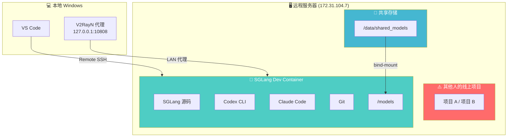

# SGLang Docker 开发环境完整指南

## 一、环境概述

### 解决的问题
在多人共用的远程服务器上，使用 Docker 容器隔离 SGLang 开发环境，确保 AI 编码工具（Codex、Claude Code）和开发操作不会影响服务器上的其他项目。

### 架构



### 多人协作模型

每个开发者使用同一份 `.devcontainer/` 配置，但各自拥有独立的：
- 容器实例（互不干扰）
- AI 工具登录凭证（从各自的 `$HOME` 映射）
- API Keys（从各自的 `~/.bashrc` 读取）
- Git/SSH 身份（从各自的 `$HOME` 映射）

所有人共享：
- 模型权重（`/data/shared_models`）
- SGLang 代码库

---

## 二、配置文件说明

### 文件结构

```
sglang/.devcontainer/
├── Dockerfile           # 容器镜像构建
├── devcontainer.json    # 容器运行配置
└── post-create.sh       # 容器首次创建后的初始化脚本
```

### Dockerfile

[Dockerfile](file:///d:/Download_edge/sglang-main/sglang-main/.devcontainer/Dockerfile)

| 层 | 内容 | 说明 |
|---|------|------|
| 基础镜像 | `lmsysorg/sglang:dev` | SGLang 官方开发镜像（含 Python、CUDA） |
| 用户创建 | `useradd -m -s /bin/zsh devuser` | 不指定 UID/GID，运行时由 `updateRemoteUserUID` 自动匹配 |
| Node.js 20 | NodeSource 安装 | Claude Code 要求 Node.js ≥ 18 |
| AI 工具 | `@openai/codex` + `@anthropic-ai/claude-code` | 全局 npm 安装 |
| oh-my-zsh | 从 root 复制到 devuser | 保持终端体验一致 |
| Diffusion 依赖 | diffusers、moviepy、SageAttention 等 | Wan2.1 模型运行所需 |
| uv + Rust | devuser 下安装 | 开发工具链 |

### devcontainer.json

[devcontainer.json](file:///d:/Download_edge/sglang-main/sglang-main/.devcontainer/devcontainer.json)

| 配置项 | 值 | 作用 |
|--------|---|------|
| `updateRemoteUserUID` | `true` | 容器内 devuser 的 UID 自动匹配宿主机用户 |
| `build.args.HTTP_PROXY` | `${localEnv:http_proxy}` | 构建时通过代理下载依赖 |
| `initializeCommand` | `mkdir -p ~/.codex ~/.claude ~/.ssh ...` | 容器构建前在宿主机创建必要目录 |
| `mounts` | `.codex`、`.claude`、`.gitconfig`、`.ssh` | AI 工具凭证和 Git 身份映射 |
| `--gpus all` | - | GPU 透传 |
| `--shm-size 32g` | - | 共享内存（大模型推理需要） |
| `--add-host host.docker.internal` | - | 容器可访问宿主机网络 |
| `-v /data/shared_models:/models` | - | 共享模型目录映射 |
| `containerEnv` | 代理、API Keys、HF_HOME | 运行时环境变量 |
| `workspaceMount` | bind-mount sglang 源码 | 本地修改实时同步到容器 |

### post-create.sh

[post-create.sh](file:///d:/Download_edge/sglang-main/sglang-main/.devcontainer/post-create.sh)

容器首次创建后自动执行：
1. 修复工作目录和 AI 工具配置目录的权限
2. 配置 Codex 信任 sglang 项目
3. 验证 Codex 和 Claude Code 安装
4. 将 HuggingFace 缓存指向共享模型目录

---

## 三、新开发者初始化步骤

### 前置条件
- 远程服务器已安装 Docker + NVIDIA Container Toolkit
- 本地已安装 VS Code + Remote SSH 扩展 + Dev Containers 扩展
- 已配置 SSH 连接到远程服务器

### Step 1：配置代理（如需翻墙）

如果服务器无法直接访问 OpenAI / Anthropic API，需要通过本地代理。

**在本地 V2RayN 中：**
- 确认「允许来自局域网的连接」已开启
- 确认代理端口（通常为 10808，混合端口同时支持 HTTP 和 SOCKS5）

**验证本地代理：**
```powershell
# 在本地 PowerShell 中
curl.exe -x http://127.0.0.1:10808 https://api.openai.com -I
```

### Step 2：服务器环境变量配置

SSH 连接到服务器后，在 `~/.bashrc` 末尾添加：

```bash
# ---- SGLang Dev Container 配置 ----

# 代理设置（替换为你本地机器的 IP 和代理端口）
export http_proxy="http://你的本地IP:10808"
export https_proxy="http://你的本地IP:10808"
export ALL_PROXY="socks5://你的本地IP:10808"
export no_proxy="localhost,127.0.0.1"

# 容器内代理（同上）
export CONTAINER_PROXY="http://你的本地IP:10808"

# API Keys（替换为你自己的 key）
export OPENAI_API_KEY="sk-你的key"
export ANTHROPIC_API_KEY="sk-ant-你的key"
```

然后执行：
```bash
source ~/.bashrc
```

**验证服务器代理：**
```bash
curl https://api.openai.com -I
# 应返回 HTTP 421（网络通了）
```

### Step 3：共享模型目录（首次搭建时，只需一个人做一次）

```bash
sudo mkdir -p /data/shared_models/huggingface_cache
sudo chmod -R 2775 /data/shared_models

# 将现有模型链接过来
sudo ln -s /home/model/models/* /data/shared_models/

# 验证
ls -la /data/shared_models/
```

### Step 4：启动容器

1. VS Code → `Ctrl+Shift+P` → **Remote-SSH: Connect to Host** → 选择服务器
2. 打开服务器上的 sglang 项目文件夹
3. VS Code 检测到 `.devcontainer/` 后会提示 → 点击 **Reopen in Container**
4. 首次构建需要几分钟（下载 Node.js、安装 Codex 和 Claude Code）

### Step 5：容器内验证

```bash
# AI 工具
codex --version
claude --version
git --version

# 模型目录
ls /models/

# SGLang 开发者模式
python -c "import sglang; print(sglang.__file__)"
# 应输出 /sgl-workspace/sglang/python/sglang/__init__.py

# 环境变量
echo $HF_HOME       # /models/huggingface_cache
echo $HTTP_PROXY     # 你的代理地址
```

### Step 6：AI 工具首次登录

```bash
# Codex（首次运行会引导登录）
codex

# Claude Code（首次运行会引导登录）
claude
```

登录凭证保存在宿主机的 `~/.codex` 和 `~/.claude` 中，重建容器后不需要重新登录。

---

## 四、日常使用

### 进入开发环境
```
VS Code → Ctrl+Shift+P → Dev Containers: Reopen in Container
```
> 容器创建后会一直保留，Reopen 是秒开的，不需要每次 Rebuild。

### 何时需要 Rebuild
- 修改了 `Dockerfile`（如添加新依赖）
- 修改了 `devcontainer.json` 中的 `build` 部分
- 基础镜像 `lmsysorg/sglang:dev` 有更新

### SGLang 开发工作流
```bash
# 容器内修改代码后直接测试
python -c "import sglang; ..."

# Git 操作（容器内）
git add .
git commit -m "feat: xxx"
git push origin my-branch
```

---

## 五、已知问题与解决方案

### 问题 1：宿主机 .codex 权限被改

**症状**：在宿主机上运行 `codex` 报 `Permission denied`
**原因**：容器内的 `post-create.sh` 执行 `chown` 时通过 bind-mount 改变了宿主机文件权限
**解决**：
```bash
# 在宿主机上执行
sudo chown -R $(whoami):$(whoami) ~/.codex ~/.claude
```

### 问题 2：宿主机 Git 报 dubious ownership

**症状**：`git fetch` 报 `detected dubious ownership in repository`
**解决**：
```bash
git config --global --add safe.directory /home/你的用户名/sglang
sudo chown -R $(whoami):$(whoami) ~/sglang
```

### 问题 3：Docker 构建时网络超时

**症状**：`apt-get update` 或 `npm install` 超时
**原因**：构建时没有走代理
**解决**：确保 `~/.bashrc` 中的 `http_proxy` 和 `https_proxy` 已设置，`devcontainer.json` 的 `build.args` 会自动读取

### 问题 4：容器内代理不通

**排查步骤**：
```bash
# 1. 检查代理变量是否注入
echo $HTTP_PROXY

# 2. 测试代理连通性
curl -x $HTTP_PROXY https://api.openai.com -I

# 3. 如果不通，确认本地代理软件是否开启了"允许局域网连接"
```

---

## 六、换机器迁移清单

将此开发环境迁移到新服务器时，需要调整的内容：

| 事项 | 操作 |
|------|------|
| Docker + NVIDIA | 安装 Docker 和 NVIDIA Container Toolkit |
| sglang 代码 | `git clone` sglang 项目（配置文件都在 `.devcontainer/` 中） |
| `~/.bashrc` | 配置代理地址、API Keys |
| 模型路径 | 修改 `devcontainer.json` 第 34 行的 `-v` 路径 |
| 共享目录 | 创建 `/data/shared_models` 并设置权限 |

**不需要修改的**：Dockerfile、mounts、containerEnv 的变量引用 —— 都是通过 `${localEnv:...}` 动态读取的。
